# RAGbenchmark

## English Version

RAGbenchmark is an independent RAG (Retrieval-Augmented Generation) system evaluation framework, fully compatible with the latest version of OpenViking.

### Project Structure

```
RAGbenchmark/
├── src/
│   ├── __init__.py
│   ├── pipeline.py              # Evaluation core pipeline
│   ├── adapters/                # Dataset adapters
│   │   ├── __init__.py
│   │   ├── base.py              # Base adapter class
│   │   ├── locomo_adapter.py    # Locomo dataset adapter
│   │   ├── syllabusqa_adapter.py # SyllabusQA dataset adapter
│   │   ├── qasper_adapter.py    # Qasper dataset adapter
│   │   ├── financebench_adapter.py # FinanceBench dataset adapter
│   │   └── ...
│   └── core/                    # Core components
│       ├── __init__.py
│       ├── logger.py            # Logging module
│       ├── vector_store.py      # Vector store wrapper
│       ├── llm_client.py        # LLM client wrapper
│       ├── metrics.py           # Metrics calculation
│       ├── judge_util.py        # LLM judge utility
│       └── monitor.py           # Monitoring utility
├── config/                      # Configuration files
│   ├── config.yaml
│   ├── locomo_config.yaml
│   ├── syllabusqa_config.yaml
│   ├── qasper_config.yaml
│   └── financebench_config.yaml
├── datasets/                    # Dataset directory
│   └── Benchmark_Lite/         # Lightweight evaluation dataset
├── Output/                      # Output result directory
├── run.py                       # Main execution script
└── README.md
```

### Quick Start

#### 1. Install Dependencies

```bash
cd OpenViking
uv pip install -e ".[benchmark]"
source .venv/bin/activate
```

#### 2. Prepare Datasets

Use the lightweight datasets in `datasets/Benchmark_Lite/` for quick testing.

#### 3. Configure LLM

Edit LLM configuration in `config/*.yaml`. This configuration is used for both:

- **Answer generation**: Generating answers from retrieved context
- **LLM-as-judge evaluation**: Using LLM to evaluate the quality of generated answers

#### 4. Configure OpenViking

If you need to use custom OpenViking configuration (for data ingestion and retrieval), create an `ov.conf` file in the RAGbenchmark directory. This will override the default OpenViking settings.

You can refer to `examples/ov.conf.example` in the OpenViking root directory for the configuration format.

#### 5. Run Evaluation

```bash
cd RAGbenchmark

# Run complete evaluation (data ingestion, answer generation, evaluation, and data deletion)
python run.py --config config/locomo_config.yaml

# Only run data ingestion and answer generation stage
python run.py --config config/locomo_config.yaml --step gen

# Only run evaluation stage (requires generated answers from previous step)
python run.py --config config/locomo_config.yaml --step eval

# Only run data deletion stage
python run.py --config config/locomo_config.yaml --step delete
```

### Supported Datasets

| Dataset        | Type       | Docs | QAs | Characteristics                                                                                                              |
| -------------- | ---------- | ---- | --- | ---------------------------------------------------------------------------------------------------------------------------- |
| **Locomo**     | Multi-turn | 3    | 100 | Real user conversations, 4 question types (factual, temporal, reasoning, understanding)                                      |
| **SyllabusQA** | Syllabus   | 8    | 120 | Education domain, 6 question types (single factual, multi factual, single reasoning, multi reasoning, summarization, yes/no) |
| **Qasper**     | Academic   | 12   | 84  | Research domain, complex reasoning, 3 answer types (extractive, free-form, yes/no)                                           |
| Financebench   | Financial  | 4    | 13  | Financial domain, SEC financial reports, 3 question types (domain-relevant, metrics-generated, novel-generated)              |

### How to Use Different Datasets

Each dataset has its own configuration file in the `config/` directory. To use a specific dataset:

1. **Choose a dataset configuration file**:
   - `config/locomo_config.yaml` - For Locomo dataset
   - `config/syllabusqa_config.yaml` - For SyllabusQA dataset
   - `config/qasper_config.yaml` - For Qasper dataset
   - `config/financebench_config.yaml` - For FinanceBench dataset
2. **Run evaluation with the chosen configuration**:
   ```bash
   # Evaluate with Locomo dataset
   python run.py --config config/locomo_config.yaml

   # Evaluate with SyllabusQA dataset
   python run.py --config config/syllabusqa_config.yaml

   # Evaluate with Qasper dataset
   python run.py --config config/qasper_config.yaml

   # Evaluate with FinanceBench dataset
   python run.py --config config/financebench_config.yaml
   ```
3. **Customize configuration (optional)**:
   You can copy a dataset configuration file and modify it to suit your needs:
   ```bash
   cp config/locomo_config.yaml config/my_custom_config.yaml
   # Edit config/my_custom_config.yaml with your preferences
   python run.py --config config/my_custom_config.yaml
   ```

### Configuration Guide

RAGbenchmark uses YAML configuration files to control the evaluation process. Each dataset has its own configuration file in the `config/` directory.

**Key Configuration Sections:**

1. **Basic Configuration**:
   - `dataset_name`: Name of the dataset being evaluated
2. **Adapter Configuration**:
   - `adapter.module`: Python module path for the dataset adapter
   - `adapter.class_name`: Class name of the dataset adapter
3. **Execution Configuration**:
   - `max_workers`: Number of concurrent worker threads
   - `ingest_workers`: Number of worker threads for document ingestion
   - `retrieval_topk`: Number of documents to retrieve
   - `max_queries`: Limit the number of queries to process (null = all)
   - `skip_ingestion`: Skip document ingestion (use existing index)
   - `ingest_mode`: Document ingestion mode ("directory" or "per\_file")
   - `retrieval_instruction`: Custom instruction for retrieval (empty by default)
4. **Path Configuration**:
   - `raw_data`: Path to raw dataset file
   - `doc_output_dir`: Directory for processed documents
   - `vector_store`: Directory for vector index storage
   - `output_dir`: Directory for evaluation results
   - `log_file`: Path to log file
5. **LLM Configuration**:
   - `llm.model`: LLM model name
   - `llm.temperature`: Generation temperature
   - `llm.base_url`: API base URL
   - `llm.api_key`: API key (keep secure)

### Evaluation Process Overview

The evaluation process consists of 5 main stages:

1. **Data Preparation**
   - Convert raw dataset into OpenViking-friendly format
   - Process documents for ingestion
2. **Data Ingestion**
   - Ingest processed documents into OpenViking vector store
   - Create embeddings for documents
   - Store vector index for retrieval
3. **Answer Generation**
   - For each question, retrieve relevant documents from vector store
   - Build prompt with retrieved context and question
   - Generate answer using LLM
4. **Evaluation**
   - Use LLM-as-judge to evaluate generated answers against gold answers
   - Calculate metrics (Recall, F1, Accuracy)
5. **Data Deletion**
   - Clean up vector store and remove ingested documents

### Evaluation Metrics

- **Recall**: Retrieval recall rate
- **F1 Score**: Answer F1 score
- **Accuracy**: LLM judge score (0-4)
- **Latency**: Retrieval latency
- **Token Usage**: Token consumption

### Benchmark Results

Below are the benchmark results across different datasets for reference and comparison.

#### Performance Metrics Comparison

```mermaid
---
config:
  xyChart:
    plotColorPalette: "#4E79A7, #F28E2B, #E15759"
---
xychart-beta
    title "Performance Metrics by Dataset"
    x-axis ["Locomo", "SyllabusQA", "Qasper", "Financebench"]
    y-axis "Score (0-1)" 0 --> 1
    bar "Recall" [0.72, 0.73, 0.65, 0.73]
    bar "F1 Score" [0.32, 0.34, 0.44, 0.30]
    line "Normalized Accuracy" [0.59, 0.74, 0.69, 0.69]
```



**Legend:**
- Blue Bar "Recall": Retrieval recall rate
- Green Bar "F1 Score": Answer F1 score
- Red Line "Normalized Accuracy": LLM judge score normalized to 0-1 scale

#### Benchmark Results Table

| Metric                       | Locomo | SyllabusQA | Qasper | Financebench |
| ---------------------------- | ------ | ---------- | ------ | ------------ |
| **Recall**                   | 0.72   | 0.73       | 0.65   | 0.73         |
| **F1 Score**                 | 0.32   | 0.34       | 0.44   | 0.30         |
| **Accuracy (0-4)**           | 2.36   | 2.96       | 2.77   | 2.77         |
| **Normalized Accuracy**      | 0.59   | 0.74       | 0.69   | 0.69         |
| **Avg Retrieval Time (s)**   | 0.17   | 1.00       | 0.18   | 0.55         |
| **Avg Input Tokens**         | 3364   | 2171       | 2160   | 6813         |
| **Avg Output Tokens**        | 16     | 69         | 57     | 63           |
| **Total Queries**            | 100    | 120        | 79     | 13           |
| **Total Insertion Time (s)** | 132    | 98         | 112    | 456          |

**Notes:**

- Results are based on default configuration with `retrieval_topk=5`
- FinanceBench uses `retrieval_topk=10` in this test
- Normalized Accuracy = Accuracy / 4

### Output Files

Evaluation results are saved in the `Output/` directory with the following structure:

```
Output/
└── {dataset_name}/
    └── experiment_{experiment_name}/
        ├── generated_answers.json       # Generated answers from LLM
        ├── qa_eval_detailed_results.json # Detailed evaluation results
        ├── benchmark_metrics_report.json # Aggregated metrics report
        ├── docs/                         # Processed documents (if skip_ingestion=false)
        └── benchmark.log                 # Log file
```

**Vector Store Database Location:**
The vector index (document database) is stored in the path specified by `vector_store` in the configuration file. By default, this is:

```
datasets/{dataset_name}/viking_store_index_dir
```

#### File descriptions and examples

**1.** **`benchmark_metrics_report.json`** **- Summary Report**

- **What it contains**: Aggregated metrics report with overall performance scores

Example:

```json
{
    "Insertion Efficiency (Total Dataset)": {
        "Total Insertion Time (s)": 131.98,
        "Total Input Tokens": 142849,
        "Total Output Tokens": 52077,
        "Total Embedding Tokens": 95626
    },
    "Query Efficiency (Average Per Query)": {
        "Average Retrieval Time (s)": 0.17,
        "Average Input Tokens": 3364.46,
        "Average Output Tokens": 15.5
    },
    "Dataset": "Locomo",
    "Total Queries Evaluated": 100,
    "Performance Metrics": {
        "Average F1 Score": 0.318,
        "Average Recall": 0.724,
        "Average Accuracy (Hit 0-4)": 2.36,
        "Average Accuracy (normalization)": 0.59
    }
}
```

**Field descriptions:**

- `Insertion Efficiency`: Document ingestion performance statistics
- `Query Efficiency`: Per-query performance averages
- `Performance Metrics`: Core evaluation scores (0-4 scale for Accuracy)

***

**2.** **`generated_answers.json`** **- Generated Answers**

- **What it contains**: All questions, retrieved contexts, and LLM-generated answers

Example (single result):

```json
{
  "_global_index": 0,
  "sample_id": "conv-26",
  "question": "Would Caroline pursue writing as a career option?",
  "gold_answers": ["LIkely no; though she likes reading, she wants to be a counselor"],
  "category": "3",
  "evidence": ["D7:5", "D7:9"],
  "retrieval": {
    "latency_sec": 0.288,
    "uris": ["viking://resources/...", "viking://resources/..."]
  },
  "llm": {
    "final_answer": "Not mentioned"
  },
  "metrics": {
    "Recall": 1.0
  },
  "token_usage": {
    "total_input_tokens": 2643,
    "llm_output_tokens": 2
  }
}
```

**Field descriptions:**

- `_global_index`: Unique query identifier
- `question`: The question being asked
- `gold_answers`: Ground truth answers
- `retrieval.uris`: URIs of retrieved documents
- `llm.final_answer`: Answer generated by LLM
- `metrics.Recall`: Retrieval recall score (0-1)
- `token_usage`: Token consumption statistics

***

**3.** **`qa_eval_detailed_results.json`** **- Detailed Evaluation**

- **What it contains**: Per-question evaluation including LLM judge reasoning and scores

Example (single result):

```json
{
  "_global_index": 2,
  "question": "When did Caroline go to the LGBTQ support group?",
  "gold_answers": ["7 May 2023"],
  "llm": {
    "final_answer": "7 May 2023 (the day before the chat at 1:56 pm on 8 May, 2023)"
  },
  "metrics": {
    "Recall": 1.0,
    "F1": 0.375,
    "Accuracy": 4
  },
  "llm_evaluation": {
    "prompt_used": "Locomo_0or4",
    "reasoning": "The generated answer explicitly includes the exact date 7 May 2023 that matches the gold answer...",
    "normalized_score": 4
  }
}
```

**Field descriptions:**

- `metrics.F1`: Answer F1 score (0-1)
- `metrics.Accuracy`: LLM judge score (0-4, 4 = perfect)
- `llm_evaluation.reasoning`: LLM judge's reasoning for the score
- `llm_evaluation.normalized_score`: Final normalized score

***

**4.** **`benchmark.log`** **- Execution Log**

- **What it contains**: Detailed execution log with timestamps, warnings, and errors
- **How to view**: Open directly in any text editor

***

**5.** **`docs/`** **- Processed Documents**

- **What it contains**: Processed documents in Markdown format (if `skip_ingestion=false`)
- **How to view**: Open `.md` files directly in any Markdown viewer or text editor

### Advanced Configuration

#### Retrieval Instruction Configuration

You can configure a custom retrieval instruction in the `config.yaml` file to guide the retrieval process. This instruction is prepended to each query during retrieval.

**Configuration Example:**

```yaml
# ===========Execution Configuration============
# Instruction for retrieval, empty by default
# Recommended format: "Target_modality: xxx.\nInstruction:xxx.\nQuery:"
retrieval_instruction: "Target_modality: text.\nInstruction:Locate the part of the conversation where the speakers discuss.\nQuery:"
```

**Recommended Format:**

- `Target_modality: xxx.` - Specify the target modality (e.g., text, image, audio)
- `Instruction: xxx.` - Provide specific instructions for retrieval
- `Query:` - Mark the start of the actual query

When `retrieval_instruction` is empty, the system will use the raw question for retrieval.

#### Customizing Prompts

RAGbenchmark uses dataset-specific and question-type-specific prompts to guide LLM answer generation. You can customize these prompts in the adapter files under `src/adapters/` to improve evaluation results.

##### Locomo Dataset Prompts (src/adapters/locomo\_adapter.py)

Locomo has 4 question categories, each with specific instructions:

- **Category 1 (Factual Extraction)**:
  ```
  Extract the exact factual answer from the conversation.
  - Use the exact words from the context when possible
  - If multiple items, separate with commas
  ```
- **Category 2 (Time-related)**:
  ```
  Answer the time-related question.
  - Pay close attention to DATE labels in the conversation
  - Calculate relative time (e.g., "10 years ago") when needed
  - Use the exact dates from the context
  ```
- **Category 3 (Reasoning)**:
  ```
  Reason and infer based on the conversation.
  - Use ONLY the facts in the context
  - State your conclusion clearly (e.g., "Likely yes", "Probably no")
  - Do NOT explain your reasoning or provide any basis/justification
  - Only output your final conclusion, nothing else
  - Do NOT invent information
  ```
- **Category 4 (Understanding/Significance)**:
  ```
  Understand the meaning and significance.
  - Focus on what the speakers mean, not just what they say
  - Identify symbolism or implied meaning
  - Use wording from the context when possible
  ```

##### SyllabusQA Dataset Prompts (src/adapters/syllabusqa\_adapter.py)

SyllabusQA has 6 question types:

- **single factual**: Extract single factual answer
- **multi factual**: Extract multiple factual answers
- **single reasoning**: Simple logical reasoning
- **multi reasoning**: Complex reasoning
- **summarization**: Summarize relevant information
- **yes/no**: Yes/No questions

##### Qasper Dataset Prompts (src/adapters/qasper\_adapter.py)

Qasper has 3 answer types:

- **extractive**: Extract exact answer from paper
- **free\_form**: Free-form answer in own words
- **yes\_no**: Yes/No questions

##### FinanceBench Dataset Prompts (src/adapters/financebench\_adapter.py)

FinanceBench has 3 question types:

- **domain-relevant**: Financial domain questions
- **metrics-generated**: Calculate financial metrics
- **novel-generated**: Novel financial questions

##### How to Customize Prompts

1. Open the adapter file for your dataset (e.g., `src/adapters/locomo_adapter.py`)
2. Locate the `CATEGORY_INSTRUCTIONS` dictionary
3. Modify the prompt text for the question type(s) you want to improve
4. Re-run the evaluation with the modified prompts

### Adding New Datasets

1. Create a new adapter class in `src/adapters/`, inheriting from `BaseAdapter`
2. Create corresponding configuration file in `config/`
3. Implement necessary methods:
   - `data_prepare()`: Data preprocessing
   - `load_and_transform()`: Load and transform data
   - `build_prompt()`: Build prompt
   - `post_process_answer()`: Post-process answer

### Integration with OpenViking

This project integrates with OpenViking through:

- Using `openviking` client for data ingestion and retrieval
- Configuring OpenViking connection via `ov.conf`
- Supporting dynamic loading of OpenViking's latest features

### Frequently Asked Questions (FAQ)

**Q: How do I skip the data ingestion stage if I already have a vector index?**
A: Set `skip_ingestion: true` in the configuration file. This will use the existing vector index.

**Q: Can I run only the evaluation stage without re-ingesting documents?**
A: Yes! First run `--step gen` to generate answers, then run `--step eval` to evaluate the generated answers.

**Q: What should I do if I get an API key error?**
A: Make sure you have set a valid API key in the `llm.api_key` field of your configuration file. Keep your API key secure and do not commit it to version control.

**Q: How can I limit the number of queries processed for testing?**
A: Set `max_queries` in the configuration file to the number of queries you want to process (e.g., `max_queries: 10`).

**Q: What's the difference between "directory" and "per\_file" ingest modes?**
A:

- "directory": Treats the entire directory as one document
- "per\_file": Treats each file as a separate document

**Q: How do I customize the retrieval instruction?**
A: Set `retrieval_instruction` in the configuration file. The recommended format is:
`"Target_modality: xxx.\nInstruction:xxx.\nQuery:"`

**Q: Where can I find the evaluation results?**
A: Results are saved in the directory specified by `output_dir` in the configuration file. By default, this is `Output/{dataset_name}/experiment_{experiment_name}/`.

### License

Same license as OpenViking.

***

## 中文版本

RAGbenchmark 是一个独立的 RAG (Retrieval-Augmented Generation) 系统评测框架，完全兼容最新版本的 OpenViking。

### 项目结构

```
RAGbenchmark/
├── src/
│   ├── __init__.py
│   ├── pipeline.py              # 评测核心管道
│   ├── adapters/                # 数据集适配器
│   │   ├── __init__.py
│   │   ├── base.py              # 基础适配器类
│   │   ├── locomo_adapter.py    # Locomo 数据集适配器
│   │   ├── syllabusqa_adapter.py # SyllabusQA 数据集适配器
│   │   ├── qasper_adapter.py    # Qasper 数据集适配器
│   │   ├── financebench_adapter.py # FinanceBench 数据集适配器
│   │   └── ...
│   └── core/                    # 核心组件
│       ├── __init__.py
│       ├── logger.py            # 日志模块
│       ├── vector_store.py      # 向量存储封装
│       ├── llm_client.py        # LLM 客户端封装
│       ├── metrics.py           # 指标计算
│       ├── judge_util.py        # LLM 裁判工具
│       └── monitor.py           # 监控工具
├── config/                      # 配置文件
│   ├── config.yaml
│   ├── locomo_config.yaml
│   ├── syllabusqa_config.yaml
│   ├── qasper_config.yaml
│   └── financebench_config.yaml
├── datasets/                    # 数据集目录
│   └── Benchmark_Lite/         # 轻量级评测数据集
├── Output/                      # 输出结果目录
├── run.py                       # 主运行脚本
└── README.md
```

### 快速开始

#### 1. 安装依赖

```bash
cd OpenViking
uv pip install -e ".[benchmark]"
source .venv/bin/activate
```

#### 2. 准备数据集

使用 `datasets/Benchmark_Lite/` 中的轻量级数据集进行快速测试。

#### 3. 配置 LLM

编辑 `config/*.yaml` 中的 LLM 配置。该配置用于以下两个过程：

- **答案生成**：根据检索到的上下文生成答案
- **LLM 裁判评测**：使用 LLM 评估生成答案的质量

#### 4. 配置 OpenViking

如果需要使用自定义的 OpenViking 配置（用于数据入库和检索），请在 RAGbenchmark 目录下创建 `ov.conf` 文件。这将覆盖默认的 OpenViking 设置。

你可以参考 OpenViking 根目录下的 `examples/ov.conf.example` 了解配置格式。

#### 5. 运行评测

```bash
cd RAGbenchmark

# 运行完整评测流程（数据导入、答案生成、评测和数据删除）
python run.py --config config/locomo_config.yaml

# 仅运行数据导入和答案生成阶段
python run.py --config config/locomo_config.yaml --step gen

# 仅运行评测阶段（需要前面步骤生成的答案）
python run.py --config config/locomo_config.yaml --step eval

# 仅运行数据删除阶段
python run.py --config config/locomo_config.yaml --step delete
```

### 支持的数据集

| 数据集            | 类型   | 文档 | QA数 | 特点                                    |
| -------------- | ---- | -- | --- | ------------------------------------- |
| **Locomo**     | 多轮对话 | 3  | 100 | 真实用户对话，4 种问题类型（事实、时间、推理、理解）           |
| **SyllabusQA** | 教学大纲 | 8  | 120 | 教育领域，6 种问题类型（单事实、多事实、单推理、多推理、总结、是/否）  |
| **Qasper**     | 学术论文 | 12 | 84  | 科研领域，复杂推理，3 种答案类型（提取式、自由式、是/否）        |
| Financebench   | 财务领域 | 4  | 13  | 财务领域，SEC 财务报告，3 种问题类型（领域相关、指标生成、新颖生成） |

### 如何使用不同数据集

每个数据集在 `config/` 目录下都有自己的配置文件。要使用特定数据集：

1. **选择数据集配置文件**：
   - `config/locomo_config.yaml` - 用于 Locomo 数据集
   - `config/syllabusqa_config.yaml` - 用于 SyllabusQA 数据集
   - `config/qasper_config.yaml` - 用于 Qasper 数据集
   - `config/financebench_config.yaml` - 用于 FinanceBench 数据集
2. **使用所选配置运行评测**：
   ```bash
   # 使用 Locomo 数据集评测
   python run.py --config config/locomo_config.yaml

   # 使用 SyllabusQA 数据集评测
   python run.py --config config/syllabusqa_config.yaml

   # 使用 Qasper 数据集评测
   python run.py --config config/qasper_config.yaml

   # 使用 FinanceBench 数据集评测
   python run.py --config config/financebench_config.yaml
   ```
3. **自定义配置（可选）**：
   你可以复制数据集配置文件并根据需要修改：
   ```bash
   cp config/locomo_config.yaml config/my_custom_config.yaml
   # 编辑 config/my_custom_config.yaml 为你的偏好设置
   python run.py --config config/my_custom_config.yaml
   ```

### 配置指南

RAGbenchmark 使用 YAML 配置文件来控制评测过程。每个数据集在 `config/` 目录下都有自己的配置文件。

**关键配置部分：**

1. **基本配置**：
   - `dataset_name`：正在评测的数据集名称
2. **适配器配置**：
   - `adapter.module`：数据集适配器的 Python 模块路径
   - `adapter.class_name`：数据集适配器的类名
3. **执行配置**：
   - `max_workers`：并发工作线程数
   - `ingest_workers`：文档入库的工作线程数
   - `retrieval_topk`：要检索的文档数量
   - `max_queries`：限制要处理的查询数量（null = 全部）
   - `skip_ingestion`：跳过文档入库（使用现有索引）
   - `ingest_mode`：文档入库模式（"directory" 或 "per\_file"）
   - `retrieval_instruction`：自定义检索指令（默认为空）
4. **路径配置**：
   - `raw_data`：原始数据集文件路径
   - `doc_output_dir`：处理后文档的目录
   - `vector_store`：向量索引存储目录
   - `output_dir`：评测结果目录
   - `log_file`：日志文件路径
5. **LLM 配置**：
   - `llm.model`：LLM 模型名称
   - `llm.temperature`：生成温度
   - `llm.base_url`：API 基础 URL
   - `llm.api_key`：API 密钥（请保密）

### 评测流程概述

评测流程包含 5 个主要阶段：

1. **数据准备**
   - 将原始数据集转换为 OpenViking 友好的格式
   - 处理文档以便入库
2. **数据入库**
   - 将处理后的文档入库到 OpenViking 向量存储
   - 为文档创建嵌入向量
   - 存储向量索引以便检索
3. **答案生成**
   - 对每个问题，从向量存储中检索相关文档
   - 使用检索到的上下文和问题构建提示词
   - 使用 LLM 生成答案
4. **评测**
   - 使用 LLM 裁判将生成的答案与标准答案进行对比评估
   - 计算指标（Recall、F1、Accuracy）
5. **数据删除**
   - 清理向量存储并删除已入库的文档

### 评测指标

- **Recall**: 检索召回率
- **F1 Score**: 答案 F1 值
- **Accuracy**: LLM 裁判评分 (0-4)
- **Latency**: 检索延迟
- **Token Usage**: Token 使用量

### 评测结果

以下是不同数据集的评测结果，供参考和对比。

#### 性能指标对比

```mermaid
xychart-beta
    title "各数据集性能指标"
    x-axis ["Locomo", "SyllabusQA", "Qasper", "Financebench"]
    y-axis "分数 (0-1)" 0 --> 1
    bar "召回率" [0.72, 0.73, 0.65, 0.73]
    bar "F1 分数" [0.32, 0.34, 0.44, 0.30]
    line "归一化准确率" [0.59, 0.74, 0.69, 0.69]
```



**图例：**
- 蓝色柱状图 "召回率"：检索召回率
- 绿色柱状图 "F1 分数"：答案 F1 值
- 红色折线图 "归一化准确率"：LLM 裁判评分归一化到 0-1 范围

#### 评测结果表

| 指标                               | Locomo | SyllabusQA | Qasper | Financebench |
| -------------------------------- | ------ | ---------- | ------ | ------------ |
| **召回率 (Recall)**                 | 0.72   | 0.73       | 0.65   | 0.73         |
| **F1 分数 (F1 Score)**             | 0.32   | 0.34       | 0.44   | 0.30         |
| **准确率 (Accuracy 0-4)**           | 2.36   | 2.96       | 2.77   | 2.77         |
| **归一化准确率 (Normalized Accuracy)** | 0.59   | 0.74       | 0.69   | 0.69         |
| **平均检索时间 (秒)**                   | 0.17   | 1.00       | 0.18   | 0.55         |
| **平均输入 Token 数**                 | 3364   | 2171       | 2160   | 6813         |
| **平均输出 Token 数**                 | 16     | 69         | 57     | 63           |
| **总查询数**                         | 100    | 120        | 79     | 13           |
| **总入库时间 (秒)**                    | 132    | 98         | 112    | 456          |

**说明：**

- 结果基于默认配置，`retrieval_topk=5`，FinanceBench 在此测试中使用 `retrieval_topk=10`
- 归一化准确率 = 准确率 / 4

### 输出文件

评测结果保存在 `Output/` 目录中，结构如下：

```
Output/
└── {dataset_name}/
    └── experiment_{experiment_name}/
        ├── generated_answers.json       # LLM 生成的答案
        ├── qa_eval_detailed_results.json # 详细的评测结果
        ├── benchmark_metrics_report.json # 汇总的指标报告
        └── benchmark.log                 # 日志文件
```

**向量存储数据库位置：**
向量索引（文档数据库）存储在配置文件中 `vector_store` 指定的路径。默认情况下为：

```
datasets/{dataset_name}/viking_store_index_dir
```

#### 文件说明及示例

**1.** **`benchmark_metrics_report.json`** **- 汇总报告**

- **包含内容**: 汇总的指标报告，包含整体性能分数

示例：

```json
{
    "Insertion Efficiency (Total Dataset)": {
        "Total Insertion Time (s)": 131.98,
        "Total Input Tokens": 142849,
        "Total Output Tokens": 52077,
        "Total Embedding Tokens": 95626
    },
    "Query Efficiency (Average Per Query)": {
        "Average Retrieval Time (s)": 0.17,
        "Average Input Tokens": 3364.46,
        "Average Output Tokens": 15.5
    },
    "Dataset": "Locomo",
    "Total Queries Evaluated": 100,
    "Performance Metrics": {
        "Average F1 Score": 0.318,
        "Average Recall": 0.724,
        "Average Accuracy (Hit 0-4)": 2.36,
        "Average Accuracy (normalization)": 0.59
    }
}
```

**字段说明：**

- `Insertion Efficiency`: 文档入库性能统计
- `Query Efficiency`: 每个查询的平均性能
- `Performance Metrics`: 核心评测分数（Accuracy 为 0-4 分）

***

**2.** **`generated_answers.json`** **- 生成的答案**

- **包含内容**: 所有问题、检索到的上下文和 LLM 生成的答案

示例（单个结果）：

```json
{
  "_global_index": 0,
  "sample_id": "conv-26",
  "question": "Would Caroline pursue writing as a career option?",
  "gold_answers": ["LIkely no; though she likes reading, she wants to be a counselor"],
  "category": "3",
  "evidence": ["D7:5", "D7:9"],
  "retrieval": {
    "latency_sec": 0.288,
    "uris": ["viking://resources/...", "viking://resources/..."]
  },
  "llm": {
    "final_answer": "Not mentioned"
  },
  "metrics": {
    "Recall": 1.0
  },
  "token_usage": {
    "total_input_tokens": 2643,
    "llm_output_tokens": 2
  }
}
```

**字段说明：**

- `_global_index`: 唯一的查询标识符
- `question`: 被询问的问题
- `gold_answers`: 标准答案
- `retrieval.uris`: 检索到的文档的 URI
- `llm.final_answer`: LLM 生成的答案
- `metrics.Recall`: 检索召回分数 (0-1)
- `token_usage`: Token 消耗统计

***

**3.** **`qa_eval_detailed_results.json`** **- 详细评测结果**

- **包含内容**: 每个问题的评测，包括 LLM 裁判推理和分数

示例（单个结果）：

```json
{
  "_global_index": 2,
  "question": "When did Caroline go to the LGBTQ support group?",
  "gold_answers": ["7 May 2023"],
  "llm": {
    "final_answer": "7 May 2023 (the day before the chat at 1:56 pm on 8 May, 2023)"
  },
  "metrics": {
    "Recall": 1.0,
    "F1": 0.375,
    "Accuracy": 4
  },
  "llm_evaluation": {
    "prompt_used": "Locomo_0or4",
    "reasoning": "The generated answer explicitly includes the exact date 7 May 2023 that matches the gold answer...",
    "normalized_score": 4
  }
}
```

**字段说明：**

- `metrics.F1`: 答案 F1 分数 (0-1)
- `metrics.Accuracy`: LLM 裁判分数 (0-4, 4 = 满分)
- `llm_evaluation.reasoning`: LLM 裁判给出分数的推理
- `llm_evaluation.normalized_score`: 最终归一化分数

***

**4.** **`benchmark.log`** **- 执行日志**

- **包含内容**: 详细的执行日志，包含时间戳、警告和错误
- **查看方法**: 直接在任意文本编辑器中打开

***

**5.** **`docs/`** **- 处理后的文档**

- **包含内容**: Markdown 格式的处理后文档（如果 `skip_ingestion=false`）
- **查看方法**: 直接在任意 Markdown 查看器或文本编辑器中打开 `.md` 文件

### 高级配置

#### 检索指令配置

你可以在 `config.yaml` 文件中配置自定义的检索指令，以指导检索过程。该指令会在检索时被添加到每个查询的前面。

**配置示例：**

```yaml
# ===========Execution Configuration============
# 检索指令，默认为空
# 推荐格式："Target_modality: xxx.\nInstruction:xxx.\nQuery:"
retrieval_instruction: "Target_modality: text.\nInstruction:Locate the part of the conversation where the speakers discuss.\nQuery:"
```

**推荐格式：**

- `Target_modality: xxx.` - 指定目标模态（例如，文本、图像、音频）
- `Instruction: xxx.` - 提供特定的检索指令
- `Query:` - 标记实际查询的开始

当 `retrieval_instruction` 为空时，系统将使用原始问题进行检索。

#### 自定义 Prompt

RAGbenchmark 使用数据集特定和问题类型特定的 prompt 来指导 LLM 生成答案。你可以在 `src/adapters/` 下的适配器文件中自定义这些 prompt，以改进评测结果。

##### Locomo 数据集 Prompt (src/adapters/locomo\_adapter.py)

Locomo 有 4 种问题类别，每种都有特定的指令：

- **类别 1（事实提取）**:
  ```
  Extract the exact factual answer from the conversation.
  - Use the exact words from the context when possible
  - If multiple items, separate with commas
  ```
- **类别 2（时间相关）**:
  ```
  Answer the time-related question.
  - Pay close attention to DATE labels in the conversation
  - Calculate relative time (e.g., "10 years ago") when needed
  - Use the exact dates from the context
  ```
- **类别 3（推理）**:
  ```
  Reason and infer based on the conversation.
  - Use ONLY the facts in the context
  - State your conclusion clearly (e.g., "Likely yes", "Probably no")
  - Do NOT explain your reasoning or provide any basis/justification
  - Only output your final conclusion, nothing else
  - Do NOT invent information
  ```
- **类别 4（理解/意义）**:
  ```
  Understand the meaning and significance.
  - Focus on what the speakers mean, not just what they say
  - Identify symbolism or implied meaning
  - Use wording from the context when possible
  ```

##### SyllabusQA 数据集 Prompt (src/adapters/syllabusqa\_adapter.py)

SyllabusQA 有 6 种问题类型：

- **single factual**: 提取单个事实答案
- **multi factual**: 提取多个事实答案
- **single reasoning**: 简单逻辑推理
- **multi reasoning**: 复杂推理
- **summarization**: 总结相关信息
- **yes/no**: 是/否问题

##### Qasper 数据集 Prompt (src/adapters/qasper\_adapter.py)

Qasper 有 3 种答案类型：

- **extractive**: 从论文中提取精确答案
- **free\_form**: 用自己的话自由回答
- **yes\_no**: 是/否问题

##### FinanceBench 数据集 Prompt (src/adapters/financebench\_adapter.py)

FinanceBench 有 3 种问题类型：

- **domain-relevant**: 财务领域问题
- **metrics-generated**: 计算财务指标
- **novel-generated**: 新颖的财务问题

##### 如何自定义 Prompt

1. 打开你的数据集的适配器文件（例如 `src/adapters/locomo_adapter.py`）
2. 找到 `CATEGORY_INSTRUCTIONS` 字典
3. 修改你想要改进的问题类型的 prompt 文本
4. 使用修改后的 prompt 重新运行评测

### 添加新数据集

1. 在 `src/adapters/` 中创建新的适配器类，继承自 `BaseAdapter`
2. 在 `config/` 中创建对应的配置文件
3. 实现必要的方法：
   - `data_prepare()`: 数据预处理
   - `load_and_transform()`: 加载并转换数据
   - `build_prompt()`: 构建提示词
   - `post_process_answer()`: 后处理答案

### 与 OpenViking 集成

本项目通过以下方式与 OpenViking 集成：

- 使用 `openviking` 客户端进行数据入库和检索
- 通过 `ov.conf` 配置 OpenViking 连接
- 支持动态加载 OpenViking 的最新功能

### 常见问题解答（FAQ）

**Q：如果我已经有向量索引，如何跳过数据入库阶段？**
A：在配置文件中设置 `skip_ingestion: true`。这将使用现有的向量索引。

**Q：我可以只运行评测阶段而不重新入库文档吗？**
A：可以！首先运行 `--step gen` 生成答案，然后运行 `--step eval` 来评测生成的答案。

**Q：如果我遇到 API 密钥错误，应该怎么办？**
A：确保你在配置文件的 `llm.api_key` 字段中设置了有效的 API 密钥。请保管好你的 API 密钥，不要将其提交到版本控制中。

**Q：如何限制处理的查询数量以进行测试？**
A：在配置文件中设置 `max_queries` 为你想要处理的查询数量（例如，`max_queries: 10`）。

**Q："directory" 和 "per\_file" 入库模式有什么区别？**
A：

- "directory"：将整个目录视为一个文档
- "per\_file"：将每个文件视为一个单独的文档

**Q：如何自定义检索指令？**
A：在配置文件中设置 `retrieval_instruction`。推荐格式为：
`"Target_modality: xxx.\nInstruction:xxx.\nQuery:"`

**Q：我可以在哪里找到评测结果？**
A：结果保存在配置文件中 `output_dir` 指定的目录中。默认情况下，这是 `Output/{dataset_name}/experiment_{experiment_name}/`。

### License

与 OpenViking 使用相同的许可证。
