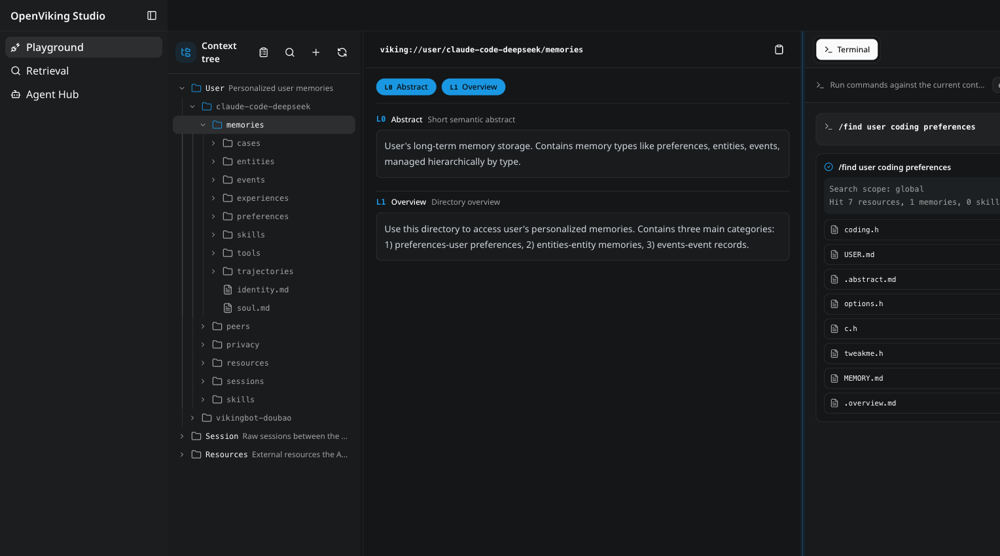
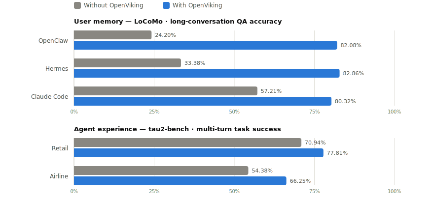

<div align="center">

<a href="https://openviking.ai/" target="_blank">
  <picture>
    
  </picture>
</a>

### OpenViking: The Context Database for AI Agents

English / [中文](README_CN.md) / [日本語](README_JA.md)

<a href="https://www.openviking.ai">Website</a> · <a href="https://openviking.ai/studio">Live Demo</a> · <a href="https://github.com/volcengine/OpenViking">GitHub</a> · <a href="https://github.com/volcengine/OpenViking/issues">Issues</a> · <a href="https://docs.openviking.ai/">Docs</a>

[](https://github.com/volcengine/OpenViking/releases)
[](https://github.com/volcengine/OpenViking)
[](https://github.com/volcengine/OpenViking/issues)
[](https://github.com/volcengine/OpenViking/graphs/contributors)
[](https://github.com/volcengine/OpenViking/blob/main/LICENSE)
[](https://github.com/volcengine/OpenViking/commits/main)

👋 Join our Community

📱 <a href="https://docs.openviking.ai/en/about/01-about-us#lark-group">Lark Group</a> · <a href="https://docs.openviking.ai/en/about/01-about-us#wechat-group">WeChat</a> · <a href="https://discord.com/invite/eHvx8E9XF3">Discord</a> · <a href="https://x.com/openvikingai">X</a>

<a href="https://trendshift.io/repositories/19668" target="_blank"></a>

</div>

***

## What is OpenViking

OpenViking is an open-source context database for AI agents. It stores memories, resources, and skills as one virtual filesystem under the `viking://` protocol, so an agent browses its own context with `ls`, `tree`, and `find` instead of querying a black-box vector store. Content is processed into three tiers — L0 abstract, L1 overview, L2 details — and loaded on demand. Every retrieval leaves a trajectory you can watch and debug. Full introduction: [Getting started](https://docs.openviking.ai/en/getting-started/01-introduction).

[](https://openviking.ai/studio)

*The [OpenViking Studio](https://openviking.ai/studio) playground — a live demo you can open in the browser, no installation required.*

## Why OpenViking

- **One filesystem for all context.** Memories, resources, and skills each get a `viking://` URI. Agents locate and manipulate context deterministically, like a developer working with files. → [Viking URI](https://docs.openviking.ai/en/concepts/04-viking-uri) · [Context types](https://docs.openviking.ai/en/concepts/02-context-types)
- **Tiered loading cuts token spend.** Every entry is processed into L0 (abstract), L1 (overview), and L2 (details) on write, then loaded only as deep as the task requires. → [Context layers](https://docs.openviking.ai/en/concepts/03-context-layers)
- **Directory recursive retrieval.** Vector search first locates the highest-scoring directory, then drills down layer by layer, so results arrive with their surrounding context intact. → [Retrieval](https://docs.openviking.ai/en/concepts/07-retrieval)
- **Observable retrieval.** Each query preserves its directory-browsing trajectory. When a result looks wrong, you can see exactly which path produced it. → [Retrieval](https://docs.openviking.ai/en/concepts/07-retrieval)
- **Sessions become memory.** After a session commits, OpenViking asynchronously extracts user preferences and agent experience into long-term memory. → [Session](https://docs.openviking.ai/en/concepts/08-session)

How the pieces fit together: [Architecture](https://docs.openviking.ai/en/concepts/01-architecture). The thinking behind the design: [The Database Paradigm for Context Engineering](https://blog.openviking.ai/post/openviking-context-database/).

```
viking://
├── resources/              # Resources: project docs, repos, web pages, etc.
│   └── my_project/
│       ├── docs/
│       │   ├── api/
│       │   └── tutorials/
│       └── src/
└── user/
    └── {user_id}/
        ├── memories/
        │   └── preferences/
        │       ├── writing_style
        │       └── coding_habits
        ├── resources/
        │   └── private_project/
        ├── skills/
        │   ├── search_code
        │   └── analyze_data
        └── peers/
            └── web-visitor-alice/
```

The three loading tiers:

- **L0 (Abstract)**: a one-sentence summary for quick relevance checks.
- **L1 (Overview)**: core information and usage scenarios for planning.
- **L2 (Details)**: the full original data, read only when needed.

Each directory carries its own L0/L1 layers, so relevance can be judged before any full file is read:

```
viking://resources/my_project/
├── .abstract               # L0: ~100 tokens - quick relevance check
├── .overview               # L1: ~2k tokens - structure and key points
└── docs/
    ├── .abstract
    ├── .overview
    └── api/
        ├── auth.md         # L2: full content, loaded on demand
        └── endpoints.md
```

## Proof it works

OpenViking 0.3.22 has been evaluated on long-conversation user memory (LoCoMo) and multi-turn agent tasks (tau2-bench). Full results and setup details, including knowledge-base QA, are in the [benchmark report](https://blog.openviking.ai/post/openviking-benchmark-results/); reproduction scripts live in [./benchmark](./benchmark).

<picture>
  <source media="(prefers-color-scheme: dark)" srcset="docs/images/benchmark-dark.svg">
  
</picture>

- **User memory (LoCoMo)**: with OpenViking, all three agent integrations land at 80–83% accuracy — up from 24–57% on their native memory — while input tokens drop by 34.3–91.0% and query latency by 58.45–66.10%.
- **Agent experience (tau2-bench)**: experience memory lifts task success by +6.87pp (retail) and +11.87pp (airline) over the same LLM without memory.

## Quick start

> 💡 **Want to see it in action first?** Try [OpenViking Studio](https://openviking.ai/studio) — a live hosted instance with a context playground, semantic search, and a multi-agent hub. No installation required.

Requires Python 3.10 or higher.

```bash
pip install openviking --upgrade
openviking-server init      # interactive wizard: providers, models, ov.conf
openviking-server doctor    # validate setup
openviking-server           # start (background: nohup openviking-server > openviking.log 2>&1 &)
```

`init` walks you through provider setup and writes `~/.openviking/ov.conf`. It supports Volcengine, OpenAI, Codex OAuth, Kimi, GLM, and local Ollama — for Ollama it can detect and install the runtime and pull models suited to your hardware. `doctor` checks the config file, Python version, provider connectivity, and disk space without a running server. Manual `ov.conf` templates, per-provider examples, environment variables, and Windows setup: [Configuration guide](https://docs.openviking.ai/en/guides/01-configuration) · [Quick start docs](https://docs.openviking.ai/en/getting-started/02-quickstart).

The install already includes the `ov` client CLI. With the server running:

```bash
ov status
ov add-resource https://github.com/volcengine/OpenViking # --wait
ov ls viking://resources/
ov tree viking://resources/volcengine -L 2
# wait some time for semantic processing if not --wait
ov find "what is openviking"
ov grep "openviking" --uri viking://resources/volcengine/OpenViking/docs/en
```

Next steps:

- Client configuration (`ov config`), standalone CLI installs (npm / cargo), and advanced usage such as index rebuilding: [CLI setup](https://docs.openviking.ai/en/getting-started/05-cli-setup)
- Docker and production deployment: [Deployment guide](https://docs.openviking.ai/en/guides/03-deployment)

## Use it with your agent

Integrations inject OpenViking recall into your agent's context and auto-commit session memory:

- [Claude Code](https://docs.openviking.ai/en/agent-integrations/02-claude-code)
- [Codex](https://docs.openviking.ai/en/agent-integrations/04-codex)
- [OpenClaw](https://docs.openviking.ai/en/agent-integrations/03-openclaw)
- [Hermes](https://docs.openviking.ai/en/agent-integrations/05-hermes)
- [Cursor](https://docs.openviking.ai/en/agent-integrations/12-cursor)
- [Trae](https://docs.openviking.ai/en/agent-integrations/13-trae)
- [OpenCode](https://docs.openviking.ai/en/agent-integrations/10-opencode)
- [pi](https://docs.openviking.ai/en/agent-integrations/11-pi)
- [MCP clients](https://docs.openviking.ai/en/agent-integrations/06-mcp-clients)
- [LangChain / LangGraph](https://docs.openviking.ai/en/agent-integrations/07-langchain-langgraph)

Setup instructions for each agent: [Agent integrations overview](https://docs.openviking.ai/en/agent-integrations/01-overview).

## OpenViking Helper (Beta)

OpenViking Helper is a desktop console, currently in beta for macOS and Windows x64:

- **Visual local agent setup**: detects OpenViking CLI, Claude Code, Codex, Cursor, Trae, and OpenCode, then configures supported plugin, MCP, Hook, and CLI integrations.
- **Session trace inspection**: parses Claude Code, Codex, and Trae sessions to show OpenViking recall, prompt injection, MCP calls, capture, and commit events.
- **Local memory and skill management**: views local memory / rule files and `SKILL.md` skills, then syncs them to OpenViking.

Download:

- [macOS Apple Silicon (arm64)](https://lf3-cdn-tos.bytegoofy.com/obj/tron-demo/7654844610543360265/420238785/0.0.19/darwin-arm64/openviking-helper-0.0.19-arm64.dmg)
- [macOS Intel (x64)](https://lf3-cdn-tos.bytegoofy.com/obj/tron-demo/7654844610543360265/420238785/0.0.19/darwin-x64/openviking-helper-0.0.19-x64.dmg)
- [Windows (x64)](https://lf3-cdn-tos.bytegoofy.com/obj/tron-demo/7654844610543360265/420238785/0.0.19/win32-x64/openviking-helper-0.0.19-x64.exe)

## VikingBot

VikingBot is an AI agent framework built on top of OpenViking:

```bash
pip install "openviking[bot]"
openviking-server --with-bot
ov chat   # in another terminal
```

The official Docker image bundles VikingBot and starts it by default alongside the server and console UI. Details: [VikingBot guide](https://docs.openviking.ai/en/guides/17-vikingbot).

## Deploy in production

For production, run OpenViking as a standalone HTTP service — see [Server deployment](https://docs.openviking.ai/en/getting-started/03-quickstart-server) and the [Deployment guide](https://docs.openviking.ai/en/guides/03-deployment).

Prefer not to operate it yourself? OpenViking Personal is officially hosted and ready to use, scales far beyond local hardware with VikingDB, and includes a free trial for up to 50 files; existing open-source users can move over with the migration tool. → [openviking.ai](https://www.openviking.ai)

## Research

OpenViking open-sources a subset of the core capabilities described in the VikingMem paper:

> **VikingMem: A Memory Base Management System for Stateful LLM-based Applications**
> Jiajie Fu, Junwen Chen, Mengzhao Wang, Aoxiang He, Maojia Sheng, Xiangyu Ke, Yifan Zhu, and Yunjun Gao.
> arXiv:2605.29640, 2026. Accepted by VLDB 2026.
> 📄 [Read the paper on arXiv](https://arxiv.org/abs/2605.29640)

## Community & contributing

OpenViking is still in its early stages, and there is plenty left to build.

- **Docs**: [docs.openviking.ai](https://docs.openviking.ai/) · [FAQ](https://docs.openviking.ai/en/faq/faq)
- **Blog**: [blog.openviking.ai](https://blog.openviking.ai/)
- **Team**: [About us](https://docs.openviking.ai/en/about/01-about-us)
- **Chat**: 📱 [Lark Group](https://docs.openviking.ai/en/about/01-about-us#lark-group) · 💬 [WeChat](https://docs.openviking.ai/en/about/01-about-us#wechat-group) · 🎮 [Discord](https://discord.com/invite/eHvx8E9XF3) · 🐦 [X](https://x.com/openvikingai)
- **Contribute**: bug fixes and new features are both welcome — see [CONTRIBUTING.md](CONTRIBUTING.md)

## Security and privacy

This project takes security seriously.
For vulnerability reporting and supported versions, see [SECURITY.md](SECURITY.md)

## License

The OpenViking project uses different licenses for different components:

- **Main Project**: AGPLv3 - see the [LICENSE](./LICENSE) file for details
- **crates/ov\_cli**: Apache 2.0 - see the [LICENSE](./crates/LICENSE) for details
- **examples**: Apache 2.0 - see the [LICENSE](./examples/LICENSE) for details
- **third\_party**: Respective original licenses of third-party projects
