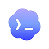

<div align="center">

<a href="https://openviking.ai/" target="_blank">
  <picture>
    
  </picture>
</a>

### OpenViking: AIエージェントのためのコンテキストデータベース

[English](README.md) / [中文](README_CN.md) / 日本語

<a href="https://www.openviking.ai">Webサイト</a> · <a href="https://openviking.ai/studio">ライブデモ</a> · <a href="https://github.com/volcengine/OpenViking">GitHub</a> · <a href="https://github.com/volcengine/OpenViking/issues">Issues</a> · <a href="https://docs.openviking.ai/">ドキュメント</a>

[](https://github.com/volcengine/OpenViking/releases)
[](https://github.com/volcengine/OpenViking)
[](https://github.com/volcengine/OpenViking/issues)
[](https://github.com/volcengine/OpenViking/graphs/contributors)
[](https://github.com/volcengine/OpenViking/blob/main/LICENSE)
[](https://github.com/volcengine/OpenViking/commits/main)

👋 コミュニティに参加しよう

📱 <a href="https://docs.openviking.ai/en/about/01-about-us#lark-group">Larkグループ</a> · <a href="https://docs.openviking.ai/en/about/01-about-us#wechat-group">WeChat</a> · <a href="https://discord.com/invite/eHvx8E9XF3">Discord</a> · <a href="https://x.com/openvikingai">X</a>

<a href="https://trendshift.io/repositories/19668" target="_blank"></a>

</div>

***

## OpenVikingとは

OpenVikingは、AIエージェントのためのオープンソースのコンテキストデータベースです。メモリ、リソース、スキルを `viking://` プロトコル配下の1つの仮想ファイルシステムとして保存するため、エージェントはブラックボックスのベクトルストアに問い合わせる代わりに、`ls`、`tree`、`find` で自分のコンテキストを閲覧できます。コンテンツは L0（abstract）、L1（overview）、L2（details）の3階層に処理され、必要に応じてロードされます。すべての検索は、観察してデバッグできる軌跡を残します。詳しい紹介はこちら: [Getting started](https://docs.openviking.ai/en/getting-started/01-introduction)。

[](https://openviking.ai/studio)

*[OpenViking Studio](https://openviking.ai/studio) のプレイグラウンド — インストール不要でブラウザから試せるライブデモです。*

## OpenVikingを選ぶ理由

- **すべてのコンテキストを1つのファイルシステムに。** メモリ、リソース、スキルにはそれぞれ `viking://` URI が与えられます。エージェントは、ファイルを扱う開発者のように、コンテキストを決定論的に特定・操作できます。→ [Viking URI](https://docs.openviking.ai/en/concepts/04-viking-uri) · [Context types](https://docs.openviking.ai/en/concepts/02-context-types)
- **階層型ローディングで token 消費を削減。** すべてのエントリは書き込み時に L0（abstract）、L1（overview）、L2（details）へ処理され、タスクが必要とする深さまでだけロードされます。→ [Context layers](https://docs.openviking.ai/en/concepts/03-context-layers)
- **ディレクトリ再帰検索。** ベクトル検索でまず最高スコアのディレクトリを特定し、そこから層ごとに掘り下げるため、結果は周辺のコンテキストを保ったまま返ってきます。→ [Retrieval](https://docs.openviking.ai/en/concepts/07-retrieval)
- **観察可能な検索。** 各クエリはディレクトリ閲覧の軌跡を保存します。結果がおかしいときは、どのパスがその結果を生んだのかを正確に確認できます。→ [Retrieval](https://docs.openviking.ai/en/concepts/07-retrieval)
- **セッションはメモリになる。** セッションのコミット後、OpenVikingはユーザーの好みとエージェントの経験を非同期に抽出し、長期メモリとして保存します。→ [Session](https://docs.openviking.ai/en/concepts/08-session)

各要素がどう組み合わさるか: [Architecture](https://docs.openviking.ai/en/concepts/01-architecture)。設計思想: [The Database Paradigm for Context Engineering](https://blog.openviking.ai/post/openviking-context-database/)。

```
viking://
├── resources/              # リソース: プロジェクトドキュメント、リポジトリ、Webページなど
│   └── my_project/
│       ├── docs/
│       │   ├── api/
│       │   └── tutorials/
│       └── src/
└── user/
    └── {user_id}/
        ├── memories/
        │   └── preferences/
        │       ├── writing_style
        │       └── coding_habits
        ├── resources/
        │   └── private_project/
        ├── skills/
        │   ├── search_code
        │   └── analyze_data
        └── peers/
            └── web-visitor-alice/
```

3つのローディング階層:

- **L0（Abstract）**: 迅速な関連性チェックのための一文の要約。
- **L1（Overview）**: 計画立案のためのコア情報と使用シナリオ。
- **L2（Details）**: 完全なオリジナルデータ。必要な場合にのみ読み込まれます。

各ディレクトリが自身の L0/L1 レイヤーを持つため、ファイル全体を読む前に関連性を判断できます:

```
viking://resources/my_project/
├── .abstract               # L0: 〜100 tokens - 迅速な関連性チェック
├── .overview               # L1: 〜2k tokens - 構造とキーポイント
└── docs/
    ├── .abstract
    ├── .overview
    └── api/
        ├── auth.md         # L2: 完全なコンテンツ、オンデマンドでロード
        └── endpoints.md
```

## 実証データ

OpenViking 0.3.22 は、長い会話でのユーザーメモリ（LoCoMo）と複数ターンのエージェントタスク（tau2-bench）で評価されています。ナレッジベースQAを含む完全な結果と実験設定は[ベンチマークレポート](https://blog.openviking.ai/post/openviking-benchmark-results/)を、再現用スクリプトは [./benchmark](./benchmark) を参照してください。

メモリ評価では、VLM に [Doubao 2.0 Pro](https://console.volcengine.com/ark/region:cn-beijing/model/detail?Id=doubao-seed-2-0-pro)、Embedding モデルに [Doubao-embedding-vision-251215](https://console.volcengine.com/ark/region:cn-beijing/model/detail?Id=doubao-embedding-vision) を使用しました。

<picture>
  <source media="(prefers-color-scheme: dark)" srcset="docs/images/benchmark-dark.svg">
  
</picture>

- **ユーザーメモリ（LoCoMo）**: OpenViking を接続すると、3つのエージェント統合すべてで精度が 80–83% に達します（ネイティブメモリでは 24–57%）。同時に入力 token は 34.3–91.0%、クエリレイテンシは 58.45–66.10% 削減されます。
- **エージェント経験（tau2-bench)**: 経験メモリにより、タスク成功率は同一 LLM（メモリなし）比で Retail +6.87pp、Airline +11.87pp 向上します。

## クイックスタート

> 💡 **まず動くところを見たい方へ**: [OpenViking Studio](https://openviking.ai/studio) をお試しください。コンテキストプレイグラウンド、セマンティック検索、マルチエージェント Hub を備えたライブホスト版インスタンスで、インストールは不要です。

Python 3.10 以上が必要です。

```bash
pip install openviking --upgrade
openviking-server init      # 対話式ウィザード: プロバイダー、モデル、ov.conf
openviking-server doctor    # セットアップを検証
openviking-server           # 起動
```

または、サーバーをバックグラウンドで実行します:

```bash
nohup openviking-server > /data/log/openviking.log 2>&1 &
```

`init` はプロバイダー設定を対話的に進め、`~/.openviking/ov.conf` を書き出します。Volcengine、OpenAI、Codex OAuth、Kimi、GLM、ローカルの Ollama をサポートし、Ollama についてはランタイムの検出とインストール、ハードウェアに適したモデルの取得も行えます。`doctor` は、サーバーを起動せずに設定ファイル、Python バージョン、プロバイダーへの接続性、ディスク容量をチェックします。

手動で書く `ov.conf` テンプレート、プロバイダーごとの設定例、環境変数、Windows でのセットアップ、CLI/クライアント設定は、[Configuration guide](https://docs.openviking.ai/en/guides/01-configuration) と [Quick start docs](https://docs.openviking.ai/en/getting-started/02-quickstart) にあります。

サーバーが起動したら:

```bash
ov status
ov add-resource https://github.com/volcengine/OpenViking
# TASK_ID を返されたタスク ID に置き換え、completed を確認してから後続のコマンドを実行します
ov task status TASK_ID
ov ls viking://resources/
ov tree viking://resources/volcengine -L 2
ov find "what is openviking"
ov grep "openviking" --uri viking://resources/volcengine/OpenViking/docs/en
```

既存インデックスの再構築: `ov reindex <uri> --mode vectors_only` はベクトルのみ更新します。`--mode semantic_and_vectors` はセマンティック生成物（`.abstract.md`、`.overview.md`）を再生成してからベクトルを更新し、`--mode prune_orphans` はソースファイルが存在しないベクトルレコードを削除します（`--dry-run` でプレビュー可能）。`semantic` や `full` というモードエイリアスはありません。

クライアント設定は `ov config` で対話的に初期化できます。複数のサーバーを運用する場合は `ov config switch` で切り替えます。

Rust CLI は `npm i -g @openviking/cli` でインストールできます。ソースからのビルドは `cargo install --git https://github.com/volcengine/OpenViking ov_cli` を使います — [CLI setup](https://docs.openviking.ai/en/getting-started/05-cli-setup) を参照してください。公式 Docker イメージもあります。[Deployment guide](https://docs.openviking.ai/en/guides/03-deployment) を参照してください。

## エージェントと組み合わせて使う

OpenViking を接続して、セッションをまたいで記憶を引き継ぎます。ネイティブ統合で自動想起とセッション収集を使うか、MCP で記憶とコンテキストのツールを提供できます。

<table>
<tr>
<td align="center" valign="bottom" width="33%">
<a href="https://docs.openviking.ai/en/agent-integrations/02-claude-code"><br><strong>Claude</strong></a><br>
<sub>Hooks&nbsp;+&nbsp;MCP</sub>
</td>
<td align="center" valign="bottom" width="33%">
<a href="https://docs.openviking.ai/en/agent-integrations/04-codex"><br><strong>Codex</strong></a><br>
<sub>Hooks&nbsp;+&nbsp;MCP</sub>
</td>
<td align="center" valign="bottom" width="33%">
<a href="https://docs.openviking.ai/en/agent-integrations/12-cursor"><br><strong>Cursor</strong></a><br>
<sub>Hooks&nbsp;+&nbsp;MCP</sub>
</td>
</tr>
<tr>
<td align="center" valign="bottom" width="33%">
<a href="https://docs.openviking.ai/en/agent-integrations/13-trae"><br><strong>TRAE</strong></a><br>
<sub>Hooks&nbsp;+&nbsp;MCP</sub>
</td>
<td align="center" valign="bottom" width="33%">
<a href="https://docs.openviking.ai/en/agent-integrations/03-openclaw"><br><strong>OpenClaw</strong></a><br>
<sub>コンテキストエンジン</sub>
</td>
<td align="center" valign="bottom" width="33%">
<a href="https://docs.openviking.ai/en/agent-integrations/05-hermes"><br><strong>Hermes</strong></a><br>
<sub>内蔵メモリ</sub>
</td>
</tr>
<tr>
<td align="center" valign="bottom" width="33%">
<a href="https://docs.openviking.ai/en/agent-integrations/10-opencode"><br><strong>OpenCode</strong></a><br>
<sub>Plugin&nbsp;+&nbsp;MCP</sub>
</td>
<td align="center" valign="bottom" width="33%">
<a href="https://docs.openviking.ai/en/agent-integrations/11-pi"><picture><source media="(prefers-color-scheme: dark)" srcset="docs/images/integrations/pi-dark.svg"></picture><br><strong>pi</strong></a><br>
<sub>ネイティブ拡張</sub>
</td>
<td align="center" valign="bottom" width="33%">
<a href="docs/images/agents/en/deerflow-memory-manager.md"><picture><source media="(prefers-color-scheme: dark)" srcset="docs/images/integrations/deerflow-dark.svg"></picture><br><strong>DeerFlow</strong></a><br>
<sub>Memory&nbsp;+&nbsp;MCP</sub>
</td>
</tr>
</table>

**汎用接続**

<table>
<tr>
<td align="center" valign="bottom" width="33%">
<a href="https://docs.openviking.ai/en/agent-integrations/15-agent-plugins"><br><strong>Agent&nbsp;Plugins&nbsp;1.0</strong></a>
</td>
<td align="center" valign="bottom" width="33%">
<a href="https://docs.openviking.ai/en/agent-integrations/06-mcp-clients"><br><strong>MCP&nbsp;ク&#8288;ラ&#8288;イ&#8288;ア&#8288;ン&#8288;ト</strong></a>
</td>
<td align="center" valign="bottom" width="33%">
<a href="https://docs.openviking.ai/en/agent-integrations/07-langchain-langgraph"><br><strong>LangChain</strong></a>
</td>
</tr>
</table>

設定方法と統合の詳細は [Integrations](https://openviking.ai/integrations) を参照してください。

## OpenViking Helper（Beta）

OpenViking Helper はデスクトップコンソールで、現在 macOS と Windows x64 向けの Beta 版として提供しています:

- **ローカルエージェント設定の可視化**: OpenViking CLI、Claude Code、Codex、Cursor、Trae、OpenCode を検出し、対応する plugin、MCP、Hook、CLI 統合を設定します。
- **セッショントレースの確認**: Claude Code、Codex、Trae のセッションを解析し、OpenViking の recall、プロンプト注入、MCP 呼び出し、capture、commit の各イベントを表示します。
- **ローカルメモリとスキルの管理**: ローカルの memory / rule ファイルと `SKILL.md` スキルを確認し、OpenViking に同期します。

ダウンロード:

- [macOS Apple Silicon (arm64)](https://lf3-cdn-tos.bytegoofy.com/obj/tron-demo/7654844610543360265/420238785/0.0.19/darwin-arm64/openviking-helper-0.0.19-arm64.dmg)
- [macOS Intel (x64)](https://lf3-cdn-tos.bytegoofy.com/obj/tron-demo/7654844610543360265/420238785/0.0.19/darwin-x64/openviking-helper-0.0.19-x64.dmg)
- [Windows (x64)](https://lf3-cdn-tos.bytegoofy.com/obj/tron-demo/7654844610543360265/420238785/0.0.19/win32-x64/openviking-helper-0.0.19-x64.exe)

## VikingBot

VikingBot は、OpenViking 上に構築された AI エージェントフレームワークです:

```bash
pip install "openviking[bot]"
openviking-server --with-bot
ov chat   # 別のターミナルで実行
```

公式 Docker イメージには VikingBot が同梱されており、サーバーとコンソール UI とともにデフォルトで起動します。詳細: [VikingBot guide](https://docs.openviking.ai/en/guides/17-vikingbot)。

## 本番環境へのデプロイ

本番環境では、OpenViking をスタンドアロンの HTTP サービスとして実行してください — [Server deployment](https://docs.openviking.ai/en/getting-started/03-quickstart-server) と [Deployment guide](https://docs.openviking.ai/en/guides/03-deployment) を参照してください。

## 商用版

**オープンソース版が機能制限されることはありません。** 本リポジトリの OpenViking は AGPLv3 で完全にオープンソースです。機能ロックなし、アカウント登録なし、アクティベーションコードなしで、上記の[本番環境へのデプロイ](#本番環境へのデプロイ)に従って自分で本番運用できます。今後もそれは変わりません。

以下の 2 つの版が解決するのは「誰が運用し、どこで動かすか」であって、「使えるかどうか」ではありません。

<table>
<tr>
<td width="50%" valign="top">


<h3>☁️ マネージド SaaS 版</h3>
<p><b>Volcano Engine</b> 上で公式にホスティングされ、構築も運用も不要です。</p>
<ul>
<li><b>Personal</b> — 個人開発者向け。最大 50 ファイルまで無料トライアル、VikingDB によりローカルハードウェアを超えてスケールします。</li>
<li><b>Enterprise</b> — チーム向けのマルチユーザー管理、権限管理、エンタープライズ SLA とサポート。</li>
</ul>
<p>オープンソース版のユーザーは移行ツールでそのまま移行できます。</p>
<p><a href="https://www.volcengine.com/product/openviking-service"><b>→ Volcano Engine 製品ページ</b></a> · <a href="https://docs.volcengine.com/docs/84313/2374478">ドキュメント</a></p>
<p><sub>中国以外の地域向けグローバルホスティングは <a href="https://www.byteplus.com">BytePlus</a> で提供予定です。</sub></p>

</td>
<td width="50%" valign="top">


<h3>🏢 プライベートデプロイ版</h3>
<p><b>自社環境内</b>で動作し、データは外部に出ません。</p>
<ul>
<li><b>オンライン</b> — 自社のクラウドアカウント / VPC にデプロイ。BYOC 対応、更新とライセンス取得のため外部接続あり。</li>
<li><b>オフライン</b> — 外部接続のない完全な閉域環境向け。規制産業に対応します。</li>
</ul>
<p>オープンソース版に加えて分散デプロイと公式サポートを提供し、アクティベーションコードで有効化します。</p>
<p><a href="https://docs.google.com/forms/d/e/1FAIpQLScQqwsm7fvKdjtNiW5rWNXJjoHPtedVzLsKSMJgObtsj2_udA/viewform"><b>→ プライベートデプロイのお問い合わせ</b></a></p>

</td>
</tr>
</table>

> オープンソース版を自分で動かしたいだけですか？問題ありません。誰にも連絡する必要はなく、[クイックスタート](#クイックスタート)へどうぞ。

## 研究

**対話とともに進化するエージェントの記憶。** VikingMem は、イベントを起点に長期記憶を抽出・更新・統合し、状態を持つエージェントが対話を通じて再利用できる経験を蓄積する仕組みを示しています。OpenViking は、そのコア機能の一部をオープンソースとして公開しています。

> **VikingMem: A Memory Base Management System for Stateful LLM-based Applications**<br>
> Jiajie Fu, Junwen Chen, Mengzhao Wang, Aoxiang He, Maojia Sheng, Xiangyu Ke, Yifan Zhu, and Yunjun Gao.<br>
> arXiv:2605.29640, 2026. 2026 年 9 月に VLDB 2026 で発表済み。<br>
> 📄 [arXiv で論文を読む](https://arxiv.org/abs/2605.29640) · [PDF を読む](https://arxiv.org/pdf/2605.29640)

**ディレクトリ構造を検索のコンテキストに。** 本論文は、OpenViking のディレクトリを考慮した検索に形式的基盤、インデックス設計、実験による検証を提供します。ディレクトリ範囲のクエリと構造の保守操作を定義し、TrieHI を提案しています。OpenViking はこれを統合し、ベクトルによる順位付けの前に検索範囲を確定します。エージェントはプロジェクトや記憶のサブツリー内で根拠を探し、周辺のコンテキストを保ちながら、知識の変化に応じてディレクトリを再編できます。

> **Directory-Aware Query and Maintenance in Vector Databases**<br>
> Mengzhao Wang, Zheng Gong, Jingpei Hu, Jiajie Fu, Maojia Sheng, Junwen Chen, and Yifan Zhu.<br>
> arXiv:2606.16903, 2026. ICDE 採択済み。<br>
> 📄 [arXiv で論文を読む](https://arxiv.org/abs/2606.16903) · [PDF を読む](https://arxiv.org/pdf/2606.16903)

**少ないトークンで回答に必要な根拠を集める。** VikingRAG は意味検索と文書構造を組み合わせ、根拠の不足に応じて関連するディレクトリ部分を取得します。そのコア機構は OpenViking に統合されています。さらに、検索履歴の再利用と必要な場合のみ複数ラウンドの検索へ移行する手法を研究し、回答品質を保ちながら探索の繰り返しを減らします。

> **VikingRAG: Accurate and Token-efficient Retrieval-augmented Generation over Structured Documents**<br>
> Peiyuan Gao, Gaoyuan Zhang, Haojie Qin, Yahui Sun, Qianyi Zhang, Yunhao Zhang, Zeyu Wang, and Wei Lu.<br>
> arXiv:2609.11390, 2026. 投稿中。<br>
> 📄 [arXiv で論文を読む](https://arxiv.org/abs/2609.11390) · [PDF を読む](https://arxiv.org/pdf/2609.11390)

## パートナープロジェクト

OpenViking は、コンテキストデータエコシステムを構築するために他のオープンソースプロジェクトとのコラボレーションを歓迎します。確認済みのパートナーは以下の通りです:

- [deer-flow](https://github.com/bytedance/deer-flow) - オープンソースの長時間 SuperAgent フレームワーク
- [NoKV](https://github.com/NoKV-Lab/NoKV) - AI ネイティブの分散ファイルシステム
- [loopx](https://github.com/huangruiteng/loopx) - 軽量なループエンジニアリング状態カーネル
- [Hermes Agent](https://github.com/NousResearch/hermes-agent) - あなたと共に成長するエージェント

パートナーリストへの参加に興味がありますか？コミュニティに issue を提出して申請してください。

## コミュニティとコントリビューション

OpenViking はまだ初期段階にあり、作るべきものが数多く残っています。

- **ドキュメント**: [docs.openviking.ai](https://docs.openviking.ai/) · [FAQ](https://docs.openviking.ai/en/faq/faq)
- **ブログ**: [blog.openviking.ai](https://blog.openviking.ai/)
- **チーム**: [About us](https://docs.openviking.ai/en/about/01-about-us)
- **チャット**: 📱 [Larkグループ](https://docs.openviking.ai/en/about/01-about-us#lark-group) · 💬 [WeChat](https://docs.openviking.ai/en/about/01-about-us#wechat-group) · 🎮 [Discord](https://discord.com/invite/eHvx8E9XF3) · 🐦 [X](https://x.com/openvikingai)
- **コントリビュート**: バグ修正も新機能も歓迎します — [CONTRIBUTING_JA.md](CONTRIBUTING_JA.md) を参照してください

## セキュリティとプライバシー

このプロジェクトはセキュリティを重視しています。
脆弱性の報告方法とサポート対象バージョンについては、[SECURITY.md](SECURITY.md) を参照してください

## ライセンス

OpenViking プロジェクトは、コンポーネントごとに異なるライセンスを使用しています:

- **メインプロジェクト**: AGPLv3 - 詳細は [LICENSE](./LICENSE) ファイルを参照してください
- **crates/ov\_cli**: Apache 2.0 - 詳細は [LICENSE](./crates/LICENSE) を参照してください
- **examples**: Apache 2.0 - 詳細は [LICENSE](./examples/LICENSE) を参照してください
- **third\_party**: 各サードパーティプロジェクトの元のライセンス
