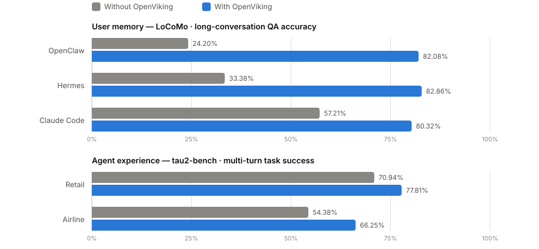
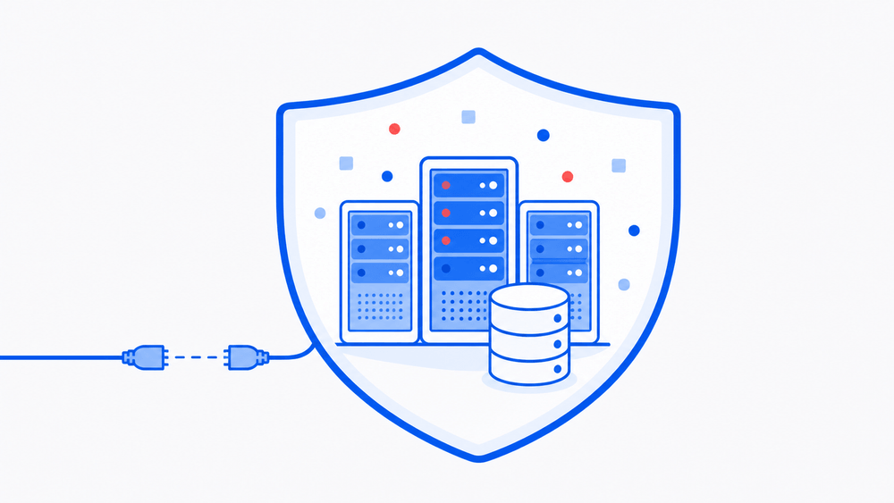

<div align="center">

<a href="https://openviking.ai/" target="_blank">
  <picture>
    
  </picture>
</a>

### OpenViking: контекстная база данных для ИИ-агентов

[English](README.md) / [中文](README_CN.md) / [日本語](README_JA.md) / Русский

<a href="https://www.openviking.ai">Сайт</a> · <a href="https://openviking.ai/studio">Живое демо</a> · <a href="https://github.com/volcengine/OpenViking">GitHub</a> · <a href="https://github.com/volcengine/OpenViking/issues">Issues</a> · <a href="https://docs.openviking.ai/">Документация</a>

[](https://github.com/volcengine/OpenViking/releases)
[](https://github.com/volcengine/OpenViking)
[](https://github.com/volcengine/OpenViking/issues)
[](https://github.com/volcengine/OpenViking/graphs/contributors)
[](https://github.com/volcengine/OpenViking/blob/main/LICENSE)
[](https://github.com/volcengine/OpenViking/commits/main)

👋 Присоединяйтесь к сообществу

📱 <a href="https://docs.openviking.ai/en/about/01-about-us#lark-group">Lark Group</a> · <a href="https://docs.openviking.ai/en/about/01-about-us#wechat-group">WeChat</a> · <a href="https://discord.com/invite/eHvx8E9XF3">Discord</a> · <a href="https://x.com/openvikingai">X</a>

<a href="https://trendshift.io/repositories/19668" target="_blank"></a>

</div>

***

## Что такое OpenViking

OpenViking — открытая контекстная база данных для ИИ-агентов. Память, ресурсы и навыки хранятся как одна виртуальная файловая система по протоколу `viking://`: агент смотрит свой контекст через `ls`, `tree` и `find`, а не через чёрный ящик векторного хранилища. Контент обрабатывается в три уровня — L0 abstract, L1 overview, L2 details — и подгружается по требованию. Каждый поиск оставляет траекторию, которую можно смотреть и отлаживать. Полное введение: [Getting started](https://docs.openviking.ai/en/getting-started/01-introduction).

[](https://openviking.ai/studio)

*[OpenViking Studio](https://openviking.ai/studio) playground — живое демо в браузере, установка не нужна.*

## Почему OpenViking

- **Одна файловая система для всего контекста.** Память, ресурсы и навыки получают URI `viking://`. Агенты находят и меняют контекст детерминированно, как разработчик работает с файлами. → [Viking URI](https://docs.openviking.ai/en/concepts/04-viking-uri) · [Типы контекста](https://docs.openviking.ai/en/concepts/02-context-types)
- **Многоуровневая загрузка экономит токены.** При записи каждая запись обрабатывается в L0 (abstract), L1 (overview) и L2 (details), а загружается только на нужную глубину. → [Слои контекста](https://docs.openviking.ai/en/concepts/03-context-layers)
- **Рекурсивный поиск по каталогам.** Векторный поиск сначала находит каталог с лучшим скором, затем спускается слой за слоем — результаты приходят вместе с окружающим контекстом. → [Retrieval](https://docs.openviking.ai/en/concepts/07-retrieval)
- **Наблюдаемый retrieval.** Каждый запрос сохраняет траекторию обхода каталогов. Если результат странный, видно, какой путь его дал. → [Retrieval](https://docs.openviking.ai/en/concepts/07-retrieval)
- **Сессии становятся памятью.** После commit сессии OpenViking асинхронно извлекает предпочтения пользователя и опыт агента в долгосрочную память. → [Session](https://docs.openviking.ai/en/concepts/08-session)

Как части складываются вместе: [Architecture](https://docs.openviking.ai/en/concepts/01-architecture). Идея дизайна: [The Database Paradigm for Context Engineering](https://blog.openviking.ai/post/openviking-context-database/).

```
viking://
├── resources/              # Resources: project docs, repos, web pages, etc.
│   └── my_project/
│       ├── docs/
│       │   ├── api/
│       │   └── tutorials/
│       └── src/
└── user/
    └── {user_id}/
        ├── memories/
        │   └── preferences/
        │       ├── writing_style
        │       └── coding_habits
        ├── resources/
        │   └── private_project/
        ├── skills/
        │   ├── search_code
        │   └── analyze_data
        └── peers/
            └── web-visitor-alice/
```

Три уровня загрузки:

- **L0 (Abstract)**: одно предложение для быстрой оценки релевантности.
- **L1 (Overview)**: ключевая информация и сценарии использования для планирования.
- **L2 (Details)**: полные исходные данные, читаются только когда нужны.

У каждого каталога свои слои L0/L1, поэтому релевантность можно оценить до чтения полного файла:

```
viking://resources/my_project/
├── .abstract               # L0: ~100 tokens - quick relevance check
├── .overview               # L1: ~2k tokens - structure and key points
└── docs/
    ├── .abstract
    ├── .overview
    └── api/
        ├── auth.md         # L2: full content, loaded on demand
        └── endpoints.md
```

## Доказательства, что это работает

OpenViking 0.3.22 оценивали на пользовательской памяти в длинных диалогах (LoCoMo) и многоходовых агентных задачах (tau2-bench). Полные результаты и детали сетапа, включая QA по базе знаний, — в [отчёте по бенчмаркам](https://blog.openviking.ai/post/openviking-benchmark-results/); скрипты воспроизведения — в [./benchmark](./benchmark).

Для оценки памяти использовались [Doubao 2.0 Pro](https://console.volcengine.com/ark/region:cn-beijing/model/detail?Id=doubao-seed-2-0-pro) как VLM и [Doubao-embedding-vision-251215](https://console.volcengine.com/ark/region:cn-beijing/model/detail?Id=doubao-embedding-vision) как модель эмбеддингов.

<picture>
  <source media="(prefers-color-scheme: dark)" srcset="docs/images/benchmark-dark.svg">
  
</picture>

- **Память пользователя (LoCoMo)**: с OpenViking все три интеграции агентов дают 80–83% точности — против 24–57% на нативной памяти — при этом входные токены падают на 34.3–91.0%, а латентность запросов — на 58.45–66.10%.
- **Опыт агента (tau2-bench)**: память опыта поднимает успешность задач на +6.87 п.п. (retail) и +11.87 п.п. (airline) по сравнению с той же LLM без памяти.

## Быстрый старт

> 💡 **Сначала хотите посмотреть в деле?** Попробуйте [OpenViking Studio](https://openviking.ai/studio) — живой хостинг с playground контекста, семантическим поиском и хабом мультиагентов. Установка не нужна.

Нужен Python 3.10 или новее.

```bash
pip install openviking --upgrade
openviking-server init      # interactive wizard: providers, models, ov.conf
openviking-server doctor    # validate setup
openviking-server           # start (background: nohup openviking-server > openviking.log 2>&1 &)
```

`init` проводит по настройке провайдера и пишет `~/.openviking/ov.conf`. Поддерживаются Volcengine, OpenAI, Codex OAuth, Kimi, GLM и локальный Ollama — для Ollama умеет найти и поставить runtime и скачать модели под ваше железо. `doctor` проверяет конфиг, версию Python, связность с провайдером и место на диске без запущенного сервера. Шаблоны `ov.conf`, примеры по провайдерам, переменные окружения и установка на Windows: [Configuration guide](https://docs.openviking.ai/en/guides/01-configuration) · [Quick start docs](https://docs.openviking.ai/en/getting-started/02-quickstart).

В установку уже входит клиентский CLI `ov`. Когда сервер запущен:

```bash
ov status
ov add-resource https://github.com/volcengine/OpenViking # --wait
ov ls viking://resources/
ov tree viking://resources/volcengine -L 2
# wait some time for semantic processing if not --wait
ov find "what is openviking"
ov grep "openviking" --uri viking://resources/volcengine/OpenViking/docs/en
```

Дальше:

- Конфигурация клиента (`ov config`), отдельные установки CLI (npm / cargo) и продвинутые сценарии вроде пересборки индекса: [CLI setup](https://docs.openviking.ai/en/getting-started/05-cli-setup)
- Docker и продакшен: [Deployment guide](https://docs.openviking.ai/en/guides/03-deployment)

## Использование с вашим агентом

Интеграции вставляют recall OpenViking в контекст агента и автоматически коммитят память сессии:

- [Claude Code](https://docs.openviking.ai/en/agent-integrations/02-claude-code)
- [Codex](https://docs.openviking.ai/en/agent-integrations/04-codex)
- [OpenClaw](https://docs.openviking.ai/en/agent-integrations/03-openclaw)
- [Hermes](https://docs.openviking.ai/en/agent-integrations/05-hermes)
- [Cursor](https://docs.openviking.ai/en/agent-integrations/12-cursor)
- [TRAE / TRAE CN / TraeCode CLI 2.0](https://docs.openviking.ai/en/agent-integrations/13-trae)
- [OpenCode](https://docs.openviking.ai/en/agent-integrations/10-opencode)
- [pi](https://docs.openviking.ai/en/agent-integrations/11-pi)
- [Agent Plugins 1.0](https://docs.openviking.ai/en/agent-integrations/15-agent-plugins)
- [MCP clients](https://docs.openviking.ai/en/agent-integrations/06-mcp-clients)
- [LangChain / LangGraph](https://docs.openviking.ai/en/agent-integrations/07-langchain-langgraph)

Инструкции по каждому агенту: [обзор интеграций](https://docs.openviking.ai/en/agent-integrations/01-overview).

## OpenViking Helper (Beta)

OpenViking Helper — десктопная консоль, сейчас в бете для macOS и Windows x64:

- **Визуальная настройка локального агента**: находит OpenViking CLI, Claude Code, Codex, Cursor, Trae и OpenCode, затем настраивает поддерживаемые plugin, MCP, Hook и CLI-интеграции.
- **Просмотр трасс сессий**: разбирает сессии Claude Code, Codex и Trae и показывает recall OpenViking, инъекцию промптов, MCP-вызовы, capture и commit.
- **Локальная память и навыки**: просматривает локальные файлы памяти / правил и навыки `SKILL.md`, затем синхронизирует их в OpenViking.

Скачать:

- [macOS Apple Silicon (arm64)](https://lf3-cdn-tos.bytegoofy.com/obj/tron-demo/7654844610543360265/420238785/0.0.19/darwin-arm64/openviking-helper-0.0.19-arm64.dmg)
- [macOS Intel (x64)](https://lf3-cdn-tos.bytegoofy.com/obj/tron-demo/7654844610543360265/420238785/0.0.19/darwin-x64/openviking-helper-0.0.19-x64.dmg)
- [Windows (x64)](https://lf3-cdn-tos.bytegoofy.com/obj/tron-demo/7654844610543360265/420238785/0.0.19/win32-x64/openviking-helper-0.0.19-x64.exe)

## VikingBot

VikingBot — фреймворк ИИ-агентов поверх OpenViking:

```bash
pip install "openviking[bot]"
openviking-server --with-bot
ov chat   # in another terminal
```

Официальный Docker-образ включает VikingBot и по умолчанию запускает его вместе с сервером и UI консоли. Подробности: [гайд по VikingBot](https://docs.openviking.ai/en/guides/17-vikingbot).

## Продакшен

В продакшене запускайте OpenViking как отдельный HTTP-сервис — см. [Server deployment](https://docs.openviking.ai/en/getting-started/03-quickstart-server) и [Deployment guide](https://docs.openviking.ai/en/guides/03-deployment).

## Коммерческие редакции

**Open-source редакция не урезана.** OpenViking в этом репозитории полностью открыт по AGPLv3: без feature gates, без аккаунта, без ключа активации. Следуйте [Продакшен](#продакшен) выше и запускайте сами — так и останется.

Две редакции ниже отвечают на вопрос «кто это обслуживает и где это крутится», а не «можно ли этим пользоваться».

<table>
<tr>
<td width="50%" valign="top">


<h3>☁️ Managed SaaS</h3>
<p>Официально хостится на <b>Volcano Engine</b>. Ничего не нужно ставить и обслуживать.</p>
<ul>
<li><b>Personal</b> — для индивидуальных разработчиков. Бесплатный пробный период до 50 файлов; масштабируется далеко за пределы локального железа с VikingDB.</li>
<li><b>Enterprise</b> — мультипользовательское управление контекстом, командная работа и права, корпоративный SLA и поддержка.</li>
</ul>
<p>Существующие open-source пользователи могут переехать с помощью инструмента миграции.</p>
<p><a href="https://www.volcengine.com/product/openviking-service"><b>→ Страница продукта Volcano Engine</b></a> · <a href="https://docs.volcengine.com/docs/84313/2374478">Документация</a></p>
<p><sub>Глобальный хостинг за пределами Китая появится на <a href="https://www.byteplus.com">BytePlus</a>.</sub></p>

</td>
<td width="50%" valign="top">



<h3>🏢 Self-Managed</h3>
<p>Работает <b>внутри вашей среды</b>. Данные её не покидают.</p>
<ul>
<li><b>Online</b> — в вашем облачном аккаунте / VPC, поддерживается BYOC, исходящий доступ для обновлений и лицензирования.</li>
<li><b>Offline</b> — полностью изолированные среды без интернета, для регулируемых отраслей.</li>
</ul>
<p>К open-source редакции добавляются распределённый деплой и официальная поддержка; активируется лицензионным ключом.</p>
<p><a href="https://docs.google.com/forms/d/e/1FAIpQLScQqwsm7fvKdjtNiW5rWNXJjoHPtedVzLsKSMJgObtsj2_udA/viewform"><b>→ Напишите нам про self-managed развёртывание</b></a></p>

</td>
</tr>
</table>

> Хотите просто запустить open-source редакцию? Вперёд — никого уведомлять не нужно. Переходите к [Быстрый старт](#быстрый-старт).

## Исследования

OpenViking открывает часть ключевых возможностей, описанных в статье VikingMem:

> **VikingMem: A Memory Base Management System for Stateful LLM-based Applications**
> Jiajie Fu, Junwen Chen, Mengzhao Wang, Aoxiang He, Maojia Sheng, Xiangyu Ke, Yifan Zhu, and Yunjun Gao.
> arXiv:2605.29640, 2026. Accepted by VLDB 2026.
> 📄 [Читать статью на arXiv](https://arxiv.org/abs/2605.29640)

## Партнёрские проекты

OpenViking приглашает к сотрудничеству другие open-source проекты, чтобы строить экосистему контекстных данных. Подтверждённые партнёры:

- [deer-flow](https://github.com/bytedance/deer-flow) — открытый harness для long-horizon SuperAgent
- [NoKV](https://github.com/NoKV-Lab/NoKV) — AI-native распределённая файловая система
- [loopx](https://github.com/huangruiteng/loopx) — лёгкое ядро состояния для loop engineering
- [Hermes Agent](https://github.com/NousResearch/hermes-agent) — агент, который растёт вместе с вами

Хотите попасть в список партнёров? Создайте issue в сообществе.

## Сообщество и вклад

OpenViking ещё на ранней стадии, строить есть что.

- **Документация**: [docs.openviking.ai](https://docs.openviking.ai/) · [FAQ](https://docs.openviking.ai/en/faq/faq)
- **Блог**: [blog.openviking.ai](https://blog.openviking.ai/)
- **Команда**: [О нас](https://docs.openviking.ai/en/about/01-about-us)
- **Чат**: 📱 [Lark Group](https://docs.openviking.ai/en/about/01-about-us#lark-group) · 💬 [WeChat](https://docs.openviking.ai/en/about/01-about-us#wechat-group) · 🎮 [Discord](https://discord.com/invite/eHvx8E9XF3) · 🐦 [X](https://x.com/openvikingai)
- **Вклад**: и багфиксы, и новые фичи приветствуются — см. [CONTRIBUTING.md](CONTRIBUTING.md)

## Безопасность и приватность

Этот проект относится к безопасности серьёзно.
О сообщении уязвимостей и поддерживаемых версиях см. [SECURITY.md](SECURITY.md)

## Лицензия

У разных компонентов OpenViking разные лицензии:

- **Основной проект**: AGPLv3 — см. файл [LICENSE](./LICENSE)
- **crates/ov\_cli**: Apache 2.0 — см. [LICENSE](./crates/LICENSE)
- **examples**: Apache 2.0 — см. [LICENSE](./examples/LICENSE)
- **third\_party**: исходные лицензии сторонних проектов
