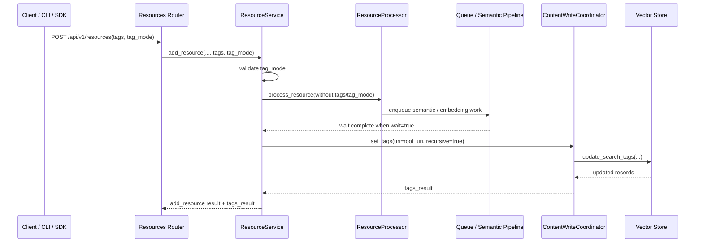

# add_resource tags 设计文档

> 状态: Draft
> 适用范围: `add_resource` / `temp_upload` / search tags；稳定来源的 resource watch 沿用同一标签策略
> 目标读者: OpenViking 服务端、SDK、CLI 维护者

## 1. 背景

OpenViking 已经支持通过 `/api/v1/fs/attrs/set_tags` 给已有资源设置检索标签，并在 `/api/v1/search/find`、`/api/v1/search/search` 中通过 `tags` 做过滤召回。这个能力适合资源已存在后的二次治理，但对导入场景不够顺手：

- 用户上传或导入资源时，通常已经知道资源来源、业务线、环境、数据集批次等标签。
- 资源导入后再调用 `set_tags` 需要额外请求，失败恢复和调用方状态管理更复杂。
- 对已有稳定来源 watch 场景，后续刷新需要继续沿用同一套标签策略，否则首次导入有标签，刷新后新向量记录可能丢失标签。
- SDK 和 CLI 需要与 HTTP API 保持一致，避免用户在不同入口之间切换时语义不一致。

本设计把显式检索标签作为 `add_resource` 的可选导入策略，让用户可以在资源创建时同步表达标签。对于 URL、sitemap、RSS 等可重复读取的稳定来源 watch，刷新时继续使用同一策略。

## 2. 目标与非目标

### 2.1 目标

- `POST /api/v1/resources` 支持可选字段 `tags` 和 `tag_mode`。
- `add_resource` 处理完成后，把标签应用到导入产生的语义节点。
- `temp_upload + watch_interval > 0` 仍然拒绝；上传内容是一份一次性快照，本轮不引入 uploaded watch 或 materialized watch source。
- SDK 和 CLI 暴露同等能力。
- `find/search` 使用同一个 `search_tags` 过滤模型，支持单 tag 和多 tag AND 过滤。
- 对失败或部分成功的标签应用结果给出结构化返回，调用方可以据此决定是否重试或降级。

### 2.2 非目标

- 不把 `tags` 传给 parser 或资源解析器。标签是检索元数据，不是解析参数。
- 不引入服务端后台重试循环来掩盖后端最终一致性。`add_resource` 返回的 `tags_result` 是一次标签应用的结果。
- 不改变 `/api/v1/fs/attrs/set_tags` 的现有语义。
- 不把标签写入原始文件内容。标签只落到向量检索记录的 `search_tags` 元数据。
- 不支持任意字符串标签。首版只支持严格 `k=v` 格式。

## 3. 用户可见语义

### 3.1 标签格式

标签必须是严格的 `k=v` 字符串。服务端会做规范化：

- 去除首尾空白。
- 转为小写。
- 去重。
- `k` 和 `v` 都不能为空。
- 只能包含一个等号。

示例：

```json
[" Team=Search ", "team=search", "Env=Prod"]
```

会被规范化为：

```json
["team=search", "env=prod"]
```

非法示例：

```json
["team", "team=", "=search", "a=b=c"]
```

这些值会返回 `INVALID_ARGUMENT`。

### 3.2 tag_mode

`tag_mode` 支持两个值：

| 模式 | 语义 |
| --- | --- |
| `replace` | 用输入标签替换目标语义节点上的现有 `search_tags`。这是默认值。 |
| `append` | 把输入标签合并到现有 `search_tags`。同 key 后写覆盖先写，例如已有 `env=dev`，追加 `env=prod` 后保留 `env=prod`。 |

### 3.3 检索过滤

`find/search` 的 `tags` 是 AND 语义：

- `["source=curl"]`：要求结果带有 `source=curl`。
- `["source=curl", "env=test"]`：要求结果同时带有两个标签。
- 任意一个标签不匹配，结果不会被召回。

标签过滤会与 `target_uri`、`context_type`、时间过滤、`level` 等其他过滤条件组合。

## 4. API 设计

### 4.1 add_resource

请求字段：

```json
{
  "path": "...",
  "temp_file_id": "...",
  "to": "viking://resources/demo/doc.md",
  "wait": true,
  "timeout": 120,
  "watch_interval": 0,
  "tags": ["source=upload", "env=test"],
  "tag_mode": "replace"
}
```

字段说明：

| 字段 | 类型 | 必填 | 默认值 | 说明 |
| --- | --- | --- | --- | --- |
| `tags` | `list[str]` | 否 | `null` | 要写入检索记录的显式标签。 |
| `tag_mode` | `string` | 否 | `replace` | `replace` 或 `append`。只有 `tags` 非空时有意义。 |

返回中会包含 `tags_result`：

```json
{
  "tags_result": {
    "uri": "viking://resources/demo/doc.md",
    "updated_uris": ["viking://resources/demo/doc.md"],
    "root_uri": "viking://resources/demo/doc.md",
    "context_type": "resource",
    "tags": ["source=upload", "env=test"],
    "mode": "replace",
    "success_count": 1,
    "skipped_count": 0,
    "failed_count": 0,
    "tags_updated": true
  }
}
```

如果 `tags` 未提供，则不返回 `tags_result`。

### 4.2 set_tags

已有接口继续作为资源创建后的显式更新入口：

```http
POST /api/v1/fs/attrs/set_tags
```

```json
{
  "uri": "viking://resources/demo/doc.md",
  "tags": ["owner=qa"],
  "mode": "append",
  "recursive": true
}
```

`add_resource(tags=...)` 内部复用同一套 `ContentWriteCoordinator.set_tags()` 逻辑，因此标签格式、replace/append 语义和返回结构保持一致。

### 4.3 find/search

```http
POST /api/v1/search/search
POST /api/v1/search/find
```

```json
{
  "query": "deployment guide",
  "target_uri": "viking://resources/team-docs",
  "limit": 5,
  "tags": ["team=search", "env=prod"]
}
```

服务端把 `tags` 转换为 `search_tags` 过滤条件。多个标签会转换为 AND 过滤。

## 5. 服务端实现

### 5.1 数据流



关键点：

- `tags` 和 `tag_mode` 是 `ResourceService` 层的后置策略，不进入 parser 参数。
- `wait=true` 路径会在队列处理完成后应用标签。
- prepared job 和 connector completion 也走同一后置应用逻辑，避免不同入口行为分裂。
- `set_tags(recursive=true)` 会覆盖资源根节点及其派生语义节点，例如 L0/L1/L2 记录。

### 5.2 watch 行为

watch 的标签策略需要持久化到 watch task：

```json
{
  "processor_kwargs": {
    "tags": ["source=upload", "env=test"],
    "tag_mode": "replace"
  }
}
```

后续 watch refresh 重新执行资源导入时，调度器会把 `processor_kwargs.tags` 和 `processor_kwargs.tag_mode` 传回 `ResourceService`，刷新产生的新语义记录继续应用同一套标签。

`watch_interval=0` 用于停用已有 watch。停用请求仍可以带 `tags`，用于对替换后的资源内容应用最终标签状态。

### 5.3 uploaded watch

`temp_upload` 是一次性上传源，本身不能长期 watch 原始临时路径。本轮不支持 uploaded watch，也不创建 `watch_sources` 这类 materialized watch source。

下面的组合会被拒绝：

```json
{
  "temp_file_id": "upload_xxx.md",
  "to": "viking://resources/demo/uploaded.md",
  "watch_interval": 5,
  "tags": ["source=upload", "watch=true"],
  "tag_mode": "replace"
}
```

返回 `INVALID_ARGUMENT`，不会创建 watch task，也不会把上传内容复制到稳定 watch 目录。需要 watch 的场景应传入 URL、sitemap、RSS 等可重复读取的稳定来源；上传文件变化后应重新上传并重新 `add_resource(tags=...)`。

## 6. SDK 和 CLI

### 6.1 Python SDK

Async:

```python
await client.add_resource(
    path="/tmp/demo.md",
    to="viking://resources/demo.md",
    wait=True,
    tags=["team=search", "env=test"],
    tag_mode="replace",
)
```

Sync:

```python
client.add_resource(
    path="/tmp/demo.md",
    to="viking://resources/demo.md",
    wait=True,
    tags=["team=search"],
    tag_mode="append",
)
```

### 6.2 CLI

```bash
ov add-resource ./demo.md \
  --to viking://resources/demo.md \
  --wait \
  --tag team=search \
  --tag env=test \
  --tag-mode replace
```

`--tag` 可以重复。`--tag-mode` 支持 `replace` 和 `append`。

## 7. 后端一致性与已知注意事项

`search_tags` 存储在向量检索记录中。不同 vector backend 对写入后的可见性和 update/upsert 语义可能不同：

- local backend 下，`set_tags` 成功后 `fs attrs`、`find`、`search` 可以立即读到标签。
- Volcengine backend 可能存在短暂可见性延迟；调用方应以 `tags_result` 和后续检索验证为准。
- 如果 `set_tags` 返回 `tags_updated=true` 但 `fs attrs` 或 debug vector 读回仍为空，需要重点检查后端 update/upsert 语义是否真正持久化 `search_tags`。

服务端当前不在 `add_resource` 内部做无限或长时间重试。原因是：

- 导入成功和标签应用是两个可观测阶段，调用方需要看到真实结果。
- 不同后端的一致性窗口不同，服务端固定重试可能扩大请求延迟且无法覆盖全部情况。
- `set_tags` 已经是幂等更新入口，调用方或测试脚本可以根据需要做显式重试。

## 8. 错误处理

| 场景 | 行为 |
| --- | --- |
| `tags` 为空或未提供 | 不执行标签应用，不返回 `tags_result`。 |
| `tag_mode` 非 `replace/append` | `INVALID_ARGUMENT`。 |
| tag 非严格 `k=v` | `INVALID_ARGUMENT`。 |
| 没有可更新 vector record | `tags_result.tags_updated=false`，`skipped_count>0`。 |
| 部分目标没有 vector record | 返回成功数量和 skipped 数量，由调用方决定是否重试。 |
| watch trigger 后立即替换同 URI | 可能遇到 retryable busy conflict，调用方应稍后重试。 |
| `temp_upload + watch_interval > 0` | `INVALID_ARGUMENT`，不会创建 watch task。 |

## 9. 测试覆盖

正式测试覆盖：

- `add_resource` 接收 tags 后调用 `set_tags`。
- tags/tag_mode 不传给 parser。
- invalid `tag_mode` 在处理前失败。
- watch task 持久化 tags/tag_mode。
- prepared add_resource job 应用 tags。
- SDK 和 CLI 发送 tags/tag_mode。

临时 e2e 脚本覆盖更宽的 HTTP 行为，但不提交到 git：

- local backend 临时 server。
- 每次运行随机 account/user。
- `temp_upload + add_resource(tags)`。
- `set_tags append`、mixed-case normalize、去重。
- 多 tag AND 召回。
- 跨 account 隔离。
- `find/search` matching 和 non-matching tags。
- `replace` 移除旧 tags。
- 非法 tag 拒绝。
- `temp_upload + watch_interval > 0 + tags` 拒绝，且不创建 `watch_sources`。

## 10. 运维与调试

调试标签是否真正落库时，优先按下面顺序检查：

1. `add_resource` 返回的 `tags_result`。
2. `GET /api/v1/fs/attrs?uri=...` 中的 `attrs.tags`。
3. `POST /api/v1/search/search` 或 `/api/v1/search/find` 带 tags 是否能召回。
4. debug vector scroll 中 record 的 `search_tags` 字段。

如果 `set_tags` 返回成功但 debug vector 仍没有 `search_tags`，问题在 vector backend 写入语义，不在 `fs attrs` 读取层。
