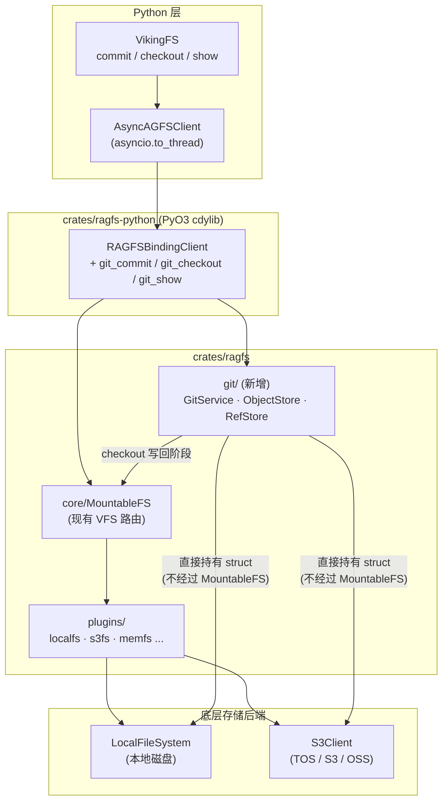
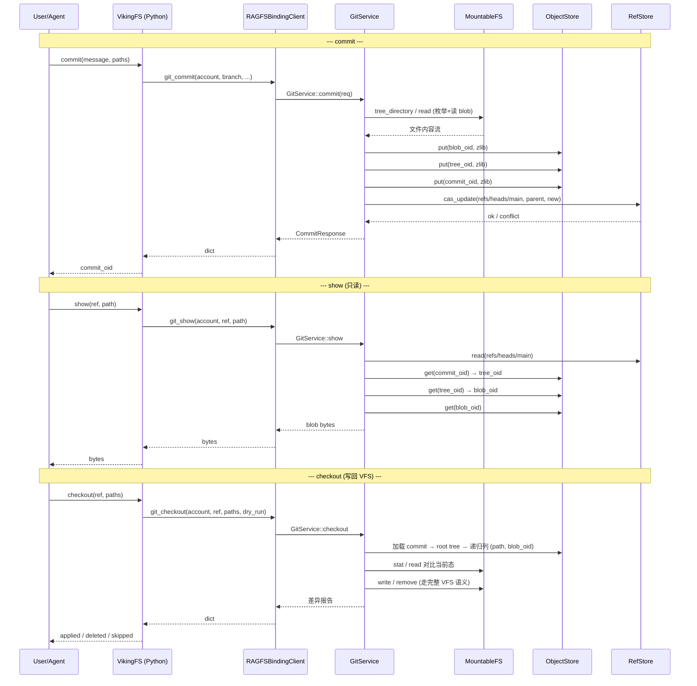
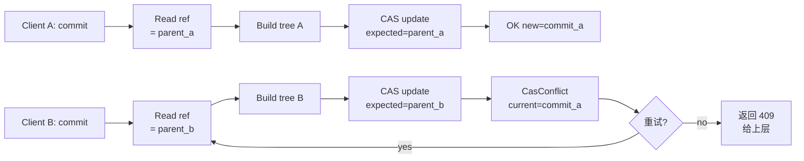

# OpenViking 多版本管理技术方案 — 基于 Gitoxide 的 in-process Git 集成

> 💡 **一句话摘要**：在现有 OpenViking 的 RAGFS Rust 实现中嵌入一套基于 `gitoxide` 的 in-process Git 服务，以 **账号(account\_id)粒度** 提供 `commit / restore / show` 三个版本管理原语;通过 PyO3 binding 直接被 `VikingFS` Python 层调用,全程零 HTTP、零额外进程,Git 对象/Ref 后端复用现有 `localfs`/`s3fs` 客户端,实现"本地或远程"对称配置。

# 1. 背景与目标

## 1.1 业务背景

OpenViking 现有存储架构是一套以 `viking://` URI 为入口的双层抽象:上层 `VikingFS`(Python)负责 URI 规范化、L0/L1 摘要、向量同步、租户隔离;下层 RAGFS(Rust + PyO3 binding)提供 `FileSystem` trait 与 `MountableFS` radix-trie 路由,实际数据落到 `localfs`、`s3fs`、`memfs` 等插件后端。

在持续运行过程中,用户/Agent 对 `viking://resources/`、`viking://agent/skills/` 等命名空间的写入是连续且不可逆的——出错后无法回滚,跨多个文件的"逻辑事务"难以原子化捕获,实验性改动需要手动备份。这些场景的本质需求都是一套**面向账号的多版本快照机制**,语义与 Git 的 commit/restore/show 高度同构。

## 1.2 设计目标

- **显式版本化**：用户/Agent 通过 API 显式触发 commit/restore/show,不引入隐式 hook,避免影响现有写链路的延迟与一致性语义
- **账号粒度仓库**：每个 `account_id` 一个逻辑 Git 仓库,跨 scope (resources/agent/user/session) 共享同一棵 root tree,支持跨 scope 的原子快照
- **多后端对称**：Git objects / refs 的实际存储类型与 resources 目录一致,可在配置中切换本地(local)或远程(s3),运维心智零增量
- **零进程膨胀**：Git 服务以 in-process binding 形式嵌入现有 RAGFS,共享 Tokio runtime 与配置加载链路,不引入新 HTTP server
- **对现有代码侵入最小**：不修改 `content_write.py`、`viking_fs.write/rm/mv` 等核心写链路,仅在 `VikingFS` 上增加 3 个新方法
- **定向恢复 (restore)**：支持以 **(project\_dir, commit\_id)** 为输入，将指定 project 目录恢复到目标 commit 的快照状态，并以 HEAD 为父节点*正向生成一个新 commit*。非目标 project 目录保持当前最新状态不动。

## 1.3 非目标 (Out of Scope)

- 不实现自动 commit hook (首版纯主动 API 触发)
- 不实现分支 merge / rebase / cherry-pick / push/pull (首版只覆盖快照 + 回滚 + 查看)
- 不暴露 Git 数据到 `viking://` 用户命名空间 (避免被用户误删/误改)
- 不支持向量索引数据的版本化 (向量索引由 watcher 异步重建, restore 后需触发重建;L0/L1 派生文件已纳入版本管理)
- 不支持 ref 回退式 checkout：本方案不提供 "把 main / HEAD 指针直接移动到旧 commit" 的能力。所有恢复操作都通过正向新增 commit 实现，保证 HEAD 单调前进、commit 链完整可审计。如需查看旧版本，使用 **show** 接口的只读路径。

***

# 2. 核心设计决策

| 决策                             | 设计含义                                                                                                                        | 替代方案被淘汰的原因                                                               |
| ------------------------------ | --------------------------------------------------------------------------------------------------------------------------- | ------------------------------------------------------------------------ |
| **单 Repo per account\_id**     | 同一账号下的 `resources/`、`agent/`、`user/`、`session/` 全部在一棵 root tree 之下;一次 commit 可覆盖任意 scope 的子集                                | per-resource repo 会产生 N×账号数量的索引数据,跨 resource 的"事务性快照"需要协调多 repo,复杂度高     |
| **纯 API 触发,不接 hook**           | `content_write.py` / `viking_fs.write/rm/mv` 完全不动;Git 仅通过 `VikingFS.commit/restore/show` 三个新方法被显式调用                         | hook 模式会让每次小写入都触发 Git 写入,放大延迟、放大冲突窗口、放大 ref CAS 失败率;首版优先简单               |
| **Git 存储后端与 resources 同构**     | 定义 `ObjectStore` / `RefStore` trait,提供 local 与 s3 两种实现,直接复用 `plugins::localfs::LocalFileSystem` 和 `plugins::s3fs::S3Client` | 独立实现 Git 存储后端会重复造轮子;走 `MountableFS` 又会让 Git 数据进入用户命名空间                   |
| **嵌入为 crates/ragfs 子模块**       | 新增 `crates/ragfs/src/git/` 模块,与 `core/`、`plugins/`、`server/` 平级;PyO3 binding 在 `RAGFSBindingClient` 上加 3 个方法                | 独立 crate 会引入额外配置、额外 runtime、额外鉴权;`ServicePlugin` 又无法表达 commit 这种非文件操作的语义 |
| **暴露方式 = PyO3 binding,非 HTTP** | 三个新方法挂在现有 `RAGFSBindingClient` 上,通过 `AsyncAGFSClient.run` 由 `VikingFS` 调用,与 `ls/read/write` 一致                              | HTTP server 路径在 OpenViking 当前架构中已是 legacy,生产路径是 in-process binding       |

***

# 3. 整体架构

## 3.1 分层与依赖关系



## 3.2 数据流(三个核心命令)



## 3.3 关键设计原则

> 💡 **Git 数据不进 viking 命名空间**
>
> Git 模块直接持有 `LocalFileSystem`/`S3Client` 实例,**不**通过 `MountableFS` 路由。Git 数据存到 `git/{account}/objects/...`,用户在 `viking://` 下看不到、也改不到。

> 💡 **LocalObjectStore 和 S3ObjectStore 直接调用 tokio::fs 和 Arc\<aws\_sdk\_s3::Client>, 不复用 LocalFileSystem/S3Client**
>
> LocalFileSystem/S3Client 是面向"用户文件树"的抽象,而 Git 后端是面向"内容寻址对象库"的存储,两者的语义需求不重叠。强行复用会导致更复杂的胶水代码。

***

# 4. Repo 边界与 Tree 布局

## 4.1 Tree 镜像 VikingFS 命名空间

由于 `viking_fs._uri_to_path` 已经定义了 `viking://X → /local/{account_id}/X` 的映射规则,我们让 Git 的 root tree 完全镜像 `/local/{account_id}/` 下的子目录结构。这样 tree path 与 viking URI 后缀一一对应,语义直观、无歧义。

## 4.2 路径剪枝(自动排除)

剪枝规则集中实现在 `crates/ragfs/src/git/enumerate.rs::prune_path`,在 `commit` 入口对 `paths=Some(...)` 与 `paths=None`(全量枚举)两条路径都生效:

| 类别            | 规则                                                      | 理由                                                              |
| ------------- | ------------------------------------------------------- | --------------------------------------------------------------- |
| 内部 scope / 目录 | 第一段命中 `_system` / `tasks` / `temp` / `queue` / `upload` | 与 `VikingFS._INTERNAL_NAMES` / `INTERNAL_SCOPES` 一致,均为运行时锁/系统状态 |
| 运行时锁文件        | 任意段以 `.path.ovlock` 开头                                  | VFS 内部锁,不应纳入版本                                                  |
| 向量缓存目录        | 任意非叶段等于 `embedding_cache`                               | embedding 缓存为派生数据                                               |
| 向量索引文件        | 叶子文件以 `.faiss` 或 `.index` 结尾                            | 纯计算产物,体积大且可重建                                                   |

L0/L1 派生文件(`.abstract.md`、`.overview.md`、`.relations.json`)未命中任一剪枝规则,**会**纳入主线 commit。restore 时随源文件一起回滚,无需重新生成;Python 层在 `restore` 完成后按 `(written_paths, deleted_paths)` 精确触发 L0/L1/DETAIL 向量异步重建(`.relations.json` 不触发向量任务)。

## 4.3 单库多命名空间的优势

1. **原子跨 scope 快照**：一次 commit 可同时覆盖 `resources/docs` 和 `agent/skills`,对应"Agent 一次任务的所有产出"这种逻辑事务
2. **定向回滚**：restore 时可指定 `paths=["resources/docs/auth.md"]`,只回滚单个文件
3. **索引数据线性**：objects/refs 数量随账号线性,不随 resource 数量指数膨胀
4. **权限边界清晰**：account\_id 已经是天然的隔离单位,Git 仓库边界与现有权限模型完全对齐

***

# 5. 物理布局

## 5.1 Crate 目录结构

Git 模块作为 `crates/ragfs` 的子模块,与 `core/`、`plugins/`、`server/` 平级。新增文件全部位于 `crates/ragfs/src/git/` 下,Python binding 仅在 `crates/ragfs-python/src/lib.rs` 上追加方法,无新 crate。

```
crates/ragfs/src/
├── core/                       # 既有(不动)
├── plugins/                    # 既有(不动)
├── server/                     # 既有(不动)
└── git/                        # 新增
    ├── mod.rs                  # 模块入口 + 重导出
    ├── service.rs              # GitService(commit/restore/show 主流程,均在此文件)
    ├── object_store.rs         # ObjectStore trait
    ├── ref_store.rs            # RefStore trait
    ├── tree_builder.rs         # TreeEditor + flatten/lookup 工具
    ├── commit.rs               # write_commit / Actor / 时间戳
    ├── enumerate.rs            # 从 MountableFS 枚举 + prune_path 剪枝
    ├── util.rs                 # zlib 压缩/解压、ref 名校验、loose object 读写
    ├── types.rs                # 请求/响应 DTO
    ├── error.rs                # GitError / ObjectStoreError / RefStoreError(thiserror)
    ├── config.rs               # GitConfig(serde)
    └── backends/
        ├── mod.rs
        ├── local.rs            # LocalObjectStore / LocalRefStore(直接使用 tokio::fs)
        └── s3.rs               # S3ObjectStore / S3RefStore(直接使用 aws_sdk_s3 + If-Match)

crates/ragfs-python/src/
└── lib.rs                      # 追加 git_commit / git_restore / git_show 方法

openviking/openviking/storage/
└── viking_fs.py                # 追加 commit / restore / show / log + URI↔tree-path 工具
```

## 5.2 依赖增量

仅引入 gitoxide 中实现 commit/restore/show MVP 所需的最小子 crate 集合,通过 `crates/ragfs/Cargo.toml` 增量声明:

```toml
[dependencies]
# === Git (gitoxide) ===
gix-hash       = "0.14"   # ObjectId / Hash 抽象
gix-object     = "0.42"   # Blob/Tree/Commit 编解码 + tree::Editor
gix-actor      = "0.31"   # 作者/提交者签名(name  ts tz)
gix-date       = "0.8"    # 时间戳格式化

# === Zlib 压缩 ===
flate2         = "1"      # loose object zlib 编解码

# === S3 后端 ===
aws-sdk-s3     = ...      # S3 API client(直接依赖,不复用 plugins/s3fs 内部封装)
aws-config     = ...

[dev-dependencies]
tempfile       = "3"
```

> 💡 **说明:** 不引入 `gitoxide` 顶层 crate,只挑选 commit/restore/show MVP 必需的子 crate;不引入 `gix-pack`(MVP 只用 loose object 格式)、不引入 `gix-protocol`(无 push/pull 需求)、不引入 `gix-worktree`(restore 通过 VFS 完成)。
>
> - 实际实现使用 `flate2` 直接做 zlib 编解码,而非 `gix-features`,以减少 gitoxide 依赖面。
> - ref 名校验由 `crates/ragfs/src/git/util.rs` 中自实现的 `validate_ref_name` 完成,未引入 `gix-validate`。
> - 并发模型测试(`loom`)与 fuzz 测试(`proptest`)在 MVP 阶段未引入,以单测 + 集成测试覆盖。

***

# 6. 核心 Trait 设计

## 6.1 ObjectStore

`ObjectStore` 是 Git 内容寻址存储的抽象,提供 blob/tree/commit 三类对象的存取。所有写入按 SHA-1 内容寻址,天然幂等(同样的字节 → 同样的 oid)。trait 必须 `Send + Sync + 'static`,以便在 Tokio 多线程运行时中跨任务共享。

```rust
// crates/ragfs/src/git/object_store.rs
use async_trait::async_trait;
use bytes::Bytes;
use gix_hash::ObjectId;

/// 内容寻址的 Git 对象存储抽象
/// put 必须幂等;get 不存在返回 NotFound;exists 不读取内容
#[async_trait]
pub trait ObjectStore: Send + Sync + 'static {
    /// 写入一个已 zlib 压缩的 loose object
    /// oid 必须等于 SHA-1(未压缩 header + payload)
    async fn put(
        &self,
        account: &str,
        oid: &ObjectId,
        zlib_body: Bytes,
    ) -> Result<(), ObjectStoreError>;

    /// 读取并 zlib 解压(返回 header + payload 的原始字节)
    async fn get(
        &self,
        account: &str,
        oid: &ObjectId,
    ) -> Result<Bytes, ObjectStoreError>;

    /// 仅检查存在性(HEAD/stat 优化,跳过内容传输)
    async fn exists(
        &self,
        account: &str,
        oid: &ObjectId,
    ) -> Result<bool, ObjectStoreError>;
}

#[derive(Debug, thiserror::Error)]
pub enum ObjectStoreError {
    #[error("object not found: {0}")]
    NotFound(ObjectId),
    #[error("backend io: {0}")]
    Io(#[from] std::io::Error),
    #[error("zlib decode: {0}")]
    Zlib(String),
    #[error("oid mismatch: expected {expected}, got {actual}")]
    OidMismatch { expected: ObjectId, actual: ObjectId },
    #[error("backend error: {0}")]
    Backend(String),
}
```

> ℹ️ **说明:** 物理路径布局由各实现自行决定(local 走 fanout 目录,s3 走 key prefix),trait 层不暴露物理路径,只暴露逻辑寻址。

## 6.2 RefStore

`RefStore` 是分支/标签的命名引用存储,核心是 **CAS(Compare-And-Swap)** 更新原语 — 这是 Git 一致性的基石。CAS 保证"两个并发 commit 先到先得,后到的看到 `Conflict` 并需要重试或 rebase",避免静默覆盖。

```rust
// crates/ragfs/src/git/ref_store.rs
use async_trait::async_trait;
use gix_hash::ObjectId;

#[async_trait]
pub trait RefStore: Send + Sync + 'static {
    /// 读取 ref 的当前值;不存在返回 NotFound
    async fn read(
        &self,
        account: &str,
        ref_name: &str,
    ) -> Result<ObjectId, RefStoreError>;

    /// Compare-And-Swap 更新:仅当当前值 == expected 时才写入 new
    /// expected = None 表示"仅当 ref 不存在时创建"
    async fn cas_update(
        &self,
        account: &str,
        ref_name: &str,
        expected: Option<ObjectId>,
        new: ObjectId,
    ) -> Result<(), RefStoreError>;

    /// 列出 account 下的所有 refs(用于 log / branch 列表)
    async fn list(
        &self,
        account: &str,
        prefix: &str,
    ) -> Result<Vec<(String, ObjectId)>, RefStoreError>;
}

#[derive(Debug, thiserror::Error)]
pub enum RefStoreError {
    #[error("ref not found: {0}")]
    NotFound(String),
    #[error("CAS conflict: expected {expected:?}, actual {actual:?}")]
    Conflict {
        expected: Option<ObjectId>,
        actual: Option<ObjectId>,
    },
    #[error("invalid ref name: {0}")]
    InvalidName(String),
    #[error("backend io: {0}")]
    Io(#[from] std::io::Error),
    #[error("backend: {0}")]
    Backend(String),
}
```

> ⚠️ **注意:** ref 名必须经 `crate::git::util::validate_ref_name(...)` 校验,拒绝 `..`、空字符、特殊保留字等,避免路径穿越和注入(实现位于 `git/util.rs`,未引入 `gix-validate`)。

## 6.3 命名约定

| 类别          | 路径模板                                    | 说明                                                       |
| ----------- | --------------------------------------- | -------------------------------------------------------- |
| Object      | `{root}/{account}/objects/{aa}/{bb...}` | Git 标准 fanout(前 2 hex 为目录,后 38 hex 为文件名),便于分布式存储 list 优化 |
| Ref (heads) | `{root}/{account}/refs/heads/{branch}`  | 文件内容 = 40 hex 字符 + `\n`                                  |
| HEAD        | `{root}/{account}/HEAD`                 | 内容 = `ref: refs/heads/main\n`                            |
| Packed-refs | (不实现)                                   | MVP 全部 loose,后续如 ref 数量爆炸再补 pack                         |

***

# 7. 后端实现

## 7.1 LocalObjectStore / LocalRefStore

**LocalObjectStore** 直接调用 `tokio::fs`(不经 MountableFS、也不复用 `LocalFileSystem`),把 Git 对象写入本地磁盘的 `{base_dir}/{account}/objects/{aa}/{bb...}`。**LocalRefStore** 使用进程内的 `DashMap<(account, ref_name), Arc<Mutex<()>>>` 串行化同 ref 的 CAS,叠加 `tempfile + rename(2)` 的原子重命名,覆盖同进程并发场景。

> **当前实现限制:** MVP 仅做了进程内 Mutex,**未叠加** `flock` 跨进程锁。生产部署若存在同 host 多进程同时写同一账号的场景,需要在后续版本补 `flock`。

```rust
// crates/ragfs/src/git/backends/local.rs (节选)
pub struct LocalObjectStore {
    base_dir: PathBuf,            // e.g. /data/openviking/git
}

#[async_trait]
impl ObjectStore for LocalObjectStore {
    async fn put(&self, account: &str, oid: &ObjectId, body: Bytes) -> Result<()> {
        let hex = oid.to_hex().to_string();
        let path = self.base_dir
            .join(account).join("objects")
            .join(&hex[..2]).join(&hex[2..]);
        // 内容寻址 → 已存在则跳过(幂等)
        if tokio::fs::try_exists(&path).await? { return Ok(()); }
        tokio::fs::create_dir_all(path.parent().unwrap()).await?;
        // 写临时文件 + rename 保证原子性
        let tmp = path.with_extension("tmp");
        tokio::fs::write(&tmp, &body).await?;
        tokio::fs::rename(&tmp, &path).await?;
        Ok(())
    }
    // get / exists 略
}

pub struct LocalRefStore {
    base_dir: PathBuf,
    // 进程内串行化 CAS,key = (account, ref_name)
    locks: dashmap::DashMap<(String, String), Arc<Mutex<()>>>,
}

#[async_trait]
impl RefStore for LocalRefStore {
    async fn cas_update(
        &self,
        account: &str,
        name: &str,
        expected: Option<ObjectId>,
        new: ObjectId,
    ) -> Result<()> {
        validate_ref_name(name)?;          // util.rs 自实现
        let lock = self.locks
            .entry((account.into(), name.into()))
            .or_default().clone();
        let _guard = lock.lock().await;
        let path = self.ref_path(account, name);
        let actual = read_ref_opt(&path).await?;
        if actual != expected {
            return Err(RefStoreError::Conflict { expected, actual });
        }
        let tmp = path.with_extension("tmp");
        tokio::fs::write(&tmp, format!("{}\n", new.to_hex())).await?;
        // rename 保证 crash-consistency
        tokio::fs::rename(&tmp, &path).await?;
        Ok(())
    }
}
```

## 7.2 S3ObjectStore / S3RefStore

**S3ObjectStore** 直接持有一个 `Arc<aws_sdk_s3::Client>`(MVP 不复用 `plugins::s3fs::S3Client`,以解耦 git 模块与 plugin 体系),将 object 存为 `{prefix}/{account}/objects/{aa}/{bb...}`。由于内容寻址,`put` 用 `If-None-Match: *` 头实现幂等"仅首次写入"。**S3RefStore** 用 `If-Match: "{etag}"` 实现 CAS,先 `GET` 拿当前值与 ETag,再用 `PUT` 条件写。

> **CAS 模式:** `CasMode::Native` 已实现并默认启用;`CasMode::RedisLock` 仅作为枚举占位,**实际尚未实现**,调用会直接返回 `RefStoreError::Backend("RedisLock CAS mode not yet implemented")`。

```rust
// crates/ragfs/src/git/backends/s3.rs (节选)
pub struct S3RefStore {
    client: Arc<aws_sdk_s3::Client>,
    bucket: String,
    prefix: String,
    cas_mode: CasMode,    // Native | RedisLock(占位,未实现)
}

#[async_trait]
impl RefStore for S3RefStore {
    async fn cas_update(
        &self,
        account: &str,
        name: &str,
        expected: Option<ObjectId>,
        new: ObjectId,
    ) -> Result<()> {
        validate_ref_name(name)?;
        match self.cas_mode {
            CasMode::Native => {
                // 1. GET 当前 body 与 ETag
                let current = self.read_ref_opt(account, name).await?;
                let (current_oid, current_etag) = match current {
                    Some((oid, etag)) => (Some(oid), etag),
                    None => (None, None),
                };
                if current_oid != expected {
                    return Err(RefStoreError::Conflict {
                        expected, actual: current_oid,
                    });
                }
                // 2. 条件 PUT
                let body = format!("{}\n", new.to_hex());
                let put = self.client.put_object()
                    .bucket(&self.bucket).key(&self.ref_key(account, name))
                    .body(body.into_bytes().into());
                let put = match (current_etag, expected) {
                    (Some(etag), Some(_)) => put.if_match(etag),
                    (None, None)          => put.if_none_match("*"),
                    _ => return Err(RefStoreError::Conflict {
                        expected, actual: current_oid,
                    }),
                };
                // 412 → Conflict;其他 → Backend
                map_precondition_failed(put.send().await, expected, current_oid)
            }
            CasMode::RedisLock => Err(RefStoreError::Backend(
                "RedisLock CAS mode not yet implemented".into(),
            )),
        }
    }
}
```

> ⚠️ **S3 CAS 兼容性提示:** AWS S3 自 2024 年起支持 `If-Match` / `If-None-Match` 条件写;TOS / OSS 实现情况需在选型时验证。若某后端不支持原生 CAS,需退化为"分布式锁 + GET-then-PUT"模式;`RedisLock` 模式已在配置/枚举中预留,但实现待补。

***

# 8. GitService 主流程

## 8.1 commit 完整实现

commit 主流程:**枚举 → 读 blob → 构建 tree → 构建 commit → CAS 更新 ref**。所有 ObjectStore 写入按账号粒度幂等(同 oid 多次 put 安全),tree 写入由 `TreeEditor` 自底向上完成。tree 未变 → 不创建空 commit(no-op 优化)。绝大多数 commit 场景下，被调用方声明为 "改动" 的文件里仍有大量未真正修改，需要通过三级 fast path 层层过滤，保证只有真正变化的字节才进入 streaming hash 与 blob 写入。

| 层级                             | 触发条件                                    | 节省的开销                                  | 实现位置                                                                                                                                                                                 |
| ------------------------------ | --------------------------------------- | -------------------------------------- | ------------------------------------------------------------------------------------------------------------------------------------------------------------------------------------ |
| **Fast Path 1**: Stat 索引复用 oid | 文件 (size, mtime\_ns) 与 prev\_index 完全一致 | 跳过 `vfs.read` + sha1 hash              | **已实现**（`IndexStore` trait + `LocalIndexStore`/`S3IndexStore`,`CommitIndex` 与 `parent_oid` 绑定,索引 miss/decode 错误/parent 不匹配 → 静默回退 slow path;通过 `git.tuning.commit_index_enabled` 关闭） |
| **Fast Path 2**: Tree 子树原样保留   | 子树下所有路径都没 upsert/remove                 | 跳过子树重 hash + 新 tree object 写入          | **已实现**（`TreeEditor::from_tree` 惰性加载 root，未被 upsert/remove/upsert\_subtree 触及的子树连读取+zlib 解压都省掉，由 `write_subtree` 的 `None` 分支原样复用其 OID）                                               |
| **Fast Path 3**: Blob CAS 去重   | 算出的 oid 在 object\_store 已存在             | 跳过 zlib 压缩 + put\_blob (本地写盘 / S3 PUT) | **已实现**（slow path 写 blob 前在 service 层调用 `object_store.exists` 预检，命中则跳过 zlib 压缩与 `put`；范围严格限定 blob，tree/commit 不预检；通过 `git.tuning.blob_exists_precheck_enabled` 关闭）                   |

```rust
// crates/ragfs/src/git/service.rs ::commit (节选)
pub async fn commit(&self, req: CommitRequest) -> Result<CommitResponse> {
    let CommitRequest {
        account, branch, message, paths, author_name, author_email,
    } = req;

    // 1. 解析当前 HEAD,加载 prev_tree(若 ref 不存在则空 tree)
    let prev_head = self.resolve_ref(&account, &branch).await.ok();
    let prev_tree = match prev_head {
        Some(oid) => self.load_commit(&account, &oid).await?.tree,
        None      => empty_tree_oid(),
    };
    let mut editor = TreeEditor::from_tree(
        &self.object_store, &account, prev_tree,
    ).await?;
    let mut changed = 0usize;

    // 2. 候选路径:paths=Some → 经 prune_path 过滤后的清单;paths=None → enumerate::collect_all 全量
    let candidates = match &paths {
        Some(ps) => ps.iter().filter_map(prune_path).collect(),
        None     => enumerate::collect_all(&self.vfs, &account).await?,
    };

    for path in candidates {
        match self.vfs.stat(&account_path(&account, &path)).await {
            Ok(_) => {
                // 读全量 + streaming hash + 写 blob(无 Fast Path 1/3)
                let bytes = self.vfs.read(&account_path(&account, &path)).await?;
                let oid   = sha1_blob_streaming(&bytes);
                self.write_object(&account, &oid, &bytes).await?;  // 幂等
                editor.upsert(&path, oid)?;
                changed += 1;
            }
            Err(e) if is_not_found(&e) => {
                // 文件被删 → 从 tree 中移除
                editor.remove(&path)?;
                changed += 1;
            }
            Err(e) => return Err(e.into()),
        }
    }

    // 3. 无任何变化 → noop
    if changed == 0 {
        return Ok(CommitResponse::Noop {
            commit_oid: prev_head.unwrap_or_default(),
        });
    }

    // 4. 写 tree + commit
    let new_tree   = editor.write(&self.object_store, &account).await?;
    let commit_oid = write_commit(&self.object_store, &account, CommitObject {
        tree: new_tree,
        parents: prev_head.into_iter().collect(),
        author: Actor::now(&author_name, &author_email),
        committer: Actor::now(&author_name, &author_email),
        message: message.into(),
    }).await?;

    // 5. CAS 更新 ref;失败 → ConcurrentCommit 直接上抛
    //    注意:当前实现中 commit() 内部不做 retry,由调用方决定如何处理冲突。
    self.ref_store.cas_update(
        &account, &format!("refs/heads/{}", branch),
        prev_head, commit_oid,
    ).await?;

    Ok(CommitResponse::Created { commit_oid, changed })
}
```

> **关于 retry:** 当前实现中 `commit()` 内部 **不包含 CAS 重试循环**(代码中明确注释 `// There is intentionally no retry loop inside commit().`)。冲突直接以 `ConcurrentCommit` 上抛,由 Python 层或上游业务决定重试策略;这与 §11.3 旧版描述的"内部最多重试 3 次"不一致,以本节为准。

## 8.2 restore 完整实现

restore 主流程:**解析目标 commit → 提取该 commit 中 project\_dir 子树 → 与当前 HEAD 中同路径子树 diff → 通过 MountableFS.write/rm 回写 → 删除回写后空目录 → 以当前 HEAD 为 parent 生成新 commit → CAS 更新 ref → 把受影响路径返回给调用方**。`dry_run` 模式只计算差异不写,用于预检。

向量索引重建在 service 层**不直接触发**,而是通过把 `written_paths` / `deleted_paths` 放到 `RestoreResponse::Applied` 中返回,Python 层(`VikingFS.restore`)再调度 `ReindexExecutor`。

关键差异:与 git checkout 不同,本接口**不移动分支指针到旧 commit**,而是把"旧内容"作为新 commit 的工作树内容,正向写入。新 commit 的 parent 是当前 HEAD,不是目标 commit,这保证了:(1) HEAD 单调前进;(2) 非 `project_dir` 路径自动保留 HEAD 的最新内容,无需特殊处理;(3) restore 本身可以被再次 restore (因为它就是一个普通 commit)。

```rust
pub async fn restore(&self, req: RestoreRequest) -> Result<RestoreResponse> {
    let RestoreRequest {
        account, branch, project_dir, source_commit, dry_run, message,
        author_name, author_email,
    } = req;

    // 0. 校验 project_dir(非空、不含 ..、不命中 prune 规则)
    validate_project_dir(&project_dir)?;

    // 1. 解析两端 commit
    let source_oid = self.resolve_ref(&account, &source_commit).await?;
    let source     = self.load_commit(&account, &source_oid).await?;
    let head_oid   = self.resolve_ref(&account, &branch).await?;  // 必须已有 HEAD
    let head       = self.load_commit(&account, &head_oid).await?;

    // 2. 在两棵 tree 中分别"截取" project_dir 子树
    //    source 没有该子目录 → 视为空树(等价于把整个目录删掉)
    let source_subtree = tree_builder::subtree(...).await?
        .unwrap_or(empty_tree_oid());
    let head_subtree   = tree_builder::subtree(...).await?
        .unwrap_or(empty_tree_oid());

    // 3. 子树之间 diff,得到三类操作(只限 project_dir 范围内)
    let target_entries  = flatten(&self.object_store, &account, source_subtree).await?;
    let current_entries = flatten(&self.object_store, &account, head_subtree).await?;
    let diff = compute_subtree_diff(&target_entries, &current_entries);

    if dry_run {
        return Ok(RestoreResponse::DryRun { diff, source_oid, head_oid });
    }
    if diff.is_empty() {
        return Ok(RestoreResponse::Noop { head: head_oid, source: source_oid });
    }

    // 4. 并发回写 VFS:路径要带上 project_dir 前缀
    //    走完整 viking_fs.write/rm,触发现有 lock、加密
    let prefixed = |p: &str| format!("{}/{}", project_dir.trim_end_matches('/'), p);
    let written_paths: Vec<String> = stream::iter(diff.to_write)
        .map(|(path, blob_oid)| async move {
            let body = self.read_blob(&account, &blob_oid).await?;
            self.vfs.write(&account_path(&account, &prefixed(&path)), body).await?;
            Ok::<_, GitError>(prefixed(&path))
        })
        .buffer_unordered(32)        // 当前实现硬编码 32,未读取 git.tuning.restore_concurrency
        .try_collect().await?;
    let deleted_paths: Vec<String> = stream::iter(diff.to_delete)
        .map(|path| {
            let p = prefixed(&path);
            async move {
                // 幂等删除:NotFound 视为成功,允许 restore 在已被并发删除的路径上完成
                match self.vfs.rm(&account_path(&account, &p)).await {
                    Ok(()) => Ok(p),
                    Err(e) if is_not_found(&e) => Ok(p),
                    Err(e) => Err(e.into()),
                }
            }
        })
        .buffer_unordered(32)
        .try_collect().await?;

    // 6b. 删除空目录:沿被删路径的祖先链向上 rmdir,直到第一个非空目录或 project_dir 边界
    //     (gix tree 不存空目录,而 VFS 写到本地后会留下空 dir,造成 ls 不一致)
    self.prune_empty_dirs(&account, &project_dir, &deleted_paths).await?;

    // 5. 在 head.tree 之上做增量编辑:
    //    把 project_dir 子树整体替换为 source_subtree。
    //    非 project_dir 路径原样保留 head 中的 tree_oid。
    let mut editor = TreeEditor::from_tree(&self.object_store, &account, head.tree).await?;
    editor.upsert_subtree(&project_dir, source_subtree)?;
    let new_tree = editor.write(&self.object_store, &account).await?;

    // 6. 构造新 commit:parent = 当前 HEAD(不是 source_oid!)
    let new_commit_oid = write_commit(&self.object_store, &account, CommitObject {
        tree: new_tree,
        parents: vec![head_oid],                       // ← 关键:HEAD 单向前进
        author: Actor::now(&author_name, &author_email),
        committer: Actor::now(&author_name, &author_email),
        message: message.unwrap_or_else(|| format!(
            "restore {} from {}", project_dir, &source_oid.to_hex()[..12],
        )),
    }).await?;

    // 7. CAS 更新 ref:expect=head_oid, new=new_commit_oid
    //    若期间有别的 commit 进入 → ConcurrentCommit,调用方按提示重试
    self.ref_store.cas_update(
        &account, &format!("refs/heads/{}", branch),
        Some(head_oid), new_commit_oid,
    ).await?;

    Ok(RestoreResponse::Applied {
        new_commit_oid,
        source_commit: source_oid,
        parent_commit: head_oid,
        // 计数 + 受影响路径(供上层精确触发向量重建)
        written: written_paths.len(),
        deleted: deleted_paths.len(),
        unchanged: diff.unchanged.len(),
        written_paths,
        deleted_paths,
    })
}
```

> 当前实现相对早期设计的差异
>
> - **空目录清理(步骤 6b)**：删除完文件后会沿祖先链 rmdir 至 `project_dir` 或第一个非空目录,避免 VFS 残留空目录。
> - **幂等删除**：`vfs.rm` 返回 NotFound 视为成功,使 restore 可以在已被并发清理的路径上继续推进。
> - **written\_paths / deleted\_paths**：`Applied` 响应除了 `written/deleted` 计数外,还返回**全量受影响路径(已加 project\_dir 前缀)**;Python 层按 marker / 源文件 / `.relations.json` 分类,精确触发 L0/L1/DETAIL 向量更新,不再依赖广义的 `_trigger_vector_rebuild(paths)`。
> - **没有 commit\_index 刷新**：对应 §8.1 的 Fast Path 1 未实现,restore 末尾也无须刷新 index。
> - **回写并发度**：当前硬编码 `buffer_unordered(32)`,**尚未**读取 `git.tuning.restore_concurrency` 配置项。
>
> ✅ **推荐:** 生产环境调用前先以 `dry_run=true` 跑一遍取得差异列表,再让用户确认,避免误覆盖未提交的本地变更。

## 8.3 show 完整实现

show 是**纯读路径**,无任何 VFS 写入或 ref 变更,易于实现与验证。支持两种模式:`path=None` 返回 commit 元信息(用于 log 列表);`path=Some(p)` 返回该 path 的 blob 字节(零拷贝 `Bytes` 切片)。

```rust
pub async fn show(&self, req: ShowRequest) -> Result<ShowResponse> {
    let ShowRequest { account, target_ref, path } = req;

    // 1. ref 解析:依次尝试
    //    a. 40-hex commit_oid    → 直接解析
    //    b. 4..=39 hex 的缩写 oid → 沿 HEAD 父链回溯,找到唯一前缀匹配的 commit
    //                              (歧义返回 AmbiguousOid;无匹配返回 OidPrefixNotFound)
    //    c. branch 名(如 "main")  → 加前缀 refs/heads/{branch}
    //    d. 全路径 refs/heads/xxx → 透传
    let commit_oid = self.resolve_ref(&account, &target_ref).await?;
    let commit = self.load_commit(&account, &commit_oid).await?;

    match path {
        // 模式 A:返回 commit 元信息(log 用)
        None => Ok(ShowResponse::Commit {
            oid:       commit_oid,
            tree:      commit.tree,
            parents:   commit.parents,
            author:    commit.author.into(),
            committer: commit.committer.into(),
            message:   commit.message.to_string(),
        }),

        // 模式 B:返回该 path 的 blob 字节
        Some(p) => {
            // 按 / 拆分,在 tree 上逐层递归;
            //   - path 命中目录    → PathIsDirectory(p)
            //   - path 完全无对应  → PathNotFound(p)
            let blob_oid = tree_builder::lookup(
                &self.object_store, &account, commit.tree, &p,
            ).await?;

            let blob_full = self.load_blob(&account, &blob_oid).await?;
            // 去掉 "blob {len}\0" header,使用 Bytes::slice 零拷贝返回 payload
            let payload = strip_object_header(blob_full)?;
            Ok(ShowResponse::Blob {
                oid:   blob_oid,
                size:  payload.len() as u64,
                bytes: payload,
            })
        }
    }
}
```

***

# 9. Python Binding 与 VikingFS 集成

## 9.1 PyO3 binding 新增方法

在现有 `RAGFSBindingClient`(`crates/ragfs-python/src/lib.rs`)上追加三个 `#[pymethods]`。模式与 `ls/read/write` 一致:用 `py_detach_blocking` 释放 GIL,在 Tokio runtime 内调 `GitService`,返回结果序列化为 `PyDict`。

```rust
// crates/ragfs-python/src/lib.rs (追加)
#[pymethods]
impl RAGFSBindingClient {
    /// 提交一次快照
    /// kwargs: account, branch, message, paths(Option<Vec<String>>),
    ///         author_name, author_email
    /// returns: {"commit_oid": str, "result": "created" | "noop"}
    fn git_commit(&self, py: Python<'_>, kwargs: &PyDict) -> PyResult<PyObject> {
        let req = parse_commit_request(kwargs)?;
        let svc = self.git_service()?;     // FeatureDisabled 时返回 PyErr
        py_detach_blocking(py, || {
            self.runtime.block_on(svc.commit(req))
                .map_err(map_git_error)
        }).map(|r| commit_response_to_pydict(py, r))
    }

    /// 定向恢复某个 project 目录,正向生成新 commit
    /// kwargs: account, branch(默认 "main"), project_dir, source_commit,
    ///         dry_run(bool=false), message(Option<String>),
    ///         author_name, author_email
    /// returns:
    ///   Applied: {"new_commit_oid": str, "source_commit": str, "parent_commit": str,
    ///             "written": int, "deleted": int, "unchanged": int}
    ///   Noop:    {"noop": true, "head": str, "source": str}
    ///   DryRun:  {"dry_run": true, "diff": {...}, "head": str, "source": str}
    fn git_restore(&self, py: Python<'_>, kwargs: &PyDict) -> PyResult<PyObject> {
        let req = parse_restore_request(kwargs)?;
        let svc = self.git_service()?;
        py_detach_blocking(py, || self.runtime.block_on(svc.restore(req))
            .map_err(map_git_error))
            .map(|r| restore_response_to_pydict(py, r))
    }

    /// 读取 ref / commit / blob
    /// kwargs: account, target_ref, path(Option)
    /// returns:
    ///   path=None: {"oid","tree","parents","author","committer","message"}
    ///   path=str:  {"oid","size","bytes": PyBytes}
    fn git_show(&self, py: Python<'_>, kwargs: &PyDict) -> PyResult<PyObject> {
        let req = parse_show_request(kwargs)?;
        let svc = self.git_service()?;
        py_detach_blocking(py, || {
            self.runtime.block_on(svc.show(req))
                .map_err(map_git_error)
        }).map(|r| show_response_to_pydict(py, r))
    }
}

/// GitError → Python 异常映射(在 openviking 侧定义对应异常类)
fn map_git_error(e: GitError) -> PyErr {
    match e {
        GitError::FeatureDisabled    => PyRuntimeError::new_err("git feature disabled"),
        GitError::ConcurrentCommit   => PyValueError::new_err("concurrent commit conflict"),
        GitError::PathNotFound(p)    => PyFileNotFoundError::new_err(p),
        GitError::RefNotFound(r)     => PyFileNotFoundError::new_err(r),
        other                        => PyRuntimeError::new_err(other.to_string()),
    }
}
```

## 9.2 Python 侧 VikingFS 新增方法

在 `openviking/openviking/storage/viking_fs.py` 的 `VikingFS` 类上追加 4 个公开方法。Python 调用方使用 `viking://` URI,内部经 `_uri_to_tree_path` 转换为账号内 tree 路径后再传给 binding。

```python
# openviking/storage/viking_fs.py (追加)
class VikingFS:
    # 已有: read / write / rm / ls / mv / mkdir ...

    async def commit(
        self,
        *,
        message: str,
        paths: list[str] | None = None,        # viking://... URIs
        branch: str = "main",
        author_name: str | None = None,
        author_email: str | None = None,
    ) -> dict:
        """提交一次跨 scope 快照。返回 {commit_oid, result}."""
        account = self._current_account()
        tree_paths = [self._uri_to_tree_path(p) for p in (paths or [])]
        return await self._async_client.run(
            "git_commit",
            account=account,
            branch=branch,
            message=message,
            paths=tree_paths or None,
            author_name=author_name or self._default_author_name(),
            author_email=author_email or self._default_author_email(),
        )

    async def restore(
        self,
        *,
        project_dir: str,                    # viking://resources/proj_a/ 或 "resources/proj_a"
        source_commit: str,                  # 40-hex / branch / tag
        branch: str = "main",
        dry_run: bool = False,
        message: str | None = None,
        author_name: str | None = None,
        author_email: str | None = None,
    ) -> dict:
        """将 project_dir 恢复到 source_commit 状态,生成一个新 commit。

        语义等价于 git restore --source=<source_commit> --worktree --staged
        <project_dir>/ && git commit。HEAD 单调前进,不会回退。
        """
        account = self._current_account()
        tree_dir = self._uri_to_tree_path(project_dir).rstrip("/")
        result = await self._async_client.run(
            "git_restore",
            account=account, branch=branch,
            project_dir=tree_dir, source_commit=source_commit,
            dry_run=dry_run, message=message,
            author_name=author_name or self._default_author_name(),
            author_email=author_email or self._default_author_email(),
        )
        if dry_run or result.get("noop"):
            return result

        # 增量向量更新:只对受影响的源文件,逐个 vectors_only 重算。
        # L0/L1 派生文件已随源文件一起从 git 回写到 VFS,不需要重新生成。
        from openviking.service.reindex_executor import ReindexExecutor
        executor = ReindexExecutor()
        ctx = self._current_request_context()
        for affected_path in result.get("affected_files", []):
            affected_uri = self._tree_path_to_uri(affected_path)
            if self._is_derived_file(affected_uri):
                continue
            asyncio.create_task(executor.execute(
                uri=affected_uri, mode="vectors_only",
                wait=False, ctx=ctx,
            ))
        return result

    async def show(
        self,
        target_ref: str,
        *,
        path: str | None = None,
    ) -> dict | bytes:
        """path=None → commit 元信息;path=str → blob 字节。"""
        account = self._current_account()
        tree_path = self._uri_to_tree_path(path) if path else None
        resp = await self._async_client.run(
            "git_show",
            account=account,
            target_ref=target_ref,
            path=tree_path,
        )
        if "bytes" in resp:
            return resp["bytes"]
        return resp

    async def log(
        self,
        *,
        branch: str = "main",
        limit: int = 20,
    ) -> list[dict]:
        """便捷封装:沿 parent 链反向遍历 commit。"""
        account = self._current_account()
        head = await self._async_client.run(
            "git_show", account=account, target_ref=branch, path=None,
        )
        result, current = [head], head.get("parents", [])
        while current and len(result) < limit:
            parent_oid = current[0]
            commit = await self._async_client.run(
                "git_show", account=account, target_ref=parent_oid, path=None,
            )
            result.append(commit)
            current = commit.get("parents", [])
        return result

    # --- 工具方法 ---
    def _uri_to_tree_path(self, uri: str) -> str:
        """viking://resources/a.md → 'resources/a.md'
        (去掉 viking:// 前缀,保留 scope 段作为 tree 一级目录)"""
        parsed = VikingURI.parse(uri)
        if parsed.scope in INTERNAL_SCOPES:
            raise ValueError(f"internal scope not versioned: {parsed.scope}")
        return f"{parsed.scope}/{parsed.relative_path}"

    async def _trigger_vector_rebuild(
        self, account: str, paths: list[str]
    ) -> None:
        """restore 后异步触发向量索引重建。
        实现可对接现有的 watcher / 任务队列;失败不影响 restore 结果。"""
        try:
            await self._vector_service.rebuild(account, paths)
        except Exception:
            logger.exception("vector rebuild failed for %s", account)
```

***

# 10. 配置规范

## 10.1 与 resources 对称的配置布局

配置位于现有 RAGFS 配置文件的 `[git]` 段,布局与 `[plugins.localfs_resources]` / `[plugins.s3fs_resources]` 完全对称,便于运维心智复用。`enabled = false` 时 binding 方法返回 `FeatureDisabled`,不影响现有 VFS。

```toml
# ragfs.toml 新增 [git] 段
[git]
enabled        = true
backend        = "local"          # "local" | "s3"
default_branch = "main"
author_name    = "openviking-bot" # commit 默认作者
author_email   = "openviking-bot@system.local"

# 本地后端
[git.local]
base_dir = "/data/openviking/git" # objects/refs 存储根

# 远程后端(与 plugins.s3fs_resources 配置同构)
[git.s3]
bucket            = "openviking-prod"
prefix            = ".ovgit"       # 全部 key = {prefix}/{account}/...
region            = "us-east-1"
endpoint          = "https://s3.amazonaws.com"
access_key_env    = "OV_S3_AK"     # 从环境变量读
secret_key_env    = "OV_S3_SK"
cas_mode          = "native"       # "native"(If-Match):当前唯一支持的模式
use_path_style    = true           # path-style addressing(MinIO/LocalStack/TOS 默认开)

# 高级调优(字段已在 config 中定义,但 MVP 部分尚未生效)
[git.tuning]
upload_concurrency   = 64          # ⚠️ 当前未读取:commit blob 上传现为串行
restore_concurrency  = 32          # ⚠️ 当前未读取:restore 回写并发度硬编码 32
ref_cas_max_retry    = 3           # ⚠️ 当前未读取:commit 内部不做重试(见 §11.3)
ref_cas_backoff_ms   = 50          # ⚠️ 当前未读取
commit_index_enabled = true        # Fast Path 1 总开关(默认 true);关闭后强制走 slow path,适合测试 / mtime 不可靠环境
```

## 10.2 切换本地↔远程

| 维度         | local → s3 改动                                         |
| ---------- | ----------------------------------------------------- |
| 配置文件       | `backend = "local"` → `backend = "s3"`;填 `[git.s3]` 块 |
| Service 代码 | 无                                                     |
| Python 调用方 | 无                                                     |
| 数据迁移       | 一次性脚本:本地 `{base_dir}` 全量上传至 S3 key prefix(保持目录结构)     |

> 💡 从本地切到远程的全部成本 = 修改 `backend = "local"` → `backend = "s3"` + 填 `[git.s3]` 块。Service 代码、Python 调用方完全无感。这与 resources 目录"`plugins.localfs_resources` ↔ `plugins.s3fs_resources`"的切换体验完全对称。

***

# 11. 并发与一致性

## 11.1 写并发模型

| 层次        | 并发原语                     | 说明                               |
| --------- | ------------------------ | -------------------------------- |
| Blob 上传   | `buffer_unordered(64)`   | 内容寻址,天然幂等;同 oid 多次 put 安全        |
| Tree 写入   | 串行(`Editor::write` 自底向上) | 同 oid 幂等,但顺序必须自底向上               |
| Commit 写入 | 串行,最后一步                  | 同 oid 幂等                         |
| Ref 更新    | CAS                      | 本地: 进程锁 + rename(2);S3: If-Match |

## 11.2 并发冲突处理



## 11.3 重试策略

- **幂等部分(blob/tree/commit 写)**: 同 oid 多次 put 安全;后端层面通过 `If-None-Match: *`(S3)与 `try_exists`(local)短路重复写;service 层不额外做 retry。
- **CAS 冲突**: **当前实现** GitService::commit/restore **内部不做自动重试,直接以 GitError::ConcurrentCommit 上抛给 Python 层,由调用方决定是否 re-read parent 重建 tree 重新提交。git.tuning.ref\_cas\_max\_retry / ref\_cas\_backoff\_ms 配置项已在 GitTuningConfig 中定义但**尚未在代码中读取\*\*,后续接入。
- **跨账号**: 不同 account\_id 的 ref 路径不同,天然无冲突,可完全并行

***

# 12. 安全与隔离

## 12.1 账号隔离

- Git 数据路径全部以 `{account_id}` 为顶层前缀,与现有 `/local/{account_id}/` 隔离模型完全一致
- `GitService` 所有方法的第一个参数都是 `account_id`,binding 层从 `RequestContext.account_id` 注入,不允许跨账号访问
- Path 解析时必须经过 `validate_account_id`(白名单字符集 + 长度),防止 `../` 注入

## 12.2 加密

> 💡 **重要:** 现有 `viking_fs.write` 在写入前会调 `_encrypt_content`。**commit 时不应再次加密**——blob 内容 = 当前 VFS 已加密内容,Git 是对密文做版本管理。restore 写回时走 `viking_fs.write`,会再次"加密"——这里需要绕过(或保持密文不变):restore 路径走 `MountableFS.write` 而非 `viking_fs.write`,避免双重加密;或为 `viking_fs.write` 增加 `raw=True` 参数,restore 调用时传入。

## 12.3 资源限制

| 维度           | 限制                               | 措施                                   | 当前状态                                             |
| ------------ | -------------------------------- | ------------------------------------ | ------------------------------------------------ |
| 单 blob 大小    | ≤ 100MB                          | commit 前 stat 检查,超限报错                | **未实现**(`GitError::BlobTooLarge` 已定义,但无运行时检查)    |
| 单 commit 文件数 | ≤ 50000                          | enumerate 阶段提前拒绝                     | **未实现**(`GitError::TooManyFiles` 已定义,但无运行时检查)    |
| 账号 Git 容量    | 由 quota 系统单独管控                   | 放在 `[git.quota]`,首版默认 10GB           | **未实现**(配置块未引入)                                  |
| restore 并发   | 同子树串行,同一 account\_id 全量 restore 互斥 | `VikingFS.restore` 用 `LockContext` 树锁包裹 writeback:scoped restore 锁 `project_dir`,全量 restore 锁账号根;防止 VFS 写竞态 | **已实现**(写回阶段加锁;后台 reindex 在锁释放后调度,冲突映射为 `ResourceBusyError`) |
| 账号 ID 校验     | 白名单字符集 + 长度,防 `../` 注入           | `validate_account_id` 在 binding 入口拒绝 | **未实现**(`GitError::InvalidAccountId` 已定义,但无校验代码) |

***

# 13. 错误处理

## 13.1 错误分类

顶层错误类型为 `GitError`(`crates/ragfs/src/git/error.rs`),按可恢复性与归属分组:

| 类别        | Variant                                                                                     | 说明                                          |
| --------- | ------------------------------------------------------------------------------------------- | ------------------------------------------- |
| 后端透传      | `ObjectStore(ObjectStoreError)`、`RefStore(RefStoreError)`、`Vfs(...)`                        | 来自存储后端 / VFS                                |
| 路径校验      | `PathNotFound(String)`、`PathIsDirectory(String)`、`InvalidProjectDir(String)`                | show / restore 入参校验                         |
| Tree 内容缺失 | `SubtreeNotFoundInCommit { commit, path }`                                                  | restore 时 source 中缺失目标子树(已通过空树语义包装,正常路径不抛出) |
| Ref 解析    | `OidPrefixNotFound(String)`、`AmbiguousOid { prefix, candidates }`                           | 缩写 OID 解析失败                                 |
| 并发        | `ConcurrentCommit`                                                                          | CAS 失败(由 ref\_store conflict 上抛)            |
| 资源限制      | `BlobTooLarge { path, size, max }`、`TooManyFiles { count, max }`、`InvalidAccountId(String)` | 已定义但**当前无运行时检查**,详见 §12.3                   |
| 其他        | `FeatureDisabled`、`CorruptedObject(...)`、`Other(String)`                                    | binding 关闭、对象腐烂、兜底                          |

## 13.2 Python 异常映射

| Rust Error                                                           | Python Exception            | 语义          |
| -------------------------------------------------------------------- | --------------------------- | ----------- |
| `FeatureDisabled`                                                    | `AGFSNotSupportedError`     | git 模块未启用   |
| `ConcurrentCommit`                                                   | `GitConcurrentCommitError`  | 需要上层重试或人工介入 |
| `PathNotFound` / `OidPrefixNotFound` / 后端 NotFound                   | `AGFSNotFoundError`         | 404 语义      |
| `PathIsDirectory` / `BlobTooLarge` / `TooManyFiles` / `AmbiguousOid` | `AGFSInvalidOperationError` | 入参或资源错误     |
| `InvalidAccountId` / `InvalidProjectDir`                             | `AGFSInvalidPathError`      | 路径/账号 ID 非法 |
| `CorruptedObject` / `Other` / `Vfs`                                  | `AGFSInternalError`         | 底层异常        |

***

# 14. 可观测性

> **当前状态:** §14.1/§14.2 中描述的 tracing span / metrics **MVP 尚未接入**;§14.3 健康检查仅暴露 `git_enabled` / `git_backend` 两个字段。下面保留为目标态,未带状态标注的均为待实现项。

## 14.1 Tracing/日志关键字段(目标态)

- **span 名**: `git.commit`, `git.restore`, `git.show`
- **tag**: `account_id`, `branch`, `parent_oid`, `commit_oid`, `backend`
- **event**: `git.blob.put`(`oid`, `size`), `git.tree.write`, `git.ref.cas`(`expected`, `new`, `result`), `git.cas.conflict`

## 14.2 Metrics(目标态)

| 指标                                 | 类型        | 维度                           |
| ---------------------------------- | --------- | ---------------------------- |
| `git_commit_total`                 | counter   | account\_id, branch, result  |
| `git_commit_duration_seconds`      | histogram | backend                      |
| `git_commit_files`                 | histogram | —                            |
| `git_commit_bytes`                 | histogram | backend                      |
| `git_cas_conflict_total`           | counter   | account\_id, branch          |
| `git_object_store_latency_seconds` | histogram | op (put/get/exists), backend |
| `git_ref_store_latency_seconds`    | histogram | op (read/cas), backend       |

## 14.3 健康检查

- **当前实现**: `RAGFSBindingClient.health()` 在原有字段上追加 `git_enabled: bool` 和 `git_backend: Option<String>`(关闭时为 None)。
- **目标态(未实现)**: 增加 `git` 子结构,返回 `{"backend", "writable", "last_commit_age_sec"}`;每分钟后台心跳对 `refs/heads/main` 做一次 read,失败则标记 degraded。

***

# 15. 测试策略

## 15.1 测试层次

| 层级               | 范围                                                                                                                       |
| ---------------- | ------------------------------------------------------------------------------------------------------------------------ |
| **单元测试 (Rust)**  | ObjectStore 各操作的幂等性;RefStore CAS 在并发下的正确性(MVP 用普通并发测,未引入 loom);tree\_builder 的 upsert/remove/write;错误映射                  |
| **集成测试 (Rust)**  | LocalObjectStore 跑全套场景(MVP 暂未引入 MemObjectStore);commit → show 路径 → bytes 一致;commit → restore → 文件一致;并发 commit 的 CAS 冲突处理 |
| **端到端 (Python)** | VikingFS.commit → restore 全流程;跨 scope 原子快照;派生文件被正确纳入 commit 并随 restore 回滚;向量索引在 restore 后被精确重建;多账号并发隔离                   |

## 15.2 关键测试用例清单

1. **幂等性**: 同一 commit\_req 调用两次,第二次应快速返回(blob exists 跳过 + ref 未变 → no-op 或 same oid)
2. **跨 scope 原子性**: 一次 commit 同时改 `resources/a.md` 和 `agent/skills/b.py`,restore 父 commit 后两者都应回滚
3. **派生文件纳入**: 创建 `resources/x.md` 与 `resources/x.md.abstract.md`,commit 后 `show` 两者均可见;restore 父 commit 后两者都应回滚;向量索引文件不被 commit
4. **CAS 冲突**: 两个并发 commit,后到的必须看到 `ConcurrentCommit` 错误而非默默覆盖
5. **dry\_run 不写**: restore dry\_run 后再 ls,VFS 状态不变
6. **账号隔离**: A 账号的 commit\_oid 在 B 账号下 show 必须返回 not found
7. **后端等价性**: LocalObjectStore 与 S3ObjectStore (LocalStack/MinIO) 跑同一组用例输出一致
8. **大文件**: 单 blob 80MB 可正确 commit / show / restore
9. **双重加密**: restore 写回后 VFS read 内容与原始明文一致

***

# 16. 实施计划 (MVP)

| 阶段    | 工作内容                                                                                                                  | 交付物                    | 预估   |
| ----- | --------------------------------------------------------------------------------------------------------------------- | ---------------------- | ---- |
| D1-D2 | 新建 `crates/ragfs/src/git/`,定义 trait + LocalObjectStore/LocalRefStore + S3ObjectStore/S3RefStore (含 If-Match CAS) + 单测 | 裸 Git 存储跑通 put/get/CAS | 2d   |
| D3    | 接入 `gix_object::tree::Editor`,实现 `GitService::commit`                                                                 | commit 流程单测绿           | 1d   |
| D4    | 实现 `GitService::show` (纯读路径,易验证)                                                                                      | commit + show 闭环       | 1d   |
| D5    | 实现 `GitService::restore`,dry\_run 优先,验证幂等                                                                             | commit + restore 闭环    | 1d   |
| D6    | PyO3 binding: `RAGFSBindingClient` 三个新方法 + 错误映射                                                                       | Python 端可调             | 1d   |
| D7    | `VikingFS.commit/restore/show/log` + URI ↔ tree path 转换                                                               | Python 端到端             | 1d   |
| D9    | tracing/metrics 接入 + health check                                                                                     | 可观测性完备                 | 0.5d |
| D10   | 文档 + 灰度发布                                                                                                             | 上线 Phase 1             | 0.5d |

> 💡 **总工期**: \~10 人日 (MVP, 单人); 双后端等价测试与 S3 CAS 兼容性验证可能引入额外 2-3 天。

***

# 17. 当前实现进度与未实现项

下面汇总文档中已写出但当前**尚未实现**的部分,供后续阶段补齐:

### Rust 侧

- **commit / restore 内部 CAS 重试循环** —— 文档 §11.3 旧版描述。当前 `commit()` 明确不做 retry,`ConcurrentCommit` 直接上抛。
- *git.tuning.* 配置项接入\* —— 文档 §10.1。`upload_concurrency` / `restore_concurrency` / `ref_cas_max_retry` / `ref_cas_backoff_ms` 已在 `GitTuningConfig` 中定义并解析,但代码尚未读取(restore 回写并发度硬编码 32,commit blob 上传为串行)。
- **S3 RedisLock CAS 模式** —— 文档 §7.2。`CasMode::RedisLock` 仅作为枚举占位,实际调用返回 "not yet implemented" 错误。
- **资源限制实际生效** —— 文档 §12.3。`BlobTooLarge` / `TooManyFiles` / `[git.quota]` 配置块均未实现(仅错误 variant 已定义)。同账号 restore 写竞态防护已通过 `VikingFS.restore` 的 `LockContext` 树锁实现(见 §12.3)。
- **账号 ID 校验** —— 文档 §12.1。`validate_account_id` 未实现,`GitError::InvalidAccountId` 仅占位。
- **本地 ref 跨进程锁** —— 文档 §7.1。`LocalRefStore` 仅有进程内 `DashMap<Mutex>`,未叠加 `flock`。
- **观测性 (tracing / metrics)** —— 文档 §14.1 / §14.2。span / event / 各类 counter / histogram 均未接入。
- **健康检查增强** —— 文档 §14.3。当前仅 `git_enabled` / `git_backend`,未接入 `writable` / `last_commit_age_sec` / 心跳。
- **GC / pack file / branch & tag 管理 / diff API** —— 文档 §19。属后续 Phase。
- **loom 并发模型测试 + proptest fuzz** —— 文档 §5.2。MVP 未引入。
- 在版本管理中忽略某些特定文件 uri，类似 .gitignore 功能的实现。

### Python 侧

- **VikingFS.commit / restore / show / log 已实现**(`openviking/storage/viking_fs.py`),`_uri_to_tree_path` / `_tree_path_to_uri` / `_classify_restore_path` / `_schedule_vector_rebuild` / `_run_vector_rebuild` 均已实现,精确按 marker / source-file / `.relations.json` 调度 `ReindexExecutor`。
- **VikingFS.\_trigger\_vector\_rebuild(account, paths)(早期设计)** 已被更精确的 `_schedule_vector_rebuild(written, deleted)` 替代,**不会**再实现旧 API。

***

# 18. 风险与缓解

| 风险                                     | 影响 | 缓解                                                                                  |
| -------------------------------------- | -- | ----------------------------------------------------------------------------------- |
| S3/TOS CAS 兼容性差异                       | 高  | POC 阶段验证目标后端的 If-Match 条件写支持;不支持时该后端不可用于 git ref 存储                                       |
| 大账号 commit 时 enumerate 慢               | 中  | `paths` 参数限定 scope;后续引入增量 diff(基于 mtime + parent tree)                              |
| 双重加密导致 restore 后内容损坏                   | 高  | restore 路径绕过 `viking_fs.write` 加密,直接走 `MountableFS`;集成测试覆盖                          |
| L0/L1 派生文件纳入版本历史,模型异步重建导致 commit 间差异增加 | 中  | 用户主动控制 commit 时机,不自动触发;L0/L1 文件通常较小(< 10KB),存储成本可控;如需降频可配置 commit 时忽略 mtime-only 变更 |
| 同一账号多 Agent 高并发 commit                 | 中  | CAS 冲突自动重试 3 次;长期可引入"基于队列的串行化提交器"                                                   |
| Git 数据无 GC,长期膨胀                        | 中  | 首版不做 GC,运维侧定期 dump + 压缩;后续接入 reachability-based GC                                  |
| loose object 数量爆炸,本地 inode 紧张          | 低  | Phase 4 引入 pack file;Git fanout 已经缓解一半                                              |

***

# 19. 后续演进方向

1. **Pack file 支持**: 引入 `gix-pack`,对历史 commit 做 delta 压缩,降低存储成本 80%+
2. **Auto-commit hook**: 在 `content_write.ContentWriteCoordinator` 末尾追加可选 hook,实现"每次写自动 commit"模式(Phase 2 重新评估)
3. **Branch / Tag 管理**: 暴露 `branch_create / branch_delete / tag` API
4. **Diff API**: `diff(ref_a, ref_b)` 返回结构化差异,供 UI 渲染
5. **跨账号镜像**: 支持账号间的 commit 分享(类似 GitHub fork)
6. **向量索引版本化(可选)**: 若后续需要向量索引的快照回滚能力,可引入轻量 manifest 记录 index 版本与对应 commit\_oid 的映射,避免全量存储向量数据
7. **外部 Git 工具兼容**: 输出标准 Git 仓库格式,允许通过 `git clone file://...` 检视

***

# 20. 附录

## 20.1 术语表

| 术语           | 含义                                                                                               |
| ------------ | ------------------------------------------------------------------------------------------------ |
| VFS          | Virtual File System,本文特指 OpenViking 的 `MountableFS` + plugin 体系                                  |
| Loose Object | Git 的基础存储单元,zlib 压缩,按 SHA 寻址的单文件                                                                 |
| CAS          | Compare-And-Swap,本文特指 ref 更新时"仅当当前值 = 期望值才写入"                                                    |
| Root Tree    | commit 对象指向的最顶层 tree 对象,代表整个仓库快照                                                                 |
| Tree Editor  | `gix_object::tree::Editor`,gitoxide 提供的内存中 tree 构建器,支持 upsert/remove/write                       |
| 派生文件         | `.abstract.md` / `.overview.md` / `.relations.json`,由 OpenViking 模型异步生成的 L0/L1 摘要文件,已纳入 Git 版本管理 |

## 20.2 参考资料

- [GitoxideLabs/gitoxide](https://github.com/GitoxideLabs/gitoxide)
- [volcengine/OpenViking](https://github.com/volcengine/OpenViking)
- [OpenViking 存储架构文档](https://github.com/volcengine/OpenViking/blob/main/docs/zh/concepts/05-storage.md)
- [Git Pack Format (后续 Phase 参考)](https://git-scm.com/docs/gitformat-pack)

> 💡 **文档完成**。如需对某一章节细化(如某后端实现细节、某测试用例代码、迁移脚本),请告知具体目标。

