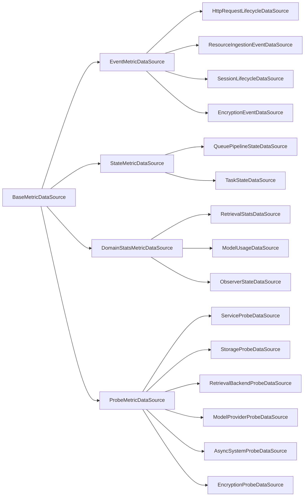
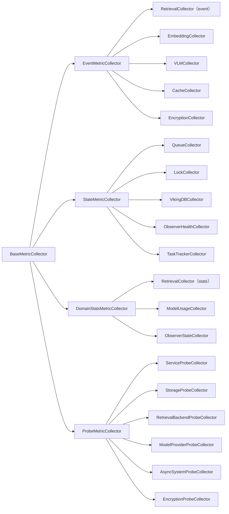
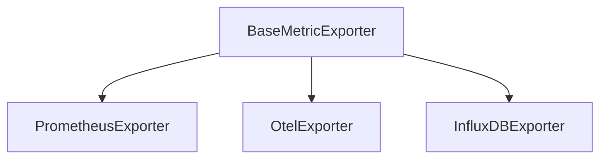
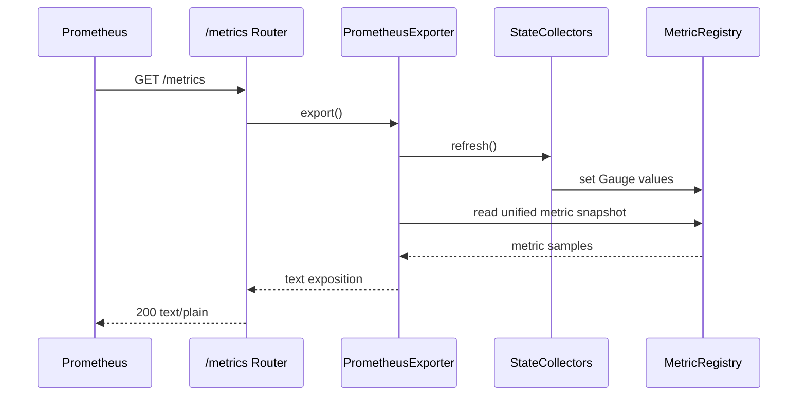

# OpenViking 指标体系设计方案

## 背景

本方案讨论的是 OpenViking 的“指标体系（metrics）”，目标是把 `/metrics` 做成一个可持续抓取的 Prometheus 导出端点，并与 `/api/v1/observer/*`（瞬时状态）和 `/api/v1/stats/*`（分析统计）形成清晰边界。

### 现状入口与实现特征

OpenViking 当前已经存在三类与“观测”相关的入口：

| 入口 | 当前定位 | 当前实现特征 |
| --- | --- | --- |
| `/api/v1/observer/*` | 组件瞬时状态查询 | `ObserverService` 组装 queue/vikingdb/models/lock/retrieval 状态 |
| `/api/v1/stats/*` | 业务统计与内容质量分析 | `StatsAggregator` 动态查询 memory 分类、热度、陈旧度、session extraction 等 |
| `/metrics` | Prometheus 指标导出 | 当前依赖 `PrometheusObserver.render_metrics()` 输出文本 |

结合代码现状可以归纳出关键事实：

| 模块 | 位置 | 当前职责 | 问题摘要 |
| --- | --- | --- | --- |
| `BaseObserver` | `openviking/storage/observers/base_observer.py` | `get_status_table/is_healthy/has_errors` | 瞬时状态语义清晰 |
| `PrometheusObserver` | `openviking/storage/observers/prometheus_observer.py` | 进程内存储 Counter/Histogram + 渲染 `/metrics` | 与 Observer 体系职责不一致，属于“异类” |
| 业务埋点（retrieval/embedding/vlm 等） | 多处 | 直接回调 observer 写指标 | 采集层与导出层强耦合，难扩展/难测试 |
| `/metrics` 路由 | `openviking/server/routers/metrics.py` | 直接取 `app.state.prometheus_observer` | 路由层绑定具体实现对象，而非 exporter 抽象 |

当前 `/metrics` 已打通的指标主要集中在 retrieval/embedding/vlm/cache 的少量 counter/histogram 指标族，覆盖面偏窄。

### 关键问题

- `PrometheusObserver` 破坏 Observer 一致性：它本质是“注册中心 + 导出器”混合体，而非瞬时状态读取器。
- 采集与导出强耦合：业务代码需要感知 Prometheus 是否启用，未来接入其他 exporter 会反向侵入业务埋点。
- 指标类型与语义不完整：缺 gauge/health、缺统一命名与标签边界，难扩展到 queue/task/lock/vikingdb 等运行态。
- 多租户可观测性不足但风险高：缺 `account_id` 切片能力，同时必须防止演化为高基数（user/session/resource 等维度严禁进入 `/metrics`）。
- `/metrics` 与 `/api/v1/stats` 易混淆：分析型统计不应迁入高频抓取的 Prometheus 模型。

### 设计目标与非目标

设计目标：

1. 让 `Observer` 回归“瞬时状态观测”本位。
2. 建立独立 metrics 核心层：采集（DataSource）/语义分流（Collector）/存储（Registry）/导出（Exporter）解耦。
3. 把零散埋点统一接入同一套事件与状态契约（Event/State/DomainStats/Probe）。
4. 为 `/metrics` 提供系统化的 Gauge / Counter / Histogram，并明确失败语义（best-effort、valid/stale）。
5. 明确 `/metrics` 与 `/api/v1/stats` 边界，避免抓取放大成本。

非目标：

- 不重写现有 operation telemetry 响应结构。
- 不要求把所有业务统计都变为 Prometheus 指标。
- 不引入分布式聚合层，也不解决跨进程汇总问题。
- 首版不强制落地 OTel exporter。

## 1. 架构概览

### 1.1 核心原则

本节明确指标体系设计中需要持续成立的几项基础原则。这些原则用于约束后续的抽象分层、模块边界、Telemetry 关系以及对外观测接口的职责划分。

#### 原则 A：先抽象职责，再落实现类型

概览层保留以下四个核心抽象：

- `MetricDataSource`
- `BaseMetricCollector`
- `MetricRegistry`
- `BaseMetricExporter`

#### 原则 B：数据源与指标体系解耦

现有 Observer、Telemetry、TaskTracker、业务事件埋点，本质上都属于“数据来源”，但不等同于指标系统本身。

因此：

- 数据源负责提供原始状态或原始事件；
- Collector 负责把这些原始语义转换为指标；
- Registry 负责保存指标；
- Exporter 负责把指标转换为外部协议。

这种拆分可以避免 retrieval、embedding、vlm 等业务代码直接耦合某一个 exporter。

#### 原则 C：Registry 是唯一真实指标存储

`MetricRegistry` 作为进程内指标的唯一真实来源，负责承接统一的读写与约束。

职责范围如下：

- 指标定义注册；
- 标签规范校验；
- 当前值读写；
- 并发安全；
- 向 exporter 提供可读取的当前视图。

注意：这里的“当前视图”仅指读取时获取 registry 内部状态，不引入独立的 Snapshot 架构层。

#### 原则 D：Exporter 只负责协议导出

Exporter 只负责协议导出，不负责指标语义生成。

Exporter 不负责：

- 业务埋点；
- 状态采集；
- 指标语义转换。

Exporter 只负责：

- 读取 registry；
- 根据目标协议格式化；
- 输出给 `/metrics` 或其他监控后端。

这意味着 Prometheus 只是首个落地实现，而不是整个 metrics 架构的中心。

#### 原则 E：保留三类观测入口的职责边界

`/metrics`、`/api/v1/observer/*`、`/api/v1/stats/*` 三类入口继续并存，但必须保持清晰分工。

- `/metrics` 面向机器抓取，强调低基数、低成本、可持续聚合；
- `/api/v1/observer/*` 面向人工诊断，强调瞬时状态可读性；
- `/api/v1/stats/*` 面向业务分析，允许更重的查询与统计逻辑。

这三个入口共享部分数据来源，但不共享同一种输出模型。

### 1.2 抽象分层设计

本节给出指标体系的抽象主链路，只保留最小且稳定的四类角色，不提前展开任何具体实现类。

抽象主链路如下：

四类抽象角色的职责如下：

| 抽象角色 | 作用 | 只负责什么 | 不负责什么 |
| --- | --- | --- | --- |
| `MetricDataSource` | 提供原始状态或原始事件 | 产生可观测输入 | 不直接生成 Prometheus 文本 |
| `BaseMetricCollector` | 将输入转为统一指标语义 | 采集、归一化、写 registry | 不直接暴露 HTTP |
| `MetricRegistry` | 统一存储进程内指标 | 注册、校验、读写、并发控制 | 不关心数据源来自哪里 |
| `BaseMetricExporter` | 按协议导出指标 | 格式化与导出 | 不直接理解业务链路语义 |

抽象主链路对应的数据流顺序如下：

1. `MetricDataSource` 提供瞬时状态、请求结束摘要或运行时事件；
2. `BaseMetricCollector` 将这些输入映射为 Counter / Gauge / Histogram 等统一指标；
3. `MetricRegistry` 保存当前进程内全部指标状态；
4. `BaseMetricExporter` 在需要时读取 registry 并输出给外部系统。

### 1.3 设计边界

抽象分层确定之后，还需要从设计边界上进一步保证：

* 指标体系可以观测业务主链路，但不成为业务主链路的组成部分；
* 指标链路可以缺失或降级，但不能反向改变 retrieval、embedding、VLM、resource、session、task 与 observer 等核心功能的行为语义。

因此，需要对相应角色施加明确约束：

* **DataSource**：业务接触面收敛到 DataSource。业务对象、业务状态、业务事件、已有统计快照与探针执行结果，只允许由 `MetricDataSource` 接触和读取。`Collector`、`MetricRegistry`、`Exporter` 不再直接访问业务服务、业务存储或业务上下文。
* **Collector**：Collector 禁止重新参与业务流程。Collector 的职责仅为把标准化输入映射为指标语义，并写入 `MetricRegistry`，不拥有业务真实状态。
  * 事件类（如 HTTP API 调用）链路由业务事件发生点触发，DataSource 到 Collector 之间只传递轻量事件；
  * 状态类（如系统状态）链路由采集时机触发，例如 `/metrics` 抓取前刷新，对应读取只能是轻量快照、已有聚合结果或轻量探针结果。

### 1.4 目录与模块边界

在边界约束成立之后，模块划分也需要与之保持一致，避免目录结构重新把已经划清的职责边界混回同一层。为避免新指标体系继续与 `storage/observers/` 的职责混杂，集中放入 `openviking/metrics/`，并按“注册中心 / 采集器 / 导出器 / 规则 / 启动装配”进行分组。

逻辑分组如下：

| 模块分组 | 职责 |
| --- | --- |
| `registry` | 指标存储、指标定义、标签校验 |
| `collectors` | retrieval / embedding / vlm / queue / task / observer / telemetry 等采集器 |
| `exporters` | Prometheus / 未来 OTel / InfluxDB |
| `naming` | 指标命名规则、label 规则、bucket 约定 |
| `bootstrap` | app 启动时初始化 registry / exporters / collector manager |

### 1.5 与现有 telemetry 的关系

operation telemetry 与 metrics 并不是两套彼此替代的系统。前者继续作为请求级结构化摘要存在，服务于单次调用的解释与排障；后者则只对白名单字段做低基数抽取，用于持续抓取、聚合与告警。

operation telemetry 已经拥有很多有价值的数据字段，如：

- `duration_ms`
- `tokens.*`
- `vector.*`
- `queue.*`
- `semantic_nodes.*`
- `memory.extract.*`
- `errors.*`

但并非所有字段都适合直接进入 `/metrics`，因此这里只对白名单字段进行指标化抽取：

| telemetry 分组 | 是否指标化 | 原因 |
| --- | --- | --- |
| `duration_ms` | 是 | 低基数、高通用性 |
| `tokens.total / llm / embedding` | 是 | 有明确容量与成本价值 |
| `vector.searches / scored / returned` | 是 | 检索链路核心运行指标 |
| `queue.*` | 是 | 适合形成任务吞吐与错误指标 |
| `semantic_nodes.*` | 有条件 | 更适合资源导入链路，不应无限扩散标签 |
| `memory.extract.*` | 部分保留在 stats / telemetry | 更偏业务分析，首版不全面指标化 |
| `errors.message` | 否 | 高基数、可能泄漏上下文 |

### 1.6 `/metrics`、`/api/v1/observer`、`/api/v1/stats` 的职责边界

三类对外观测接口共享部分数据来源，但并不共享同一种输出模型，也不应追求由同一套接口承担全部观测需求。明确这一边界，是为了避免后续设计在机器抓取、人工诊断与业务分析之间发生职责漂移。

| 接口 | 定位 | 数据特征 | 输出风格 |
| --- | --- | --- | --- |
| `/metrics` | 机器消费型监控接口 | 低基数、可持续抓取、可聚合 | Prometheus exposition |
| `/api/v1/observer/*` | 人工诊断型瞬时状态接口 | 组件当前状态、表格或结构化描述 | JSON + 可读状态文本 |
| `/api/v1/stats/*` | 业务分析型接口 | 可能昂贵、可扫描、可聚合但非高频 | JSON 统计结果 |

## 2. 核心设计细节

### 2.1 `MetricDataSource` 设计

在实现层，抽象角色 `MetricDataSource` 统一落为基类 `BaseMetricDataSource`，并在其下进一步划分 `EventMetricDataSource`、`StateMetricDataSource`、`DomainStatsMetricDataSource`、`ProbeMetricDataSource` 四类中间抽象。这四类中间抽象并非单纯的逻辑标签，而是分别对应不同的数据访问契约与刷新方式，因此在架构层被明确区分。

这些输入可能是：

- 某个组件的瞬时状态；
- 某个运行时事件；
- 某个领域内部维护的累计统计；
- 某个探针执行结果。

在 OpenViking 中，`MetricDataSource` 采用“统一基类 + 中间契约层 + 具体实现类”的三层结构。具体继承关系如下：

这四类中间抽象对应的数据访问契约如下：

| 中间抽象 | 契约语义 | 典型读取方式 | 典型指标类型 |
| --- | --- | --- | --- |
| `EventMetricDataSource` | 提供增量事件流或生命周期事件 | 读取事件批次、消费新事件、按游标增量拉取 | Counter、Histogram |
| `StateMetricDataSource` | 提供当前状态快照 | 按需读取当前状态、重复读取返回最新值 | Gauge |
| `DomainStatsMetricDataSource` | 提供领域内部已经维护好的累计统计 | 读取累计计数、汇总结果、统计快照 | Counter、Gauge、部分 Histogram 输入 |
| `ProbeMetricDataSource` | 提供探针执行结果或健康检查结果 | 执行探测、读取最近一次探测结果 | Gauge、Health |

各类具体数据源的职责如下：

| 实现 | 分类 | 主要对接对象 | 输出形态 | 适用场景 |
| --- | --- | --- | --- | --- |
| `HttpRequestLifecycleDataSource` | `EventMetricDataSource` | FastAPI middleware、路由响应 | 请求生命周期事件 | request total、duration、status code、in-flight |
| `ResourceIngestionEventDataSource` | `EventMetricDataSource` | ResourceProcessor、ResourceService、watch / wait 流程 | 资源处理事件与阶段摘要 | parse / finalize / summarize / wait / watch duration |
| `SessionLifecycleDataSource` | `EventMetricDataSource` | session create / used / commit / archive | 会话生命周期状态与事件 | commit 生命周期、contexts_used、archive 状态 |
| `EncryptionEventDataSource` | `EventMetricDataSource` | Encryptor、API Key 验证路径、KDF / Key Loader | 加密操作事件与密钥处理事件 | encrypt / decrypt / verify count、duration、bytes、kdf / key_load 耗时、auth_failed |
| `QueuePipelineStateDataSource` | `StateMetricDataSource` | `QueueManager`、Semantic DAG、request queue stats | 队列与流水线状态 | pending、in_progress、processed、error_count、semantic_nodes |
| `TaskStateDataSource` | `StateMetricDataSource` | `TaskTracker` | 当前任务状态 | pending、running、completed、failed 数量 |
| `RetrievalStatsDataSource` | `DomainStatsMetricDataSource` | `RetrievalStatsCollector` | 检索累计统计 | query count、zero result、latency、rerank 情况 |
| `ModelUsageDataSource` | `DomainStatsMetricDataSource` | VLM / Embedding / Rerank token tracker | 模型使用统计 | 调用次数、耗时、token 消耗 |
| `ObserverStateDataSource` | `DomainStatsMetricDataSource` | `ObserverService`、`LockManager`、`VikingDBManager` | 诊断聚合视图 | component health、lock、vikingdb、models、retrieval |
| `ServiceProbeDataSource` | `ProbeMetricDataSource` | 服务初始化、组件装配状态 | 服务探针结果 | startup completion、service readiness |
| `StorageProbeDataSource` | `ProbeMetricDataSource` | AGFS / VikingFS、系统表访问检查 | 存储探针结果 | storage readability、storage writability、system table readiness |
| `RetrievalBackendProbeDataSource` | `ProbeMetricDataSource` | VikingDB、检索后端最小能力检查 | 检索后端探针结果 | backend readiness、collection availability |
| `ModelProviderProbeDataSource` | `ProbeMetricDataSource` | VLM / Embedding / Rerank provider 可用性检查 | 模型依赖探针结果 | provider readiness、credential availability |
| `AsyncSystemProbeDataSource` | `ProbeMetricDataSource` | Queue、TaskTracker、后台消费线程检查 | 异步系统探针结果 | queue readiness、worker liveness |
| `EncryptionProbeDataSource` | `ProbeMetricDataSource` | Root Key、KMS / Vault Provider、加密组件检查 | 加密探针结果 | root key readiness、kms availability、encryption component health |

设计边界如下：

- 同一个业务模块可以暴露多个 DataSource，例如 session 相关能力既可以贡献 `SessionLifecycleDataSource`，也可能间接贡献 `TaskStateDataSource`。
- 加密相关监控优先建模为 `EncryptionEventDataSource`；涉及 Root Key readiness、KMS / Vault Provider 可用性、加密组件健康度时，则由 `EncryptionProbeDataSource` 承接。
- `SessionLifecycleDataSource` 只支持聚合级监控，不支持 `session_id` 级细粒度监控，也不允许把 `session_id` 作为指标标签。
- `ObserverStateDataSource` 属于诊断视图适配结果，适合承接当前 Observer 体系的聚合输出，但不应继续向更高层堆叠新的 summary。
- `operation telemetry` 属于请求级链路汇总能力，不作为一级 `MetricDataSource` 建模；如需复用其结果，应通过 collector 或兼容适配层接入。
- memory health、category、staleness 等分析型统计继续通过 `/api/v1/stats` 暴露，不在本节中抽象为独立 DataSource。
- `ProbeMetricDataSource` 采用方案 B：不再设置总的 `SystemProbeDataSource` 聚合父类，而是直接按依赖类型细分为 Service / Storage / Retrieval Backend / Model Provider / Async System / Encryption 六类 probe 子类。

Observer、Telemetry、TaskTracker、HTTP Router 与各类业务服务继续保持原有职责；指标系统只把它们视为数据源，而不将其改造成 exporter 或 collector。

### 2.2 `BaseMetricCollector` 设计

Collector 位于指标体系中的语义转换层，负责接收不同类型的可观测输入，并将其稳定映射为对 `MetricRegistry` 的统一写入操作。随着 `MetricDataSource` 被进一步划分为 Event、State、DomainStats 与 Probe 四类，Collector 侧采用对应的分层组织，而不再停留在仅区分 Event / State 的简化模型。

在这一设计下，Collector 不再只是“埋点写入器”，而是承担统一收口职责：一方面屏蔽上游数据源在访问方式与更新节奏上的差异，另一方面对下游 registry 暴露一致的写入语义。这样可以保证新增指标链路时，扩展点仍然集中在 Collector 层，而不会把 source-specific 逻辑扩散到 registry 或 exporter。

Collector 采用“基类 + 四类子抽象 + 多个具体实现”的组织方式：

抽象层次的分工如下：

| 抽象层次 | 职责 | 典型触发方式 |
| --- | --- | --- |
| `BaseMetricCollector` | 定义 collector 统一行为与 registry 写入约束 | 所有 collector 共用 |
| `EventMetricCollector` | 处理“事件发生一次，就写一次”的场景 | HTTP 请求完成、资源处理完成、VLM 调用完成、加密操作完成 |
| `StateMetricCollector` | 处理“读取当前状态并刷新 gauge”的场景 | `/metrics` 抓取前刷新 |
| `DomainStatsMetricCollector` | 处理“读取已有累计统计并写入 registry”的场景 | 检索统计、模型使用统计、Observer 聚合视图刷新 |
| `ProbeMetricCollector` | 处理“执行探针并映射为健康类指标”的场景 | readiness / dependency probe 刷新 |

Collector 与 DataSource 的主映射关系如下：

| DataSource 分类 | 优先对应的 Collector 分类 | 说明 |
| --- | --- | --- |
| `EventMetricDataSource` | `EventMetricCollector` | 事件型输入天然适合 Counter / Histogram |
| `StateMetricDataSource` | `StateMetricCollector` | 当前状态快照天然适合 Gauge |
| `DomainStatsMetricDataSource` | `DomainStatsMetricCollector` | 已聚合统计应直接桥接到 registry |
| `ProbeMetricDataSource` | `ProbeMetricCollector` | 健康检查结果应统一映射为 readiness / health 指标 |

具体 collector 分工如下：

| Collector | 分类 | 数据输入 | 写入指标 |
| --- | --- | --- | --- |
| `RetrievalCollector` | `EventMetricCollector` | retrieval 完成事件 | 请求数、零结果数、结果数、耗时、rerank 使用情况 |
| `EmbeddingCollector` | `EventMetricCollector` | embedding 完成事件 | 请求数、耗时、错误数 |
| `VLMCollector` | `EventMetricCollector` | token / duration 事件 | 调用数、耗时、token 统计 |
| `CacheCollector` | `EventMetricCollector` | cache 命中或未命中事件 | hit / miss |
| `EncryptionCollector` | `EventMetricCollector` | encrypt / decrypt / verify / kdf / key_load 事件 | 加密次数、认证失败、耗时、字节量、密钥处理统计 |
| `QueueCollector` | `StateMetricCollector` | QueueManager / DAG 当前状态 | pending、in_progress、processed、errors |
| `LockCollector` | `StateMetricCollector` | LockManager 当前状态 | active、waiting、stale |
| `VikingDBCollector` | `StateMetricCollector` | VikingDB collection 当前状态 | health、vectors、collections |
| `ObserverHealthCollector` | `StateMetricCollector` | ObserverService 结果 | component health、component errors |
| `TaskTrackerCollector` | `StateMetricCollector` | TaskTracker 当前状态 | pending、running、completed、failed |
| `RetrievalCollector` | `DomainStatsMetricCollector` | RetrievalStatsDataSource | 检索累计统计桥接 |
| `ModelUsageCollector` | `DomainStatsMetricCollector` | ModelUsageDataSource | 模型使用累计统计桥接 |
| `ObserverStateCollector` | `DomainStatsMetricCollector` | ObserverStateDataSource | 诊断聚合视图桥接 |
| `ServiceProbeCollector` | `ProbeMetricCollector` | ServiceProbeDataSource | service readiness、startup completion |
| `StorageProbeCollector` | `ProbeMetricCollector` | StorageProbeDataSource | storage readiness、system table availability |
| `RetrievalBackendProbeCollector` | `ProbeMetricCollector` | RetrievalBackendProbeDataSource | backend readiness、collection availability |
| `ModelProviderProbeCollector` | `ProbeMetricCollector` | ModelProviderProbeDataSource | provider readiness、credential availability |
| `AsyncSystemProbeCollector` | `ProbeMetricCollector` | AsyncSystemProbeDataSource | queue readiness、worker liveness |
| `EncryptionProbeCollector` | `ProbeMetricCollector` | EncryptionProbeDataSource | root key readiness、kms availability、encryption component health |

设计理由：在引入四类 Collector 之后，整个体系的语义边界更清晰：

- EventCollector 偏向增量写入，天然适合 Counter / Histogram；
- StateCollector 偏向覆盖写入，天然适合 Gauge。
- DomainStatsCollector 偏向桥接已有累计统计，避免把已聚合结果重新拆回事件。
- ProbeCollector 偏向健康检查与 readiness 映射，避免把探针逻辑塞进 StateCollector 或 EventCollector。

对于 retrieval 链路，统一保留 `RetrievalCollector` 命名：它既可以接收 retrieval 完成事件，也可以读取 `RetrievalStatsDataSource` 的累计快照。两类输入在实现上可以走不同分支，但不再拆出单独的 `RetrievalStatsCollectorAdapter` 名称，以避免把“同一指标域的两条输入路径”误写成两套 collector。

### 2.3 `MetricRegistry` 设计

`MetricRegistry` 是整个体系的稳定中心，负责统一注册、校验、存储和读取指标，但不负责采集触发，也不承担协议导出职责。它对外维持统一接口，不针对 Event / State / DomainStats / Probe 四类 Collector 再拆分多套写入 API，语义分流应由 Collector 自身完成。

`MetricRegistry` 必须满足以下能力：

| 能力 | 要求 |
| --- | --- |
| 统一注册 | 每个指标在进程内只注册一次，防止重复定义 |
| 类型约束 | 同名指标不能一会儿是 Counter、一会儿是 Gauge |
| 标签约束 | 每个指标的 label key 集合固定，运行时只允许填充固定维度 |
| 并发安全 | 允许 FastAPI 协程、队列线程、后台清理线程同时读写 |
| 低开销读取 | `/metrics` 抓取不应持有长时间大锁 |
| 可扩展性 | 不耦合 Prometheus 专属概念，避免 registry 层直接出现 exposition 文本逻辑 |
| 统一写入接口 | 对外维持统一的 counter / gauge / histogram 写入接口，不按 source 类型暴露分裂 API |

Registry 只解决“如何统一保存指标”，不解决：

- 数据从哪里来；
- 谁来触发采集；
- 以什么协议导出。

统一接口策略如下：

- EventCollector 决定何时调用 `inc_counter` 或 `observe_histogram`；
- StateCollector 决定何时调用 `set_gauge`；
- DomainStatsCollector 决定如何把已有累计统计映射到统一写接口；
- ProbeCollector 决定如何把 probe 结果翻译成 readiness / health gauge。

也就是说，Registry 不感知“当前写入的是事件、状态、统计还是探针”，它只感知“要写入哪种指标类型、哪个指标名、哪些标签和值”。

由此，registry 可以作为整个指标系统的稳定核心，而不随 exporter 或 collector 的演化频繁变动。

### 2.4 `BaseMetricExporter` 设计

Exporter 位于指标体系最下游，只负责把 registry 中的当前指标状态转换成外部协议。与 Registry 相同，Exporter 也遵循统一接口原则：它只依赖统一的读接口，不感知指标来自 Event / State / DomainStats / Probe 中的哪一路。

Exporter 采用如下继承关系：

各 exporter 的定位如下：

| Exporter | 定位 | 首版状态 |
| --- | --- | --- |
| `PrometheusExporter` | 负责 `/metrics` exposition 输出 | 首版必须落地 |
| `OtelExporter` | 对接未来 OTel 指标导出 | 预留 |
| `InfluxDBExporter` | 对接未来 InfluxDB | 预留 |

统一读取策略如下：

- Exporter 通过统一的 registry 读取接口获取当前样本集合；
- Exporter 不关心某个样本来自哪类 DataSource 或哪类 Collector；
- Exporter 只关心指标定义、标签集合、当前值与目标协议的序列化方式；
- source/category 语义在 Collector 写入 registry 前已经完成收敛，不应渗透到 exporter 层。

### 2.5 Prometheus 方式数据路径

本节讨论 `/metrics` 请求从进入服务到返回结果之间的完整运行时序，并明确导出前刷新策略的边界。Prometheus 抓取 `/metrics` 时，先执行必要的 collector 刷新，再统一读取 registry 快照，最后由 exporter 完成协议序列化。

Prometheus 抓取 `/metrics` 时，执行以下流程：

设计理由：采用“导出前刷新 StateCollector”的原因是：

- 不需要额外后台采样协程；
- 指标与抓取时间点一致；
- 避免无人抓取时持续消耗资源；
- 与现有 Observer 的按需读取模式一致。
- Exporter 保持协议层纯度，不因 source/category 增长而扩展额外分支逻辑。

### 2.6 State / Probe 刷新控制策略

对于 Queue、Lock、VikingDB、Task、Observer health 以及各类 probe 而言，设计目标不应是“每次 `/metrics` 抓取都严格同步拿到瞬时最新值”，而应是“在保证抓取路径稳定、延迟可控的前提下，提供足够新的状态视图”。换句话说，`/metrics` 首先是一个可持续抓取的监控接口，其次才是状态刷新触发点。

基于这一点，State / Probe 刷新统一采用“默认 scrape-triggered refresh + 基于 TTL 的刷新控制 + stale-while-revalidate” 组合策略：

- 默认情况下，State / Probe Collector 仍在 Prometheus 抓取 `/metrics` 时触发刷新；
- 对读取成本高、依赖外部系统或容易抖动的 Collector，允许引入短 TTL 的刷新控制窗口；
- 当当前时间仍处于 TTL 控制窗口内时，不重复触发刷新；
- 当 TTL 控制窗口结束后，允许先返回最近一次成功值，再触发一次受控刷新；
- 刷新策略属于 Collector 运行时能力，而不是 `MetricRegistry` 的职责。

这里需要进一步明确两类信息的边界：

- `MetricRegistry` 保存的是对外可见的当前指标值，是 Exporter 读取并序列化的唯一真实来源；
- State / Probe Collector 不保存另一份对外指标结果，而只负责在合适的时机触发刷新。

因此，TTL、超时、是否允许返回旧值、是否触发后台刷新等策略不下沉到 `MetricRegistry`。Registry 只负责统一存储指标，不负责刷新调度，也不在其读取接口上附带“读取即触发刷新”的副作用。刷新时机由 `/metrics` 导出路径中的执行层显式控制，例如由 Exporter 或独立的 CollectorManager 在导出前调用 `refresh_if_needed()`，随后再统一读取 Registry。

对于返回旧值（stale value），本方案默认允许该行为，而不是把它当作异常分支。原因在于大多数状态类与探针类指标本身就不是强瞬时一致性的观测对象；相比“为了获取最新值而阻塞整个 `/metrics` 抓取路径”，继续导出 `MetricRegistry` 中最近一次成功写入的指标值更符合监控系统的使用语义。

为了避免“旧值长期存在但不可见”，本方案采用更明确的可观测语义：对于无法定义失败默认值的状态类指标，指标设置之初即包含一个最小的有效性标签（如 `valid=1/0`），以便让告警与看板显式识别“当前值是否可用”。当刷新失败时，不强行覆盖写入默认值，而是将该 `valid` 标签置为 `0`，并继续导出 `MetricRegistry` 中最近一次成功写入值。

- 对启用基于 TTL 的刷新控制的 State / Probe 指标，指标定义中统一包含 `valid` 标签；Collector 在刷新成功时写入 `valid=1`，刷新失败时写入 `valid=0`；
- 对具有明确失败语义的探针类指标（如 readiness / dependency probe），刷新失败时应显式覆盖写入失败值（例如 UP -> DOWN），而不依赖“值消失”或隐式过期；

在 Collector 分类上，以下对象优先视为“启用基于 TTL 的刷新控制”的候选：

- 需要访问外部依赖的 Probe Collector，例如 retrieval backend、model provider、storage、encryption provider；
- 需要做聚合、扫描或多对象汇总的 State Collector，例如 collection 级状态或复杂 observer 聚合视图；
- 在运行中已观测到刷新耗时抖动明显、超时概率较高的 Collector。

相对地，Queue、Task 等纯内存态或低成本状态读取，仍应优先保持同步 scrape-triggered refresh，不必默认引入基于 TTL 的刷新控制。

### 2.7 HTTP Metrics Middleware 语义

当前实现中，HTTP 请求指标并不只是“某个 EventMetricCollector 的普通上游事件源”，而是由一个专门的 middleware 负责把请求生命周期翻译为低基数、best-effort 的 HTTP metrics 事件。其运行时语义如下：

#### 2.7.1 路由忽略与低基数路径归一化

- middleware 必须先按 **raw path** 忽略内部接口：
  - `/metrics`
  - `/health`
  - `/ready`
- 这样可以保证即使当前请求尚未绑定 Starlette route template，也不会把内部健康接口错误纳入业务 HTTP 指标。
- 对普通业务请求，优先使用 route template（例如 `/api/v1/sessions/{session_id}`）作为 `route` 标签；
- 当 route template 不可用时，禁止回退到原始 URL path，而统一回落到固定低基数字符串（例如 `"/__unmatched__"`），以避免把动态 ID、UUID、资源路径直接带入标签，造成基数爆炸。

#### 2.7.2 inflight 语义是“进程内近似值”，不是强一致计数

- HTTP inflight 计数可以通过进程内字典按 `(route, account_id)` 维持；
- 该值的目标是为实时看板和排障提供“足够合理的当前并发近似视图”，而不是全局严格正确性机制；
- 为避免多线程运行时的读改写竞态，应使用轻量锁保护该近似计数的更新过程；
- 当 inflight 计数归零后，应及时删除对应键，避免零值键长期残留并放大内存占用。

#### 2.7.3 middleware 必须保持 best-effort

- HTTP metrics middleware 不能影响主请求链路；
- 任何指标写入、inflight 调整、request 计时上报失败，都只能影响 observability side-channel，而不能影响业务响应；
- 统一将此类异常收敛为 debug 级日志，并在日志中带上 `route` 与 `account_id` 等上下文字段；
- 默认不开启高频错误日志，仅在 debug 诊断场景下用于排查 metrics 自身问题。

#### 2.7.4 请求链路中的 `account_id` 解析分两阶段完成

- middleware 进入请求时，可以先尝试从 request state 或 header 提取一个 provisional account id，用于 inflight 早期打点；
- 请求结束后，应重新读取最终的 request-scoped account identity，并在必要时对 inflight 指标做一次 rebalance；
- 这样可兼顾：
  - 早期 inflight 可见性；
  - 认证完成后的最终租户归属正确性。

## 3. 指标策略

### 3.1 指标映射总览

在展开具体指标清单之前，先把“指标族 → DataSource → Collector → Metric Type”的关系收敛成统一视图，可以避免后续列表只见指标名、不见来源链路。对于首版范围内的所有指标，都应能够映射回明确的 DataSource 与 Collector；如果某个指标无法说明其输入来源或采集责任，就不应直接进入首版清单。

| 指标族 | 主要 DataSource | 主要 Collector | 主要指标类型 | 代表指标 |
| --- | --- | --- | --- | --- |
| HTTP 请求监控 | `HttpRequestLifecycleDataSource` | `HTTPCollector` | Counter、Histogram | request total、duration、status code |
| 检索链路监控 | `RetrievalStatsDataSource`、retrieval 完成事件 | `RetrievalCollector` | Counter、Histogram | retrieval requests、zero result、latency |
| 模型链路监控 | `ModelUsageDataSource`、模型调用事件 | `VLMCollector`、`EmbeddingCollector`、`ModelUsageCollector` | Counter、Histogram | model calls、tokens、duration |
| 资源导入监控 | `ResourceIngestionEventDataSource` | `ResourceIngestionCollector` | Counter、Histogram | parse / finalize / summarize / wait duration |
| Session 与异步任务监控 | `SessionLifecycleDataSource`、`TaskStateDataSource`、`QueuePipelineStateDataSource` | `TaskTrackerCollector`、`QueueCollector` | Gauge、Counter | task pending、queue backlog、session lifecycle count |
| 诊断与状态监控 | `ObserverStateDataSource`、`QueuePipelineStateDataSource` | `ObserverHealthCollector`、`LockCollector`、`VikingDBCollector` | Gauge | component health、lock active、collection health |
| 加密监控 | `EncryptionEventDataSource`、`EncryptionProbeDataSource` | `EncryptionCollector`、`EncryptionProbeCollector` | Counter、Histogram、Gauge | encrypt count、decrypt duration、root key readiness |
| 系统探针监控 | 各类 `*ProbeDataSource` | 各类 `*ProbeCollector` | Gauge、Health | service readiness、storage readiness、kms availability |
| 操作级 Telemetry 指标化 | telemetry adapter / bridge | `TelemetryBridgeCollector` | Counter、Histogram、Gauge | operation requests、vector scanned、memory extracted |

### 3.2 指标对象模型

当前指标对象模型收敛为三类基础指标：Counter、Gauge 与 Histogram。`Summary` 不纳入当前范围，以避免在聚合语义、实现复杂度与使用收益之间引入不必要的失衡。

当前统一支持三种指标类型：

| 类型 | 用途 | 典型场景 |
| --- | --- | --- |
| Counter | 单调递增计数 | 请求量、错误数、cache 命中数、任务完成数 |
| Gauge | 当前值 | 队列 backlog、运行中任务数、锁持有数、健康状态 |
| Histogram | 分布统计 | 请求耗时、embedding 耗时、VLM 调用耗时、资源处理耗时 |

当前不支持 `Summary`，原因如下：

- 对 Prometheus 多实例聚合不友好；
- 与 Histogram 的职责边界重叠；
- 会增加 registry 与 exporter 实现复杂度；
- 当前 OpenViking 真实缺的是 Gauge，不是 Summary。

### 3.3 标签策略

标签策略的核心，不在于“尽可能表达更多业务信息”，而在于在可观测性价值与高基数风险之间取得稳定平衡。为此，标签设计必须遵守“低基数优先”原则，默认只允许有限、可枚举、可控的标签集合。

#### 允许的常用标签

| 标签 | 说明 | 默认策略 |
| --- | --- | --- |
| `operation` | 操作名，如 `search.find`、`resources.add_resource` | 默认启用 |
| `status` | `ok` / `error` | 默认启用 |
| `queue` | `Embedding` / `Semantic` / 其他队列名 | 默认启用 |
| `level` | cache level，如 `L0` / `L1` / `L2` | 默认启用 |
| `context_type` | retrieval context，如 `memory` / `resource` | 默认启用 |
| `component` | queue / models / lock / retrieval / vikingdb | 默认启用 |
| `task_type` | 如 `session_commit` | 默认启用 |
| `account_id` | 租户 ID | 条件启用 |
| `provider` | 模型供应商，如 openai / volcengine | 条件启用 |
| `model_name` | 模型名 | 谨慎启用，需归一化后有限枚举 |

#### 租户标签策略

`account_id` 仅用于：

- 请求量；
- 请求耗时；
- 任务堆积；
- 资源导入吞吐。

运行时保护规则如下：

1. 默认关闭；
2. 仅对明确列入白名单的指标启用；
3. 提供最大活跃租户数保护，超出后回退到无标签聚合。

#### `account_id` 运行时解析与回退语义

在当前实现中，`account_id` 已不再只是“是否在指标定义里声明一个标签”的静态设计问题，而是一个运行时解析过程。其落地语义如下：

1. **支持集（support set）比 allowlist 更窄**
   - 只有被明确标记为“支持多租户维度”的指标族，才允许在运行时注入 `account_id`；
   - 即使配置上开启了 `account_id`，不在支持集中的指标也不得携带该标签；
   - allowlist 只用于在“支持集内部”进一步决定哪些指标真正启用租户维度。

2. **最终标签值不是简单的“真实租户 ID 或空”**
   - 运行时解析结果允许出现三类稳定标签值：
     - 真实租户 ID；
     - `__unknown__`：当前请求/事件无法解析出可信租户；
     - `__overflow__`：已启用活跃租户数上限保护，当前租户超出上限，统一回落到溢出桶。

3. **解析路径按“显式值 > 请求上下文 > 所有权信息”收敛**
   - 对事件类指标，优先使用事件调用方显式传入的 `account_id`；
   - 对 HTTP / 请求链路类指标，优先使用 request-scoped context 中已认证/已解析出的租户身份；
   - 对资源、任务等存在 owner 语义的场景，可回退到 owner account 信息；
   - 无法得到可信结果时统一落到 `__unknown__`，而不是直接省略标签。

4. **运行时策略作为独立配置对象**
   - 配置项至少应包含：
     - `enabled`
     - `metric_allowlist`
     - `max_active_accounts`
   - Collector 在写指标时不自行实现租户裁剪逻辑，而统一调用 account-dimension runtime helper 解析最终标签值。

5. **文档层面应明确：`account_id` 是“有损但可控”的可观测维度**
   - 其目标是为低基数、在线监控场景提供有限的租户切片；
   - 它不是审计维度，也不保证所有租户都能长期以真实 ID 形式保留在 `/metrics` 中。

#### 应避免的高基数标签

- `user_id`
- `session_id`
- `resource_uri`
- 原始 `error_message`
- 原始 `query`
- 文件路径
- request id / telemetry id

### 3.4 命名规范

命名规范的目标，是让同一类指标在不同 collector、不同链路中保持一致的表达方式，减少命名漂移与语义歧义。为此，指标命名统一采用 `openviking_<domain>_<metric>_<unit>` 模板，并对 Counter / Histogram / Health 指标施加额外约束。

指标命名统一采用：

`openviking_<domain>_<metric>_<unit>`

示例：

- `openviking_retrieval_requests_total`
- `openviking_queue_pending`
- `openviking_task_running`
- `openviking_operation_duration_seconds`

设计要求：

- Counter 以 `_total` 结尾；
- Histogram / duration 统一使用 `_seconds`；
- Gauge 不强制带单位后缀，但应显式表达；
- health 指标统一使用 `0/1` 数值。

### 3.5 明确不纳入 `/metrics` 的指标

以下指标保留在 `/api/v1/stats` 或 telemetry JSON 中更合适：

| 数据项 | 原因 |
| --- | --- |
| memory category 分布 | 需要扫描或查询聚合，更接近业务分析 |
| hotness / staleness 分布 | 不适合高频抓取 |
| 单 session extraction 明细 | 高基数、偏诊断 |
| 原始错误文本 | 高基数且可能包含敏感信息 |
| 任意 resource / URI 级统计 | 高基数 |

### 3.6 指标桶策略

所有耗时类 Histogram 统一使用秒级桶，便于跨模块比较：

| 桶值（秒） | 适用场景 |
| --- | --- |
| `0.005` / `0.01` / `0.025` | 极短本地操作 |
| `0.05` / `0.1` / `0.25` | retrieval / cache / 轻量 API |
| `0.5` / `1.0` / `2.5` | embedding / 中等资源操作 |
| `5.0` / `10.0` / `30.0` | VLM / wait 模式 / 重处理任务 |

如果某条链路需要独立桶配置，应通过指标定义层配置，而不是在业务埋点中写死。

### 3.7 Telemetry 指标化细则

对于 operation telemetry，只抽取“结束时就已具备、并且不会导致高基数”的字段。结合 `docs/zh/guides/05-observability.md`、`docs/zh/guides/07-operation-telemetry.md` 与 `openviking/telemetry/operation.py` 的当前能力。

| telemetry 字段 | 映射指标 |
| --- | --- |
| `summary.operation` + `summary.status` | `openviking_operation_requests_total` |
| `summary.duration_ms` | `openviking_operation_duration_seconds` |
| `summary.tokens.total` | 不直接落单独指标；通过对 `openviking_operation_tokens_total` 的原子分量在查询层聚合得到 |
| `summary.tokens.llm.input` | `openviking_operation_tokens_total{token_type="llm_input"}` |
| `summary.tokens.llm.output` | `openviking_operation_tokens_total{token_type="llm_output"}` |
| `summary.tokens.embedding.total` | `openviking_operation_tokens_total{token_type="embedding"}` |
| `summary.vector.searches` | `openviking_vector_searches_total` |
| `summary.vector.scored` | `openviking_vector_scored_total` |
| `summary.vector.passed` | `openviking_vector_passed_total` |
| `summary.vector.returned` | `openviking_vector_returned_total` |
| `summary.vector.scanned` | `openviking_vector_scanned_total` |
| `summary.semantic_nodes.{total|done|pending|running}` | `openviking_semantic_nodes_total{status=...}` |
| `summary.memory.extracted` | `openviking_memory_extracted_total` |

### 3.8 多租户支持范围

当前代码中，只有进入 `ACCOUNT_DIMENSION_SUPPORTED_METRICS` 支持集的指标族允许注入 `account_id`。支持集如下：

| 指标域 | 当前支持 `account_id` 的指标 |
| --- | --- |
| HTTP | `openviking_http_requests_total`、`openviking_http_request_duration_seconds`、`openviking_http_inflight_requests` |
| Retrieval | `openviking_retrieval_requests_total`、`openviking_retrieval_results_total`、`openviking_retrieval_zero_result_total`、`openviking_retrieval_latency_seconds`、`openviking_retrieval_rerank_used_total`、`openviking_retrieval_rerank_fallback_total` |
| Resource | `openviking_resource_stage_total`、`openviking_resource_stage_duration_seconds`、`openviking_resource_wait_duration_seconds` |
| Session | `openviking_session_lifecycle_total`、`openviking_session_contexts_used_total`、`openviking_session_archive_total` |
| Operation Telemetry | `openviking_operation_requests_total`、`openviking_operation_duration_seconds`、`openviking_operation_tokens_total` |
| VLM | `openviking_vlm_calls_total`、`openviking_vlm_call_duration_seconds`、`openviking_vlm_tokens_input_total`、`openviking_vlm_tokens_output_total`、`openviking_vlm_tokens_total` |
| Embedding | `openviking_embedding_requests_total`、`openviking_embedding_latency_seconds`、`openviking_embedding_errors_total` |

除上述指标外，其他指标族即使在配置上开启了 `account_id`，当前实现也不会为其注入租户标签。

## 5. 兼容性策略

Openviking 指标体系采用如下兼容性策略:

- 保持现有 retrieval / embedding / vlm / cache 指标名尽量不变；
- `/metrics` 路由地址保持不变；
- `server.observability.metrics.enabled` 配置保持不变；
- `/api/v1/observer/*` 与 `/api/v1/stats/*` 行为保持不变。

## 6. 风险与缓解

| 风险 | 描述 | 缓解策略 |
| --- | --- | --- |
| 指标高基数 | 租户、模型、错误码维度无限增长 | 严格标签白名单 + 上限保护 |
| 抓取放大成本 | StateCollector / ProbeCollector 在 `/metrics` 时做重查询 | 限制为轻量瞬时状态源与轻量 probe，不扫描业务大表 |
| 迁移期间重复计数 | 老 PrometheusObserver 与新 registry 并存 | 引入过渡期开关，避免双写 |
| 并发锁争用 | 高频写入与高频抓取互相影响 | registry 采用细粒度结构与最小持锁时间 |
| 指标语义漂移 | 同一指标在不同 collector 中含义不一致 | 统一命名文档与 contract test |
| Probe 副作用 | 外部依赖 probe 超时或失败拖慢 `/metrics` | 为 probe 设置超时、隔离失败并限制 probe 数量 |
| Adapter 语义漂移 | telemetry bridge 或 domain stats bridge 与原始事件语义不一致 | 明确 bridge 边界并增加 contract test |
| 双路径重复上报 | 一级事件链路与 bridge 链路同时写入同类指标 | 以指标所有权清单约束单一写入责任 |
