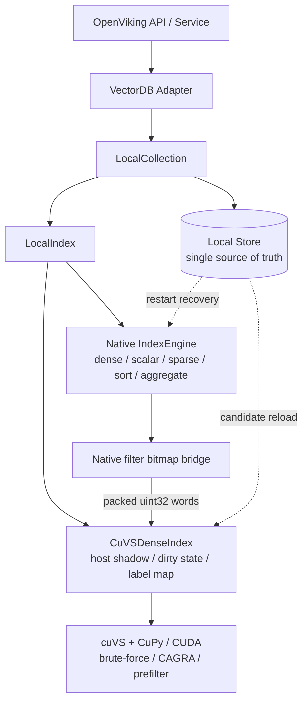
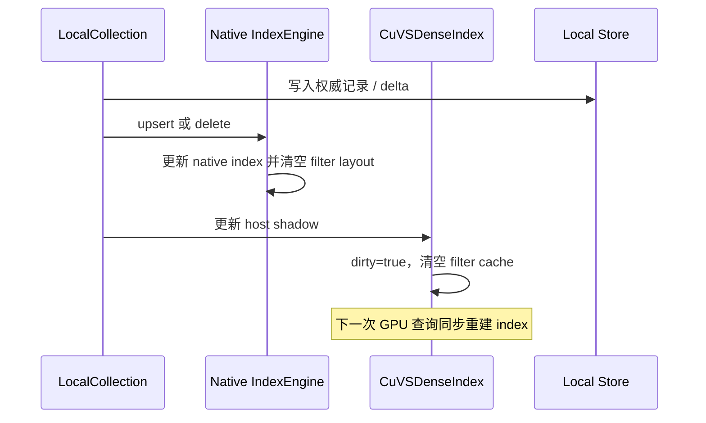
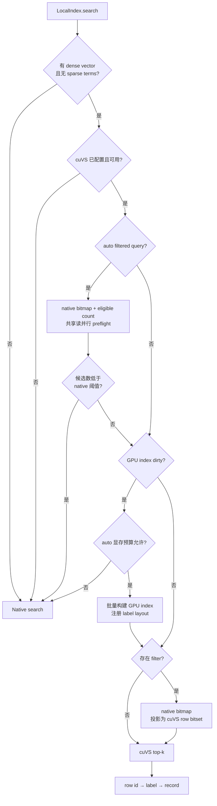

# OpenViking × cuVS 集成计划

> 状态：功能集成与第一轮向量索引验证已完成，后续进入数据面性能化阶段。
> 原则：cuVS 是可选的 dense-search sidecar，不改变 OpenViking 默认 CPU 行为。
> 相关文档：[benchmark 计划](./openviking-cuvs-benchmark-plan.md)、[初步结果](../../benchmark/cuvs/PRELIMINARY_RESULTS.md)、[用户指南（中文）](../zh/guides/16-cuvs.md)、[User guide (English)](../en/guides/16-cuvs.md)。

## 1. 目标

本集成只替换 OpenViking 本地 VectorDB 的 dense vector search 执行器，继续复用现有的：

- 权威记录存储和持久化恢复；
- scalar/path index 与过滤 DSL；
- sparse/hybrid retrieval；
- sort、aggregate、label mapping 和结果回表；
- upsert、delete 和 collection 生命周期。

当前阶段需要做到：

1. 通过显式配置启用 cuVS，不改变上层检索 API 和默认 `local` 行为；
2. pure dense query 能进入 cuVS brute-force 或 CAGRA；
3. cosine、inner product 和 L2 的返回分数保持现有接口语义；
4. scalar、URI/path 和组合过滤复用 native 语义，并作为 cuVS 前置过滤；
5. upsert、delete、重启恢复后结果正确；
6. 显存不足或 GPU 不可用时，auto 模式安全保留 native 路径；
7. 用可复现 benchmark 量化适用规模、过滤选择性、显存和 lifecycle 成本。

## 2. 非目标

本阶段不做以下扩展：

- 不把 cuVS 变成独立的完整数据库后端；
- 不移除或改写 OpenViking 原生 dense index；
- 不改变 native CPU index 的默认 int8 量化；
- 不把 cuVS 序列化文件作为权威持久化格式；
- 不实现多 GPU、跨机分片或共享 GPU 资源池；
- 不在功能版中承诺写密集 workload 的低延迟；
- 不用未过滤 top-k 后置过滤代替正确的 prefilter；
- 不把 CAGRA 的 ANN 结果描述为精确检索。

## 3. 核心决策

| 决策 | 选择 | 原因 |
| --- | --- | --- |
| 集成位置 | `LocalIndex.search()` 的 pure dense 分支 | 边界小，可复用 Store、恢复、过滤和回表 |
| 权威状态 | Local Store | GPU index 可随时由当前记录重建 |
| 默认算法 | cuVS brute-force | 适合功能对齐和 exact ground truth |
| ANN 算法 | CAGRA，显式开启 | 必须结合 Recall@K、延迟、build time 和显存评估 |
| mutation | host shadow 标脏，下一次查询全量重建 | 首先保证 upsert/delete 语义正确 |
| 过滤 | native bitmap 投影为 cuVS row bitset | 复用既有 DSL 和 scalar/path index，不重复实现语义 |
| 持久化 | 不持久化 cuVS index | 避免绑定 GPU、CUDA/cuVS 版本和序列化兼容性 |
| 默认 CPU dtype | 保持现有 per-vector-scale int8 | cuVS opt-in 不能改变未启用用户的行为 |
| GPU dtype | device dataset/query 默认 float32，可显式配置 float16 | host shadow 保存预处理后的 Python 浮点值；仅 device dataset/query 在创建时 cast 为配置 dtype；低精度按独立能力报告 Recall@K 和显存 |

## 4. 总体架构



一句话概括：OpenViking 管数据、生命周期和查询语义，cuVS 管 GPU dense top-k；两者通过 label layout 和 native filter bitmap 对接。

### 4.1 组件职责

| 组件 | 职责 | 当前状态 |
| --- | --- | --- |
| `VectorDBBackendConfig` / `CuVSConfig` | backend、算法、显存预算、路由阈值和 CAGRA 参数校验 | 已实现 |
| `CuVSCollectionAdapter` | 复用 local adapter，注入 cuVS dense-search 配置 | 已实现 |
| `LocalCollection` | schema、Store、delta、恢复和结果回表 | 复用原生 |
| `LocalIndex` | pure dense 路由、跨后端 mutation 一致性和 native fallback | 已扩展 |
| `CuVSDenseIndex` | host shadow、dirty lifecycle、label map、bitset cache 和 GPU index | 已实现 |
| `_CuVSRuntime` | 延迟导入 CuPy/cuVS，调用 brute-force/CAGRA build/search | 已实现 |
| Native `IndexEngine` | 完整 native 能力和 filter bitmap 生成 | 已扩展 bitmap bridge |
| ABI3 backend | 暴露 filter layout 注册与 bitmap projection | 已实现 |
| `StoreManager` | 权威记录、向量和字段存储 | 复用原生 |

### 4.2 数据所有权

| 状态 | 是否权威 | 生命周期 |
| --- | --- | --- |
| Local Store | 是 | 持久化，恢复从这里开始 |
| Native index | 否 | 由 snapshot + delta 维护，承担完整本地能力 |
| cuVS host shadow | 否 | 按 label 保存 dense vector 和重建所需记录 |
| cuVS GPU index | 否 | 首次查询或 dirty 后构建，进程退出即丢弃 |
| Device filter cache | 否 | LRU 缓存，mutation 时清空 |

OpenViking 主键按现有规则映射为 `uint64 label`。cuVS 返回 dataset row id，`CuVSDenseIndex` 再通过构建时的 label 数组映射回 OpenViking label，最后由 Collection 回表得到完整记录。

## 5. 核心链路

### 5.1 Upsert / delete



`LocalIndex` 使用跨后端读写锁覆盖 native mutation 和 cuVS shadow mutation，避免查询获得新 native bitmap 却使用旧 GPU row layout。warmed query 持有共享读锁并发搜索，mutation 和同步 rebuild 持有写锁。当前 mutation 后不增量修改 CAGRA，而是标脏并在下一次 dense 查询全量重建。

### 5.2 Dense query



显式 `backend=cuvs` 对支持的 pure dense query 固定使用 GPU，并在初始化或运行错误时 fail-fast。`auto_cuvs` 才执行显存准入和候选数路由。

### 5.3 Filter bitmap bridge

过滤路径不再扫描全部 Python records：

1. GPU rebuild 后调用 `set_filter_layout(ordered_labels)`；
2. native engine 将每个 cuVS row 预映射到 native logical offset；
3. 查询时 native filter parser 与 scalar/path index 计算原生 bitmap；
4. `evaluate_filter(dsl)` 按已注册 layout 投影，返回 packed `uint32` words 和 eligible count；
5. 宽过滤把 preflight words 直接交给 cuVS，通过 `filters.from_bitset()` 构造 prefilter，不重复计算 native bitmap；
6. 窄过滤由 native engine 返回一个有界、短生命周期的 bitmap token，CPU recall 直接复用；token miss 时安全回退到普通 search；
7. 相同 filter 复用 device bitset；mutation 同时使 layout、device cache 和 native token 失效。

auto 模式会在进入 cuVS search 前完成候选数 preflight。native engine 对
`evaluate_filter` 使用共享读锁，因此不同的首次过滤条件可以并行计算；layout 注册和
mutation 使用写锁。cuVS shadow 的 generation 校验会丢弃跨 mutation 得到的旧路由结果。

该 bridge 继承 native 对以下能力的处理：

- `and`、`or`；
- `must`、`must_not`；
- `contains`；
- `range`、`range_out`；
- URI/path prefix 和 depth；
- `date_time`、`geo_point` 等 native 字段转换语义。

bitmap 在 CPU 上生成是有意选择。native scalar/path index 已经维护了对应结构；把 URI DSL 解析、Trie 遍历和 bitmap union 搬到 GPU 会引入额外索引副本、同步和 kernel launch，而当前主要收益来自 GPU distance/top-k。只有 profiling 表明 bitmap 生成成为主要瓶颈时，才评估 GPU 化。

### 5.4 Restart recovery

1. 读取 collection 和 index metadata；
2. 恢复 native snapshot 并 replay delta；
3. 从 Store 读取当前 candidates；
4. 恢复 cuVS host shadow，但不立即构建 GPU index；
5. 第一次 pure dense query 按配置执行显存准入和 lazy build。

cuVS index 文件未来可以作为带严格版本约束的 cache，但不能成为事实来源。

## 6. 查询路由策略

### 6.1 能力路由

| 查询类型 | 执行路径 |
| --- | --- |
| pure dense，无 filter | cuVS 或 auto/native |
| pure dense + scalar/path filter | native bitmap → cuVS prefilter，或 auto 路由 native recall |
| sparse / hybrid | native |
| scalar sort / aggregate | native |
| 空数据集 / filter 无候选 | 返回空结果 |

不采用 post-filter。先取未过滤 top-k 再过滤，无法保证高选择性过滤后的结果数量和真实 top-k；无限 over-fetch 也不能提供稳定正确性。

### 6.2 Auto mode

auto 模式包含两层决策：

1. **Build admission**：根据空闲显存和保守峰值估算决定是否构建 GPU index；
2. **Per-query routing**：根据 native bitmap 返回的 eligible count 决定 filtered query 走 CPU 还是 GPU。

当前默认阈值：

| 配置 | 默认值 | 含义 |
| --- | ---: | --- |
| `auto_filter_native_threshold` | 2000 | 普通过滤候选数不超过该值时走 native recall |
| `auto_path_filter_native_threshold` | 200 | URI/path 过滤使用的更保守阈值 |

URI/path 使用更低阈值，是因为宽路径需要 native Trie traversal 和 subtree bitmap union；这个成本会先于 GPU search 发生。阈值设为 `0` 可关闭对应 native 路由。阈值是当前测量得到的默认值，不是跨硬件、维度和 workload 的常数。

候选数 preflight 和 native fallback 使用跨后端共享读锁，既保留 native engine
原有的读并发，也避免与 mutation 交错；相同 filter 的路由决策由 LRU 直接复用。

## 7. Dtype 与数值语义

### 7.1 当前边界

- native collection 默认保持 per-vector-scale int8；
- cuVS host shadow 保存预处理后的 Python 浮点值，不随 `dtype` 改写；
- 仅 cuVS device dataset/query 在创建时 cast 为配置的 `dtype`，默认是 float32，
  可显式配置为 float16；
- 启用 cuVS 不迁移、不重写 native index metadata；
- native fallback 始终使用原有 CPU representation；
- auto 模式可能按 query 在两种 representation 间路由。

因此：

- index-only exact benchmark 可显式使用 FP32 CPU / FP32 GPU 隔离 kernel；
- collection/service benchmark 必须说明是 native int8 / cuVS 配置的 float32 或 float16；
- 结果必须同时报告 Recall@K、显存和 host memory，不能声称 equal-dtype 或 equal-memory；
- 要求固定 numerical representation 的应用应选择显式 backend，或关闭 native 候选路由。

### 7.2 低精度路线

低精度 GPU 存储作为显式新能力实现，不做隐式 cast：

1. 先支持可配置的 float16 dataset/query；
2. 以 float32 brute-force 为 ground truth，测 Recall@K、延迟、吞吐和显存；
3. 再评估 CAGRA int8 或 VPQ；
4. native scaled-int8 若要求数值兼容，需要 scale-aware distance/top-k 或候选 rerank，不能直接 cast 成普通 int8。

## 8. 显存准入

当前保守估算包含：

- device vector payload 跟随配置的 dtype：float32 为 `N * dimension * 4`，
  float16 为 `N * dimension * 2`；
- CAGRA retained graph：约 `N * graph_degree * 4`；
- CAGRA build intermediate graph：约 `N * intermediate_graph_degree * 4`；
- device filter cache：每个 bitset 约 `N / 8`；
- 默认 `2.0` safety factor；
- 默认保留 1 GiB 空闲显存。

若预算不足，auto 模式本次查询走 native，并保留 dirty 状态供后续查询重试。显式 `backend=cuvs` 不经过该 gate。估算不是硬保证，allocator、build algorithm、batch 和并发 workload 都可能改变实际 peak；已准入后的 allocation failure 仍会在 auto 模式回退 native。

## 9. 配置

### 9.1 显式 cuVS backend

```json
{
  "storage": {
    "vectordb": {
      "backend": "cuvs",
      "distance_metric": "cosine",
      "cuvs": {
        "algorithm": "brute_force",
        "dtype": "float32",
        "max_concurrent_gpu_searches": 1,
        "fallback_to_native": true
      }
    }
  }
}
```

### 9.2 CAGRA

```json
{
  "storage": {
    "vectordb": {
      "backend": "cuvs",
      "cuvs": {
        "algorithm": "cagra",
        "build_params": {
          "graph_degree": 64,
          "intermediate_graph_degree": 128,
          "build_algo": "nn_descent"
        },
        "search_params": {
          "itopk_size": 64,
          "search_width": 1
        },
        "fallback_to_native": true
      }
    }
  }
}
```

### 9.3 保留 local 默认并自动启用

```json
{
  "storage": {
    "vectordb": {
      "backend": "local",
      "cuvs": {
        "auto_enable": true,
        "algorithm": "brute_force",
        "auto_memory_reserve_mb": 1024,
        "auto_memory_safety_factor": 2.0,
        "auto_filter_native_threshold": 2000,
        "auto_path_filter_native_threshold": 200,
        "filter_cache_size": 16,
        "auto_background_rebuild": true,
        "auto_rebuild_debounce_ms": 500
      }
    }
  }
}
```

### 9.4 配置语义

| 配置 | 默认值 | 说明 |
| --- | --- | --- |
| `algorithm` | `brute_force` | `brute_force` exact 或 `cagra` ANN |
| `dtype` | `float32` | GPU dataset/query dtype；可显式设为 `float16`，不改变 native CPU dtype |
| `max_concurrent_gpu_searches` | `1` | 单 index 同时进入 GPU search 的上限；host preflight/filter 仍可并行 |
| `micro_batching_enabled` | `false` | 可选地合并兼容的并发单 query 请求；仅支持 `brute_force`，且要求 `max_concurrent_gpu_searches=1` |
| `micro_batching_max_batch_size` | `8` | 单次 matrix-query 的最大行数，范围 1 到 8 |
| `micro_batching_max_wait_ms` | `1.0` | 等待兼容请求的 collection window，范围 0 到 100 ms；0 表示不主动等待、仅 opportunistic batching |
| `build_params` | `{}` | 传给 CAGRA `IndexParams` |
| `search_params` | `{}` | 传给 CAGRA `SearchParams` |
| `fallback_to_native` | `true` | sparse/hybrid 等非 cuVS dense top-k 能力使用 native |
| `auto_enable` | `false` | 在 `backend=local` 下按空闲显存自动启用 |
| `auto_memory_reserve_mb` | `1024` | auto admission 后保留的显存 |
| `auto_memory_safety_factor` | `2.0` | 已知 allocation 的峰值安全系数 |
| `auto_filter_native_threshold` | `2000` | auto 普通过滤 native 路由阈值 |
| `auto_path_filter_native_threshold` | `200` | auto URI/path native 路由阈值 |
| `filter_cache_size` | `16` | device bitset 或 native 路由决策的 LRU 大小 |
| `auto_background_rebuild` | `false` | auto 模式合并 mutation 并在后台构建新 snapshot；dirty 期间查询走 native |
| `auto_rebuild_debounce_ms` | `500` | 后台 rebuild 前用于合并连续 mutation 的静默窗口 |

依赖安装方式和 CUDA 12/13 wheel 选择见中英文用户指南，不在本计划中复制易过期的版本命令。

## 10. 一致性、并发与错误策略

### 10.1 当前保证

- 顺序 upsert/delete 返回后，下一次 GPU dense query 会先重建，提供 read-after-write；
- native mutation 与 cuVS shadow mutation 由跨后端读写锁协调；filter layout 和 bitmap
  preflight 由 native engine 读写锁及 cuVS generation 校验保证一致性；
- GPU index、dataset ownership、label mapping 和 generation 组成 immutable snapshot；
- 默认非 micro-batch 路径可使用复用的 cuVS resources/CUDA stream；启用 micro-batching 后，
  compatible warm query 可在不获取 caller 侧 device gate 的情况下入队，micro-batch worker
  是唯一在持有 device-search gate 时执行 matrix search 的组件；
- dirty/cold snapshot、device filter cache miss 和 rebuild 仍在同一 gate 内完成 GPU preparation，
  caller 入队后立即释放 gate，不会持 gate 等待 worker；
- mutation 不会破坏已被查询持有的 snapshot；同步 rebuild 仍由写锁合并为一次；
- 同一 GPU 上不同 collection 的 admission/build 由进程级 coordinator 串行，避免并发超卖显存；
- native fallback 不持有 GPU 锁，可以继续并发读取；
- 边界明确的多调用 bulk ingest 可显式延迟 derived GPU maintenance；native/store 仍逐批
  可见，最外层 scope 退出后只调度一次 rebuild，该 scope 不提供事务或原子性；
- background worker 在 debounce 到期、candidate build 后和 commit 前都校验 generation；
  index 替换会先继承 bulk suspension、停止旧 maintenance worker，再启动新 worker；
- Store 是最终事实来源，重启后派生状态会重新收敛。

### 10.2 错误矩阵

| 场景 | 显式 `backend=cuvs` | Auto mode |
| --- | --- | --- |
| cuVS/CuPy 缺失或无 CUDA device | 初始化失败 | 保留 native |
| 向量维度错误 | 显式报错 | 显式报错 |
| 显存预算不足 | 不适用预算 gate | 本次查询 native，后续重试 |
| GPU allocation failure | 异常上抛 | 释放资源并回退 native |
| GPU build/search 其他异常 | 异常上抛 | 异常上抛 |
| sparse/hybrid | `fallback_to_native=true` 时 native | native |
| 空数据集 / filter 无候选 | 空结果 | 空结果 |

### 10.3 已知事务窗口

写链路仍跨 Store、native index 和 cuVS shadow。若进程在中间退出，重启会从 Store 收敛；若进程不退出且 shadow mutation 抛错，内存派生状态可能暂时分叉。后续可用统一 mutation journal、失败后强制 reload，或构建新 snapshot 后原子交换封闭窗口。

## 11. 当前限制

| 限制 | 影响 | 后续方向 |
| --- | --- | --- |
| 每次 mutation 后整体重建 | 写后首查和 build 为 O(N) | base + delta、阈值重建、后台 build、原子切换 |
| host shadow 保存完整 dense vectors | Store/native/GPU 之外增加 host memory | 连续 buffer、共享内存、减少 Python object |
| 高并发小 query | 已有 opt-in micro-batching，但仍有每次 dispatch 的 device allocation、host sync 和单 worker 上限 | persistent buffers、allocator reuse、CAGRA batching 或多个并行 batch dispatch |
| Python/CuPy 数据面 | 对象构造、复制和同步有固定开销 | 先 profiling，再决定是否下沉 C++ cuVS C API |
| 重启后 lazy rebuild | 大 collection 的首次查询延迟高 | 后台预热、版本化派生 cache |
| native dense 与 GPU shadow 并存 | CPU 内存和写放大 | 覆盖率和回退策略稳定后再评估裁剪 |
| CPU int8 / GPU float32 或 float16 | 数值和内存语义不同 | 明确报告 dtype、Recall@K 和两侧 memory |
| auto admission 是估算 | 实际 peak 随 allocator 和 workload 波动 | telemetry、校准 safety factor、OOM fallback |
| 路由阈值来自当前 workload | 不能直接泛化 | 按规模、维度、filter type 做自适应或离线调参 |

## 12. 实施阶段

### Phase 0：功能集成 — 已完成

- cuVS backend 与 local adapter 复用；
- brute-force / CAGRA；
- host shadow 与 lazy dirty rebuild；
- native bitmap bridge 与 cuVS prefilter；
- memory-aware auto admission；
- filtered-query candidate routing；
- mutation、delete、restart 和错误路径测试；
- 中英文用户文档和 smoke example。

### Phase 1：向量索引与 collection benchmark — 进行中

- 公共 ANN dataset 的 FP32 exact 和 CAGRA recall frontier；
- 100K/1M、768D/1024D exact scaling；
- collection-level filter selectivity；
- first filter、cached filter 和 URI subtree 成本；
- retained VRAM、build、restart 和 mutation rebuild。

完整矩阵与已有数据分别记录在 benchmark 计划和初步结果文档中。

### Phase 2：数据面并发与 lifecycle 优化

优先级顺序：

1. 已将可搜索 GPU index 变成 immutable snapshot；
2. 已保证 in-flight query 在 rebuild 期间安全持有旧 snapshot；后台 build 期间的新请求路由仍待实现；
3. 已实现完成后原子交换，并延迟到最后一个持有者退出再回收旧资源；
4. 已实现可选的连续 mutation 合并与后台 rebuild；默认关闭以保留现有 auto 行为；
5. 已实现可复用 cuVS resources/CUDA stream，以及默认关闭的 brute-force request
   micro-batching 和 warm admission fast path；persistent query/result buffers、allocator reuse、
   CAGRA batching 和多个并行 batch dispatch 待评估；
6. 已补充 build queue、fallback reason、eligible count 和分阶段 latency telemetry；VRAM 指标待统一管理器。

### Phase 3：容量与低精度

- 已实现显式 float16 brute-force/CAGRA 路径；recall/latency/VRAM 矩阵待补齐；
- CAGRA int8 或 VPQ frontier；
- 大 collection 的 host shadow 内存优化；
- 根据 benchmark 决定 CAGRA 启用规模和参数策略。

### Phase 4：更深层集成 — 按收益决定

只有 Python/CuPy 数据面被证明是主要瓶颈时，才评估：

- cuVS C API 接入 native C++ engine；
- 共享 CUDA resource、stream 和 memory pool；
- 多 GPU、分片和 collection 资源隔离；
- 受 GPU/CUDA/cuVS 版本约束的持久化派生 cache。

## 13. 验收标准

### 13.1 功能正确性

- brute-force 和 CAGRA 在真实 GPU runtime 上可构建、查询和重建；
- cosine/IP/L2 的 score mapping 符合 OpenViking 接口；
- scalar + URI 组合过滤结果不越权；
- arbitrary cuVS row order 能正确映射 native bitmap；
- upsert 后新值可检索、delete 后旧值不可检索；
- persistent collection reopen 后可以由 Store 恢复并重建；
- explicit/auto backend 的失败策略符合错误矩阵；
- 默认 `backend=local` 和 native dtype 不受影响。

### 13.2 性能报告

每组结果至少包括：

- dataset、dimension、N、metric、K 和 query batch；
- native/GPU dtype 与 normalization；
- build time、cold first query、warm p50/p95/p99 和 QPS；
- Recall@K；
- host RSS、retained VRAM，能测量时增加 peak VRAM；
- filter 类型、selectivity、eligible count 和 route；
- mutation size、write latency 与 next-query rebuild latency；
- 硬件和公开软件版本。

### 13.3 当前验证状态

- 目标 VectorDB 单元/集成测试通过；
- stable-ABI loader 测试通过；
- standalone C++ engine bitmap projection 测试通过；
- native bitmap token 复用、mutation 失效及旧 ABI fallback 测试通过；
- brute-force/CAGRA GPU smoke 覆盖组合过滤、update、delete 和 rebuild；
- Python lint、C++ syntax 和 diff check 通过；
- 提交前扫描 staged/committed diff，不允许包含凭据、私钥或非公开环境标识。

## 14. 代码映射

| 文件 | 职责 |
| --- | --- |
| `openviking/storage/vectordb/index/cuvs_index.py` | runtime、host shadow、native bitmap 消费、cache、build/search 和 score mapping |
| `openviking/storage/vectordb/index/local_index.py` | dense 路由、跨后端 mutation lock、native fallback |
| `openviking/storage/vectordb/collection/local_collection.py` | 传递配置，恢复时注入当前 candidates |
| `openviking/storage/vectordb_adapters/local_adapter.py` | cuVS adapter 与 auto 配置 |
| `openviking/storage/vectordb_adapters/factory.py` | 注册 `backend=cuvs` |
| `openviking_cli/utils/config/vectordb_config.py` | 强类型 cuVS 配置 |
| `src/index/detail/index_manager_impl.cpp` | label layout 与 native bitmap projection |
| `src/abi3_engine_backend.cpp` | filter bridge 的稳定 Python ABI |
| `examples/cuvs_smoke.py` | 真实 GPU 最小功能验证 |
| `benchmark/cuvs/` | index、collection、service benchmark 与结果汇总 |
| `tests/vectordb/test_cuvs_index.py` | cuVS index、filter cache、路由和错误测试 |
| `tests/vectordb/test_cuvs_collection.py` | collection、auto mode、mutation 和恢复集成测试 |
| `tests/engine/test_index_engine.cpp` | native bitmap 的外部 row-order projection 测试 |

## 15. 待评审问题

1. 目标 workload 的向量维度、单 collection 规模、collection 数量和更新比例是什么？
2. tenant/URI filter 的真实选择性分布和重复率是什么？
3. 生产目标更重视单请求 P95，还是多请求 aggregate throughput？
4. CAGRA 可以接受的 Recall@K、build time 和最低启用规模是什么？
5. 写后查询是否允许读取旧 GPU snapshot，还是必须同步等待最新 snapshot？
6. 多 collection 是否共享 CUDA stream/memory pool，如何设置隔离与显存限额？
7. native dense 副本需要永久保留，还是在 cuVS 覆盖率稳定后允许按配置裁剪？

## 16. 参考资料

- [OpenViking](https://github.com/volcengine/OpenViking)
- [NVIDIA RAPIDS cuVS](https://github.com/rapidsai/cuvs)
- [cuVS Getting Started](https://docs.rapids.ai/api/cuvs/stable/getting_started/)
- [cuVS brute-force Python API](https://docs.rapids.ai/api/cuvs/stable/python_api/neighbors_brute_force/)
- [cuVS CAGRA Python API](https://docs.rapids.ai/api/cuvs/stable/python_api/neighbors_cagra/)
- [cuVS filtering](https://docs.rapids.ai/api/cuvs/stable/filtering/)
