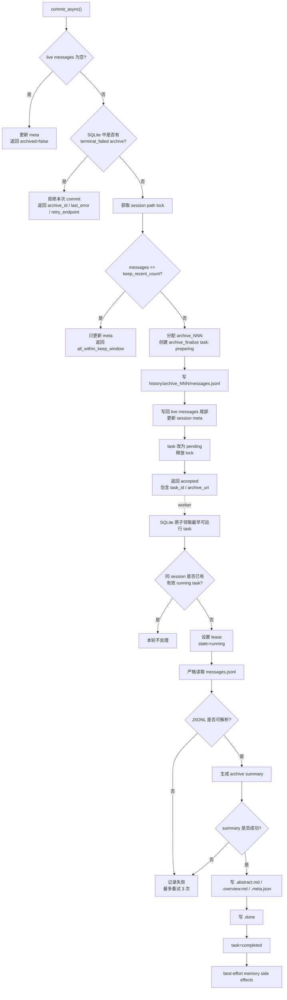

# Session Archive Finalize Recovery

## 结论

问题的核心不是 `.failed.json` 文件本身，而是 archive finalize 这一步过去只靠进程内后台任务承载。`commit_async()` 写出 `history/archive_NNN/messages.jsonl` 后，如果进程重启、后台任务丢失、summary 生成持续失败，archive 就可能长期没有 `.done`，后续 archive 再按顺序等待它，最终整个 session 的归档体验被卡住。

这次实现采用一个简版设计：常规路径信任 SQLite task log，不在启动或 commit 时全量扫描 `history`。commit 只负责把 archive 原文和 finalize task 持久化；后台 worker 从 SQLite 领取 task，生成 `.overview.md`、`.abstract.md`、`.meta.json`，最后写 `.done`。如果 finalize 连续 3 次失败，task 进入 `terminal_failed`，后续 commit 明确报错并给出 retry endpoint。用户或运维修复外部问题后，可以手动 retry 这个 archive；retry 会把 task 重置为 pending，再由 worker 重新 finalize。

`.failed.json` 只保留为诊断文件，不再作为常规 commit 的判定来源。也就是说，系统不因为看到历史目录里的 `.failed.json` 就扫描并永久阻塞，而是看 SQLite 里这个 archive 的 task 状态。memory extraction 也不再决定 `.done`；archive summary 成功后就写 `.done`，memory 相关副作用失败只记录日志，不阻塞后续归档。

## 目标流程



## 真实 Case

服务重启导致任务丢失时，目录可能是这样：

```text
history/
  archive_001/
    messages.jsonl
    .overview.md
    .abstract.md
    .meta.json
    .done
  archive_002/
    messages.jsonl
```

旧行为的问题是 `archive_002` 没有 `.done`，但进程内后台任务已经没了。新的行为里，`archive_002` 创建时已经有 SQLite task。服务恢复后，worker 看到这个 task 仍是 `pending`，或者之前是 `running` 但 lease 已过期，就重新领取并补齐 `.overview.md`、`.abstract.md`、`.meta.json`、`.done`。这里不需要启动时扫所有 session 的 `history`，也不需要从目录结构反推任务。

如果外部模型持续失败，例如 summary 连续报：

```text
archive_summary_failed: provider timeout
```

worker 会把同一个 task 重试到第 3 次。第 3 次仍失败后，SQLite 状态变成 `terminal_failed`，并写诊断：

```text
archive_002/
  messages.jsonl
  .failed.json
```

后续再 commit 这个 session 时，系统不会静默跳过，也不会写一个假的 summary，而是返回明确错误：`archive_002` finalize 已失败 3 次，需要先调用 `/api/v1/sessions/{session_id}/archives/archive_002/retry`。手动 retry 会重置 attempts 和错误信息，创建新的 task tracker id，然后 worker 重新从 `messages.jsonl` finalize。成功后目录变成：

```text
archive_002/
  messages.jsonl
  .overview.md
  .abstract.md
  .meta.json
  .done
  .failed.json   # 仅历史诊断，不参与常规判定
```

如果 `messages.jsonl` 本身损坏，例如 JSONL 半截中断，worker 严格解析时也会失败。它同样按 3 次失败进入 `terminal_failed`，后续 commit 被明确阻塞，直到人工修复这个文件后手动 retry。当前版本不做自动 quarantine，也不提供“跳过坏 archive 继续”的默认路径，因为这会制造上下文缺口，而且复杂度高于当前需要。

## 实现要点

SQLite 表 `session_archive_finalize_tasks` 存 archive finalize 状态，主键是 `(account_id, user_id, session_id, archive_id)`。关键字段包括 `state`、`attempt_count`、`task_tracker_id`、`archive_uri`、`lease_owner`、`lease_until`、`last_error` 和 `usage_records_json`。

状态流转保持简单：

```text
preparing -> pending -> running -> completed
                         |
                         +-> retry -> running
                         |
                         +-> terminal_failed
```

`preparing` 用来覆盖 commit 写 archive 过程中进程退出的情况。正常 commit 会在写完 `messages.jsonl`、live tail 和 meta 后把 task 改成 `pending`。worker 领取 task 时用 SQLite 原子更新设置 lease，同一个 session 同一时间只允许一个有效 `running` finalize。后续 archive 可以先被 commit 写入并入队，但 finalize 顺序由 worker 保证。

手动 retry 只对 `terminal_failed` task 生效。如果 task 已经 `completed`，接口返回 `already_completed`；如果 task 仍在有效 `running` lease 内，接口返回当前 running 状态；如果 task 不存在但 archive 的 `messages.jsonl` 存在，接口可以补一条 pending task，用于修复历史版本遗留的孤儿 archive。

## 非目标

当前版本不做启动全量扫描 `history`，不做自动 quarantine，不做静默 skip，不写 fallback summary。memory extraction 也不拆成独立持久化 task；它只是从 `.done` 语义里解耦，作为 archive 完成后的 best-effort 副作用执行。
