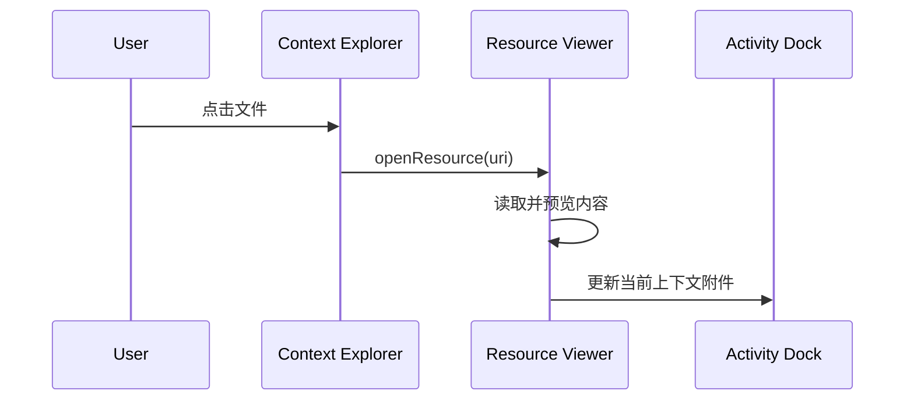
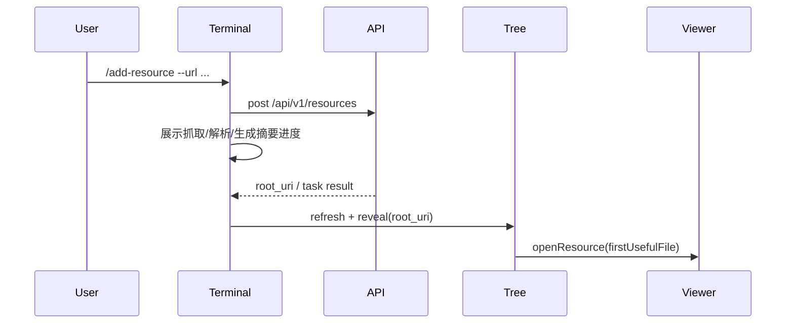
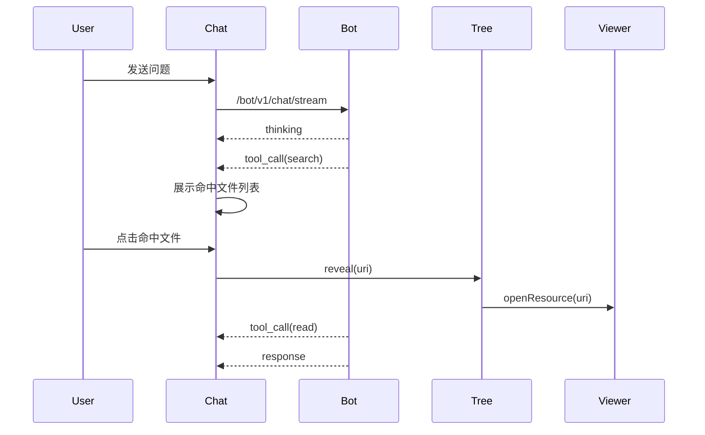

# Studio 上下文工作台产品交互方案

**状态**: Draft
**范围**: OpenViking Web Studio 的上下文管理、Terminal、Agent 会话联动体验。
**参考 Demo**: https://lilima-uxdesign.github.io/openviking-demo/

---

## 背景

当前 Studio 已经具备上下文管理、检索、会话等能力，但它们主要以独立页面存在：

1. 上下文管理页可以浏览 `viking://` 目录与预览文件。
2. 检索页可以返回资源命中结果。
3. 会话页可以和 bot 对话并展示 tool call。

问题在于这些能力之间缺少稳定联动。Agent 调用工具、添加资源、搜索命中文件、递归读取文档时，用户无法在同一屏内看到“动作发生在哪里、读了哪些文件、生成了哪些资源”。这会削弱 OpenViking 的核心卖点：上下文是可寻址、可追踪、可解释的文件系统。

目标是把 Studio 从“多个功能页面”升级成“上下文工作台”：左侧展示上下文目录结构，中间展示当前资源内容，右侧展示 Terminal 和 Agent 的动作流。所有动作都能回到左侧目录树定位，并在中间打开对应文件。

---

## Demo 交互拆解

Demo 的核心体验不是单纯三栏布局，而是三栏之间的因果关系：

| 区域 | Demo 中的角色 | 关键价值 |
| --- | --- | --- |
| 左侧目录树 | `User / Session / Agent / Resources` 上下文地图 | 让用户看到所有上下文位置与层级 |
| 中间预览区 | 当前选中文件或目录详情 | 让用户确认当前上下文内容 |
| 右侧动作区 | Terminal / Chat 两种入口 | 让用户看到 Agent 如何操作上下文 |

### 左侧目录树

左侧不是普通文件列表，而是 Agent 可操作上下文的地图。

Demo 中有几个细节值得保留：

1. 顶层固定展示 `User`、`Session`、`Agent`、`Resources` 四类命名空间。
2. 每个顶层节点带一句解释，帮助用户理解上下文类型。
3. `Resources` 下展示项目目录，例如 `openviking-project`。
4. 文件名旁展示 L0 / L1 / L2 标签。
5. 新增资源后，树会出现新目录和新生成文件，并自动展开。
6. 点击右侧输出中的文件链接后，左侧对应节点高亮。

### 中间预览区

中间区域是当前资源的详情页，承担“确认上下文内容”的职责。

Demo 中的有效细节：

1. 顶部显示完整路径面包屑，例如 `viking://resources/openviking-sdk/sdk-guide.md`。
2. 路径右侧提供复制按钮。
3. 文件内容顶部显示 L0 / L1 / L2 标签。
4. 未选中文件时显示空态，而不是列表页。
5. 中间预览区不跟随右侧消息流滚动，保持稳定。

### 右侧 Terminal / Chat

右侧是所有动作的执行与解释区域。

Terminal 适合确定性命令：

1. `/status`: 检查 Agent 服务状态。
2. `/search`: 在上下文库中搜索。
3. `/find`: 精确查找文件或目录。
4. `/read`: 读取指定资源。
5. `/add-resource`: 添加外部资源。

Chat 适合自然语言任务：

1. 支持把当前选中文件或目录作为附件。
2. 展示 user message。
3. 展示 Agent thinking。
4. 展示 tool call 卡片。
5. 展示 tool result 中的资源链接。
6. 展示最终回答。

Demo 中最关键的交互是：工具调用结果里的文件条目是可点击按钮，例如 `_abstract.md · L0 · 相似度 0.94`。点击后左侧定位，中间打开对应文件。这比只在 tool result 里展示文本更能体现 OpenViking 的可追踪性。

---

## 产品目标

1. 让用户在一个工作台内完成浏览、检索、添加资源、Agent 问答。
2. 让 Agent 的工具调用可视化，明确展示读了哪些文件、生成了哪些资源。
3. 让所有 `viking://` URI 都可点击、可定位、可预览。
4. 让 L0 / L1 / L2 分层加载过程在 UI 中可观察。
5. 让 Terminal 和 Chat 共享同一个上下文选择状态。

## 非目标

1. 首版不做真实本机 shell。Terminal 是 OpenViking CLI 风格命令面板，只操作 OpenViking 上下文。
2. 首版不重做所有现有页面。优先建立工作台体验，再逐步吸收资源、检索、会话页面。
3. 首版不要求后端提供所有实时 tree patch。可以先完成最终态刷新，再逐步增强进度流。
4. 首版不做多人协同编辑。

---

## 信息架构

建议新增一个 Studio 工作台入口，可命名为“工作台”或直接替代“上下文管理”主入口。

```
OpenViking Studio
├── 首页
├── 上下文工作台
│   ├── Context Explorer
│   ├── Resource Viewer
│   └── Activity Dock
├── 检索
├── 请求日志
├── 会话
└── 连接与身份
```

其中“上下文工作台”承担主要使用路径。原 `resources`、`retrieval`、`sessions` 可继续保留，避免一次性迁移过大。

---

## 页面布局

### 桌面端

采用四层结构：

1. AppShell 全局导航。
2. 工作台主体容器。
3. 左中右三栏。
4. 右侧 Dock 内部的 Terminal / Chat tabs。

推荐比例：

| 区域 | 宽度建议 | 说明 |
| --- | --- | --- |
| 左侧 Context Explorer | 280-360px，可拖拽 | 保证深层路径可读 |
| 中间 Resource Viewer | 自适应，最小 420px | 作为主内容区 |
| 右侧 Activity Dock | 360-440px，可折叠 | 容纳工具调用与对话 |

### 移动端

移动端不强行保持三栏并排。

建议使用三段式：

1. 顶部 tabs: `目录` / `预览` / `动作`。
2. 默认进入 `预览`，如果没有选中文件则进入 `目录`。
3. Chat 输入时自动切到 `动作`，点击资源链接后切到 `预览`。

---

## 核心交互流程

### 流程 1：点击目录树文件



预期行为：

1. 左侧文件高亮。
2. 左侧祖先目录保持展开。
3. 中间打开文件。
4. 右侧 Chat 输入框展示当前文件或目录附件。

### 流程 2：Terminal 添加资源



预期行为：

1. Terminal 显示命令回显。
2. 命令执行中显示分步状态。
3. 完成后左侧新增目录并展开。
4. 如果返回了生成文件，优先打开 L1 或 L2 文件；否则打开新增目录。
5. Terminal 输出中的 `viking://...` 可点击。

### 流程 3：Chat 提问并展示工具调用



预期行为：

1. Thinking 可折叠。
2. Tool call 卡片有清晰状态：running / completed / failed。
3. 搜索结果以文件按钮展示，包含名称、层级、相似度。
4. `read` 工具展示读取文件、tokens、耗时。
5. 最终回答下方可以显示“本次使用上下文”摘要。

### 流程 4：检索结果联动

如果用户仍在独立检索页使用搜索，点击结果也应进入工作台并定位文件：

```
/retrieval result click
  -> navigate /studio?uri=viking://resources/project/&file=viking://resources/project/a.md
  -> Context Explorer 展开并高亮
  -> Resource Viewer 打开文件
```

---

## 右侧动作流设计

### Terminal 面板

Terminal 面板建议保留命令感，但不要伪装成完整 shell。

命令输入区：

1. 支持 slash command。
2. 支持快捷 chips。
3. 支持上下方向键浏览历史。
4. 支持命令执行中禁用重复提交。

命令输出区：

| 输出类型 | 展示方式 |
| --- | --- |
| 普通文本 | monospace block |
| 资源 URI | 可点击 link/button |
| 文件列表 | compact result list |
| 进度 | step list |
| 错误 | error block + request id |

### Chat 面板

Chat 面板不再只是消息列表，而是 Agent action timeline。

消息类型：

1. User message。
2. Thinking block。
3. Tool call block。
4. Tool result block。
5. Answer block。
6. Cost / token summary。

Tool call 卡片建议字段：

| 字段 | 示例 |
| --- | --- |
| 工具名 | `openviking_search` |
| 状态 | `running / completed / failed` |
| 输入 | `query`, `scope`, `level_filter` |
| 资源引用 | `viking://resources/...` |
| 耗时 | `240ms` |
| tokens | `287 tokens` |

---

## 资源链接规则

所有以下位置出现的资源都应该可点击：

1. Terminal 输出。
2. Chat 文本。
3. Tool input。
4. Tool result。
5. Search result。
6. Read result。
7. Add resource result。
8. Session 历史消息中的 context part。

点击规则：

| URI 类型 | 行为 |
| --- | --- |
| 目录 URI，以 `/` 结尾 | 左侧展开并选中目录，中间展示目录 L0/L1 |
| 文件 URI | 左侧展开祖先目录并高亮文件，中间读取文件 |
| 不存在 URI | 尝试 stat；失败后显示 toast，并保留原链接 |
| 外部 URL | 新窗口打开，不进入资源树 |

---

## 状态与反馈

### 选中状态

同一时间只有一个 active resource：

1. 左侧高亮 active resource。
2. 中间展示 active resource。
3. 右侧输入框可附加 active resource。

### 新增状态

新增资源后的短期状态：

1. 新目录显示 `new` 或轻量高亮。
2. 新生成文件显示短暂淡入效果。
3. 右侧 Terminal / Chat 显示“Resource added”。

### Loading 状态

资源读取和目录展开分别处理：

1. 目录展开 loading 不阻塞中间预览。
2. 文件读取 loading 只影响中间预览。
3. 右侧工具执行 loading 不阻塞左侧浏览。

### Error 状态

错误需要带可行动作：

| 场景 | 展示 |
| --- | --- |
| 目录读取失败 | Retry 按钮 |
| 文件读取失败 | Retry + copy URI |
| 工具调用失败 | request id + retry command |
| 添加资源失败 | 展示失败阶段和原始 URL |

---

## 验收标准

首版可以按以下标准验收：

1. 打开工作台后能看到左中右三栏。
2. 点击左侧文件，中间能预览内容。
3. 中间当前文件能同步到右侧 Chat 附件。
4. Terminal 执行 `/search` 后，结果文件可点击定位。
5. Terminal 执行 `/add-resource` 后，左侧目录刷新并定位新增资源。
6. Chat 工具调用中的资源结果可点击定位。
7. 从旧检索页点击资源结果，可以进入工作台并打开对应文件。

---

## 分阶段落地

### Phase 1：工作台骨架与资源联动

目标：先让三栏结构跑通。

范围：

1. 新增工作台页面。
2. 抽出共享 resource navigator。
3. 复用现有文件树和预览。
4. 支持 URL query 定位。
5. 支持 Chat 附件展示当前资源。

### Phase 2：Terminal 命令面板

目标：把 OpenViking 上下文操作集中到右侧 Terminal。

范围：

1. `/status`
2. `/search`
3. `/find`
4. `/read`
5. `/add-resource`

### Phase 3：Agent 工具调用联动

目标：让 tool call 成为可点击、可解释的动作流。

范围：

1. tool call 卡片改造。
2. 从输入/输出中抽取资源引用。
3. 搜索/读取/添加资源工具结果结构化展示。
4. 点击资源定位左侧并打开中间预览。

### Phase 4：后端结构化事件增强

目标：减少前端解析字符串，提高准确性。

范围：

1. bot stream 返回结构化 `tool_call` / `tool_result` payload。
2. 工具结果提供 `resource_refs`、`read_uris`、`created_uris`。
3. `add_resource` 支持进度事件或 task polling 详情。

---

## 待确认问题

1. 工作台入口是否替代现有“上下文管理”，还是先新增“工作台”入口。
2. Terminal 是否需要支持命令历史持久化。
3. Chat 是否默认附加当前文件，还是只附加当前目录。
4. `add-resource` 过程中是否必须做到实时 tree patch，还是首版接受完成后刷新。
5. 移动端首版是否需要完整适配，还是先保证桌面端。
