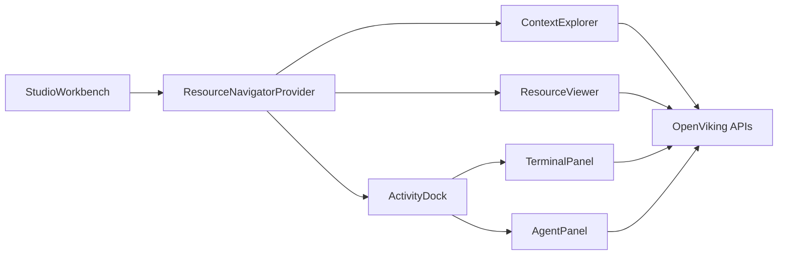

# Studio 上下文工作台技术实现方案

**状态**: Draft
**范围**: Web Studio 左中右工作台、资源定位联动、Terminal 命令面板、Agent tool call 可点击资源引用。

---

## 背景

产品目标是让 Studio 以左中右三栏展示上下文目录、资源预览、Terminal/Agent 动作流，并让所有 `viking://` 文件引用都能点击定位到左侧目录树，同时在中间自动打开。

当前代码已经具备部分基础能力：

1. `web-studio/src/routes/resources/-components/viking-file-manager.tsx` 管理目录树、选中文件、预览区。
2. `web-studio/src/routes/resources/-components/file-tree.tsx` 递归展示 `viking://` 树。
3. `web-studio/src/routes/resources/-components/file-preview.tsx` 读取并渲染文件内容。
4. `web-studio/src/routes/resources/-lib/api.ts` 封装 `fs/ls`、`fs/tree`、`content/read`、`content/write` 等 API。
5. `web-studio/src/routes/sessions/-components/message-parts.tsx` 已有 tool call 展示，但目前只展示 JSON/text。
6. `web-studio/src/lib/sessions/use-chat.ts` 已消费 `/bot/v1/chat/stream`，但 tool call/tool result 目前主要靠字符串解析。

因此技术方案重点不是重写资源管理器，而是把现有能力拆出共享状态和可复用组件，再接入 Terminal 和 Agent 动作流。

---

## 当前实现盘点

### 资源管理器

当前资源页入口：

| 文件 | 职责 |
| --- | --- |
| `src/routes/resources/route.tsx` | `/resources` layout，提供 `ResourceUploadProvider` |
| `src/routes/resources/index.tsx` | 解析 `uri/file/upload` search 参数，渲染 `VikingFileManager` |
| `src/routes/resources/-components/viking-file-manager.tsx` | 目录树、文件预览、上传弹窗、搜索 palette 的组合容器 |
| `src/routes/resources/-components/file-tree.tsx` | 懒加载递归目录树 |
| `src/routes/resources/-components/file-preview.tsx` | 文件和目录预览 |
| `src/routes/resources/-hooks/viking-fm.ts` | React Query hooks |
| `src/routes/resources/-lib/api.ts` | OpenViking FS/content API 封装 |

已有能力：

1. 支持 `initialUri`、`initialFile`。
2. 支持展开目录和选中文件。
3. 支持通过 query 参数从其他页面跳转打开资源。
4. 支持目录 L0/L1 预览、文件内容预览。
5. 支持上传/添加资源后的列表 invalidation。

当前限制：

1. `VikingFileManager` 是页面级大组件，状态没有暴露给其他区域复用。
2. `FileTree` 不支持外部 imperative reveal，只能由父组件传入状态。
3. `expandedKeys`、`selectedFile`、`currentUri` 只在资源页内部。
4. 右侧会话和资源页互相不知道对方状态。

### 会话与 Agent

当前会话链路：

| 文件 | 职责 |
| --- | --- |
| `src/routes/sessions/index.tsx` | 会话页面 |
| `src/routes/sessions/-components/thread.tsx` | chat 容器、streaming 状态、输入框 |
| `src/routes/sessions/-components/message-list.tsx` | 消息列表渲染 |
| `src/routes/sessions/-components/message-parts.tsx` | Markdown、reasoning、tool call |
| `src/lib/sessions/use-chat.ts` | SSE 消费与消息组装 |
| `src/lib/sessions/api.ts` | session CRUD、message、bot stream API |

当前限制：

1. `ToolCallBlock` 只接收 `toolName/args/result`，没有资源引用模型。
2. streaming `tool_call` 事件是字符串，前端用 `tool_name({...args})` 形式解析。
3. streaming `tool_result` 是纯文本，无法可靠区分文件路径、搜索结果、新增资源。
4. session history 的 `ToolPart` 类型没有完整覆盖后端已有 externalized output 字段。

### 后端接口

当前可直接复用的 HTTP API：

| API | 用途 |
| --- | --- |
| `GET /api/v1/fs/ls` | 列目录 |
| `GET /api/v1/fs/tree` | 按深度取目录树 |
| `GET /api/v1/fs/stat` | 判断文件/目录状态 |
| `GET /api/v1/content/read` | 读文件 L2 内容 |
| `GET /api/v1/content/abstract` | 读 L0 |
| `GET /api/v1/content/overview` | 读 L1 |
| `POST /api/v1/search/find` | 精确/语义 find |
| `POST /api/v1/search/search` | 上下文检索 |
| `POST /api/v1/resources` | 添加资源 |
| `POST /bot/v1/chat/stream` | Agent streaming |

后端已有 `ToolPart` 字段比前端类型更丰富，包括：

1. `tool_output_ref`
2. `tool_output_truncated`
3. `tool_output_storage_uri`
4. `tool_output_source_ref`
5. `tool_output_source_offset`
6. `tool_output_source_limit`

这些字段后续可以用于展示“完整结果在何处”，并支持点击回溯。

---

## 总体架构



核心思想：

1. 新增工作台页面作为组合层。
2. 把资源导航状态提升到 `ResourceNavigatorProvider`。
3. 左侧目录树、中间预览、右侧 Terminal/Agent 都通过同一套 navigator 打开资源。
4. 所有 `viking://` 点击入口最终调用 `openResource(uri)` 或 `revealResource(uri)`。

---

## 新增模块建议

建议新增目录：

```
web-studio/src/routes/studio/
├── route.tsx
├── index.tsx
├── -components/
│   ├── activity-dock.tsx
│   ├── agent-panel.tsx
│   ├── context-explorer.tsx
│   ├── resource-viewer.tsx
│   ├── terminal-panel.tsx
│   ├── terminal-output.tsx
│   └── tool-resource-links.tsx
├── -hooks/
│   ├── use-resource-navigator.tsx
│   └── use-terminal-command.ts
├── -lib/
│   ├── command-parser.ts
│   ├── resource-refs.ts
│   └── terminal-commands.ts
└── -types/
    └── studio.ts
```

为了避免复制资源页逻辑，需要从 `routes/resources` 抽出可共享模块。可以先在原目录复用，后续再迁移到 `src/features/resources`。

建议后续结构：

```
web-studio/src/features/resource-browser/
├── components/
│   ├── file-tree.tsx
│   ├── file-preview.tsx
│   ├── file-list.tsx
│   └── find-palette.tsx
├── hooks/
│   └── viking-fm.ts
├── lib/
│   ├── api.ts
│   └── normalize.ts
└── types.ts
```

首版可以不做完整迁移，先从 `studio` 直接 import `resources/-components`，降低改动量。

---

## ResourceNavigator 设计

### 状态模型

```ts
export interface ResourceSelection {
  uri: string
  kind: 'directory' | 'file'
}

export interface ResourceNavigatorState {
  currentUri: string
  selectedFileUri: string | null
  expandedKeys: Set<string>
  activeResource: ResourceSelection
}
```

### 对外动作

```ts
export interface ResourceNavigatorActions {
  openResource: (uri: string, options?: OpenResourceOptions) => void
  revealResource: (uri: string, options?: RevealResourceOptions) => void
  selectDirectory: (uri: string) => void
  selectFile: (uri: string) => void
  expandAncestors: (uri: string) => void
  refreshResource: (uri?: string) => Promise<void>
}
```

### URI 处理规则

| 输入 | 处理 |
| --- | --- |
| `viking://resources/a/` | 目录，设置 `currentUri`，清空 `selectedFileUri` |
| `viking://resources/a.md` | 文件，设置 `currentUri=parentUri(file)`，设置 `selectedFileUri=file` |
| `viking://resources/a` | 先 `stat` 判断；失败时按文件 fallback |
| 非 `viking://` | 不进入 navigator |

### 祖先展开

现有 `VikingFileManager` 已有 `getAncestorUris()`，应抽到 shared lib：

```ts
getAncestorUris('viking://resources/project/features/a.md')
// [
//   'viking://',
//   'viking://resources/',
//   'viking://resources/project/',
//   'viking://resources/project/features/',
// ]
```

点击任意资源链接时：

1. 计算祖先目录。
2. 合并到 `expandedKeys`。
3. 设置当前目录和选中文件。
4. 触发对应目录 query prefetch。

---

## 工作台页面实现

### 路由参数

建议 `/studio` 支持以下 search 参数：

```ts
type StudioSearch = {
  uri?: string
  file?: string
  panel?: 'terminal' | 'agent'
  session?: string
  command?: string
}
```

兼容现有 `/resources` 跳转模式：

1. `uri` 表示当前目录。
2. `file` 表示当前打开文件。
3. `panel` 表示右侧默认 tab。
4. `session` 表示 Agent 会话。
5. `command` 可用于从外部预填 Terminal。

### 组件组合

```tsx
function StudioWorkbench() {
  return (
    <ResourceNavigatorProvider initialUri={search.uri} initialFile={search.file}>
      <div className="studio-workbench">
        <ContextExplorer />
        <ResourceViewer />
        <ActivityDock />
      </div>
    </ResourceNavigatorProvider>
  )
}
```

### 与现有资源页关系

首版建议：

1. 新增 `/studio`。
2. 保留 `/resources`。
3. 在 `/resources` 工具栏增加“在工作台打开”入口。
4. 检索页结果优先跳 `/studio`。

稳定后再评估是否把 `/resources` 替换为 `/studio`。

---

## ContextExplorer 实现

复用 `FileTree`，但需要做轻量增强：

1. 支持从 navigator 接收 `currentUri`、`selectedFileUri`、`expandedKeys`。
2. 支持 `onSelectDirectory` 和 `onSelectFile` 调用 navigator。
3. 支持资源新增后的 highlight。
4. 支持外部 reveal 后滚动到选中节点。

### 滚动定位

`FileTree` 当前没有 DOM ref registry。可以新增：

```ts
const nodeRefs = useRef(new Map<string, HTMLDivElement>())

useEffect(() => {
  selectedFileUri && nodeRefs.current.get(selectedFileUri)?.scrollIntoView({
    block: 'nearest',
  })
}, [selectedFileUri])
```

目录选中时使用 `currentUri` 做同样处理。

### 新增资源高亮

Terminal 或 Agent 返回 `created_uris` 后，写入 navigator 的 transient state：

```ts
highlightUris(createdUris, { durationMs: 5000 })
```

`FileTree` 根据 `highlightedUris` 加浅色背景或 left border。

---

## ResourceViewer 实现

复用 `FilePreview`。

需要改造点：

1. 允许 `file=null` 且 `currentUri` 非 root 时展示目录 L0/L1。
2. 顶部面包屑统一由工作台控制，避免重复 toolbar。
3. 支持复制当前 URI。
4. 支持从 markdown 内部点击 `viking://` 链接时调用 navigator。

### Markdown 内部链接

现有 `FilePreview` 已处理资源图片和 markdown 渲染。需要补充链接点击拦截：

```tsx
components={{
  a({ href, children }) {
    if (href?.startsWith('viking://')) {
      return <button onClick={() => openResource(href)}>{children}</button>
    }
    return <a href={href} target="_blank" rel="noreferrer">{children}</a>
  }
}}
```

---

## ResourceRef 抽取与展示

为了让 Terminal、Agent、Markdown 都能复用资源链接能力，建议定义统一模型：

```ts
export interface ResourceRef {
  uri: string
  label?: string
  level?: 0 | 1 | 2
  score?: number
  kind?: 'directory' | 'file' | 'unknown'
  source?: 'terminal' | 'agent' | 'search' | 'tool' | 'markdown'
}
```

### 抽取策略

首版采用两层：

1. 结构化字段优先：`uri`、`path`、`target`、`to`、`parent`、`files[].path`。
2. 文本 fallback：正则提取 `viking://...`。

```ts
const VIKING_URI_RE = /viking:\/\/[^\s),\\]}'"]+/g
```

需要清理尾部标点：

1. `,`
2. `.`
3. `)`
4. `]`
5. `}`

### 展示组件

新增 `ResourceLink`：

```tsx
<ResourceLink ref={resourceRef} onOpen={openResource} />
```

展示规则：

| 字段 | 展示 |
| --- | --- |
| `label` | 文件名或短路径 |
| `level` | L0/L1/L2 badge |
| `score` | 相似度 |
| `kind=directory` | folder icon |
| `kind=file` | file icon |

---

## TerminalPanel 实现

### 命令模型

```ts
export interface TerminalCommand {
  id: string
  raw: string
  name: string
  args: Record<string, string | boolean>
  status: 'queued' | 'running' | 'success' | 'error'
  startedAt: number
  completedAt?: number
  output: TerminalOutput[]
}

export type TerminalOutput =
  | { type: 'text'; text: string }
  | { type: 'resource-links'; refs: ResourceRef[] }
  | { type: 'search-results'; refs: ResourceRef[] }
  | { type: 'steps'; steps: TerminalStep[] }
  | { type: 'error'; message: string; requestId?: string }
```

### 支持命令

首版命令映射：

| 命令 | API | 输出 |
| --- | --- | --- |
| `/status` | `/health`、`/bot/v1/health` | 服务状态 |
| `/search <query>` | `postSearchSearch` | 资源命中列表 |
| `/find <query>` | `postSearchFind` | 资源命中列表 |
| `/read <uri>` | `getContentRead` | 文本 preview + URI |
| `/ls <uri>` | `getFsLs` | 文件列表 |
| `/add-resource --url <url> --to <uri>` | `postResources` | 任务进度 + root uri |

### `/add-resource` 进度

如果后端只返回最终结果：

1. 前端展示 deterministic steps：提交、处理中、刷新目录。
2. 完成后 invalidate FS queries。
3. 定位 `root_uri`、`uri` 或 `to`。

如果后续后端提供 task progress：

1. 通过 task id polling。
2. 将 task event 转为 `TerminalStep`。
3. 如果返回生成文件列表，则逐步更新树。

---

## AgentPanel 实现

### 复用现有会话能力

不要从零实现 Chat。建议拆分现有 `Thread`：

| 当前组件 | 改造后 |
| --- | --- |
| `Thread` | 保留页面版 |
| `MessageList` | 复用 |
| `Composer` | 增加附件区 |
| `ToolCallBlock` | 增加资源引用展示与点击 |
| `useChat` | 增强 tool event 类型 |

### 输入附件

AgentPanel 从 navigator 读取当前 active resource：

```ts
const attachment = activeResource
```

发送消息时有两种选择：

1. 首版只在 UI 中展示附件，并把用户输入文本原样发给 bot。
2. 增强版在 message 前附加上下文提示，例如 `Use context: viking://...`。

建议首版走方案 1，避免改变 bot prompt 语义；后续通过 bot request 增加 `context_uris` 字段更干净。

### ToolCallBlock 改造

当前 props：

```ts
interface ToolCallBlockProps {
  toolName: string
  args?: Record<string, unknown>
  result?: string
  isError?: boolean
  isRunning: boolean
}
```

建议扩展：

```ts
interface ToolCallBlockProps {
  toolName: string
  args?: Record<string, unknown>
  result?: string
  refs?: ResourceRef[]
  status: 'pending' | 'running' | 'completed' | 'error'
  metrics?: {
    durationMs?: number
    promptTokens?: number
    completionTokens?: number
  }
  onOpenResource?: (uri: string) => void
}
```

首版 `refs` 可由前端从 `args/result` 抽取。

---

## Bot Stream 增强方案

### 当前问题

后端在 `bot/vikingbot/agent/loop.py` 中发布：

1. `tool_call`: `"{tool_call.name}({args_str})"`
2. `tool_result`: `str(result)`

这导致前端只能靠字符串解析，无法可靠获得：

1. tool id。
2. duration。
3. structured args。
4. result refs。
5. read/add/search 的语义类型。

### 兼容式增强

建议保持 event name 不变，但 `data` 从字符串逐步升级为 object：

```json
{
  "tool_id": "call_xxx",
  "tool_name": "openviking_search",
  "arguments": {
    "query": "openviking project",
    "scope": "viking://resources/"
  },
  "resource_refs": [
    {
      "uri": "viking://resources/openviking-project/_abstract.md",
      "label": "_abstract.md",
      "level": 0,
      "score": 0.94
    }
  ]
}
```

前端兼容策略：

1. 如果 `event.data` 是 object，按结构化协议处理。
2. 如果是 string，沿用现有 parser。

### 工具结果 ref 规范

建议工具执行结果统一返回以下字段之一：

| 字段 | 含义 |
| --- | --- |
| `resource_refs` | 所有相关资源 |
| `read_uris` | 本次读取的文件 |
| `created_uris` | 本次创建或导入的资源 |
| `updated_uris` | 本次更新的资源 |
| `tool_output_ref` | 大结果外置位置 |

---

## Session ToolPart 类型补齐

前端 `ToolPart` 应补齐后端已有字段：

```ts
export interface ToolPart {
  type: 'tool'
  tool_id: string
  tool_name: string
  tool_uri: string
  skill_uri: string
  tool_status: 'pending' | 'running' | 'completed' | 'error'
  tool_input?: Record<string, unknown>
  tool_output?: string
  duration_ms?: number
  prompt_tokens?: number
  completion_tokens?: number
  tool_output_ref?: string
  tool_output_truncated?: boolean
  tool_output_original_chars?: number
  tool_output_preview_chars?: number
  tool_output_sha256?: string
  tool_output_storage_uri?: string
  tool_output_mime_type?: string
  tool_output_source_ref?: string
  tool_output_source_offset?: number
  tool_output_source_limit?: number
}
```

这样历史 session 中 externalized tool output 也可以展示“查看完整结果”的入口。

---

## React Query 缓存策略

工作台会同时从树、预览、Terminal、Agent 触发数据刷新，需要统一 query key 使用。

现有 key：

1. `['viking-fs-ls', uri, options]`
2. `['viking-fs-tree', uri, options]`
3. `['viking-file-read', uri, modTime, options]`
4. `['viking-fs-stat', uri]`

新增操作：

```ts
invalidateResource(uri) {
  invalidateList(parentUri(uri))
  invalidateTree('viking://')
  invalidatePreview(uri)
  invalidateStat(uri)
}
```

`/add-resource` 完成后：

1. invalidate root list。
2. invalidate target parent list。
3. prefetch new directory list。
4. open/reveal returned URI。

---

## 路由联动

### 从检索页跳工作台

检索结果当前可跳 `/resources`。建议改为：

```tsx
<Link
  to="/studio"
  search={{
    uri: parentUri(fileUri),
    file: fileUri,
    panel: 'agent',
  }}
/>
```

### 从会话页跳工作台

如果保留 `/sessions` 独立页，ToolCallBlock 中的资源点击可以：

1. 当前在 `/studio`：调用 `openResource()`。
2. 当前不在 `/studio`：navigate 到 `/studio?uri=...&file=...&panel=agent&session=...`。

---

## 实施计划

### Phase 1：共享资源导航与工作台骨架

改动范围：

1. 新增 `/studio` route。
2. 新增 `ResourceNavigatorProvider`。
3. 新增 `ContextExplorer`、`ResourceViewer`、`ActivityDock`。
4. 复用 `FileTree` 和 `FilePreview`。
5. 支持 query `uri/file` 初始化。

验收：

1. 打开 `/studio` 可见三栏。
2. 点击左侧文件，中间打开。
3. 通过 URL 参数能直接打开文件。

### Phase 2：TerminalPanel

改动范围：

1. 新增 command parser。
2. 支持 `/status`、`/search`、`/find`、`/read`、`/ls`、`/add-resource`。
3. 输出资源链接可点击。
4. `/add-resource` 完成后刷新并定位。

验收：

1. `/search openviking` 返回文件列表。
2. 点击列表文件能定位左侧并打开中间。
3. `/add-resource` 能显示结果 URI 并刷新目录。

### Phase 3：AgentPanel 和 ToolCallBlock 联动

改动范围：

1. 复用 `useChat` 和 `MessageList`。
2. `ToolCallBlock` 支持 refs。
3. 从 tool input/output 抽取 `ResourceRef`。
4. Chat 附件展示当前 active resource。

验收：

1. tool result 中的 `viking://` URI 可点击打开。
2. search tool 结果以文件列表展示。
3. read tool 结果展示读取文件与 token/耗时。

### Phase 4：后端结构化 stream

改动范围：

1. bot event payload 支持 object。
2. tool executor result 标准化资源引用字段。
3. 前端 `useChat` 兼容 string/object 两种事件。
4. 补齐 `ToolPart` 类型字段。

验收：

1. 不依赖字符串正则也能展示工具资源引用。
2. 历史 session 中 externalized tool output 可回溯。
3. 旧版 string stream 仍可用。

---

## 测试计划

### 单元测试

建议覆盖：

1. `command-parser.ts`
2. `resource-refs.ts`
3. `getAncestorUris`
4. URI 归一化逻辑
5. tool result resource ref extraction

重点 cases：

1. `viking://resources/a.md`
2. `viking://resources/a/`
3. `viking://resources/a.md,`
4. `{ "path": "viking://resources/a.md" }`
5. `{ "files": [{ "path": "viking://resources/a.md", "level": "L2" }] }`

### 组件测试

建议覆盖：

1. 点击 `ResourceLink` 调用 `openResource`。
2. `ContextExplorer` 高亮 selected file。
3. `TerminalPanel` 命令成功后显示资源链接。
4. `ToolCallBlock` 渲染 refs。

### 手工验证

首版至少验证：

1. `/studio` 桌面三栏布局。
2. `/studio?uri=...&file=...` 直达文件。
3. Terminal `/search` 点击结果定位。
4. Terminal `/add-resource` 后刷新目录。
5. Agent 工具调用结果点击资源定位。
6. 暗色模式。
7. 窄屏布局。

---

## 风险与取舍

### 风险 1：一次性迁移资源页过大

策略：新增 `/studio`，先复用资源页组件，不立即删除 `/resources`。

### 风险 2：tool result 字符串解析不稳定

策略：首版前端 fallback 解析，后续尽快接后端结构化 stream。

### 风险 3：目录树深层懒加载导致 reveal 不完整

策略：reveal 时逐级 prefetch 祖先目录；如果节点尚未加载，先展开 loading，再滚动高亮。

### 风险 4：`add-resource` 长任务缺少进度

策略：首版展示前端固定步骤和最终结果；后续接 task polling 或 stream progress。

### 风险 5：移动端三栏不可用

策略：桌面优先，移动端切 tabs，避免强行横向三栏。

---

## 开放问题

1. `/studio` 是否作为新入口，还是替换 `/resources`。
2. Chat 发送时是否把当前资源作为结构化 `context_uris` 传给 bot。
3. 后端 tool result 是否统一返回 `resource_refs`。
4. `add-resource` 是否需要提供 tree patch 事件。
5. Terminal 命令历史是否需要跨 session 持久化。
