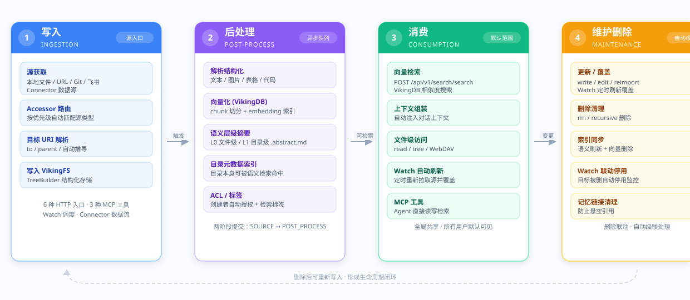
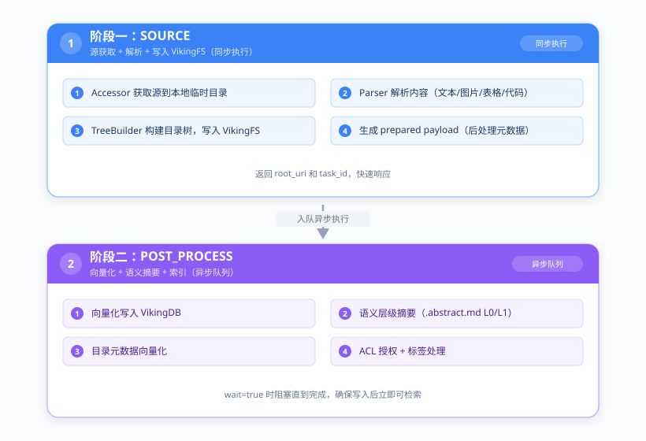
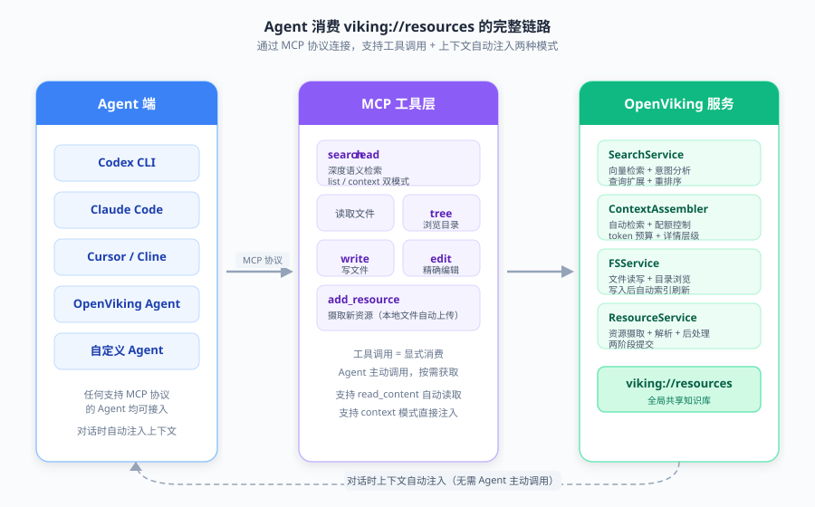
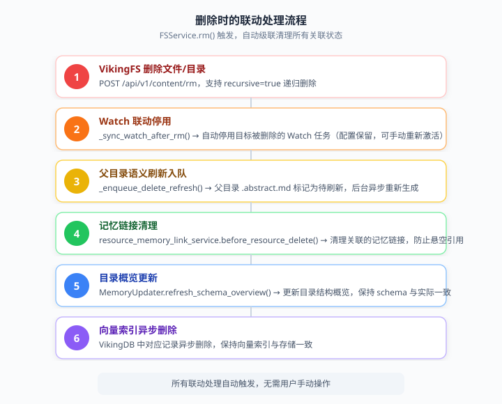

# viking://resources 生命周期完整解析

> 本文档系统梳理 `viking://resources` 命名空间从写入、后处理、消费到维护删除的完整生命周期，帮助同事快速理解资源在系统中的流转机制。

---

## 一、概述

### 1.1 什么是 viking://resources

`viking://resources` 是 VikingFS 中的**全局共享资源存储根目录**，是 OpenViking 知识库的核心存储层。

`resources` 是命名空间体系中的顶级 scope 之一，与 `user`、`agent` 并列。

**定位：Agent 可读写的知识工作区（不只是知识库）**

`viking://resources` 可以部分类比为"知识库"，但不完全等同：

| 维度 | 像知识库 | 不像知识库 |
|---|---|---|
| **读写性** | 存储知识资产、供检索消费 | 是可读写的文件系统，Agent 可 `write`/`edit`/`delete`，会写入产出物 |
| **内容类型** | 文档、代码、配置等知识资产 | 不只是文档，图片、二进制等各种资源都可放 |
| **权限** | 全局共享可见 | 有 ACL 细粒度读写权限控制 |
| **更新方式** | 手动上传管理 | 有 Watch 自动摄取机制，可定时从 Git/飞书/URL 自动同步 |
| **使用主体** | 人查阅检索 | 多 Agent 共享协作空间，支持 peer 范围控制 |

更准确的定位是：**Agent 可读写的知识工作区**——兼具知识库的语义检索能力 + 文件系统的读写能力 + 自动摄取同步能力。它既是知识的"仓库"，也是 Agent 协作的"桌面"。

### 1.2 在系统中的定位

| 维度 | 说明 |
|---|---|
| **可见性** | 所有用户默认可见的检索范围（`default_target_directories` 中排第一位） |
| **共享性** | 全局共享，不绑定特定用户或 Agent；多租户通过 ACL 控制可见性 |
| **ACL** | 唯一支持细粒度 ACL 权限控制的 scope（`openviking/storage/acl.py`） |
| **默认检索目标** | `["viking://resources", "viking://user/{uid}"]` — 全局共享 + 用户私有 |

### 1.3 生命周期四阶段



---

## 二、阶段一：写入（Ingestion）

### 2.1 写入入口总览

用户/系统可以通过 **6 种 HTTP API**、**3 种 MCP 工具**、**CLI**、**Watch 调度器** 和 **Connector 数据流** 写入 `viking://resources`。

#### HTTP API 入口

| 入口 | 路径 | 适用场景 |
|---|---|---|
| **add_resource** | `POST /api/v1/resources` | 最主要入口：摄取本地文件/URL/Git/飞书/Connector，自动解析+建索引 |
| **temp_upload** | `POST /api/v1/resources/temp_upload` | 先传文件到临时存储拿 `temp_file_id`，再调 add_resource 完成摄取；带签名 token 时可一步完成 |
| **write** | `POST /api/v1/write` | 直接写文本内容（replace/create/append），适合笔记/配置/代码文件 |
| **batch_write** | `POST /api/v1/batch-write` | 批量写多个文件，最后统一刷新一次索引 |
| **ovpack import** | `POST /api/v1/pack/import` | 从 .ovpack 打包文件批量导入资源树 |
| **WebDAV** | `/api/v1/webdav/resources/...` | 标准 WebDAV 协议挂载为网络驱动器，拖放读写 |

#### MCP 工具入口

| 工具 | 说明 |
|---|---|
| **`write`** | 写文本到 `viking://` 文件（replace/create/append），新文件必须以 `.md .txt .json .yaml .yml .toml .py .js .ts` 结尾 |
| **`edit`** | 精确字符串替换编辑（old_string → new_string），编辑记忆文件时保留元数据 |
| **`add_resource`** | 添加资源，本地文件路径时通过签名上传 token 自动完成上传+摄取 |

#### 自动写入

| 来源 | 说明 |
|---|---|
| **Watch 调度器** | `WatchScheduler` 按 `watch_interval` 定期调用 `refresh_resource()`，重新拉取源内容并**同步覆盖**目标 URI（已有目标中不在新源里的条目会被删除） |
| **Connector 数据流** | 外部连接器（RSS/Sitemap/自定义源）持续增量写入 `to/<relative_path>` |

### 2.2 源类型与 Accessor 路由

add_resource 路径下，源类型由 **AccessorRegistry** 自动路由，按优先级匹配：

| 优先级 | Accessor | 源类型 | 典型输入示例 |
|---|---|---|---|
| 100 | FeishuAccessor | 飞书文档 | `https://*.feishu.cn/docx/...` |
| 80 | GitAccessor | Git 仓库 | `https://github.com/org/repo` |
| 60 | WebFeedAccessor | 整站/Sitemap/RSS | `https://example.com/sitemap.xml` |
| 50 | HTTPAccessor | 普通网页/文件 | `https://example.com/article.html` |
| 1 | LocalAccessor | 本地文件/目录 | `/path/to/file.pdf` |

> Connector 类型不走 Accessor 路由，由 `ConnectorDelegate.should_delegate()` 判定，通过 `add_type` 参数显式指定。

#### 各源类型详细能力

**① 本地文件（LocalAccessor）**
- 单个文件（PDF、Word、Markdown、代码、图片、音频、视频等，具体格式由 parser 层支持）
- 整个目录（递归导入所有文件）
- **不支持 watch_interval**（上传是静态快照，源不会变化）

**② 普通网页/URL（HTTPAccessor）**
- 单个网页 URL（自动检测 Content-Type，网页走爬虫，文件直接下载）
- 直接文件下载 URL（PDF、Markdown、图片、压缩包等）
- GitHub/GitLab `blob` URL — 自动转 raw 下载单文件
- 网页爬虫参数（通过 `args` 传入）：

| 参数 | 默认值 | 说明 |
|---|---|---|
| `depth` | 0 | 爬取深度，0=单页，-1=无限 |
| `max_pages` | 50 | 最大页面数，-1=无限 |
| `include_paths` | null | 只包含匹配的路径 |
| `exclude_paths` | null | 排除匹配的路径 |
| `allow_external_links` | false | 是否允许爬出外链域名 |
| `skip_download_links` | true | 跳过下载链接 |

> `depth=-1 & max_pages=-1 & allow_external_links=true` 被禁止（至少需要一个边界）。

**③ 整站导入（WebFeedAccessor）**
- Sitemap XML URL（`sitemap.xml`、`sitemap_index.xml`）
- RSS / Atom Feed URL
- 裸域名 + `args={"site": true}` — 自动发现该站的 sitemap/RSS
- 自动流程：解析 feed → 遵守 robots.txt → 并发镜像下载所有页面为 HTML
- 根 URI 自动设为 `viking://resources/<host>`
- 配置：`max_pages=200`、`max_concurrency=5`、`politeness_delay=0.2s`、`same_host_only=true`

**④ Git / GitHub 仓库（GitAccessor）**
- GitHub/GitLab 仓库主页 URL：`https://github.com/org/repo`
- Git SSH URL：`git@github.com:org/repo.git`
- HTTPS clone URL、`git://`、`ssh://` 协议 URL
- 本地 `.git` 目录
- 支持参数：`branch`/`ref`（指定分支）、`commit`（指定 commit）、`auth_config`（HTTP 认证，私有仓库）
- 优化策略：GitHub 公开仓库优先调用 GitHub ZIP API 下载（更快），失败回退到 `git clone`

**⑤ 飞书文档（FeishuAccessor）**

支持 7 种类型：

| 类型 | URL 模式 |
|---|---|
| 新版文档 | `https://*.feishu.cn/docx/{document_id}` |
| 旧版文档 | `https://*.feishu.cn/docs/{doc_token}` |
| Wiki 页面 | `https://*.feishu.cn/wiki/{token}` |
| 电子表格 | `https://*.feishu.cn/sheets/{token}` |
| 多维表格 | `https://*.feishu.cn/base/{app_token}` |
| 云盘文件 | `https://*.feishu.cn/file/{file_token}` |
| 云盘文件夹 | `https://*.feishu.cn/drive/folder/{folder_token}` |

- 认证：应用级（`FEISHU_APP_ID` + `FEISHU_APP_SECRET` 环境变量）或用户级（`feishu_access_token` 参数）
- 唯一原生支持 `is_active=false`（创建时暂停）的 native watch 类型
- 调度执行时 OAuth token 自动刷新，token 永久失效时自动 deactivate 任务

**⑥ Connector 数据源（显式 `add_type`）**
- 由服务端配置 `connector.allowed_add_types` 决定（可扩展）
- 可以是 RSS、Sitemap、自定义 API 数据源等
- **Connector Watch 可共享目标 URI**（多个 Connector watch 写同一个目录的不同子路径）
- 有独立的 `connector_states` 持久化流状态（如增量游标）

### 2.3 目标 URI 解析

写入时目标位置由三个参数控制，互斥优先级如下：

| 参数 | 说明 | 冲突规则 |
|---|---|---|
| **`to`** | 精确目标 URI（含叶子名），如 `viking://resources/my_doc` | 与 `parent` 互斥；Connector 类型必填 |
| **`parent`** | 父目录 URI，叶子名从源推导；碰撞时自动预留 `name_1`、`name_2` | 与 `to` 互斥；Connector 类型不支持 |
| **都不填** | 从服务端配置 `effective_resource_add_target` 推导默认 parent | 自动创建父目录 |

> `to` 是**精确写入**：已有目标会被同步覆盖（不在新源里的条目会被删除）。`parent` 是**不覆盖写入**：碰撞时自动改名。

### 2.4 两阶段提交机制

add_resource 的核心处理分为两个阶段，通过 QueueFS 异步队列解耦：



**关键实现**（`openviking/storage/queuefs/add_resource_msg.py`）：

```python
class AddResourcePhase(str, Enum):
    SOURCE = "source"
    POST_PROCESS = "post_process"
```

- 阶段1 同步执行，返回 `root_uri` 和 `task_id`
- 阶段2 通过 `AddResourceMsg` 入队异步执行，`wait=true` 时阻塞直到完成
- `defer_post_processing=True` 是默认行为，确保写入快速响应

### 2.5 写入 VikingFS

内容最终通过 `ResourceProcessor.process_resource()` → `TreeBuilder` 写入 VikingFS：

- 文件内容按解析后的结构化格式存储（Markdown、JSON 等）
- 图片/媒体文件单独存储，URI 在文档中重写引用
- 目录结构保留源的层级关系
- 每个目录可附带 `.abstract.md` 语义摘要文件（后处理阶段生成）

---

## 三、阶段二：后处理（Post-processing）

写入 VikingFS 后，系统自动触发一系列后处理，使资源可被检索和理解。

### 3.1 后处理触发点

| 触发场景 | 触发方式 |
|---|---|
| add_resource 完成 | 自动入队 POST_PROCESS 消息 |
| write / edit 文本 | 自动触发父目录语义刷新 |
| batch_write | 批量写入后统一刷新一次索引 |
| mkdir 建目录 | 自动生成目录 abstract 并向量化 |
| rm 删除 | 触发父目录语义刷新 + 向量删除 |

### 3.2 向量化（VikingDB）

**核心函数**：`openviking/utils/embedding_utils.py` 中的 `vectorize_file()` 和 `index_resource()`

- 将文本内容按 chunk 切分，调用 embedding 模型生成向量
- 写入 VikingDB 向量数据库，关联原始 URI
- `build_index=false` 时跳过向量化
- 目录元数据也会被向量化（`vectorize_directory_meta()`），使目录本身可被检索到

### 3.3 语义层级摘要（L0/L1）

**核心组件**：`openviking/storage/queuefs/semantic_processor.py`（SemanticProcessor）

采用层级摘要架构：


- 每个目录生成 `.abstract.md` sidecar 文件，包含目录内容的语义摘要
- 子节点变化时，父目录摘要标记为"待刷新"（freshness-aware bubbling）
- 检索时可以直接命中目录级摘要，快速定位相关资源范围

**向量化与语义摘要的关系（互补而非互斥）**：
- **向量化是基础**：所有内容（包括文件内容和目录摘要）都会被向量化存入 VikingDB，检索时就是在 VikingDB 中做向量相似度搜索
- **语义摘要是层级化补充**：使目录本身可被检索（`level=0/1`），支持"先命中目录摘要定位范围，再深入文件内容"的层级检索，同时减少上下文 token 消耗
- `vectors_only` 模式 = 只向量化文件内容，不生成目录级语义摘要
- `semantic_and_vectors` 模式 = 两者都做，支持更高效的层级检索

### 3.4 processing_mode 两种模式

**配置方式**：通过 API 接口参数配置，不是 oc.conf 全局配置。每个资源可独立设置，在调用 `add_resource` 时传入 `processing_mode` 参数（默认 `semantic_and_vectors`）。Watch 任务会保存该字段，调度执行时使用；Connector 导入时同样支持。

| 模式 | 值 | 说明 |
|---|---|---|
| **SEMANTIC_AND_VECTORS** | `semantic_and_vectors` | 默认模式：生成语义层级摘要 + 向量化 |
| **VECTORS_ONLY** | `vectors_only` | 仅向量化，不生成语义摘要（更快，占用更少 LLM 调用） |

### 3.5 目录元数据索引

`vectorize_directory_meta()` 为每个目录生成：
- `abstract`：目录内容摘要
- `overview`：目录用途说明（用户可手动设置）
- 这些元数据本身被向量化，使目录可被语义检索命中

### 3.6 ACL 与标签

**ACL（仅 resources scope 支持）**：
- 新创建的资源自动授予创建者 `CreatorAclGrant.DIRECT` 权限
- 根目录 `viking://resources` 本身不能设置 ACL
- 支持细粒度的读写权限控制

**标签（Tags）**：
- 通过 `set_tags` API 设置 `k=v` 检索标签元数据
- 支持 `replace`/`add`/`remove` 模式
- 支持递归设置
- 检索时可按标签过滤

---

## 四、阶段三：消费（Consumption）

### 4.1 向量检索（最核心用途）

`viking://resources` 是**所有用户的默认检索范围**：

```python
# openviking/core/retrieval_targets.py
def default_target_directories(ctx, context_type=ContextType.RESOURCE):
    return ["viking://resources", user_root]  # 全局共享 + 用户私有
```

**检索入口**：
- `POST /api/v1/search/search` — 向量相似度搜索，在 VikingDB 中检索 resources 下的所有内容
- 检索结果中 `viking://resources/` 下的内容统一标记为 `category="resources"`，用于配额和统计
- 支持路径变量模板，如 `viking://resources/emails/{calendar:today}/inbox`

**检索流程**（`openviking/retrieve/context_assembler/gather.py`）：
1. 解析目标目录（默认包含 `viking://resources`）
2. 对每个目标目录执行向量检索
3. 按相似度排序、去重（同 URI 保留最高分）
4. 分类标记（resources / memories / skills / other）
5. 返回检索结果

### 4.2 上下文组装

`context_assembler` 自动从 `viking://resources` 收集相关片段注入对话上下文：

- 用户提问时，自动检索 resources 中相关内容作为上下文
- 对话中引用 `viking://resources/...` URI 时自动读取内容并注入
- 支持层级检索：先命中目录摘要（L1），再深入文件内容（L0）

### 4.3 文件级访问

| 方式 | 入口 | 说明 |
|---|---|---|
| HTTP 读文件 | `GET /api/v1/content/read?uri=` | 读取文件内容 |
| HTTP 列目录 | `GET /api/v1/content/tree?uri=` | 浏览目录结构 |
| MCP `read` | MCP 工具 | 读取文件内容 |
| MCP `tree` / `list` | MCP 工具 | 浏览目录结构 |
| WebDAV | 标准协议 | 挂载为网络驱动器，拖放读写 |

### 4.4 Watch 自动刷新

为 resources 下的目标创建定时刷新任务：

| 操作 | API | 说明 |
|---|---|---|
| 创建 | add_resource 时传 `watch_interval=N` | N 分钟后自动重新拉取源并覆盖写入 |
| 列表 | `GET /api/v1/watches` | 列出所有监控任务 |
| 手动触发 | `POST /api/v1/watches/{task_id}/trigger` | fire-and-forget，立即执行一次刷新 |
| 暂停/恢复 | `PATCH /api/v1/watches/{task_id}` | 改 `is_active`，不丢失配置的间隔 |
| 删除 | `DELETE /api/v1/watches/{task_id}` | 删除监控任务 |

**Watch 执行流程**（`WatchScheduler._execute_stable_task`）：
1. `UriMutationCoordinator.access()` 锁定目标 URI 稳定性
2. 检查源路径/目标 URI 是否还存在（不存在则自动 deactivate）
3. 刷新认证状态（飞书 token / Git 配置 / Connector state）
4. 调用 `ResourceService.refresh_resource()` 重新摄取
5. `record_execution()` 更新执行状态和下次执行时间
6. 资源不存在或认证永久失效时自动 `is_active=false`

### 4.5 Agent 消费链路（MCP 工具 + 上下文自动注入）

Agent（如 Codex CLI、Claude Code、Cursor/Cline、OpenViking Agent 等）通过 **MCP（Model Context Protocol）协议**连接 OpenViking，以两种模式消费 `viking://resources`：



#### 模式一：工具显式调用

Agent 主动调用以下 6 个 MCP 工具，按需获取或操作资源：

| 工具 | 功能 | 关键参数 |
|---|---|---|
| **`search`** | 深度语义检索 | `mode="list"` 返回排名结果；`mode="context"` 返回可直接注入的上下文块；支持 `purpose="chat"/"coding"`、`detail` 详情层级、`quotas` 分类配额、`dedup_turns` 跨轮去重 |
| **`read`** | 读取文件内容 | 支持批量读取，自动解析 `viking://` URI |
| **`tree`** | 浏览目录结构 | 递归列出目录树，支持深度控制 |
| **`write`** | 写文件 | replace/create/append 三种模式，写入后自动触发索引刷新 |
| **`edit`** | 精确编辑 | old_string → new_string 字符串替换，适合局部修改 |
| **`add_resource`** | 摄取新资源 | 支持本地文件路径（自动通过签名 token 上传）、URL、Git、飞书等源类型 |

**search 工具的两种模式**：
- `mode="list"`：返回排名后的资源列表（URI、摘要、分数），Agent 自行决定读取哪些
- `mode="context"`：直接返回注入就绪的上下文块，自动处理 token 预算、分类配额、详情层级，Agent 可直接使用

#### 模式二：上下文自动注入

Agent 进行对话时，**无需主动调用工具**，`ContextAssembler` 自动从 `viking://resources` 检索相关内容并注入上下文：

- **自动触发**：每轮对话自动检索，默认检索范围包含 `viking://resources`
- **查询扩展**：自动进行 query expansion，提升召回率
- **配额控制**：按类别（resources/memories/skills）分配 token 配额
- **详情层级**：`auto`/`abstract`/`overview`/`full` 四级，自动平衡信息量与 token 消耗
- **跨轮去重**：`dedup_turns` 参数避免重复注入已出现过的内容
- **对等范围**：`peer_scope="actor"/"all"` 控制是否包含其他 Agent 产生的内容

#### 支持的 Agent 类型

任何支持 MCP 协议的 Agent 均可接入，包括但不限于：
- **Codex CLI** — OpenAI 官方命令行 Agent
- **Claude Code** — Anthropic 官方命令行 Agent
- **Cursor / Cline** — IDE 集成 Agent
- **OpenViking Agent** — 平台内置 Agent
- **自定义 Agent** — 任何实现 MCP 客户端的 Agent

---

## 五、阶段四：维护与删除（Maintenance & Deletion）

### 5.1 更新与覆盖

| 操作 | 说明 | 索引处理 |
|---|---|---|
| **write (replace)** | 覆盖整个文件 | 自动触发父目录语义刷新 + 向量更新 |
| **edit** | 精确字符串替换 | 同上，编辑记忆文件时保留元数据 |
| **batch_write** | 批量写多个文件 | 最后统一刷新一次索引（避免多次刷新） |
| **reimport (add_resource with same to)** | 重新摄取源，同步覆盖目标 | 完整重跑摄取管道，目标中不在新源里的条目被删除 |
| **Watch refresh** | 定时自动重新摄取 | 同上，由调度器触发 |

### 5.2 删除

**删除入口**：
- HTTP：`POST /api/v1/content/rm`（支持 `recursive=true`）
- MCP：`rm` 工具
- WebDAV：标准删除操作

**删除时的联动处理**（`FSService.rm()`）：



### 5.3 索引同步

**语义索引同步**：
- 写入/删除后，父目录标记为 `pending`，后台 SemanticProcessor 异步刷新
- `wait=true` 时阻塞直到刷新完成，返回 `semantic_status: "completed"`
- 采用 freshness-aware bubbling：子节点变化只标记直接父目录为 pending，避免全量重算

**向量索引同步**：
- 写入时自动向量化新内容
- 删除时异步删除 VikingDB 中对应记录
- `reindex` API 可手动触发全量重建索引

### 5.4 Watch 联动停用

当 `viking://resources` 下的目标被删除时：
- `deactivate_tasks_under_uri_internal()` 自动将所有目标 URI 在被删路径下的 Watch 任务设为 `is_active=false`
- 任务配置保留（可手动重新激活），但不再自动执行
- 调度器执行时如果发现源或目标不存在，也会自动 deactivate

### 5.5 记忆链接清理

`resource_memory_link_service` 维护资源与记忆之间的关联：
- 删除资源时，自动清理引用该资源 URI 的记忆链接
- 防止记忆中出现指向已删除资源的悬空引用

---

## 六、关键设计决策

### 6.1 全局共享 vs 用户私有

| 维度 | viking://resources | viking://user/{uid}/resources |
|---|---|---|
| 所有者 | 全局共享 | 用户私有 |
| 默认检索 | 所有用户都能检索到 | 仅该用户（及 actor_peer） |
| ACL | 支持细粒度 ACL | 不支持（由用户隔离天然保证） |
| 适用场景 | 团队知识库、公共文档、项目资料 | 个人笔记、私有文件 |

### 6.2 两阶段异步处理

- **为什么分两阶段**：源获取+解析（SOURCE）通常较快，而向量化+语义摘要（POST_PROCESS）较慢且依赖 LLM/embedding 模型。解耦后写入快速响应，后处理异步完成。
- **wait 参数**：`wait=true` 时阻塞直到后处理完成，确保写入后立即可检索；默认 `wait=false` 快速返回。
- **队列持久化**：AddResourceMsg 持久化在 QueueFS 中，服务重启后不丢失。

### 6.3 URI 稳定性协调

`UriMutationCoordinator`（`openviking/resource/uri_mutation_coordinator.py`）保证：
- **access 租约**（共享）：多个 Watch 执行可同时持有，要求 URI 不变
- **mutation 租约**（排他）：URI 重命名/删除时持有，阻塞所有 access
- 防止"Watch 正在重新写入某个 URI 时，该 URI 被同时重命名或删除"的竞态

### 6.4 Watch 目标独占/共享规则

| Watch 类型 | 目标 URI 规则 |
|---|---|
| **Native Watch**（本地/HTTP/Git/飞书） | **独占**：一个 URI 只能有一个 native watch |
| **Connector Watch** | **可共享**：同一 URI 可有多条 Connector watch（各自写不同子路径） |
| **Native + Connector** | **互斥**：不能共存于同一目标 URI |

冲突时返回 `ConflictError`，提示删除冲突 watch 或选择其他目标。

### 6.5 处理模式可配置

- `semantic_and_vectors`（默认）：完整语义摘要 + 向量化，检索质量最高，但 LLM 调用多
- `vectors_only`：仅向量化，速度快、成本低，适合不需要语义层级摘要的场景
- 按资源粒度配置，不同资源可以用不同模式

---

## 七、快速参考卡

### 常用操作速查

| 操作 | 方式 | 关键参数 |
|---|---|---|
| 添加网页 | `POST /api/v1/resources` | `path="https://..."`, `to="viking://resources/xxx"` |
| 添加本地文件 | MCP `add_resource` | `path="/local/path/file.pdf"` |
| 添加 GitHub 仓库 | `POST /api/v1/resources` | `path="https://github.com/org/repo"`, `branch="main"` |
| 添加飞书文档 | `POST /api/v1/resources` | `path="https://*.feishu.cn/docx/..."` |
| 整站爬取 | `POST /api/v1/resources` | `path="https://example.com"`, `args={"site": true, "depth": 2, "max_pages": 100}` |
| 开启定时刷新 | add_resource 时 | `watch_interval=60`（每60分钟） |
| 写笔记 | MCP `write` | `uri="viking://resources/notes/xxx.md"`, `content="..."` |
| 检索 | `POST /api/v1/search/search` | 默认包含 viking://resources |
| 删除 | MCP `rm` 或 HTTP rm | `uri="viking://resources/xxx"`, `recursive=true` |

### 核心代码位置

| 模块 | 路径 |
|---|---|
| 命名空间定义 | `openviking/core/namespace.py` |
| 检索目标解析 | `openviking/core/retrieval_targets.py` |
| 资源服务（入口） | `openviking/service/resource_service.py` |
| 资源处理器（核心） | `openviking/utils/resource_processor.py` |
| Accessor 注册表 | `openviking/parse/accessors/registry.py` |
| 各 Accessor 实现 | `openviking/parse/accessors/*.py` |
| Watch 管理器 | `openviking/resource/watch_manager.py` |
| Watch 调度器 | `openviking/resource/watch_scheduler.py` |
| URI 稳定性协调 | `openviking/resource/uri_mutation_coordinator.py` |
| 两阶段消息 | `openviking/storage/queuefs/add_resource_msg.py` |
| 语义处理器 | `openviking/storage/queuefs/semantic_processor.py` |
| 向量化工具 | `openviking/utils/embedding_utils.py` |
| 上下文组装 | `openviking/retrieve/context_assembler/gather.py` |
| ACL | `openviking/storage/acl.py` |
| FS 服务（读写删） | `openviking/service/fs_service.py` |

---

*文档版本：v1.0 | 最后更新：2026-09-16*
