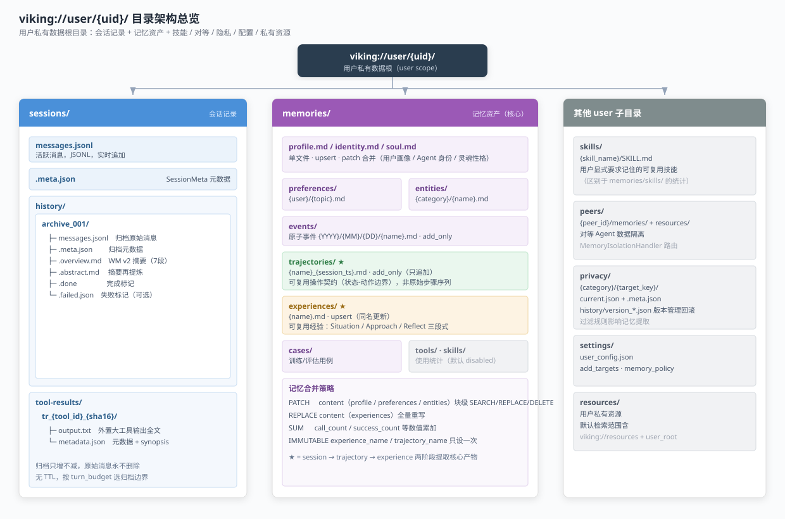
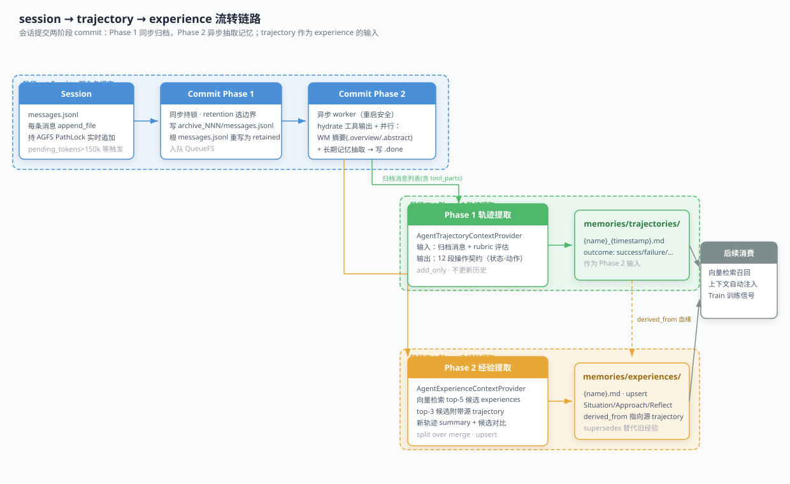

# viking://user 生命周期完整解析

> 本文档系统梳理 `viking://user/{uid}/` 命名空间下从会话写入、记忆提取、消费到维护删除的完整生命周期，重点讲清 **session → trajectory → experience** 的流转链路。

---

## 一、概述

### 1.1 什么是 viking://user

`viking://user/{uid}/` 是 VikingFS 中的**用户私有数据根目录**，与全局共享的 `viking://resources` 并列。它承载该用户名下的会话记录、个人记忆资产、用户级技能、对等 Agent 隔离数据、隐私配置、用户设置与私有资源。

| 维度 | 说明 |
|---|---|
| **可见性** | 默认仅该用户可见；默认检索范围 = `["viking://resources", "viking://user/{uid}"]` |
| **隔离性** | 天然用户级隔离；对等 Agent 数据再经 `peers/{peer_id}/` 二次隔离 |
| **核心特征** | 会话实时落盘 + 提交后两阶段异步记忆提取，把"原始对话"沉淀为"可复用经验" |

### 1.2 目录结构总览



完整目录结构树：

```
viking://user/{uid}/
├── sessions/                          # 会话记录（只增不减，原始消息永不删除）
│   └── {session_id}/
│       ├── messages.jsonl             # 活跃消息，JSONL 格式，实时追加
│       ├── .meta.json                 # SessionMeta 元数据
│       ├── history/
│       │   └── archive_NNN/           # 归档消息（超出窗口的原始消息，原样搬运）
│       └── tools/                     # 大工具输出外置（tool_result_store）
│           └── {tool_id}
├── memories/                          # 记忆资产（核心，按 type 配置合并策略）
│   ├── profile.md                     # 用户画像（upsert）
│   ├── identity.md                    # Agent 身份（upsert）
│   ├── soul.md                        # 灵魂性格（upsert）
│   ├── preferences/                   # 偏好记忆（patch 合并）
│   │   └── {category}.md
│   ├── entities/                      # 实体记忆（patch 合并）
│   │   └── {category}/{name}.md
│   ├── events/                        # 事件记忆（immutable，只设一次）
│   │   └── {timestamp}_{slug}.md
│   ├── trajectories/                  # 轨迹记忆（add_only，每次新执行产生新文件）
│   │   └── {name}_{timestamp}.md
│   ├── experiences/                   # 经验记忆（upsert，可复用执行规则）
│   │   └── {name}.md
│   ├── cases/                         # 用例记忆（add_only）
│   │   └── {timestamp}_{slug}.md
│   ├── tools/                         # 工具记忆（upsert）
│   │   └── {tool_name}.md
│   └── skills/                        # 技能统计记忆（upsert，与顶层 skills/ 不同）
│       └── {skill_name}.md
├── skills/                            # 用户显式要求记住的可复用技能
│   └── {skill_name}/SKILL.md
├── peers/                             # 对等 Agent 的隔离数据
│   └── {peer_id}/
│       ├── memories/                  # 对等 Agent 的记忆
│       └── resources/                 # 对等 Agent 的私有资源
├── privacy/                           # 隐私配置 + 版本历史
│   └── {category}/{target_key}
│       ├── current.json               # 当前生效配置
│       └── version_*.json             # 历史版本
├── settings/                          # 用户配置
│   ├── user_config.json               # 主配置（add_targets、memory_policy 等）
│   └── user_config.backup.json        # 备份
└── resources/                         # 用户私有资源（与全局 viking://resources 分开）
    └── ...
```

`viking://user/{uid}/` 下一级子目录一览：

| 子目录 | 内容 | 关键性质 |
|---|---|---|
| `sessions/` | 全部会话记录（活跃 + 归档 + 大工具输出外置） | 只增不减，原始消息永不删除 |
| `memories/` | 记忆资产（画像 / 偏好 / 实体 / 事件 / 轨迹 / 经验 / 用例 / 统计） | 按 memory type 配置合并策略 |
| `skills/` | 用户显式要求记住的可复用技能（SKILL.md） | 与 `memories/skills/`（统计）不同 |
| `peers/` | 对等 Agent 的隔离记忆与资源 | `MemoryIsolationHandler` 路由 |
| `privacy/` | 隐私配置 + 版本历史 | current + version_*.json |
| `settings/` | 用户配置（add_targets、memory_policy 等） | `user_config.json` |
| `resources/` | 用户私有资源 | 与全局 resources 分开 |

---

## 二、sessions/ 子目录生命周期

### 2.1 存储结构

每个会话一个目录，结构如下：

```
viking://user/{uid}/sessions/{session_id}/
├── messages.jsonl          # 活跃消息，JSONL，实时追加
├── .meta.json               # 会话元数据（SessionMeta）
├── history/
│   └── archive_001/
│       ├── messages.jsonl   # 归档原始消息（完整未截断）
│       ├── .meta.json       # 归档元数据
│       ├── .overview.md     # Working Memory v2 摘要（7段）
│       ├── .abstract.md     # 摘要再提炼
│       ├── .done            # 完成标记
│       └── .failed.json     # 失败标记（可选）
└── tool-results/
    └── tr_{tool_id}_{sha16}/
        ├── output.txt       # 外置大工具输出全文
        └── metadata.json    # 元数据 + synopsis
```

**各文件格式要点：**

| 文件 | 格式 | 说明 |
|---|---|---|
| `messages.jsonl` | JSON Lines | 每行一条消息（含 role/parts/token 估算），是会话的唯一真相源 |
| `.meta.json` | JSON | SessionMeta：状态、提交计数、auto-commit 策略等 |
| `archive_NNN/messages.jsonl` | JSON Lines | 归档时切出的完整原始消息，**不做截断** |
| `.overview.md` | Markdown | Phase 2 生成的 7 段 Working Memory 摘要 |
| `.abstract.md` | Markdown | 摘要的再提炼，用于目录级语义检索 |
| `.done` | 空文件 / JSON | Phase 2 完成标记（含 coverage 范围） |
| `.failed.json` | JSON | Phase 2 失败标记，便于重试排查 |
| `tool-results/output.txt` | 纯文本 | 大工具输出外置全文，消息内仅保留引用 |

### 2.2 写入：创建与实时追加

- **创建会话**时初始化 `messages.jsonl` 与 `.meta.json`。
- **每条消息**通过 `append_file` 立即追加到根 `messages.jsonl`，写入时持有 AGFS PathLock，保证并发安全。
- 大体积工具输出不直接内联进消息，而是外置到 `tool-results/tr_{tool_id}_{sha16}/output.txt`，消息里只存引用与 synopsis，避免活跃消息体积膨胀。

### 2.3 自动提交（auto-commit）触发机制

会话没有显式 policy 时默认不自动提交；policy 在创建时或后续配置 API 设定。触发条件（任一满足即触发一次 commit）：

| 触发条件 | 默认阈值 | PRD 上限 |
|---|---|---|
| `pending_token_threshold` | 150,000 token | 1,000,000 |
| `message_count_threshold` | 100 条 | 1,000 条 |
| `idle_timeout_seconds` | 86,400 秒（1 天） | 604,800 秒（7 天） |

此外还有 `keep_recent_count`（保留最近 N 轮）与 `min_commit_interval_seconds`（最小提交间隔）两个调节项。

### 2.4 压缩/归档两阶段协议（Phase 1 + Phase 2）

提交被拆成**同步 Phase 1** + **异步 Phase 2**，通过 QueueFS 解耦。

**Phase 1（同步持锁）：**
1. 调 `retention` 规划器在活跃消息上选归档 / 保留边界。
2. 把归档消息完整写入 `archive_NNN/messages.jsonl`。
3. 把根 `messages.jsonl` 重写为保留下来的消息（retained）。
4. 把提交任务入队 QueueFS。

**Phase 2（异步 worker，重启安全）：**
1. hydrate 归档消息中引用的大工具输出全文。
2. **并行**跑两类任务：
   - Working Memory 摘要 → 写 `.overview.md` / `.abstract.md`；
   - 长期记忆抽取（含 trajectory / experience 两阶段，见第五章）。
3. 成功写 `.done`，失败写 `.failed.json`；会话不存在则直接标记任务失败。

> Phase 1 保证用户侧读写快速响应；Phase 2 慢（依赖 LLM / embedding），放到后台异步完成。

**Session 压缩/摘要 Prompt：**

- 创建模板：`openviking/prompts/templates/compression/ov_wm_v2.yaml`
- 增量模板：`ov_wm_v2_update.yaml`（增量模式强制通过 `update_working_memory` 工具按 KEEP / APPEND / REPLACE 合并）
- 输出固定为 **7 段** Working Memory Markdown：
  1. Session Title
  2. Current State（最高优先级，永远反映最新状态）
  3. Task & Goals
  4. Key Facts & Decisions（关于用户世界的持久事实）
  5. Files & Context（被引用的资源）
  6. Errors & Corrections
  7. Open Issues

### 2.5 保留与删除策略

- `retention.py` 是**纯规划器**，无文件系统 / 模型依赖：先把物理消息聚合成逻辑 user turn + 原子 assistant step，再按 `turn_budget`（轮数 + token 双约束）选归档边界。
- **永不拆碎原子单元**：tool call 与其结果 transport 消息始终在同一侧，不会跨归档边界割裂。
- **无 TTL**：归档目录只增不减，没有过期清理。
- **原始消息永不删除**：归档消息完整保存在 `archive_NNN/messages.jsonl`；"删除"只作用于记忆索引 / 向量，不删原始会话数据。

---

## 三、memories/ 子目录全景

### 3.1 memories/ 目录树总览

```
viking://user/{uid}/memories/
├── profile.md              # 用户画像（单文件，upsert，patch合并）
├── identity.md             # Agent 身份（单文件）
├── soul.md                 # Agent 灵魂/性格（单文件）
├── preferences/            # 用户偏好 {user}/{topic}.md
├── entities/               # 第三方实体卡片 {category}/{name}.md
├── events/                 # 原子事件 {YYYY}/{MM}/{DD}/{name}.md
├── experiences/            # 可复用经验 {name}.md（upsert，重点）
├── trajectories/           # 执行轨迹 {name}_{ts}.md（add_only，重点）
├── cases/                   # 训练/评估用例 {name}.md
├── tools/                   # 工具使用统计（默认 disabled）
└── skills/                  # 技能使用统计（默认 disabled）
```

每个 memory type 由 `openviking/prompts/templates/memory/*.yaml` 声明，关键属性如下：

| memory type | 目录 / 文件名 | operation_mode | content 合并 | 说明 |
|---|---|---|---|---|
| profile | `profile.md` | upsert | patch | 用户画像 |
| identity | `identity.md` | upsert | patch | Agent 身份 |
| soul | `soul.md` | upsert | patch | Agent 性格 |
| preferences | `preferences/{user}/{topic}.md` | upsert | patch | 用户偏好 |
| entities | `entities/{category}/{name}.md` | upsert | patch | 第三方实体卡片 |
| events | `events/{YYYY}/{MM}/{DD}/{name}.md` | add_only | immutable 字段 | 原子事件 |
| **trajectories** | `trajectories/{name}_{ts}.md` | **add_only** | patch（正文） | 执行轨迹契约 |
| **experiences** | `experiences/{name}.md` | **upsert** | replace（正文） | 可复用经验 |
| cases | `cases/{name}.md` | upsert | immutable 字段 | 训练/评估用例 |
| tools | `tools/{tool_name}.md` | upsert | sum + patch | 使用统计，默认 disabled |
| skills | `skills/{skill_name}.md` | upsert | sum + patch | 使用统计，默认 disabled |

### 3.2 各子目录逐一介绍

#### 3.2.1 profile.md / identity.md / soul.md（单文件）

- **存储内容**：整份用户画像（profile）、Agent 身份设定（identity）、Agent 性格/灵魂（soul）。
- **数据格式**：单 Markdown 文件，带 MEMORY_FIELDS 元数据（尾部 HTML 注释）。
- **写入方式**：`operation_mode: upsert`，content 字段走 `patch`（SEARCH/REPLACE/DELETE 块级编辑），首次无文件时按 `init_value` 模板初始化。
- **消费方式**：身份类内容在会话早期注入上下文，作为 Agent 行为基线。

**抽取流程（三要素）：**

| 维度 | 说明 |
|---|---|
| **原始内容** | post-commit 的会话消息文本（`SessionExtractContextProvider` 组装为 `## Conversation History`，默认省略 ToolPart，只保留 TextPart） |
| **抽取提示词** | profile：只收"跨会话持久的当前状态"（基本身份、学业职业、婚恋家庭、长期健康），强制路由（时间性事件→events、好恶习惯→preferences、第三方对象→entities），每条 bullet 必须以 `(as of YYYY-MM-DD)` 结尾；identity / soul：极简字段提示（name/creature/vibe/emoji 或 core_truths/boundaries/continuity），多带 `init_value` 预置 |
| **抽取结果** | 单文件 `profile.md` / `identity.md` / `soul.md`；唯一业务字段 `content`（merge_op=patch）；正文由 `content_template` 渲染（identity 固定 Name/Creature/Vibe 等区块，soul 固定 Core Truths/Boundaries 等四区块）；元数据含 `memory_type` / `version` / `links` |

#### 3.2.2 preferences/

- **存储内容**：按用户 + 主题组织的偏好卡片，文件名 `{user}/{topic}.md`。
- **数据格式**：每主题一个 Markdown 文件；`user` / `topic` 字段为 immutable，content 为 patch。
- **写入方式**：识别到用户对某主题的稳定偏好时 upsert。
- **消费方式**：与当前话题相关时召回注入，指导语气 / 格式 / 决策倾向。

**抽取流程（三要素）：**

| 维度 | 说明 |
|---|---|
| **原始内容** | post-commit 会话消息文本中"用户喜欢/习惯/倾向什么"的表述 |
| **抽取提示词** | 每条偏好针对**具体话题**（代码风格、沟通方式、工具选择、饮食等），不同话题必须拆成不同文件；`topic` 为小写下划线 ≤3 词，与 `user` 共同构成主键 |
| **抽取结果** | `memories/preferences/{{user}}/{{topic}}.md`；字段：`user`（immutable）、`topic`（immutable）、`content`（patch，bullet 列表）；有 `embedding_template`（user+topic+content）用于向量检索 |

#### 3.2.3 entities/

- **存储内容**：第三方实体卡片（联系人、组织、产品等），文件名 `{category}/{name}.md`。
- **数据格式**：category / name 为 immutable，描述 / 备注为 patch。
- **写入方式**：对话中沉淀出稳定实体时创建或 patch 更新。
- **消费方式**：按实体名 / 类别语义检索召回。

**抽取流程（三要素）：**

| 维度 | 说明 |
|---|---|
| **原始内容** | 会话中提到的真实人 / 组织 / 地点 / 作品 / 产品 / 宠物 / 概念 |
| **抽取提示词** | 实体身份 = 现实对象本身，只合并显式别名；不同对象即使同主题也必须分开文件；正文硬性规定 H1 显示名 + 一句无项目符号描述 + 2–4 个 H2（每个 H2 下 1–5 条 bullet，禁止 H2 下写段落） |
| **抽取结果** | `memories/entities/{{category|lower}}/{{name|lower}}.md`；字段：`category`（immutable）、`name`（immutable）、`content`（patch） |

#### 3.2.4 events/

- **存储内容**：原子事件（带时间戳的发生事实），路径 `{YYYY}/{MM}/{DD}/{event_name}.md`。
- **数据格式**：`operation_mode: add_only`，字段多为 immutable——一旦写入不再修改。
- **写入方式**：按事件发生日期落盘，只追加；写入侧走快速路径，不做 patch 合并。
- **消费方式**：按时间范围 / 事件语义检索，支撑"最近发生了什么"类上下文。

**抽取流程（三要素）：**

| 维度 | 说明 |
|---|---|
| **原始内容** | post-commit 会话消息；LLM 输出 `ranges` 字段（如 `"0-3,7"`）指向消息索引，正文由 `content_template` 事后从**原始消息截取**渲染（`get_event_content`），所以 event 文件自带"当时的对话摘录" |
| **抽取提示词** | **原子化**——一个事件只记一次发生 / 决定 / 承诺 / 安排；附大量好坏粒度示例；相对时间转具体日期；第三人称；`ranges` 必须含至少一条 user 消息；禁止 `*_chat/_talk` 式命名 |
| **抽取结果** | `memories/events/{{年}}/{{月}}/{{日}}/{{event_name}}.md`；字段：`event_name`（immutable）、`goal`（≤5 词）、`summary`、`ranges`（immutable）；`add_only` 是唯一走快速路径、不做 patch 合并的 user 类型。注意：events 仍有 LLM 抽取（LLM 决定记什么、起什么名、归哪段消息），并非纯机械记录 |

#### 3.2.5 trajectories/（重点）

- **存储内容**：从一次任务执行中提炼出的**可复用操作契约**，不是原始步骤流水。
- **数据格式**：
  - 路径：`memories/trajectories/{trajectory_name}_{session_timestamp}.md`
  - `operation_mode: add_only`——只追加，已写出的轨迹不更新。
  - frontmatter 字段：`trajectory_name`、`outcome`（success/failure/partial/unfinished/unknown）、`task_query`、`retrieval_anchor`、`content`。
  - 除 content 外字段均为 `immutable`（只设一次）。
- **正文 12 段操作契约**（固定顺序）：Domain / Trigger / Operation Intent（Family + Primary object + Target lifecycle）/ Preconditions / Immutable Object Boundary / Procedure / Write Field Provenance / Anti-patterns / Applicability Boundary / Negative Applicability / Result / Evidence。
- **本质**：一条轨迹记录一个"状态-动作边界"——进入条件 → 读/验 → 一次主要写/交接/应答 → 验证收尾，而不是整个 session 的步骤序列。一次 session 含多个可复用边界时拆成多条。
- **写入方式**：由 Phase 1 提取器在复杂任务经验沉淀场景中产出（见 5.4）。
- **消费方式**：既是 Phase 2 提取经验的原料，也作为 Train 子系统的 rollout 信号。

> 详细抽取流程（原始内容 / 抽取提示词 / 抽取结果）见 **5.4 场景三：复杂任务经验沉淀**。

#### 3.2.6 experiences/（重点）

- **存储内容**：可泛化、可复用的执行经验，会被直接注入自治 Agent 的 system prompt。
- **数据格式**：
  - 路径：`memories/experiences/{experience_name}.md`
  - `operation_mode: upsert`——同名经验整体更新。
  - 字段：`experience_name`（immutable）、`content`（replace，全量重写）、`supersedes`（replace，指向被本经验替代的旧经验名）。
  - 正文三段式：
    - `## Situation`：进入条件（泛化的上下文 / 用户意图）
    - `## Approach`：执行步骤（命令式，IF/THEN/ELSE，只写正面动作）
    - `## Reflect`：负面约束（NEVER…、失败防护，只写"不要做什么"）
- **写入方式**：由 Phase 2 提取器在新轨迹到达时，结合向量检索候选决定 Create / Update / Replace / Skip（见 5.4）。
- **消费方式**：按 `retrieval_anchor` / 正文做向量召回，命中后直接注入 system prompt 作为可执行规则。

> 详细抽取流程（原始内容 / 抽取提示词 / 抽取结果）见 **5.4 场景三：复杂任务经验沉淀**。

#### 3.2.7 cases/

- **存储内容**：训练 / 评估用例，文件名 `{case_name}.md`。
- **数据格式**：字段全为 immutable，作为固定样本。
- **写入方式**：从含足够工具执行 / 结果证据的 commit 中抽取；与 profile / preferences / events 由**同一个 ExtractLoop 一并产出**，不是独立 LLM 调用。
- **消费方式**：Train 子系统加载为 rollout 用例。

**抽取流程（三要素）：**

| 维度 | 说明 |
|---|---|
| **原始内容** | 同一次 commit 的会话消息（需含足够的工具执行 / 结果证据）；纯闲聊 / 问答跳过；`peer_enabled=false` |
| **抽取提示词** | 从真实 commit 抽"可训练 / 可评测"样本——必须有具体用户任务 + 足够执行证据；定义场景与 rubric，供训练管线从 rollout 学经验 |
| **抽取结果** | `memories/cases/{{case_name}}.md`；字段全 immutable：`case_name`、`task_signature`（泛化任务签名）、`input`（JSON）、`rubric`（含 criteria/weight 的 JSON）、`evidence`；`content_template` 渲染成 Task Signature / Input / Rubric / Evidence / Linked Experiences 区块 |

#### 3.2.8 tools/ 与 skills/（默认 disabled）

- **存储内容**：工具 / 技能的使用统计（call_count、success_count 等）。
- **数据格式**：统计字段用 `sum`（数值累加），描述字段用 `patch`。
- **默认状态**：`enabled: false`，需显式开启才会提取。
- **注意区分**：`memories/skills/` 是**使用统计**；`viking://user/{uid}/skills/` 是**用户记住的可复用技能本体**（见 4.1），两者不同。

**抽取流程（三要素）：**

| 维度 | 说明 |
|---|---|
| **原始内容** | 工具 / 技能的调用记录（当前默认 disabled，不参与抽取） |
| **抽取提示词** | 设计上面向工具 / 技能使用模式沉淀；统计字段（`call_count` / `success_count` / `total_executions` 等）走 `merge_op: sum` 数值累加，**非 LLM 语义抽取**；文本字段（`when_to_use` / `optimal_params` / `common_failures` / `recommendation` / `guidelines`）走 patch |
| **抽取结果** | `memories/tools/{{tool_name}}.md` / `memories/skills/{{skill_name}}.md`；当前未启用 |

---

### 3.3 记忆抽取机制总览

#### 3.3.1 两条独立的抽取流水线

记忆抽取按 `stage` 分为两条完全独立的流水线，互不交叉：

| 流水线 | stage | 覆盖 memory type | 触发时机 | 编排入口 |
|---|---|---|---|---|
| **用户记忆抽取** | `user` | profile / identity / soul / preferences / entities / events / cases | 每次 session commit 后 | `SessionCompressorV3.extract_long_term_memories()` |
| **Agent 记忆抽取** | `agent` | trajectories / experiences | Train 管线的 rollout 分析阶段 | `TrajectoryRolloutAnalyzer.analyze()` → `ExperienceGradientEstimator.estimate()` |

`SessionExtractContextProvider` 在加载 schema 时只取 `stage=="user"` 的启用类型，trajectories / experiences（`stage=agent`）被自动过滤，不会在用户会话提交时被抽取。

#### 3.3.2 用户记忆抽取的完整链路

```
会话 commit/archive 完成
  └─ SessionExtractContextProvider(messages)
       · 组装 "## Conversation History"（默认省略 ToolPart，只保留 TextPart）
       · prefetch：单文件类型（profile/identity/soul）→ 直接 read；
                    多文件类型（entities/preferences）→ 目录语义 search；
                    add_only 类型（events）→ 完全跳过 prefetch
  └─ ExtractLoop.run()  ← 唯一的 LLM 抽取调用（ReAct，默认 max_iterations=3）
       · system = provider instruction + page_id 规则 + read 格式 + 输出契约
       · 输出契约 = SchemaModelGenerator 从 YAML 动态生成的 Pydantic JSON Schema
       · LLM 可调 read/search 工具补读细节，或直接吐出最终 operations
  └─ 输出协议解析（默认 Python DSL，可选 JSON）
       · Python：受限 DSL（sdk.create_* / obj.content.edit() / dup.delete(replacement=)），AST 沙箱编译
       · JSON：严格符合 JSON Schema 的对象，容错解析
  └─ resolve_operations（page_id → URI 绑定、peer 归属、event ranges 解析）
  └─ StreamingMemoryUpdater.submit()
       · 按 (peer_id, memory_type) 做计数/时间窗批处理（默认 ≤8 个 op / 10s）
       · add_only（events）→ 快速路径直接写，不合并
       · 其余类型 → 跨 session/重复目标时，跑第二次 mini-ExtractLoop
         （PatchMergeContextProvider, max_iterations=1, 无工具）合并多份提案
  └─ MemoryUpdater.apply_operations()
       · 按字段 merge_op（patch / replace / sum / immutable）合并写文件
       · 向量化入 VikingDB
       · 生成 .overview.md
```

**关键认知**：`StreamingMemoryUpdater` 不是"实时 LLM 抽取"——它是写入侧的批处理 / 合并层，接收的已是抽取完成的 `ResolvedOperations`。真正的 LLM 抽取统一在 commit 后跑一次，没有逐消息实时抽取。

#### 3.3.3 两次 LLM 调用的分工

| | 第一次：会话抽取 | 第二次：patch 合并 |
|---|---|---|
| Provider | `SessionExtractContextProvider` | `PatchMergeContextProvider` |
| 输入 | 会话消息文本（Conversation History） | 若干 before/after 记忆文件的**字段级 unified diff** + 原文件 read 结果 |
| 触发 | 每次 commit 一次 | 仅当一批操作里**多个提案指向同一/重复记忆**时 |
| 工具 | `read` / `search` | 无工具（`get_tools()→[]`） |
| 迭代 | 3 轮 ReAct | 1 轮，纯输出 |
| Prompt 主题 | "从对话抽取应写什么记忆" | "把多份独立抽取提案调和成唯一 canonical 文件" |

#### 3.3.4 统一的记忆文件格式

所有记忆文件（无论哪种 type）都是 **Markdown 正文 + 尾部 HTML 注释元数据**：

```markdown
# <content_template 渲染结果>
正文 bullet / 段落...

<!-- MEMORY_FIELDS
{"user":"alice","topic":"code_style","memory_type":"preferences","version":3,"links":[]}
-->
```

- 正文由 YAML 的 `content_template`（Jinja2）渲染，变量来自该 memory_type 的字段
- 元数据即"frontmatter"：identity 字段（user/topic/category/name/event_name…）+ system 字段（memory_type/version/links/backlinks）
- `directory` + `filename_template` 也是 Jinja2，渲染出最终 URI（如 `memories/preferences/alice/code_style.md`）

#### 3.3.5 各 memory type 抽取方式速查

| memory type | stage | 抽取 LLM | 输入材料 | 输出 merge 策略 | 特殊机制 |
|---|---|---|---|---|---|
| profile | user | 会话抽取 | 会话消息文本 | content patch | 强制路由，bullet 带 as-of 日期 |
| identity | user | 会话抽取 | 会话消息 | content patch | init_value 预置 |
| soul | user | 会话抽取 | 会话消息 | content patch | init_value 预置 |
| preferences | user | 会话抽取 | 会话消息 | user/topic immutable, content patch | 按话题拆文件 |
| entities | user | 会话抽取 | 会话消息 | category/name immutable, content patch | 按实体拆文件 |
| events | user | 会话抽取 | 会话消息 + ranges 索引 | 全 immutable, add_only | 正文从原始消息截取，快速路径不合并 |
| cases | user | 会话抽取（同一次） | 会话消息（需工具证据） | 全 immutable | 与其他 type 同一次 ExtractLoop 产出 |
| trajectories | agent | Phase 1 抽取 | 归档会话（含 ToolPart）+ rubric | 除 content 外 immutable, add_only | 12 段操作契约，文件名带时间戳 |
| experiences | agent | Phase 2 抽取 | 新轨迹正文 + top-5 候选 + top-3 源轨迹 | name immutable, content/supersedes replace | 三段式，derived_from 血缘，文件名无时间戳 |
| tools | user | 默认 disabled | — | 统计 sum, 文本 patch | — |
| skills | user | 默认 disabled | — | 统计 sum, 文本 patch | — |

---

## 四、其他 user 子目录

### 4.1 skills/（用户技能资产）

- 路径：`viking://user/{uid}/skills/{skill_name}/SKILL.md`。
- 内容：用户显式要求"记住"的可复用技能（带 SKILL.md 定义）。
- 与 `memories/skills/`（使用统计）**不同**：这里是技能本体，是检索 / 可调用资产。

### 4.2 peers/（对等 Agent 数据隔离）

- 路径：`viking://user/{uid}/peers/{peer_id}/memories/` 与 `.../resources/`。
- `MemoryIsolationHandler` 按消息上的 `peer_id` 把读写路由到对应 peer 的隔离命名空间；自身（self peer）路由回用户主命名空间。
- 支持 `peer_scope`（actor / all）控制检索时是否纳入其他对等 Agent 的内容。

### 4.3 privacy/（隐私配置与版本管理）

- 路径：`viking://user/{uid}/privacy/{category}/{target_key}/`。
- 内容：`current.json`（当前生效规则）+ `.meta.json`（元数据，含 latest_version / active_version）+ `history/version_*.json`（历史版本）。
- 每次写新规则生成递增版本号，支持回滚；规则会过滤敏感内容，影响记忆提取阶段哪些信息可被写进轨迹 / 经验。

### 4.4 settings/（用户配置）

- 路径：`viking://user/{uid}/settings/user_config.json`。
- 内容：`add_targets`（写入默认目标）、`memory_policy`（启用 / 禁用哪些 memory type、target 开关）等用户级配置。

### 4.5 resources/（用户私有资源）

- 路径：`viking://user/{uid}/resources/`。
- 内容：用户私有资源文件，走与全局 `resources` 相同的摄取 / 向量化 / 检索管道，但仅该用户可见。
- 默认检索范围 = 全局 `viking://resources` + 用户 `user_root`（含本目录）。

---

## 五、记忆抽取场景

从 Session 出发，存在多条抽取流水线并行/串行运行：有的是单阶段直接提取（profile/preferences/entities/cases），有的是多阶段逐级蒸馏（session → trajectory → experience），有的无需 LLM 直接记录（events），还有辅助流水线（WM 摘要 + hydrate）。本章按实际触发场景组织。

### 5.1 场景全景

| 场景 | 触发时机 | 覆盖记忆类型 | 核心机制 | 详细说明 |
|---|---|---|---|---|
| **场景一：会话进行中实时记住用户信息** | 会话进行中，消息累积到批处理阈值 | profile / preferences / entities 等普通记忆 | `StreamingMemoryUpdater` 作为写入合并层，count/time window batching，不是每条消息都做 LLM 抽取 | 5.2 |
| **场景二：会话结束后批量抽取记忆（最主要）** | session commit 后 | profile / identity / soul / preferences / entities / events / cases | `ExtractLoop` + `SessionExtractContextProvider` 批量抽取；cases 同一次 ExtractLoop 一并产出；events 走 add_only 快速路径 | 5.3 |
| **场景三：复杂任务经验沉淀（两阶段）** | Train 管线 rollout 分析阶段 | trajectories / experiences | Phase 1 trajectory（`AgentTrajectoryContextProvider`，含 ToolPart+rubric）→ Phase 2 experience（`AgentExperienceContextProvider`，轨迹正文+候选经验对比+derived_from 血缘）；agent stage | 5.4 |
| **场景四：长对话压缩（WM 摘要）** | 会话归档时（Phase 2） | `.overview.md` / `.abstract.md` | `MemoryUpdater.generate_overview` 生成 Working Memory 摘要，7 段固定格式 | 5.5 |

### 5.2 场景一：会话进行中实时记住用户信息

**触发时机**：会话进行中，消息持续累积。

**核心机制**：`StreamingMemoryUpdater` 不是"实时 LLM 抽取"——它是写入侧的**批处理 / 合并层**，接收的已经是抽取完成的 `ResolvedOperations`。

- 按 `(peer_id, memory_type)` 做**计数 / 时间窗批处理**（默认 ≤8 个 op / 10 秒窗口），把多个 commit 的操作攒批写入
- `operation_mode=add_only`（events）→ 快速路径直接写，不合并
- 其余类型（profile / preferences / entities 等）→ 跨 session / 重复目标时，跑第二次 mini-ExtractLoop（`PatchMergeContextProvider`, max_iterations=1, 无工具）合并多份提案为唯一 canonical 文件
- 最终由 `MemoryUpdater.apply_operations()` 按字段 merge_op 落盘 + 向量化 + 生成 `.overview.md`

**覆盖记忆类型**：profile / identity / soul / preferences / entities 等普通用户记忆（user stage）。

**设计动机**：避免每条消息都触发 LLM 抽取和文件写入，通过批处理降低 IO 和 LLM 调用频率，同时通过 patch 合并保证同一记忆文件的多次更新不会冲突。

### 5.3 场景二：会话结束后批量抽取记忆（最主要）

**触发时机**：session commit 后（post-commit），每次 commit 跑**一次** `ExtractLoop`。

**核心链路**：

```
会话 commit/archive 完成
  └─ SessionExtractContextProvider(messages)
       · 组装 "## Conversation History"（默认省略 ToolPart，只保留 TextPart）
       · prefetch：单文件类型 → 直接 read；多文件类型 → 目录语义 search；add_only → 跳过
  └─ ExtractLoop.run()（ReAct，默认 max_iterations=3）
       · system = provider instruction + page_id 规则 + 输出契约（动态 JSON Schema）
       · LLM 可调 read/search 补读，或直接吐出最终 operations
  └─ 输出协议解析（默认 Python DSL，可选 JSON）
  └─ resolve_operations（page_id → URI 绑定）
  └─ StreamingMemoryUpdater 批处理写入
```

**覆盖记忆类型与特殊机制**：

| 类型 | 抽取方式 | 特殊机制 |
|---|---|---|
| profile / identity / soul | 同一次 ExtractLoop | profile 强制路由（时间性→events、好恶→preferences、第三方→entities），bullet 带 `(as of YYYY-MM-DD)` |
| preferences | 同一次 ExtractLoop | 按话题拆文件，`user`+`topic` 为主键 |
| entities | 同一次 ExtractLoop | 按实体拆文件，只合并显式别名 |
| events | 同一次 ExtractLoop | LLM 输出 `ranges` 指向消息索引，正文从原始消息截取；`add_only` 走**快速路径**，不做 patch 合并 |
| cases | **同一次 ExtractLoop 一并产出** | 需含足够工具执行证据，纯闲聊跳过；全 immutable |

**关键认知**：
- cases 与 profile / preferences / events 由**同一个 ExtractLoop 一并产出**，不是独立 LLM 调用
- events 仍有 LLM 抽取（LLM 决定记什么、起什么名、归哪段消息），并非纯机械记录
- 真正的 LLM 抽取统一在 commit 后跑一次，没有逐消息实时抽取

### 5.4 场景三：复杂任务经验沉淀（两阶段）

**触发时机**：Train 管线的 rollout 分析阶段（agent stage，不在用户会话提交时触发）。

**两阶段架构**：



| 阶段 | Context Provider | 输入 | 输出 | 写模式 |
|---|---|---|---|---|
| **Phase 1** | AgentTrajectoryContextProvider | 归档消息列表（含 tool_parts）+ rubric 评估 | `memories/trajectories/*.md` | add_only |
| **Phase 2** | AgentExperienceContextProvider | 新轨迹 summary + top-5 候选经验 + top-3 候选的源轨迹 | `memories/experiences/*.md` + derived_from 链接 | upsert |

设计动机：先把"这次怎么做的"固化成轨迹（结构化、可追溯），再在轨迹之上泛化出"以后遇到类似情况怎么做"的经验（可注入 prompt 的规则）。

#### Phase 1：Trajectory 提取

- **触发时机**：`TrajectoryRolloutAnalyzer.analyze()` 中，先跑 rubric 评估，再启动轨迹提取。
- **原始内容（输入）**：
  - 归档会话消息列表（含 user/assistant 的 TextPart + ToolPart，`include_tool_parts_in_conversation=True`）
  - ToolCall 格式化为单行：`tool_name / status / input / output 前 500 字符 / duration_ms`
  - **额外注入 rubric 评估反馈**（passed / score / feedback / criterion_results）作为末尾 user 消息
  - LLM 无工具（`get_tools()→[]`），所有材料一次性 prefetch
- **抽取提示词**：
  - system = provider instruction（"You are an extraction agent. Analyze the archived conversation… output only JSON that matches the schema descriptions."）+ page_id 规则 + read 格式规则 + 输出契约（`SchemaModelGenerator` 从 YAML 动态生成的 Pydantic JSON Schema）
  - 无 few-shot 示例
  - 关键约束：一个记录 = 一个可复用操作边界，禁止伞形记录，必须泛化（去 ID/人名/日期/金额/路径）
- **抽取结果**：
  - 路径：`memories/trajectories/{{trajectory_name}}_{{session_timestamp}}.md`（add_only，文件名带时间戳）
  - frontmatter 5 字段：`trajectory_name`（immutable，snake_case ≤5 词）、`outcome`（immutable，枚举 success/failure/partial/unfinished/unknown）、`task_query`（immutable，可独立复跑的用户任务原文）、`retrieval_anchor`（immutable，固定四段 `Stage; Boundary; Capability; Target`）、`content`（patch，12 段操作契约）
  - embedding 只编码 trajectory_name + retrieval_anchor
  - 正文 12 段操作契约（固定顺序）：Domain / Trigger / Operation Intent（Family + Primary object + Target lifecycle）/ Preconditions / Immutable Object Boundary / Procedure / Write Field Provenance / Anti-patterns / Applicability Boundary / Negative Applicability / Result / Evidence

#### Phase 2：Experience 提取

- **触发时机**：Phase 1 产出新轨迹之后，`ExperienceGradientEstimator.estimate()` 对每条轨迹并行跑一次 Phase 2。
- **原始内容（输入）**：
  - ① 新轨迹的**正文全文**（`trajectory.content` = 12 段操作契约，非 frontmatter）作为 `trajectory_summary`
  - ② 向量检索 top-5 候选经验（`search_files(query=summary[:500], limit=5)`，无结果时退化为 `ls` 目录列举）
  - ③ top-3 候选经验的 `derived_from` 源轨迹（每条经验最多加载最近 3 条源轨迹全文）
  - ④ 原始会话历史
  - 所有材料用伪 read 调用包装（`context_role` 标记 new_trajectory / candidate_experience / candidate_source_trajectory），LLM 无工具
- **抽取提示词**：
  - system = "memory extraction agent" 角色指令：从轨迹蒸馏经验，每个不同用户意图输出**独立**一条 entry（Split over merge）
  - 系统自动处理：同名→in-place update、新名→create、`supersedes` 非空→删除旧经验并继承历史
  - **禁止用 `delete_ids`**，用 `supersedes` 代替
  - Approach 超 8 个 bullet 必须拆分
  - 所有内容用检测到的输出语言；只输出 JSON
- **抽取结果**：
  - 路径：`memories/experiences/{{experience_name}}.md`（upsert，文件名**无时间戳**，同名即覆盖）
  - 字段：`experience_name`（immutable，snake_case ≤5 词）、`content`（replace，三段式 `## Situation` / `## Approach` / `## Reflect`，严格互斥：Approach 只放正向动作，Reflect 只放负面约束）、`supersedes`（replace，仅当用更宽名字取代旧经验时填旧名）
  - 同时建立 `derived_from` 血缘链接（experience → trajectory）

#### 血缘追踪机制（derived_from link）

- 每条经验通过 `derived_from` 类型的 **StoredLink** 指向它提炼自的源轨迹。
- 链接存于经验文件的 `links` 字段：`{from_uri, to_uri, link_type: "derived_from", weight}`。
- `AgentExperienceContextProvider._load_source_trajectories()` 从候选经验的 `links` 里挑出 `link_type == "derived_from"` 的 `to_uri`，加载对应轨迹作为参考材料。
- 作用：让"经验 ← 轨迹"的来源可追溯；当经验被 supersedes 重命名时，旧经验的轨迹历史会被继承到新经验上。

### 5.5 场景四：长对话压缩（WM 摘要）

**触发时机**：会话归档时（Phase 2 异步执行），与长期记忆抽取并行启动。

**核心机制**：
- `MemoryUpdater.generate_overview` 生成 Working Memory 摘要
- 创建模板：`openviking/prompts/templates/compression/ov_wm_v2.yaml`
- 增量模板：`ov_wm_v2_update.yaml`（增量模式强制通过 `update_working_memory` 工具按 KEEP / APPEND / REPLACE 合并）
- 输出固定为 **7 段** Working Memory Markdown，写入 `archive_NNN/.overview.md`：
  1. Session Title
  2. Current State（最高优先级，永远反映最新状态）
  3. Task & Goals
  4. Key Facts & Decisions（关于用户世界的持久事实）
  5. Files & Context（被引用的资源）
  6. Errors & Corrections
  7. Open Issues
- 额外生成 `.abstract.md`（摘要的再提炼），用于目录级语义检索

**与记忆抽取的关系**：WM 摘要是会话级的短期记忆压缩，服务于后续会话的上下文恢复；长期记忆抽取（场景二、三）则是把可复用的知识沉淀到 `memories/` 命名空间。两者在 Phase 2 中并行执行。

### 5.6 通用机制：记忆合并策略

不同 memory type / 字段按 YAML 中声明的 `merge_op` 合并：

| 策略 | 适用字段 | 行为 | 典型场景 |
|---|---|---|---|
| **PATCH** | content（profile / preferences / entities / trajectory content） | SEARCH/REPLACE/DELETE 块级编辑，不全量重写 | 增量补全画像、偏好 |
| **REPLACE** | content（experiences）、supersedes | 全量重写该字段 | 经验整体重写为最新规则 |
| **SUM** | call_count / success_count 等统计 | 数值累加 | tools/skills 使用统计 |
| **IMMUTABLE** | experience_name / trajectory_name / outcome / 事件标识 | 只设一次，后续不可改 | 命名与定性，防漂移 |

**add_only vs upsert**：

| 模式 | 用于 | 理由 |
|---|---|---|
| add_only | trajectories / events | 历史事实与执行契约一旦产出不应被涂改，保留全部原始版本 |
| upsert | experiences / profile / preferences | 经验和偏好需要随认知更新而重写 / 补全，避免无限膨胀 |

**supersedes 机制**：

| 操作 | 触发 | 行为 |
|---|---|---|
| 同名 experience 重写 | Phase 2 输出相同 `experience_name` | content 整体 replace 重写 |
| 新经验替代旧经验 | Phase 2 设置不同 `supersedes` | 旧经验自动删除，其轨迹历史继承到新经验 |
| 偏好 / 画像增量补全 | patch 类字段 | SEARCH/REPLACE/DELETE 块级编辑 |
| 轨迹 / 事件追加 | add_only 类 | 只新增文件，不修改历史 |

---

## 六、消费与维护

### 6.1 向量检索召回

- 记忆文件（experiences / trajectories / events / entities 等）在写入时被向量化入 VikingDB。
- 每条轨迹有专门的 `retrieval_anchor`（为 embedding 而非展示设计的正向检索文本），格式如 `Stage: …; Boundary: …; Capability: …; Target: …`。
- 后续会话按当前意图做向量检索，命中相关经验 / 轨迹后召回。

### 6.2 上下文自动注入（各 Context Provider 职责）

- 对话进行时无需显式调用工具，`ContextAssembler` 自动从 user 命名空间召回相关内容注入。
- 各 Provider 分工：身份 / 画像类在会话早期注入作为基线；经验类按当前意图召回作为可执行规则；事件类按时间 / 主题补充背景。
- 受 token 配额、详情层级（abstract / overview / full）、跨轮去重、peer 范围等控制。

### 6.3 Train 子系统如何消费 trajectory

离线策略优化管线以轨迹为训练信号：

```
CaseLoader → PolicySnapshotter → RolloutExecutor
          → TrajectoryRolloutAnalyzer → GradientEstimator
          → PolicyOptimizer → PolicyUpdater
```

- `TrajectoryRolloutAnalyzer` 复用 `AgentTrajectoryContextProvider` 做轨迹分析；
- `GradientEstimator` 复用 `AgentExperienceContextProvider` 做经验级别的信号估计；
- `SessionCommitPolicyTrainer` 把 rollout 写回 session、走 commit 抽取，形成"训练回流"闭环；
- 轨迹被读回作为 gradient / policy 的训练信号。

### 6.4 记忆更新与 supersedes 机制

| 操作 | 触发 | 行为 |
|---|---|---|
| 同名 experience 重写 | Phase 2 输出相同 `experience_name` | content 整体 replace 重写 |
| 新经验替代旧经验 | Phase 2 设置不同 `supersedes` | 旧经验自动删除，其轨迹历史继承到新经验 |
| 偏好 / 画像增量补全 | patch 类字段 | SEARCH/REPLACE/DELETE 块级编辑 |
| 轨迹 / 事件追加 | add_only 类 | 只新增文件，不修改历史 |

### 6.5 各子目录的保留策略

| 目录 | 保留策略 |
|---|---|
| `sessions/`（原始消息） | **只增不减，无 TTL，永不物理删除**；归档完整保留 |
| `memories/trajectories/` | add_only，永久累积 |
| `memories/experiences/` | upsert，旧经验经 supersedes 被替换删除 |
| `memories/events/` | add_only，永久累积 |
| `memories/tools|skills/` | 默认 disabled，开启后统计累加 |
| `privacy/` | 版本历史永久保留，current 可切回任意版本 |

### 6.6 隐私过滤对记忆提取的影响

`privacy/` 中的过滤规则在记忆提取前生效：被标记为隐私 / 敏感的内容不会被写进 trajectory 或 experience 的正文。提取 Prompt 本身也要求去掉凭据、令牌、联系方式等敏感信息，双保险防止记忆侧泄漏原始会话中的敏感数据。

---

## 七、关键设计决策

### 7.1 Session 实时写入 vs 异步归档

- **实时写入**保证消息不丢、低延迟；**异步归档**把慢 LLM 摘要 / 记忆抽取移出用户请求路径。
- Phase 1 同步持锁只做切分与重写（快），Phase 2 全部重活放后台 QueueFS，重启可恢复。

### 7.2 Trajectory 作为 memory type 而非 session 视图

- 轨迹被建模成独立 memory type（`stage: agent`、`agent_only: true`、add_only），而不是对 session 的实时投影。
- 好处：轨迹是**沉淀产物**，有稳定命名、可独立向量化、可作为经验血缘来源；不会随 session 后续演进被漂移改写。

### 7.3 两阶段提取（先 trajectory 后 experience）

- 先轨迹（结构化操作契约、可追溯、不合并），再经验（在轨迹上泛化、可注入 prompt、允许重写）。
- 经验提取时带向量候选 + 源轨迹 grounding，避免重复造轮子，并保留"经验从哪来"的血缘。

### 7.4 add_only vs upsert 的设计考量

| 模式 | 用于 | 理由 |
|---|---|---|
| add_only | trajectories / events | 历史事实与执行契约一旦产出不应被涂改，保留全部原始版本 |
| upsert | experiences / profile / preferences | 经验和偏好需要随认知更新而重写 / 补全，避免无限膨胀 |

### 7.5 原始消息永不删除（archive 只增不减）

- 归档消息完整保存在 `archive_NNN/messages.jsonl`，"删除"只作用于记忆索引与向量，不动原始会话数据。
- 保证可回溯、可重放、可重新提取；记忆可以被 supersedes 替换，但历史执行事实永远可查。

---

## 八、快速参考卡

### 常用操作速查

| 操作 | 说明 |
|---|---|
| 查看活跃会话消息 | 读 `viking://user/{uid}/sessions/{sid}/messages.jsonl` |
| 查看某次提交摘要 | 读 `.../history/archive_NNN/.overview.md` |
| 查看已沉淀轨迹 | 浏览 `memories/trajectories/` |
| 查看可复用经验 | 浏览 `memories/experiences/` |
| 触发 / 调整 auto-commit | 会话配置 `pending_token_threshold` 等阈值 |
| 关闭某类记忆 | `settings/user_config.json` 的 `memory_policy` |
| 隐私规则回滚 | `privacy/.../history/version_*.json` 切回版本 |

### 关键代码位置索引

| 模块 | 路径 |
|---|---|
| auto-commit 策略 | `openviking/session/auto_commit_policy.py` |
| 保留规划器（纯） | `openviking/session/retention.py` |
| 会话读写 / 提交编排 | `openviking/session/session.py` |
| Phase 2 队列消费者 | `openviking/storage/queuefs/session_commit_processor.py` |
| 抽取 ReAct 主循环 | `openviking/session/memory/extract_loop.py` |
| 会话抽取 Context Provider | `openviking/session/memory/session_extract_context_provider.py` |
| patch 合并 Context Provider | `openviking/session/memory/patch_merge_context_provider.py` |
| 写入批处理 / 合并 | `openviking/session/memory/streaming_memory_updater.py` |
| 落盘执行 | `openviking/session/memory/memory_updater.py` |
| Phase 1 轨迹提取 Provider | `openviking/session/memory/agent_trajectory_context_provider.py` |
| Phase 2 经验提取 Provider | `openviking/session/memory/agent_experience_context_provider.py` |
| 经验→轨迹血缘 | `openviking/session/memory/experience_lineage.py` |
| 动态输出 schema 生成 | `openviking/session/memory/schema_model_generator.py` |
| 输出协议（JSON / Python） | `openviking/session/memory/extraction_output_protocol/` |
| memory type 注册表 | `openviking/session/memory/memory_type_registry.py` |
| 合并策略（patch/replace/sum/immutable） | `openviking/session/memory/merge_op/` |
| 记忆类型 YAML | `openviking/prompts/templates/memory/*.yaml` |
| WM v2 摘要 Prompt | `openviking/prompts/templates/compression/ov_wm_v2.yaml` |
| 对等隔离路由 | `openviking/session/memory/memory_isolation_handler.py` |
| 隐私配置存储 | `openviking/privacy/service.py` |
| Train 管线 | `openviking/session/train/` |

---

*文档版本：v1.2 | 最后更新：2026-09-16*
