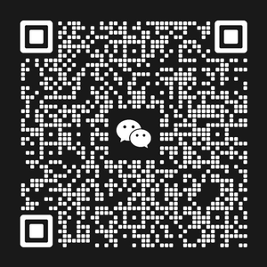

# Team & Org

## Project Overview

OpenViking is an open-source context database for AI agents, initiated and maintained by the Viking team at ByteDance's Volcengine. It organizes resources, memories, and skills as files that agents can browse, search, and read on demand.

## Team Introduction

### Viking Team Background

The Viking team develops vector retrieval, knowledge base, and memory management products. OpenViking applies that engineering experience to a context database developed with the open-source community.

This work involves three related problems: extracting searchable information from unstructured content, finding relevant context among many candidates, and retaining interaction experience for later tasks. OpenViking addresses these through [resource parsing and extraction](../concepts/06-extraction.md), [context retrieval](../concepts/07-retrieval.md), and [session and memory management](../concepts/08-session.md). These pages explain the implementation and conditions for use.

### Development History and Technical Evolution

| Period | Work |
| --- | --- |
| 2019–2023 | VikingDB used for vector retrieval within ByteDance |
| 2024 | VikingDB, Viking Knowledge Base, and Viking Memory Base offered on Volcengine |
| 2025 | Expanded into AI search and knowledge assistants |
| Late 2025 | Open-sourced [MineContext](https://github.com/volcengine/MineContext) to explore proactive context applications |
| Early 2026 | Open-sourced OpenViking |

### Academic Collaboration and Industry–Academia Integration

Since its launch, OpenViking has worked with universities and research institutes to explore context database design and engineering practice for AI agents, keeping research work tied to real application needs.

We sincerely thank the following scholars for their contributions and guidance in launching OpenViking:

- Associate Professor Sun Yahui, School of Information, Renmin University of China
- Professor Gao Yunjun, School of Software, Zhejiang University; Researchers Zhu Yifan and Ge Congcong
- Associate Professor Dai Guohao, School of Artificial Intelligence, Shanghai Jiao Tong University; Co‑founder and Chief Scientist of Wuwen Xinqiong

Our collaboration models include:

- **Joint research projects**: frontier research in context engineering
- **Technical workshops**: regular academic exchanges and technical reviews
- **Talent cultivation**: practice platforms and research topics for graduate students
- **Technology transfer**: turning research results into engineering practice

### Research Papers

The following papers come from this collaboration. Parts of their core mechanisms are integrated into OpenViking.

- **VikingMem: A Memory Base Management System for Stateful LLM-based Applications** 
  Jiajie Fu, Junwen Chen, Mengzhao Wang, Aoxiang He, Maojia Sheng, Xiangyu Ke, Yifan Zhu, and Yunjun Gao. arXiv:2605.29640, 2026. Presented at VLDB 2026. 
  Event-driven extraction, update, and consolidation of long-term memory for stateful agents. [arXiv](https://arxiv.org/abs/2605.29640) · [PDF](https://arxiv.org/pdf/2605.29640)
- **Directory-Aware Query and Maintenance in Vector Databases** 
  Mengzhao Wang, Zheng Gong, Jingpei Hu, Jiajie Fu, Maojia Sheng, Junwen Chen, and Yifan Zhu. arXiv:2606.16903, 2026. Accepted by ICDE. 
  Formal foundations and index design (TrieHI) for directory-scoped retrieval, which OpenViking uses to resolve directory scopes before vector ranking. [arXiv](https://arxiv.org/abs/2606.16903) · [PDF](https://arxiv.org/pdf/2606.16903)
- **VikingRAG: Accurate and Token-efficient Retrieval-augmented Generation over Structured Documents** 
  Peiyuan Gao, Gaoyuan Zhang, Haojie Qin, Yahui Sun, Qianyi Zhang, Yunhao Zhang, Zeyu Wang, and Wei Lu. arXiv:2609.11390, 2026. Submitted. 
  Combines semantic search with document structure, expanding relevant directory segments as evidence gaps arise. [arXiv](https://arxiv.org/abs/2609.11390) · [PDF](https://arxiv.org/pdf/2609.11390)

## Open-Source Organization

### Project Development Stages

Development covers context storage and retrieval, agent integrations, and deployment. See the [roadmap](03-roadmap.md) for implemented capabilities and future directions, and the [changelog](02-changelog.md) for released changes.

### Governance Structure and Decision-Making

The governance committee oversees technical direction, release and feature priorities, architecture and compatibility reviews, engineering standards, contributor collaboration, and integrations with related projects. Members include Haojie Qin, Jiahui Zhou, Linggang Wang, Maojia Sheng, and Yaohui Sun.

See the [contribution guide](https://github.com/volcengine/OpenViking/blob/main/CONTRIBUTING.md) for module contacts and recently active reviewers.

Feature proposals and problems are discussed in [GitHub Issues](https://github.com/volcengine/OpenViking/issues). Code and documentation changes are reviewed through pull requests. Before implementing changes to public interfaces, persistence, permission boundaries, or architecture across modules, describe the current and intended behavior, request or configuration examples, and compatibility impact.

## Community Participation

### Join the Community

#### Lark Group

Scan the QR code to discuss usage questions and development plans:

Install the [Lark client](https://www.feishu.cn/) first.

#### WeChat Group

Scan the QR code to add the assistant and mention "OpenViking" to request an invitation:

You can also join [Discord](https://discord.com/invite/eHvx8E9XF3) or follow project updates on [X](https://x.com/openvikingai).

### Ways to Participate

- **Report a problem or suggest a feature:** include the use case, version, and reproduction steps in an [issue](https://github.com/volcengine/OpenViking/issues).
- **Improve code or documentation:** read the [contribution guide](https://github.com/volcengine/OpenViking/blob/main/CONTRIBUTING.md), then submit code, tests, documentation, or translations.
- **Build an integration:** add a plugin for an agent tool or framework using the [plugin development guide](../agent-integrations/18-plugin-development.md).
- **Share experience:** post usage examples and troubleshooting notes, or help other users in the community.

For what to include in issues and pull requests, see the [contribution guide](https://github.com/volcengine/OpenViking/blob/main/CONTRIBUTING.md).

## Discussion and Collaboration

The [GitHub repository](https://github.com/volcengine/OpenViking) holds code, documentation, and review records. Use [GitHub Discussions](https://github.com/volcengine/OpenViking/discussions) for design discussions and community exchange, chat for immediate discussion, and an issue or pull request for work that needs tracking.
