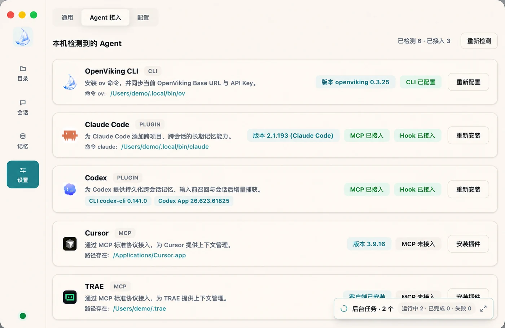
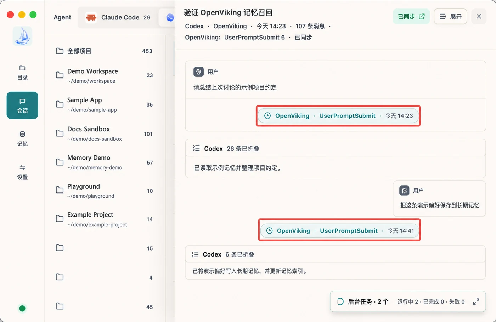
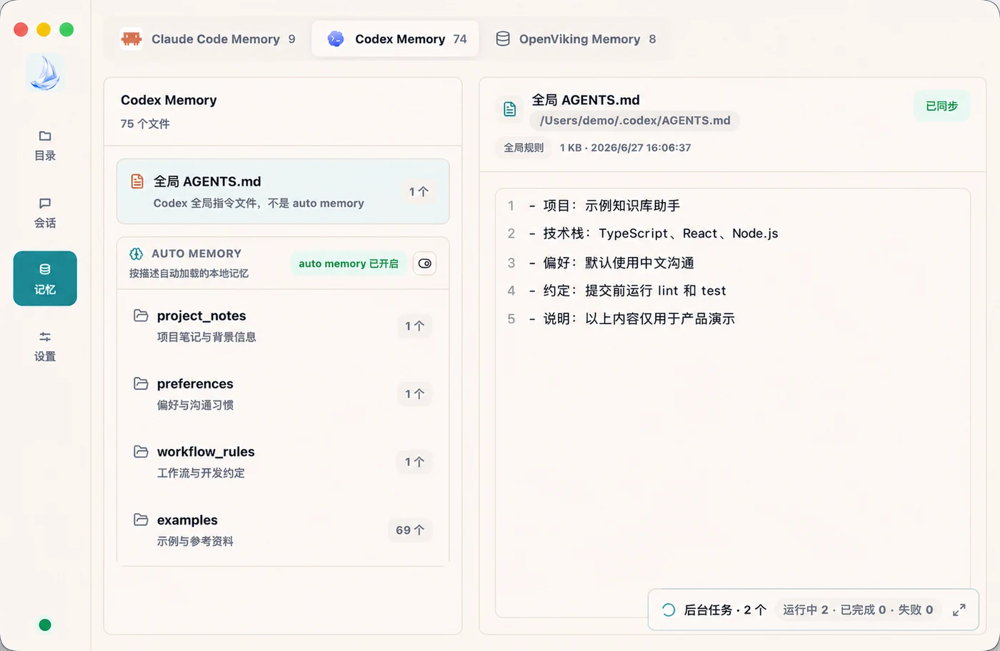

# OpenViking Helper

OpenViking Helper is a desktop console for local coding agents. It brings OpenViking setup that would otherwise be spread across commands, configuration files, and installation scripts into one interface, together with session inspection and local memory and skill management.

Helper does not replace the Claude Code, Codex, Cursor, TRAE, or OpenCode integrations. It uses the same OpenViking configuration to install them, check their status, and show whether OpenViking is actually active in a session.

OpenViking Helper is currently in beta and supports macOS and Windows x64. The application UI is available in English and Chinese; switch languages at any time under **Settings → General → Display Language**.

## Download

| Platform | Architecture | Download |
|----------|--------------|----------|
| macOS | Apple Silicon (arm64) | [Download DMG](https://lf3-cdn-tos.bytegoofy.com/obj/tron-demo/7654844610543360265/420238785/0.0.19/darwin-arm64/openviking-helper-0.0.19-arm64.dmg) |
| macOS | Intel (x64) | [Download DMG](https://lf3-cdn-tos.bytegoofy.com/obj/tron-demo/7654844610543360265/420238785/0.0.19/darwin-x64/openviking-helper-0.0.19-x64.dmg) |
| Windows | x64 | [Download installer](https://lf3-cdn-tos.bytegoofy.com/obj/tron-demo/7654844610543360265/420238785/0.0.19/win32-x64/openviking-helper-0.0.19-x64.exe) |

## Get started

1. Download and launch the package that matches your platform and architecture.
2. Open **Settings → Configuration**, select Volcengine Cloud or a self-hosted OpenViking service, enter the connection details, and test the connection.
3. Open **Settings → Agent Integration**. Helper detects the OpenViking CLI, Claude Code, Codex, Cursor, TRAE, and OpenCode on your machine.
4. Install or configure the plugin, MCP server, Hook, or CLI integration for each agent you want to use, then restart the agent when prompted.
5. Use the **Sessions**, **Memory**, and **Skills** pages to inspect the integration and local data.

## Set up agents visually

Helper detects installed local agents and displays their OpenViking integration status. From the UI, you can maintain multiple OpenViking service profiles, switch the active profile, test connectivity, and install or repair supported agent integrations.

The exact capabilities still depend on each agent integration. Refer to the corresponding integration guide for lifecycle Hooks, MCP tools, and automatic recall behavior in Claude Code, Codex, Cursor, TRAE, and OpenCode.

## Inspect session traces

Helper parses local Claude Code, Codex, and TRAE sessions and groups their timelines by agent and project. Session details show important OpenViking activity, including whether:

- memory recall and context injection ran before a prompt;
- the session called an OpenViking MCP tool;
- new conversation turns were captured after a response;
- the session was committed before context compaction;
- lifecycle actions ran at session start or end.

This makes it easier to verify that an integration is working and to diagnose configuration, Hook, or MCP connection problems.

## Manage memories and skills

Helper groups local memory and rule files and `SKILL.md` skills by agent and project. You can inspect their content, path, modification time, and sync status, then sync selected local content to the active OpenViking service.

After syncing, you can browse the server-side memory categories and content from Helper. Long-term information that was previously scattered across agents can then be searched and reused through OpenViking.

## Local data and privacy

Helper reads the relevant local agent configuration and data to display integration status, sessions, and memories. Content is sent to the active OpenViking service only when you sync it or use a service-backed capability. Before syncing, confirm the service address and review the selected content for sensitive information.

## See also

- [Agent integrations overview](./01-overview.md)
- [Claude Code Memory Plugin](./02-claude-code.md)
- [Codex Memory Plugin](./04-codex.md)
- [Cursor Memory Integration](./12-cursor.md)
- [TRAE Memory Integration](./13-trae.md)
- [OpenCode Plugin](./10-opencode.md)
