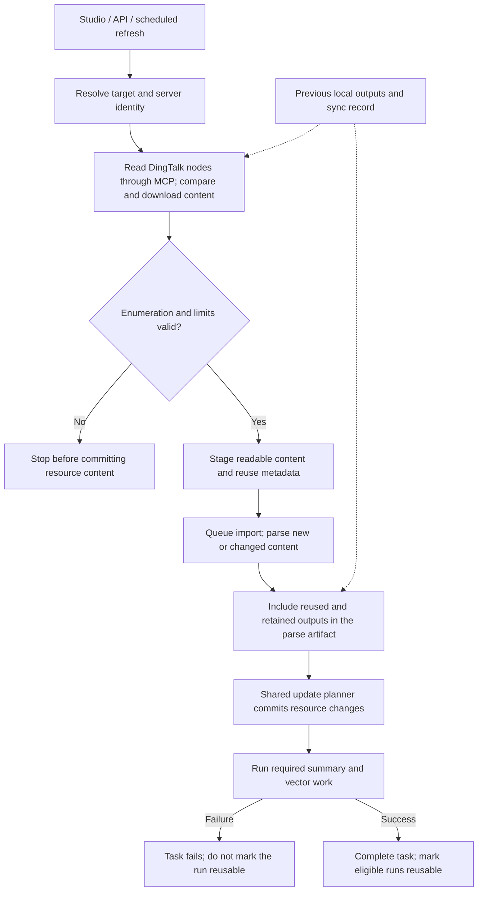

# DingTalk resource import and scheduled sync

OpenViking can import DingTalk documents, folders, workspaces, spreadsheets, AI Tables, and ordinary files through server-configured DingTalk MCP services. The integration reads DingTalk content and passes it through the existing OpenViking parsing, summary, and indexing pipeline. It does not write changes back to DingTalk.

## Import and refresh flow

Manual imports and scheduled refreshes use the same resource pipeline. The diagram below can be viewed directly on GitHub.



An unreadable child can be skipped while its readable siblings continue. Previously imported output for that child, or a node missing from the latest listing, is included before the shared planner calculates deletions. Structural failures stop the refresh; no readable or reusable content also means the import cannot proceed.

Content commit happens before summary and vector work. If that later work fails, the run is not marked reusable, but already committed content is not rolled back. A successful task is not always eligible for source reuse: the completion record remains incomplete when warnings other than the supported unreadable-child warnings are present, including local parse skips and retained missing nodes.

## Reviewer navigation

| Review question | Implementation | Regression coverage |
| --- | --- | --- |
| Where are identities configured, and what can the browser see? | [Identity configuration](../../../openviking_cli/utils/config/dingtalk_config.py), [resource routes](../../../openviking/server/routers/resources.py) | [Identity response redaction](../../../tests/server/test_dingtalk_identities.py) |
| How are nodes listed, downloaded, retried, and compared? | [DingTalk accessor](../../../openviking/parse/accessors/dingtalk_accessor.py), [MCP client](../../../openviking/parse/accessors/dingtalk_client.py) | [Accessor contracts and failure cases](../../../tests/parse/test_dingtalk_accessor.py) |
| Why do missing or unreadable nodes keep their old content? | [Artifact preparation](../../../openviking/resource/dingtalk_import.py), [resource processor](../../../openviking/utils/resource_processor.py) | [Retention and real planner deletion actions](../../../tests/storage/test_dingtalk_sync_protection.py) |
| When can a later run reuse previous output? | [Sync completion records](../../../openviking/resource/dingtalk_incremental.py), [queued import completion](../../../openviking/storage/queuefs/add_resource_processor.py) | [Reuse validation](../../../tests/resource/test_dingtalk_incremental.py), [descendant failure handling](../../../tests/storage/test_add_resource_processor_dingtalk.py) |
| How does Studio submit an identity and sync limits? | [DingTalk form fields](../../../web-studio/src/routes/resources/-components/dingtalk-resource-options.tsx) | [Import form behavior](../../../web-studio/src/routes/resources/-components/add-resource-page.test.tsx) |

For a concrete refresh, suppose the destination contains documents A and B. If the next listing contains updated A and new C but omits B, the import updates A, adds C, retains B, and reports the missing node. If listing the next page fails instead, it stops before applying that snapshot. The retention test linked above checks these rules using the shared planner rather than a separate DingTalk deletion algorithm.

## Configure an identity on the server

Create a named identity in the OpenViking server configuration. The `doc` service is required. Add `sheets` and `ai_table` only when this identity must read those resource types.

The following redacted example is valid JSON and can be merged into `ov.conf` after replacing the example endpoints and credentials:

```json
{
  "dingtalk": {
    "identities": {
      "team-docs": {
        "label": "Team documentation (read only)",
        "doc": {
          "url": "https://doc-mcp.example.invalid/mcp",
          "headers": {
            "Authorization": "Bearer REPLACE_WITH_SECRET"
          }
        },
        "sheets": {
          "url": "https://sheets-mcp.example.invalid/mcp",
          "headers": {
            "Authorization": "Bearer REPLACE_WITH_SECRET"
          }
        },
        "ai_table": {
          "url": "https://ai-table-mcp.example.invalid/mcp",
          "headers": {
            "Authorization": "Bearer REPLACE_WITH_SECRET"
          }
        }
      }
    }
  }
}
```

Each endpoint must use Streamable HTTP and has its own optional `headers` object with string keys and values. Treat endpoint URLs and headers as secrets because either may contain credentials.

The identity is resolved by the server. Studio and import requests send only its name, such as `team-docs`; MCP endpoints and credentials are not returned to the browser or stored in the import request. After changing the configuration, restart the server so Studio can load the updated identity list.

A configured identity is shared across the server; it is not a per-user DingTalk OAuth login. Any authenticated OpenViking user who is allowed to call the resource import API can select it by name. Configure an identity only in a deployment where every such user is allowed to use that DingTalk identity.

Grant the identity read access to the selected root and all descendants that should be imported. It also needs download access for files, images, and attachments. A spreadsheet requires the `sheets` endpoint, and an AI Table requires the `ai_table` endpoint. Use the least DingTalk permissions needed for those reads.

## Import from Studio

1. Open **Add resource**, select **Remote resource**, and paste a supported DingTalk URL. You can keep automatic detection or select **DingTalk** manually.
2. Select a server identity. If the list is empty, configure an identity on the server and reload the page.
3. Review the node, depth, and byte limits. Choose the OpenViking destination and, if needed, enable scheduled sync.
4. To run the first import but leave later scheduled runs paused, select **Create paused**. Resume it later from **Scheduled Sync**.
5. Submit the import and check its result in the task view.

Supported source URLs are:

```text
https://alidocs.dingtalk.com/i/nodes/<node-id>
https://docs.dingtalk.com/i/nodes/<node-id>
https://alidocs.dingtalk.com/i/spaces/<workspace-id>/overview
https://docs.dingtalk.com/i/spaces/<workspace-id>/overview
```

Other DingTalk paths are rejected instead of being fetched as ordinary web pages.

The same operation can be submitted through the resource API or SDK. This example creates an hourly sync that remains paused after the initial import:

```json
{
  "path": "https://alidocs.dingtalk.com/i/nodes/REPLACE_WITH_NODE_ID",
  "to": "viking://resources/team-handbook",
  "watch_interval": 60,
  "is_active": false,
  "args": {
    "dingtalk_identity": "team-docs",
    "dingtalk_max_nodes": 1000,
    "dingtalk_max_depth": 20,
    "dingtalk_max_bytes": 536870912
  }
}
```

`watch_interval` is measured in minutes. Use `0` for a one-time import and omit `is_active`. Setting `is_active` to `false` still runs the initial import; it only pauses later scheduled runs.

The initial import can finish with reported skips for non-structural file failures. An unreadable child file, or a downloaded file that the local parser cannot parse or support, may be omitted while readable siblings are imported. Failures that prevent reliable traversal, including an unreadable root, invalid node information, folder or workspace listing and pagination errors, or a configured limit being reached, stop the run without applying partial output.

## Access after import

DingTalk permissions control what the selected identity can read. The destination's OpenViking permissions control who can use the imported copy. Later DingTalk permission changes do not automatically change the OpenViking destination permissions.

Choose a destination with the appropriate OpenViking access rules. If the DingTalk identity later loses access, a refresh follows the protection rules below; it does not revoke access to content already stored in OpenViking.

## Refresh behavior

Every refresh enumerates the folder or workspace so it can find new, moved, and updated nodes. OpenViking then applies these rules:

| Source result | Refresh behavior |
| --- | --- |
| Unchanged node | Reuses the previous processed output and skips parsing, summaries, and vector generation. A document with a reliable version or update marker can be reused without reading its body. Files, tables, images, attachments, and documents without such a marker are read and compared before reuse. |
| New node | Adds and processes the new content. |
| Updated node | Replaces that node's previous output, including stale sections and dependencies owned by it. |
| Moved node | Imports the node at its current ID-based path and retains its previous path so old references are not broken automatically. |
| Node absent from the latest listing | Keeps the previous output. Absence can mean deletion, movement, or lost permission, so refresh does not mirror source deletions automatically. |
| Child file content cannot be read | Skips that child and retries it on the next refresh. If a previous output exists, it is retained; a newly discovered unreadable child has no imported body. |
| Folder or workspace listing fails | Stops the refresh and leaves the existing destination unchanged. Partial enumeration is not applied. |

Reuse requires a complete previous run, matching processing settings, and unmodified local output. Changes to the selected identity or parser settings disable source reuse and parse the content again. The shared update planner decides whether the parsed output needs new summaries or vectors; a model configuration change alone is not a forced reindex. When every node is reusable, OpenViking also skips model processing for unaffected parent directories.

## Limits and current constraints

| Option | Default | Meaning |
| --- | ---: | --- |
| `dingtalk_max_nodes` | `1000` | Maximum number of visited root, child, and resolved shortcut nodes. |
| `dingtalk_max_depth` | `20` | Maximum folder depth; `0` allows only the selected root. |
| `dingtalk_max_bytes` | `536870912` | Maximum bytes for the run, including downloaded content and generated local text. |

Limits must be integers. Node and byte limits must be greater than zero; depth may be zero. Reaching any limit stops the run without applying partial output to the destination.

Additional constraints:

- Each worksheet is limited to 1,000 read blocks, and each AI Table is limited to 1,000 pages. Exceeding either limit fails the run.
- Document images are downloaded and rewritten to local relative references. Root-level attachment blocks and DingTalk asset links in Markdown are localized. Nested attachment discovery is not complete; if a temporary DingTalk asset reference remains, the node cannot be accepted as complete.
- CSV output preserves displayed cell values, positions, and merge metadata; it is not an editable workbook backup.
- Unsupported local file formats can be skipped by the existing directory parser and are reported in the import result.
