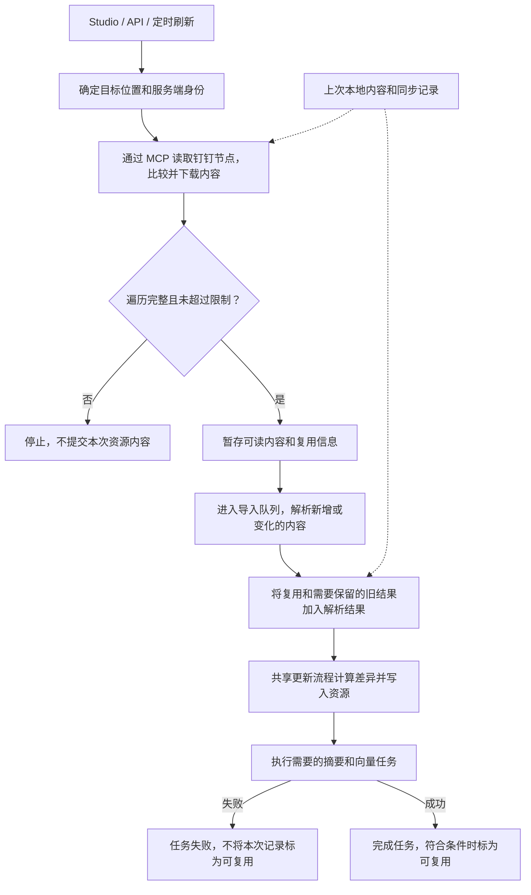

# 钉钉资源导入与定时同步

OpenViking 可以通过服务端配置的钉钉 MCP 服务导入文档、目录、知识空间、电子表格、AI 表格和普通文件。导入内容会进入 OpenViking 现有的解析、摘要和索引流程。此功能只读取钉钉内容，不会写回钉钉。

## 导入和刷新流程

手动导入和定时刷新使用同一套资源处理流程。下面的流程图可以直接在 GitHub 中查看。



不可读的子文件可以跳过，可读的同级内容继续导入。在共享流程计算删除操作之前，会先加入该子文件已有的旧结果，以及本次列表中缺失节点的旧结果。遍历结构不完整会停止刷新；没有任何可读或可复用内容时也无法继续导入。

资源内容先写入，再执行摘要和向量任务。如果后续任务失败，本次记录不会被标为可复用，但已经写入的内容不会回滚。任务成功也不一定可以复用：除支持的“子文件不可读”提示之外，存在其他警告时不会完成复用记录，例如本地解析跳过、保留缺失节点。

## 审核阅读索引

| 审核问题 | 实现位置 | 回归测试 |
| --- | --- | --- |
| 身份在哪里配置，浏览器能看到哪些信息？ | [身份配置](../../../openviking_cli/utils/config/dingtalk_config.py)、[资源接口](../../../openviking/server/routers/resources.py) | [身份返回值不含凭证](../../../tests/server/test_dingtalk_identities.py) |
| 如何列出、下载、重试和比较节点？ | [钉钉读取模块](../../../openviking/parse/accessors/dingtalk_accessor.py)、[MCP 客户端](../../../openviking/parse/accessors/dingtalk_client.py) | [来源读取和失败场景](../../../tests/parse/test_dingtalk_accessor.py) |
| 缺失或不可读节点为什么不会误删旧内容？ | [解析结果准备](../../../openviking/resource/dingtalk_import.py)、[资源处理流程](../../../openviking/utils/resource_processor.py) | [保留旧结果及实际删除清单](../../../tests/storage/test_dingtalk_sync_protection.py) |
| 后续运行什么时候能复用旧结果？ | [同步完成记录](../../../openviking/resource/dingtalk_incremental.py)、[队列任务完成处理](../../../openviking/storage/queuefs/add_resource_processor.py) | [复用条件](../../../tests/resource/test_dingtalk_incremental.py)、[后续任务失败处理](../../../tests/storage/test_add_resource_processor_dingtalk.py) |
| Studio 如何提交身份和同步限制？ | [钉钉表单](../../../web-studio/src/routes/resources/-components/dingtalk-resource-options.tsx) | [导入表单行为](../../../web-studio/src/routes/resources/-components/add-resource-page.test.tsx) |

例如目标中已有文档 A 和 B，下一次列表包含更新后的 A 和新增的 C，却没有 B：导入会更新 A、添加 C、保留 B，并报告缺失节点。如果读取下一页列表失败，则会在写入之前停止处理这次结果。上面的保留测试会调用共享更新流程验证这些规则，不另建一套钉钉删除逻辑。

## 在服务端配置身份

在 OpenViking 服务端配置中创建一个命名身份。`doc` 服务必填；只有需要读取电子表格或 AI 表格时，才需要分别添加 `sheets` 和 `ai_table`。

下面是可直接合并到 `ov.conf` 的脱敏 JSON 示例。使用前请替换示例地址和凭证：

```json
{
  "dingtalk": {
    "identities": {
      "team-docs": {
        "label": "团队文档（只读）",
        "doc": {
          "url": "https://doc-mcp.example.invalid/mcp",
          "headers": {
            "Authorization": "Bearer REPLACE_WITH_SECRET"
          }
        },
        "sheets": {
          "url": "https://sheets-mcp.example.invalid/mcp",
          "headers": {
            "Authorization": "Bearer REPLACE_WITH_SECRET"
          }
        },
        "ai_table": {
          "url": "https://ai-table-mcp.example.invalid/mcp",
          "headers": {
            "Authorization": "Bearer REPLACE_WITH_SECRET"
          }
        }
      }
    }
  }
}
```

每个地址都需要使用 Streamable HTTP，并且有各自可省略的 `headers` 对象，其中的键和值都必须是字符串。地址本身也可能包含凭证，因此地址和请求头都应按密钥管理。

身份由服务端解析。Studio 和导入请求只提交身份名称，例如 `team-docs`；MCP 地址和凭证不会返回浏览器，也不会写入导入请求。修改配置后重启服务，Studio 才能读取更新后的身份列表。

配置的身份在整个服务端共享，不是每个用户单独登录的钉钉 OAuth。任何允许调用资源导入接口的 OpenViking 认证用户都可以按名称选择该身份。只有当这些用户都被允许使用这个钉钉身份时，才应在该部署中配置它。

该身份需要拥有所选根节点和待导入子节点的读取权限，还需要文件、图片和附件的下载权限。读取电子表格必须配置 `sheets` 地址，读取 AI 表格必须配置 `ai_table` 地址。钉钉侧只授予完成这些读取所需的权限。

## 在 Studio 中导入

1. 打开“添加资源”，选择“远程资源”，粘贴支持的钉钉链接。可以使用自动识别，也可以手动选择“钉钉”。
2. 选择一个服务端身份。如果列表为空，需要先在服务端配置身份，再刷新页面。
3. 检查节点数、深度和字节数限制，选择 OpenViking 目标位置，并按需启用定时同步。
4. 如需先执行首次导入、随后暂停定时任务，选择“创建后暂停”。之后可以在“定时同步”页面恢复。
5. 提交导入，并在任务页面查看结果。

支持以下来源地址：

```text
https://alidocs.dingtalk.com/i/nodes/<节点ID>
https://docs.dingtalk.com/i/nodes/<节点ID>
https://alidocs.dingtalk.com/i/spaces/<知识空间ID>/overview
https://docs.dingtalk.com/i/spaces/<知识空间ID>/overview
```

其他钉钉路径会被拒绝，不会按普通网页抓取。

也可以通过资源 API 或 SDK 提交相同参数。下面的示例会创建每小时同步一次的任务，首次导入完成后保持暂停：

```json
{
  "path": "https://alidocs.dingtalk.com/i/nodes/REPLACE_WITH_NODE_ID",
  "to": "viking://resources/team-handbook",
  "watch_interval": 60,
  "is_active": false,
  "args": {
    "dingtalk_identity": "team-docs",
    "dingtalk_max_nodes": 1000,
    "dingtalk_max_depth": 20,
    "dingtalk_max_bytes": 536870912
  }
}
```

`watch_interval` 的单位是分钟。一次性导入时将它设为 `0`，并省略 `is_active`。`is_active` 设为 `false` 仍会执行首次导入，只会暂停后续定时任务。

首次导入遇到不影响目录结构的文件失败时，可以报告后继续。不可读的子文件，或下载后无法被本地解析器处理、格式不受支持的文件，可能会被跳过，同时导入可读的同级内容。无法继续完整遍历时会停止整次导入且不写入部分结果，包括根节点不可读、节点信息无效、目录或知识空间列表与分页失败，以及达到配置限制。

## 导入后的访问权限

钉钉权限决定所选身份可以读取哪些来源内容；目标位置的 OpenViking 权限决定谁可以使用导入后的副本。钉钉权限后续发生变化时，OpenViking 目标位置的权限不会自动变化。

应为目标位置设置合适的 OpenViking 访问规则。如果钉钉身份之后失去读取权限，刷新会按下一节的保护规则处理，不会自动撤销用户对 OpenViking 旧内容的访问。

## 刷新规则

每次刷新都会重新列出目录或知识空间，从而发现新增、移动和更新的节点。随后按以下规则处理：

| 来源结果 | 刷新行为 |
| --- | --- |
| 节点未变化 | 复用上次处理结果，跳过解析、摘要和向量生成。有可靠版本号或更新时间的文档可以不读取正文就复用；文件、表格、图片、附件以及缺少可靠标记的文档仍需读取并比较后才能复用。 |
| 新增节点 | 添加并处理新内容。 |
| 已更新节点 | 替换该节点的旧结果，同时清理属于该节点的旧章节和旧依赖文件。 |
| 已移动节点 | 按当前基于节点 ID 的路径导入，同时保留旧路径，避免自动破坏已有引用。 |
| 本次列表中缺少节点 | 保留旧结果。节点可能已删除、移动或变得无权读取，因此刷新不会自动照搬来源删除操作。 |
| 目录中的子文件内容不可读 | 跳过该子文件，并在下次刷新时重试。如果已有旧结果则继续保留；新发现但不可读的子文件不会产生正文。 |
| 目录或知识空间列表读取失败 | 停止整次刷新，保持现有目标内容不变，不会提交只列出一部分节点的结果。 |

只有上次运行完整、处理设置相同且本地结果未被修改时，才能复用结果。更换身份或修改解析配置会关闭来源复用并重新解析内容。是否重新生成摘要和向量由共享更新流程判断；仅修改模型配置不会强制重建索引。如果所有节点都可复用，OpenViking 也会跳过未受影响父目录的模型处理。

## 限制和当前边界

| 参数 | 默认值 | 含义 |
| --- | ---: | --- |
| `dingtalk_max_nodes` | `1000` | 本次最多访问的根节点、子节点和快捷方式目标总数。 |
| `dingtalk_max_depth` | `20` | 最大目录深度；`0` 表示只允许所选根节点。 |
| `dingtalk_max_bytes` | `536870912` | 本次最大字节数，包括下载内容和生成的本地文本。 |

这些参数必须是整数。节点数和字节数必须大于零，深度可以为零。达到任一限制时，本次运行会停止，不会把部分结果写入目标位置。

其他边界：

- 每个工作表最多读取 1,000 个数据块，每个 AI 表格最多读取 1,000 页；超过限制会使本次运行失败。
- 文档图片会下载并改写为本地相对引用。根级附件块和 Markdown 中的钉钉资源链接也会转为本地文件。嵌套附件目前不能保证全部识别；如果处理后仍存在临时钉钉资源链接，该节点不会被当作完整内容接收。
- CSV 会保留单元格显示值、位置和合并信息，但不是可编辑的工作簿备份。
- 现有目录解析器不支持的本地文件格式可能被跳过，并在导入结果中报告。
