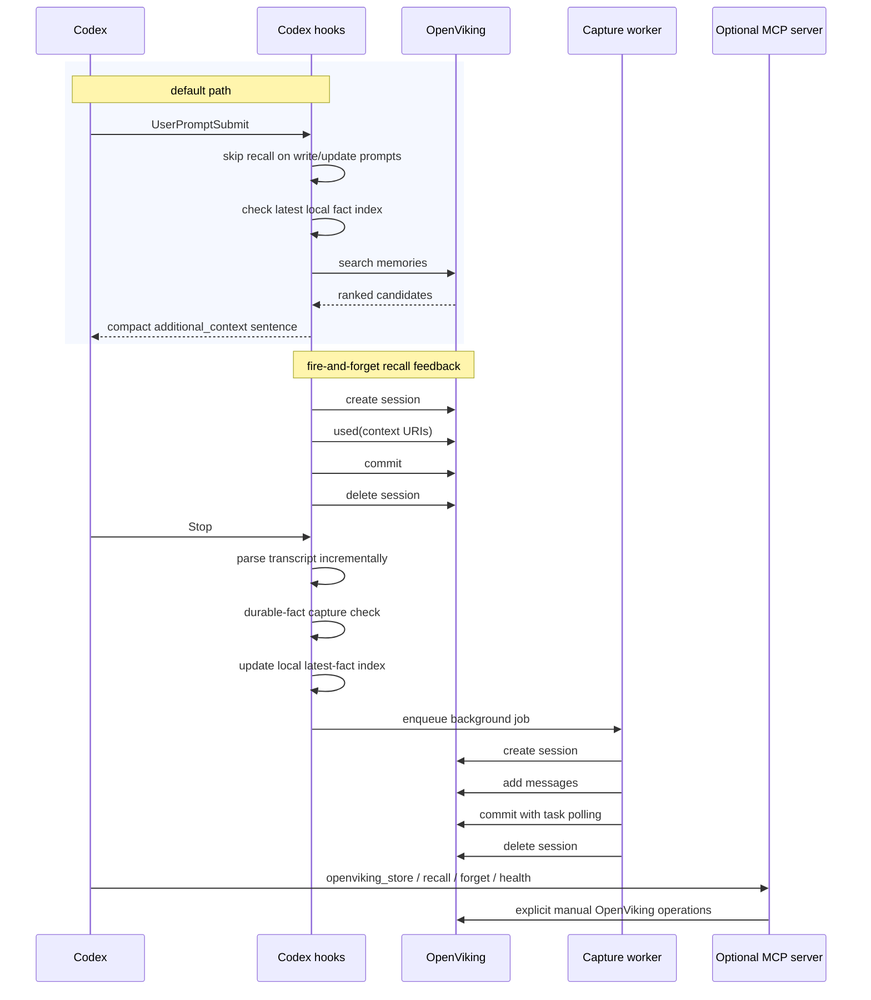

# OpenViking Memory Plugin for Codex

OpenViking wants long-term memory to feel automatic.

This Codex example now follows that model:

- transparent recall on `UserPromptSubmit`
- transparent capture on `Stop`
- explicit MCP tools only for optional manual OpenViking control

The default mode is `full`. A configurable `recall_only` mode is also
supported for setups where another system populates OpenViking and the Codex
plugin should act only as the recall/query layer.

This is still a repo example, not a fully auto-installed Codex marketplace
plugin. Codex currently discovers lifecycle hooks from `hooks.json`, not from a
plugin manifest, so this example ships both the plugin bundle shape and a
one-time hook installer.

## Architecture

- `.codex-plugin/plugin.json`
  - plugin metadata for future Codex plugin flows
- `.mcp.json`
  - optional explicit OpenViking MCP server wiring
- `scripts/auto-recall.mjs`
  - transparent recall hook
- `scripts/auto-capture.mjs`
  - transparent capture hook that enqueues background writes
- `scripts/capture-worker.mjs`
  - background worker for OpenViking writes
- `scripts/start-memory-server.mjs`
  - launches the built MCP server from the bootstrapped runtime
- `scripts/install-codex-hooks.mjs`
  - writes managed hook entries into `~/.codex/hooks.json`
- `src/memory-server.ts`
  - explicit/manual OpenViking tools for store, recall, forget, and health

## How It Works

### 1. Transparent recall

On every `UserPromptSubmit`, the hook:

- skips obvious write/update prompts
- checks the local latest-fact index first
- checks OpenViking health
- searches `viking://user/memories` and `viking://agent/memories`
- optionally searches `viking://agent/skills`
- reranks and dedupes results
- injects at most one compact memory sentence into Codex context
- marks returned URIs as `used()` and commits that feedback asynchronously

### 2. Transparent capture

In `full` mode, on every `Stop`, the hook:

- parses the Codex transcript
- captures only new turns since the last successful pass
- captures user turns only by default
- strips previously injected memory context
- keeps only durable-fact style captures by default
- updates a local latest-fact index immediately
- enqueues the OpenViking write into a background worker
- fails open if OpenViking is down or slow

### 3. Manual MCP tools

The MCP server remains available for explicit/manual operations, but it is not
part of the default happy path:

- `openviking_recall`
- `openviking_store`
- `openviking_forget`
- `openviking_health`

These are explicitly OpenViking operations. They are not Codex-native local
memory.

### 4. Plugin modes

- `full`
  - transparent recall enabled
  - transparent capture enabled
  - manual store/delete tools enabled
- `recall_only`
  - transparent recall enabled
  - transparent capture disabled
  - manual `openviking_store` and `openviking_forget` disabled
  - manual `openviking_recall` and `openviking_health` still available

## Install

Prerequisites:

- Codex CLI
- OpenViking server
- Node.js 22+

Build the example:

```bash
cd examples/codex-memory-plugin
npm ci
npm run build
```

Install the lifecycle hooks:

```bash
cd examples/codex-memory-plugin
npm run install:hooks
```

The installer writes managed entries into the active `CODEX_HOME`. Set
`CODEX_HOME=/path/to/test-home` first if you want to test without touching your
default Codex home. Rerun the installer after changing plugin mode so the
managed hook set matches the current config.

Verify the hook-first path in a new Codex session:

```bash
codex --no-alt-screen -C /tmp
```

Then say something like:

```text
For future reference, my weird constellation codeword is comet-saffron-demo-20260408.
```

Exit, start a fresh session, and ask:

```text
what is my weird constellation codeword?
```

The second session should answer with the stored codeword directly.

Optional manual MCP install:

```bash
codex mcp add openviking-memory -- \
  node /ABS/PATH/TO/OpenViking/examples/codex-memory-plugin/scripts/start-memory-server.mjs
```

Remove the example later if needed:

```bash
cd examples/codex-memory-plugin
npm run uninstall:hooks
```

If you installed the optional manual MCP layer, also remove it:

```bash
codex mcp remove openviking-memory
```

## Current Codex Limitation

The repo now includes a real Codex plugin bundle shape:

- `.codex-plugin/plugin.json`
- `.mcp.json`
- `hooks/hooks.json`

But Codex does not yet auto-discover lifecycle hooks from the plugin manifest in
this example flow. Hook discovery still happens from `~/.codex/hooks.json`, so
the hook installer is the practical bridge today.

That means setup is currently:

1. install the hooks for the default experience
2. optionally add the MCP server for manual inspection/control

The product intent is still transparent memory first.

## Config

The example reads OpenViking connection details from `~/.openviking/ov.conf`.
Codex-specific overrides live in a sidecar plugin config file at:

`~/.openviking/codex-memory-plugin/config.json`

Example:

```json
{
  "mode": "full",
  "agentId": "codex",
  "timeoutMs": 15000,
  "autoRecall": true,
  "recallLimit": 1,
  "scoreThreshold": 0.01,
  "minQueryLength": 3,
  "searchAgentSkills": false,
  "skipRecallOnWritePrompts": true,
  "maxInjectedMemories": 1,
  "preferPromptLanguage": true,
  "autoCapture": true,
  "captureMode": "durable-facts",
  "captureDispatch": "background",
  "captureMaxLength": 24000,
  "captureTimeoutMs": 30000,
  "captureAssistantTurns": false,
  "debug": false,
  "logRankingDetails": false
}
```

`mode` is the canonical lifecycle setting:

- `full`
  - installs `UserPromptSubmit` and, when capture is enabled, `Stop`
  - allows plugin-originated capture and manual store/delete
- `recall_only`
  - installs `UserPromptSubmit` only
  - disables plugin-originated capture and manual store/delete

`autoCapture` can still be used as an extra local override inside `full`, but
`recall_only` always disables write paths.

This is separate from `ov.conf` because the current OpenViking server config
schema rejects unknown top-level plugin sections.

Useful env overrides:

- `OPENVIKING_CONFIG_FILE`
- `OPENVIKING_CODEX_CONFIG_FILE`
- `OPENVIKING_AGENT_ID`
- `OPENVIKING_TIMEOUT_MS`
- `OPENVIKING_RECALL_LIMIT`
- `OPENVIKING_SCORE_THRESHOLD`
- `OPENVIKING_CODEX_PLUGIN_HOME`
- `OPENVIKING_DEBUG`
- `OPENVIKING_DEBUG_LOG`

Keep the `UserPromptSubmit` hook timeout above your effective OpenViking recall
budget. With `thinking` plus rerank enabled, a 30 second hook timeout is a
safer default than a single-digit timeout.

Runtime and state paths:

- runtime: `~/.openviking/codex-memory-plugin/runtime`
- queue: `~/.openviking/codex-memory-plugin/queue`
- capture state: `~/.openviking/codex-memory-plugin/state`
- debug log: `~/.openviking/logs/codex-hooks.log`

## Flow



## Manual Tool Semantics

`openviking_recall`

- manual inspection or forced recall
- returns compact recalled memory text plus scored summaries

`openviking_store`

- explicit durable write into OpenViking
- uses `session.commit()` plus task polling
- returns extracted count and, when recoverable, likely stored memory URIs
- disabled in `recall_only`

`openviking_forget`

- explicit deletion or correction path
- direct URI delete is supported
- query mode auto-deletes only a single strong match
- otherwise it returns candidate URIs for confirmation
- disabled in `recall_only`

`openviking_health`

- direct connectivity probe for the OpenViking server

## Native Codex Memory

This example is compatible with Codex native memory staying enabled.

The intended boundary is:

- Codex native memory: local implicit adaptation
- OpenViking plugin: transparent long-term recall/capture plus explicit manual memory control

If the model needs to inspect, store, or delete persistent OpenViking memory
explicitly, it should use the OpenViking MCP tools, not rely on ambiguous
native-memory phrasing.

## Current UX Limitation

This plugin-only example can remove plugin-branded labels and raw memory dumps,
but Codex still shows generic hook start/completion rows in the TUI. That is a
Codex UI constraint, not an OpenViking plugin choice.

## Verification

Minimum end-to-end check:

```bash
codex --no-alt-screen -C /tmp
```

Inside Codex:

```text
For future reference, my weird constellation codeword is opal-squid-radar-demo-20260408.
```

Exit, start a fresh session, and ask:

```text
what is my weird constellation codeword?
```

Expected result:

1. the first session stores the codeword without showing raw hook context
2. the second session answers `opal-squid-radar-demo-20260408`
3. Codex may still show generic `hook: UserPromptSubmit` and `hook: Stop` rows
4. Codex should not show plugin-branded labels, XML memory wrappers, or raw memory dumps

For deterministic QA, prefer a unique nonsense phrase such as
`opal-squid-radar-demo-20260408` over broad phrases like "amber tea".

`recall_only` verification:

1. set `"mode": "recall_only"` in `~/.openviking/codex-memory-plugin/config.json`
2. rerun `npm run install:hooks`
3. confirm `~/.codex/hooks.json` contains `UserPromptSubmit` but not `Stop`
4. verify a preexisting OpenViking memory is recalled in a fresh Codex session
5. verify `openviking_store` and `openviking_forget` return a mode-based rejection

Optional manual MCP verification:

```bash
codex mcp add openviking-memory -- \
  node /ABS/PATH/TO/OpenViking/examples/codex-memory-plugin/scripts/start-memory-server.mjs
```

Then in Codex:

```text
Use the external MCP tool `openviking_health` exactly once right now, then return only the tool result.
```

If `openviking_store` returns `0` extracted memories or times out, the MCP and
hook wiring may still be correct. That result usually means the backing
OpenViking extraction pipeline is unhealthy, overloaded, or misconfigured.

## Known Limitations

- Hook install is still explicit because Codex currently reads lifecycle hooks
  from `~/.codex/hooks.json`, not from the plugin manifest in this example flow.
- The MCP server install is still explicit via `codex mcp add`.
- `recall_only` is intentionally strict: the plugin will not create, mutate, or
  delete OpenViking memory in that mode, even through manual store/delete tools.
- `openviking_store` returns likely stored URIs when it can recover them from a
  follow-up search, but OpenViking does not currently return created memory URIs
  directly from `session.commit()`.
- Successful extraction still depends on the backing OpenViking server. On a
  slow or unhealthy server, explicit store can return `0` extracted memories or
  a timeout even when the Codex integration itself is working.
- `openviking_forget` query mode intentionally falls back to candidate URIs when
  there is not exactly one strong match.
- If OpenViking is unavailable, the hooks fail open and Codex remains usable,
  but automatic memory behavior is skipped for that turn.

## Troubleshooting

- `OpenViking is unreachable`
  - verify `openviking-server` is running at the host and port in `ov.conf`
- transparent recall/capture not happening
  - run `npm run install:hooks` again
  - inspect `~/.codex/hooks.json`
  - enable `OPENVIKING_DEBUG=1` or `codex.debug: true`
  - inspect `~/.openviking/logs/codex-hooks.log`
- MCP server startup fails
  - rebuild with `npm ci && npm run build`
  - remove and re-add the optional MCP server
