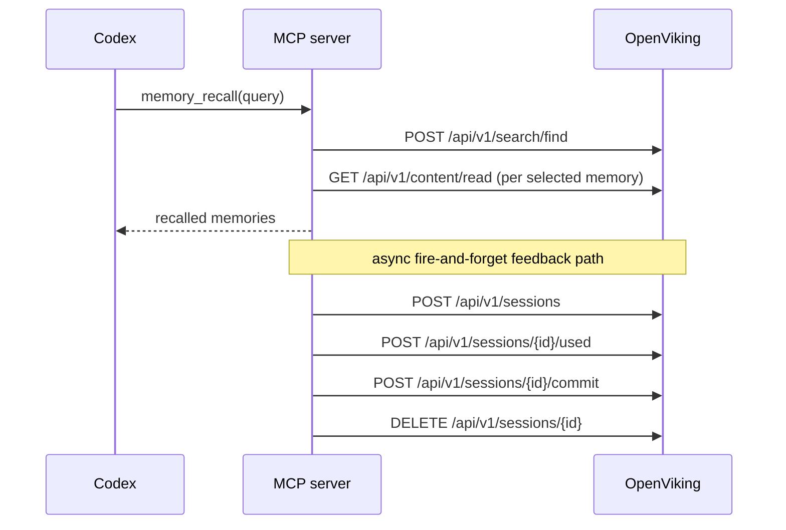

# OpenViking Memory Plugin for Codex

Codex MCP server example that exposes OpenViking memories as explicit tools.

This example is repo-only. It does not edit `~/.codex/config.toml` for you.

## What It Does

- Exposes four MCP tools for Codex:
  - `memory_recall`
  - `memory_store`
  - `memory_forget`
  - `memory_health`
- Reads OpenViking connection details from `~/.openviking/ov.conf`
- Marks recalled memory URIs as `used()` before a fire-and-forget `commit()`
- Contributes retrieval feedback to OpenViking's hotness ranking without blocking Codex

## Prerequisites

- Codex CLI installed
- OpenViking HTTP server running
- Node.js 22+

Start OpenViking first if needed:

```bash
openviking-server --config ~/.openviking/ov.conf
```

## Build

From this directory:

```bash
npm ci
npm run build
```

That produces `servers/memory-server.js`, the MCP entrypoint Codex will launch.

## End-to-End Verification (macOS)

The example was manually verified against a running OpenViking server on macOS.

1. Confirm OpenViking is healthy:

```bash
curl -fsS http://127.0.0.1:1933/health
```

2. Build the MCP server:

```bash
cd examples/codex-memory-plugin
npm ci
npm run build
```

3. Register the server in Codex and verify the config:

```bash
codex mcp add openviking-memory -- \
  node /ABS/PATH/TO/OpenViking/examples/codex-memory-plugin/servers/memory-server.js
codex mcp list
```

4. Exercise the read-only tool path through Codex itself:

```bash
codex exec --dangerously-bypass-approvals-and-sandbox --json --skip-git-repo-check -C /tmp \
  'Use the MCP tool `memory_health` exactly once. After the tool call, reply with only the final health text you received from the tool.'
```

Expected result:

```text
OpenViking is healthy (http://127.0.0.1:1933)
```

5. Exercise semantic recall through Codex:

```bash
codex exec --dangerously-bypass-approvals-and-sandbox --json --skip-git-repo-check -C /tmp \
  'Use the MCP tool `memory_recall` exactly once with a query that should match existing indexed memories. After the tool call, reply with only the final tool text.'
```

6. Exercise the write path directly against the MCP server:

```bash
node --input-type=module <<'EOF'
import { Client } from '@modelcontextprotocol/sdk/client/index.js'
import { StdioClientTransport } from '@modelcontextprotocol/sdk/client/stdio.js'

const transport = new StdioClientTransport({
  command: 'node',
  args: ['/ABS/PATH/TO/OpenViking/examples/codex-memory-plugin/servers/memory-server.js'],
  env: { ...process.env, OPENVIKING_TIMEOUT_MS: '60000' },
})

const client = new Client({ name: 'qa', version: '0.0.1' }, { capabilities: {} })
await client.connect(transport)
const result = await client.callTool(
  {
    name: 'memory_store',
    arguments: {
      text: 'Remember this preference for QA token 20260408T195200Z: Brian prefers mango sorbet after dinner.',
    },
  },
  undefined,
  { timeout: 240000 },
)
console.log(JSON.stringify(result, null, 2))
await transport.close()
EOF
```

On the macOS QA host used for this PR, the patched adapter returned a background
task ID after timing out, which confirms the async commit path runs but also
shows that the memory extraction pipeline can outlast the local verification
window.

## Functional Status

| Tool | macOS status | Notes |
| --- | --- | --- |
| `memory_health` | Verified with Codex | Successful MCP invocation via `codex exec --dangerously-bypass-approvals-and-sandbox` |
| `memory_recall` | Verified with Codex | Successful MCP invocation via `codex exec --dangerously-bypass-approvals-and-sandbox`; returned indexed memories |
| `memory_store` | Exercised, not fully completed during QA | Patched to use `session commit` plus task polling; local QA returned a timeout with background `task_id`, not a completed extraction |
| `memory_forget` | Exercised partially | Query path executed and returned candidate URIs; exact delete success path was not deterministically proven on this host |

## Add To Codex

Add the MCP server with the verified Codex CLI shape:

```bash
codex mcp add openviking-memory -- \
  node /ABS/PATH/TO/OpenViking/examples/codex-memory-plugin/servers/memory-server.js
```

Example using your local repository checkout:

```bash
codex mcp add openviking-memory -- \
  node /path/to/OpenViking/examples/codex-memory-plugin/servers/memory-server.js
```

List configured MCP servers:

```bash
codex mcp list
```

Remove it later if needed:

```bash
codex mcp remove openviking-memory
```

## Optional Environment Overrides

The server defaults to `~/.openviking/ov.conf`. You can override behavior with env vars when adding the MCP server:

```bash
codex mcp add openviking-memory \
  --env OPENVIKING_AGENT_ID=codex-local \
  --env OPENVIKING_TIMEOUT_MS=20000 \
  -- node /ABS/PATH/TO/OpenViking/examples/codex-memory-plugin/servers/memory-server.js
```

Supported overrides:

- `OPENVIKING_CONFIG_FILE`
- `OPENVIKING_AGENT_ID`
- `OPENVIKING_TIMEOUT_MS`
- `OPENVIKING_RECALL_LIMIT`
- `OPENVIKING_SCORE_THRESHOLD`

## How Recall Feedback Works

`memory_recall` searches OpenViking, returns the selected memories to Codex, and also starts a background sequence:

1. `POST /api/v1/sessions`
2. `POST /api/v1/sessions/{id}/used` with recalled `viking://` URIs
3. `POST /api/v1/sessions/{id}/commit`
4. `DELETE /api/v1/sessions/{id}`

This is fire-and-forget. Tool responses do not wait on the feedback loop.



## Testing Note

No automated tests were added for this example in this PR.

This example is a live integration across Codex CLI, stdio MCP transport,
Node.js, and a running OpenViking server. The repository does not currently
provide a stable automated harness that can authenticate Codex and exercise MCP
tools end to end inside CI, so this PR uses execution-backed manual validation
on macOS instead.

## Notes

- This example gives Codex explicit tools only. It does not implement transparent auto-recall hooks.
- `memory_recall` only marks the memories it actually returns as used, which is higher-signal than broad auto-recall marking.
- If your OpenViking server requires auth, the MCP server reads `root_api_key` from `ov.conf`.

## Known Limitations / Untested Paths

- Non-interactive Codex QA on this host required `--dangerously-bypass-approvals-and-sandbox` for successful MCP tool execution. `--full-auto` cancelled the same tool call during verification.
- `memory_store` now uses OpenViking session commit plus task polling, but long-running extraction can still outlast the local QA timeout window.
- In non-interactive Codex QA, the model may decline memory-writing tool calls on policy grounds, so write-path verification was performed directly against the MCP server.
- `memory_forget` query mode only auto-deletes when there is a single strong match. Otherwise it returns candidate URIs and requires a follow-up exact delete.
- Linux and Windows were not verified in this PR.

## Troubleshooting

- MCP server not starting: run `npm ci && npm run build` in this directory first
- OpenViking request failures: verify `openviking-server` is reachable at the host and port in `ov.conf`
- No memories returned: confirm you have indexed data under `viking://user/memories` or `viking://agent/memories`
