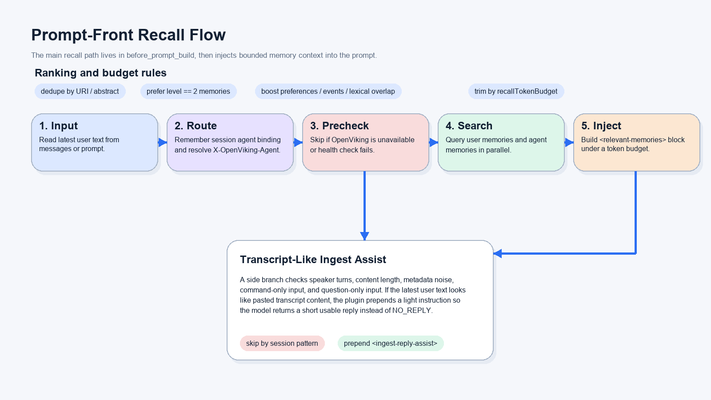

# OpenViking for OpenClaw

Use [OpenViking](https://github.com/volcengine/OpenViking) as OpenClaw's remote context engine: session archiving, threshold or `/compact`-driven memory extraction, automatic recall, resource/skill retrieval, recall tracing, and large tool-result paging over a remote OpenViking server.

Current implementation highlights:

- **Remote-only context engine**: the plugin is an HTTP client for an existing OpenViking server; it does not start a local server process.
- **Lifecycle integration**: `assemble` rebuilds compressed session history and injects relevant memories; `afterTurn` appends the new turn and may trigger async commit; `compact` runs a blocking commit/readback.
- **Import and retrieval**: agents can import resources and Agent Skills, search them, and include `resource`, `session`, `user`, or `agent` targets in recall.
- **Debuggability**: optional recall trace records can be queried with `ov_recall_trace` or `/ov-recall-trace`; oversized tool results can be listed, searched, and read by reference.

## Quick Start

```bash
openclaw plugins install clawhub:@openviking/openclaw-plugin
openclaw openviking setup --base-url http://my-server:1933 --api-key sk-xxx --json
openclaw gateway restart
openclaw openviking status --json
```

That's it. The `setup` command activates the context-engine slot and validates the connection.

Useful setup variants:

```bash
# Optional agent namespace prefix
openclaw openviking setup --base-url http://my-server:1933 --api-key sk-xxx --agent-prefix openclaw-prod --json

# Root/trusted key deployments that need explicit tenant identity headers
openclaw openviking setup --base-url http://my-server:1933 --api-key root-xxx --account-id acc_123 --user-id user_456 --json

# Resource-only default recall for account-level shared knowledge
openclaw openviking setup --base-url http://my-server:1933 --api-key sk-xxx --recall-target-types resource --json
```

### Or ask your agent

> Install the OpenClaw plugin @openviking/openclaw-plugin for OpenViking remote memory. My server is at `http://my-server:1933` and my API key is `sk-xxx`.

The agent runs install → setup → restart → verify automatically. See [INSTALL-AGENT.md](./INSTALL-AGENT.md).

## How It Works

| Stage | What happens |
|-------|-------------|
| **Every turn** (`afterTurn`) | Your messages are archived into an OpenViking session |
| **On `/compact`** (`compact`) | Archived messages are extracted into long-term memories |
| **Before each reply** (`assemble`) | Relevant memories are auto-retrieved and injected into context |

## Tools

Once installed, the plugin provides these default agent tools:

| Tool | Purpose |
|------|---------|
| `memory_recall` | Explicit semantic recall across `user`, `agent`, `session`, and/or `resource` targets |
| `memory_store` | Persist important text immediately by writing a session and running memory extraction |
| `memory_forget` | Delete a memory by exact URI, or search and delete a single strong match |
| `ov_archive_search` | Keyword-grep archived original conversation messages for the current session |
| `ov_archive_expand` | Expand an archive ID back to raw messages |
| `ov_recall_trace` | Inspect recall/search trace records captured by auto-recall and explicit tools |
| `add_skill` | Import a `SKILL.md`, skill directory, raw skill content, or MCP tool dict into `viking://agent/skills/...` |
| `ov_search` | Search imported resources and skills |
| `ov_read` | Read full content for a `viking://...` OpenViking virtual URI returned by search/trace results |
| `ov_multi_read` | Read several exact `viking://...` URIs together, useful for overview plus sibling chunks |
| `ov_list` | List OpenViking directories after search to inspect sibling chunks and `.overview.md` files |
| `openviking_tool_result_list` | List externalized large tool outputs in the current session |
| `openviking_tool_result_search` | Search within an externalized tool output by keyword |
| `openviking_tool_result_read` | Read all or part of an externalized tool output by `viking://session/.../tool-results/...` ref |

The plugin also registers slash commands for manual use: `/add-resource`, `/add-skill`, `/ov-search`, and `/ov-recall-trace`. The agent-visible `add_resource` tool is disabled by default (`enableAddResourceTool=false`) so search/retrieval flows cannot import new resources accidentally; use manual `/add-resource` or explicitly set `enableAddResourceTool=true` only when agents should be allowed to import resources.

## Data Flow & Privacy

- **What is sent**: User/assistant message text from each turn (after stripping injected memory blocks and metadata noise).
- **Where it goes**: Your configured OpenViking server (`baseUrl`). The plugin only sends data to that server; downstream model/provider data handling (embedding, VLM) depends on the server's configuration.
- **Storage**: All data lives on your OpenViking server under namespaces such as `viking://user/*`, `viking://agent/*`, `viking://session/*`, and `viking://resources/*`.
- **API Key**: Sent as `X-API-Key` over your configured connection. Never logged or forwarded.
- **Multi-tenant isolation**: Supports `accountId`, `userId`, `agent_prefix`, and canonical namespace policy toggles (`isolateUserScopeByAgent`, `isolateAgentScopeByUser`).

## Verify

```bash
openclaw openviking status --json     # one-shot health check
openclaw config get plugins.slots.contextEngine  # should output: openviking
```

## Documentation

| Doc | Description |
|-----|-------------|
| [INSTALL.md](./INSTALL.md) | Full install, upgrade, and uninstall guide |
| [INSTALL-ZH.md](./INSTALL-ZH.md) | Chinese install guide |
| [INSTALL-AGENT.md](./INSTALL-AGENT.md) | Agent-oriented operator guide |
| [docs/openviking-websocket-rpc-api.md](./docs/openviking-websocket-rpc-api.md) | Chinese guide for invoking OpenViking tools through OpenClaw Gateway WebSocket RPC |
| [docs/openviking-openclaw-plugin-guide.md](./docs/openviking-openclaw-plugin-guide.md) | Comprehensive Chinese guide for usage, configuration, debugging, testing, build, release, deployment, and rollback |

> **Plugin vs Skill**: This page is for `@openviking/openclaw-plugin` (the context-engine plugin). Do **not** use `clawhub install openviking` — that installs a different AgentSkill.

---

<details>
<summary><b>Technical Overview (for integrators and engineers)</b></summary>

This plugin is registered as the `openviking` context engine in OpenClaw.

## Design Positioning

- OpenClaw still owns the agent runtime, prompt orchestration, and tool execution.
- OpenViking owns long-term memory retrieval, session archiving, archive summaries, and memory extraction.
- `examples/openclaw-plugin` is not a narrow "memory lookup" plugin. It is an integration layer that spans the OpenClaw lifecycle.

In the current implementation, the plugin plays four roles at once:

- `context-engine`: implements `assemble`, `afterTurn`, and `compact`
- hook layer: handles `session_start`, `session_end`, and `before_reset`
- tool provider: registers memory/archive tools plus OpenViking resource and skill import tools
- runtime manager: connects to and monitors a remote OpenViking service

## Overall Architecture


The diagram above reflects the current implementation boundary:

- OpenClaw remains the primary runtime on the left. The plugin does not take over agent execution.
- The middle layer combines hooks, the context engine, tools, and runtime management in one plugin registration.
- All HTTP traffic goes through `OpenVikingClient`, which centralizes `X-OpenViking-*` headers and routing logs.
- The OpenViking service owns sessions, memories, archives, and Phase 2 extraction, with storage under `viking://user/*`, `viking://agent/*`, and `viking://session/*`.

That split lets OpenClaw stay focused on reasoning and orchestration while OpenViking becomes the source of truth for long-lived context.

## Identity and Routing

The plugin does not send one fixed agent ID to OpenViking. It tries to keep OpenClaw session identity and OpenViking routing aligned.

The main rules are:

- reuse `sessionId` directly when it is already a UUID
- prefer `sessionKey` when deriving a stable `ovSessionId`
- normalize unsafe path characters, or fall back to a stable SHA-256 when needed
- resolve `X-OpenViking-Agent` per session, not per process
- when `plugins.entries.openviking.config.agent_prefix` is non-empty, prefix the session agent as `<agent_prefix>_<sessionAgent>`
- when OpenClaw does not provide a session agent, use its default agent `main`
- send `X-OpenViking-Agent` on OpenViking requests, including startup health checks
- only add `X-OpenViking-Account` / `X-OpenViking-User` when `accountId` / `userId` are explicitly configured

This matters because the plugin is built to support multi-agent and multi-session OpenClaw usage without mixing memories across sessions.

The recommended remote-mode configuration only needs:

- `baseUrl`
- `apiKey`
- `agent_prefix`

In this setup:

- `apiKey` should usually be a user key
- `accountId` / `userId` are advanced options only when the deployment needs explicit identity headers, such as root-key or trusted-server flows
- `isolateUserScopeByAgent` / `isolateAgentScopeByUser` must match the server-side account namespace policy when using the PR #1356 canonical namespace model
- `agentScopeMode` is a deprecated compatibility alias for older hash-based routing and should only be used against older servers

### Canonical namespace policy

For OpenViking servers that include PR #1356, the plugin no longer treats agent or user scope as a locally computed hash. Instead it expands shorthand aliases into canonical URIs using the configured namespace policy:

- `viking://user/memories`
  - `viking://user/<user_id>/memories` when `isolateUserScopeByAgent=false`
  - `viking://user/<user_id>/agent/<agent_id>/memories` when `isolateUserScopeByAgent=true`
- `viking://agent/memories`
  - `viking://agent/<agent_id>/memories` when `isolateAgentScopeByUser=false`
  - `viking://agent/<agent_id>/user/<user_id>/memories` when `isolateAgentScopeByUser=true`

The plugin cannot auto-discover this policy today because `/api/v1/system/status` does not expose it. Configure the two booleans explicitly so they stay aligned with the server-side account policy.

## assemble Recall Flow



Auto-recall now runs through `assemble()`. OpenClaw calls the same context engine method in two shapes, and the plugin assigns different responsibilities to each shape:

1. Preflight assemble: params include `prompt`; `messages` is still old history. The plugin reads archive/session context back from OpenViking and rebuilds history.
2. transformContext assemble: params do not include `prompt`; the latest `messages` entry is already the current user turn. The plugin only runs long-term recall and prepends the memory block to that user message content.

During recall, the plugin:

1. Extracts query text from the latest user message.
2. Resolves the agent routing for the current `sessionId/sessionKey`.
3. Runs a quick availability precheck so model requests do not stall when OpenViking is unavailable.
4. Queries both `viking://user/memories` and `viking://agent/memories` in parallel.
5. Deduplicates, threshold-filters, reranks, and trims the results under a token budget.
6. Prepends the selected memories as a `<relevant-memories>` block to the current user message; it does not append a standalone synthetic user message.

The reranking logic is not pure vector-score sorting. The current implementation also considers:

- whether a result is a leaf memory with `level == 2`
- whether it looks like a preference memory
- whether it looks like an event memory
- lexical overlap with the current query

## Session Lifecycle


Session handling is the main axis of this design. In the current implementation it covers history assembly, incremental append, asynchronous commit, and blocking compaction readback.

### What `assemble()` does

During preflight, `assemble()` is not just replaying old chat history. It reads session context back from OpenViking under a token budget, then rebuilds OpenClaw-facing messages:

- `latest_archive_overview` becomes `[Session History Summary]`
- `pre_archive_abstracts` becomes `[Archive Index]`
- active session messages stay in message-block form
- assistant tool parts become `toolCall` (input compatible: `toolUse`/`input` is normalized to `toolCall`/`arguments`)
- tool output becomes separate `toolResult`
- the final message list goes through a tool-use/result pairing repair pass

That means OpenClaw sees "compressed history summary + archive index + active messages", not an ever-growing raw transcript.

### What `afterTurn()` does

`afterTurn()` has a narrower job: append only the new turn into the OpenViking session.

- it slices only the newly added messages
- it keeps only `user` / `assistant` capture text
- it preserves `toolCall` / `toolResult` content in the serialized turn text
- it strips injected `<relevant-memories>` blocks and metadata noise before capture
- it appends the sanitized turn text into the OpenViking session

After that, the plugin checks `pending_tokens`. Once the session crosses `commitTokenThreshold`, it triggers `commit(wait=false)`:

- archive generation and Phase 2 memory extraction continue asynchronously on the server
- the current turn is not blocked waiting for extraction
- if `logFindRequests` is enabled, the logs include the task id and follow-up extraction detail

### What `compact()` does

`compact()` is the stricter synchronous boundary:

- it calls `commit(wait=true)` and blocks for completion
- when an archive exists, it re-reads `latest_archive_overview`
- it returns updated token estimates, the latest archive id, and summary content
- if the summary is too coarse, the model can call `ov_archive_expand` to reopen a specific archive

So `afterTurn()` is closer to "incremental append plus threshold-triggered async commit", while `compact()` is the explicit "wait for archive and compaction to finish" boundary.

## Tools and Expandability

Beyond automatic behavior, the plugin exposes fourteen default tools directly, plus an opt-in `add_resource` import tool when `enableAddResourceTool=true`. Agent-visible tools can be narrowed with `enabledTools` and `disabledTools`:

- `memory_recall`: explicit semantic recall over memory/resource/session targets
- `memory_store`: write text into an OpenViking session and trigger blocking commit/extraction
- `memory_forget`: delete by URI, or search first and remove a single strong match
- `ov_archive_search`: grep archived original conversation messages by keyword
- `ov_archive_expand`: expand a concrete archive back into raw messages
- `ov_recall_trace`: query recall trace records for auto-recall and explicit recall/search calls
- `add_skill`: import or register an OpenViking agent skill
- `ov_search`: search OpenViking resources and skills, especially after importing them
- `ov_read`: read full content for a `viking://...` OpenViking virtual URI returned by `ov_search` or recall trace results
- `ov_multi_read`: read multiple exact `viking://...` URIs together, useful for an overview plus sibling chunks
- `ov_list`: list a hit's parent directory to recover sibling chunks, `.overview.md`, and related split-document context
- `openviking_tool_result_list`: list large tool outputs externalized for the current session
- `openviking_tool_result_search`: keyword search within an externalized tool output
- `openviking_tool_result_read`: read externalized tool output content by ref, with offset/limit paging

Tool selectors accept exact tool names or groups: `default`, `all`, `memory`, `resource_query`, `import`, `recall_trace`, `archive`, and `tool_result`. For example, to hide all memory tools while keeping only resource query tools available:

```json
{
  "autoCapture": false,
  "autoRecall": false,
  "enabledTools": ["resource_query"]
}
```

To keep the default tool set but remove only memory operations, use `"disabledTools": ["memory"]`. `add_resource` always remains a second-level opt-in: it is registered only when selected by `enabledTools` and `enableAddResourceTool=true`.

They serve different roles:

- automatic recall covers the default case where the model does not know what to search yet
- `memory_recall` gives the model an explicit follow-up search path
- `memory_store` is for immediately persisting clearly important information
- `ov_archive_search` and `ov_archive_expand` are the "go back to archive detail" escape hatches when summaries are not enough
- `ov_recall_trace` explains why a recall/search did or did not surface an item
- manual `/add-resource` imports resources into OpenViking; the agent-visible `add_resource` tool is opt-in only and must not be used during search, retrieval, URI reading, or search-result optimization
- `add_skill` imports skills into OpenViking
- `ov_search` closes the loop after import by letting the user or agent confirm resources and skills; its `viking://...` results are virtual OpenViking URIs, not local file paths
- `ov_read` consumes an exact `viking://...` result URI through OpenViking `/api/v1/content/read`, avoiding accidental filesystem reads of virtual URIs
- `ov_multi_read` reads overview and sibling chunks together when a split document needs more context than a single hit
- `ov_list` complements `ov_search` when a ranked hit is only one chunk of a larger procedure or document
- `openviking_tool_result_*` tools prevent large external tool outputs from bloating context while keeping full content recoverable

`ov_archive_expand` is especially important because `assemble()` normally returns archive summaries and indexes, not the full raw transcript.

### Resource and Skill Import

Resource and skill imports are intentionally separate because they land in different OpenViking namespaces and use different server APIs:

- resources go through `/api/v1/resources` and land under `viking://resources/...`
- skills go through `/api/v1/skills` and land under `viking://agent/skills/...`

The plugin also registers explicit slash commands for manual imports:

```text
/add-resource ./README.md --to viking://resources/openviking-readme --wait
/add-skill ./skills/install-openviking-memory --wait
/ov-search "OpenViking install" --uri viking://resources/openviking-readme
/ov-search "memory install skill" --uri viking://agent/skills
/ov-recall-trace --turn latest --include-content
```

Resource import supports remote URLs, Git URLs, local files, local directories, and uploaded zip files. OpenViking's built-in parsers cover common documents and media such as Markdown, text, PDF, HTML, Word, PowerPoint, Excel, EPUB, images, audio, and video. Directory imports also accept common code, documentation, and config file extensions such as `.py`, `.js`, `.ts`, `.go`, `.rs`, `.java`, `.cpp`, `.json`, `.yaml`, `.toml`, `.csv`, `.rst`, `.proto`, `.tf`, and `.vue`.

For HTTP safety, the plugin never sends a direct local filesystem path to the OpenViking server. Local files and directories are first uploaded through `/api/v1/resources/temp_upload`; directories are zipped locally with a pure JavaScript zip implementation before upload.

### Recall Trace and Tool Result References

Recall tracing is off by default. Enable it with plugin config keys such as `traceRecall`, `traceRecallPersist`, and `traceRecallDir`, then query records with `ov_recall_trace` or `/ov-recall-trace`. Persisted traces default to `~/.openclaw/openviking/recall-traces` and can be bounded by retention and query limits.

When OpenViking externalizes an oversized tool result, the visible preview contains a `viking://session/<session_id>/tool-results/<tool_result_id>` reference. Use `openviking_tool_result_list` to discover refs, `openviking_tool_result_search` to locate snippets, and `openviking_tool_result_read` with `offset`/`limit` to restore the original content.

## Runtime Mode


The plugin operates exclusively in remote mode as a pure HTTP client:

- `baseUrl` and optional `apiKey` come from plugin config
- no local subprocess is started or managed
- session context, memory search/read, commit, and archive expansion behavior stays the same

The OpenViking service must be deployed and running independently before the plugin can connect to it.

## Relationship to the Older Design Draft

The repo also contains a more future-looking design draft at `docs/design/openclaw-context-engine-refactor.md`. It is important not to conflate the two:

- this README describes current implemented behavior
- the older draft discusses a stronger future move into context-engine-owned lifecycle control
- in the current version, the main automatic recall path lives in `assemble()`: preflight rebuilds history, transformContext injects long-term memories
- in the current version, `afterTurn()` already appends to the OpenViking session, but commit remains threshold-triggered and asynchronous on that path
- in the current version, `compact()` already uses `commit(wait=true)`, but it is still focused on synchronous commit plus readback rather than owning every orchestration concern

That distinction matters, otherwise the future design draft is easy to misread as already shipped behavior.

## Operator and Debugging Surfaces

If you need to debug this plugin, start with these entry points.

### Inspect the current setup

```bash
openclaw openviking status --json
openclaw plugins list
openclaw config get plugins.entries.openviking.config
openclaw config get plugins.slots.contextEngine
```

### Watch logs

OpenClaw plugin logs:

```bash
openclaw logs --follow
```

OpenViking service logs:

```bash
cat ~/.openviking/data/log/openviking.log
```

### Web Console

```bash
python -m openviking.console.bootstrap --host 0.0.0.0 --port 8020 --openviking-url http://127.0.0.1:1933
```

### `ov tui`

```bash
ov tui
```

### Common things to check

| Symptom | More likely cause | First check |
| --- | --- | --- |
| `plugins.slots.contextEngine` is not `openviking` | The plugin slot was never set, or another plugin replaced it | `openclaw config get plugins.slots.contextEngine` |
| Cannot connect to OpenViking service | `baseUrl` is wrong or the service is down | Check `baseUrl` in config and test connectivity manually |
| recall behaves inconsistently across sessions | Routing identity is not what you expected | Enable `logFindRequests`, then inspect `openclaw logs --follow` |
| long chats stop extracting memory | `pending_tokens` never crosses the threshold, or Phase 2 fails server-side | Check plugin config and `~/.openviking/data/log/openviking.log` |
| summaries are too coarse for detailed questions | You need archive-level detail, not just summary | Use an ID from `[Archive Index]` with `ov_archive_expand` |

---

For installation, upgrade, and uninstall operations, use [INSTALL.md](./INSTALL.md).

</details>
